```{r setup, include=FALSE}
knitr::opts_chunk$set(echo = TRUE)
```

```{css, echo=FALSE}

img{
  /* 上右下左 */
  /* margin: 5% 0% 0% 0% ;*/ 
  /* width : 75%; */
  margin: auto;
  display: block;
}

.figcaption {
    font-style: italic;
    font-size: large;
    font-weight: bold;
    color: #666;
    text-align: center;
    margin:0% 0% 5% 0%;
}

.ref {
  position: relative;
  margin:5%;
  padding:5px;
  background-color: rgba(255, 255, 128, .5);
  color: #666;
}
.ref::before{
  content: "[参考]";
  font-weight: bold;
  display: block;
  margin-bottom: 3px;
}

```

# R実行環境の整備

## Posit Cloudへのサインアップ

Rを使って統計分析を行う際には、本来は[R](https://cran.r-project.org/)と[RStudio](https://posit.co/download/rstudio-desktop/)という2つのアプリを自分のPCにインストールする必要があるが、インターネットに接続できている場合には、Posit
Cloudというオンラインサービスを利用することによって、これらのアプリを自分のPCにインストールすることなくWebブラウザ上でRStudioを利用することができる。

今回はPosit Cloudを利用することを前提に説明していく。

[Posit Cloud](https://posit.cloud/)にアクセス。
下記の通りのページが表示される。


「Get Started」をクリック

↓

Freeプランの「Learn more」をクリック

↓

「Sign Up」をクリック。下記のページが表示される。


「Sign Up with Google」を選択して、大学のGmailアドレスで登録。

↓

「Posit
Cloudにログイン」の画面で「次へ」を選択すると、サインアップが完了し、以下のような画面が表示される。


なお、Posit
Cloudは英語のサイトだが、GoogleChromeの「翻訳」で「日本語」にすればある程度は日本語表記がされる。（あくまである程度であって、Rを操作する画面までは残念ながら日本語化されない）

## Procjectの作成

右上にある「New Project」をクリック

↓

「New RStduio Project」をクリック。「Deploying
Project」とプログレスバーがしばらく表示されたあと、以下のような画面が表示される。

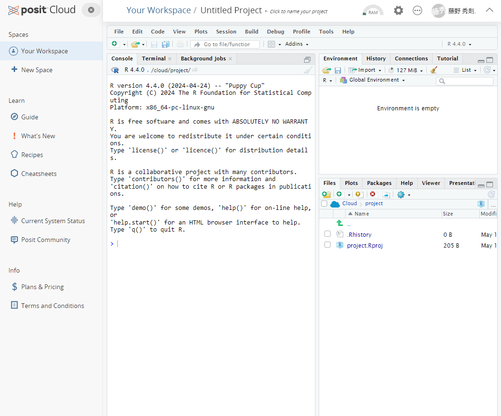

この画面がR（Rstduio）の基本操作画面になる。

## Project名の設定

続いて、プロジェクトに名前を付ける。 画面トップにある「Untitled
Project」と書かれてある箇所をクリックして、名前を書き入れよう。


ただし、注意しないといけない点として、Project名は半角文字しか受け付けてくれない（アルファベットや数字、アンダーバーなど）。日本語を書き入れても、最初は表示されてもリロードされたときに「?」という表記に変わってしまう。

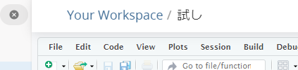

ページをリロード（再読み込み）すると、以下のようになる。

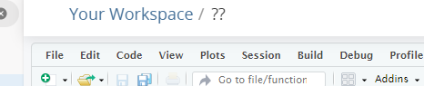

# RとRStudioの基本操作

## 基本的な計算の実行

「Console」と書かれた以下の画面に数式を入力することによって、Rに計算をさせることができる。

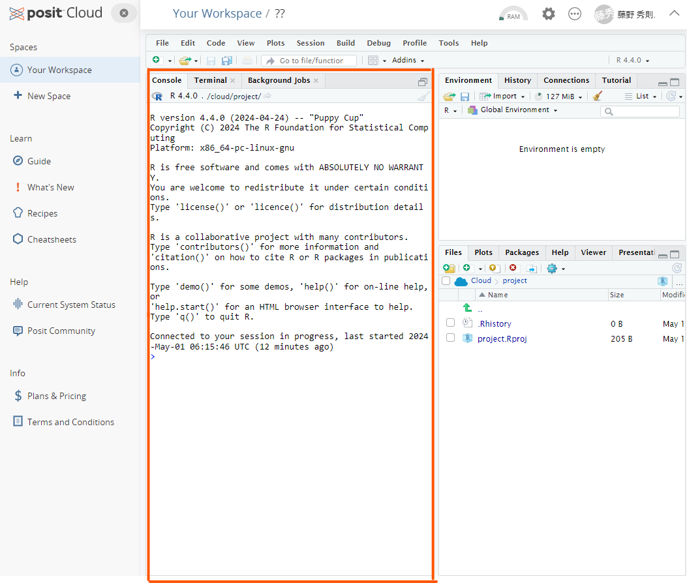

実際に各自で好きな数で四則演算をさせてみよう。以下は一例。

```{r}
5+1
5-7
6*4
9/3
```

さらには、カッコを使ったり、累乗演算をさせたり、剰余演算をさせたりもできる。

```{r parenthesis}
# カッコつき
5*3*(11-23)
# カッコを重ねることもできる（中カッコ[]や大カッコ{}は用いない）
5+3*(11-23*(4+3))
```

```{r power}
# 累乗演算
2^3
```

```{r remainder}
#　剰余演算
15%%6
```

このように、`+`、`-`、`*`、`/`、`()`、`^`、`%%`などの演算記号のことを<strong>演算子(Operator)</strong>と呼ぶ。演算子にはこれら以外にもいろいろある。以下にRで使われる代表的な演算子を示す。

| 演算子 | 説明                       | 例             |
|--------|----------------------------|----------------|
| \+     | 加算                       | `x + y`        |
| \-     | 減算                       | `x - y`        |
| \*     | 乗算                       | `x * y`        |
| /      | 除算                       | `x / y`        |
| \^     | 累乗                       | `x ^ y`        |
| %%     | 剰余                       | `x %% y`       |
| %/%    | 整数除算                   | `x %/% y`      |
| ==     | 等しい                     | `x == y`       |
| !=     | 等しくない                 | `x != y`       |
| \<     | より小さい                 | `x < y`        |
| \>     | より大きい                 | `x > y`        |
| \<=    | 以下                       | `x <= y`       |
| \>=    | 以上                       | `x >= y`       |
| &      | 論理積 (AND)               | `x & y`        |
| \|     | 論理和 (OR)                | `x | y`        |
| !      | 否定 (NOT)                 | `!x`           |
| %in%   | ベクトルの要素が含まれるか | `x %in% y`     |
| :      | シーケンスの生成           | `1:10`         |
| \<-    | 代入                       | `x <- 10`      |
| =      | 代入 (引数で使用)          | `func(x = 10)` |

平方根の場合には、`sqrt()`という**関数**を使う。

```{r sqrt}
sqrt(16)
```

ちなみに、出力結果の前にある`[1]`という表記は、出力結果が長さ1の**ベクトル(Vector)**の1つ目の要素であることを示している。このベクトルについては後で改めて説明する。

::: ref
<P>

なお、このようにconsoleに1行1行数式や関数（まとめて**コマンド**）を入力していく形をCommand
Line Interface (CLI)
と呼ぶ。CLIでは、操作できるのはあくまで現在カーソルが置かれている行だけである。過去の行はログとして見えているだけであり、ログを消したり、書き換えたりはできない。

</p>

<p>

もし誤ったコマンドを入力しているのに気づかずに実行してしまった場合には、もう一度正しいコマンドを改めて入力すればよい。

</P>
:::

## オブジェクト

Rでは<strong>オブジェクト</strong>と呼ばれる箱に計算結果の数値や読み込んだデータ（後で説明する）を格納することができる。オブジェクトに格納しておくことと、後からそれらの値やデータを再度利用したくなったときに、いちいち再度計算式を入力したり、データの読み込みをすることなく、オブジェクトを呼び出すだけで、それらの値やデータを呼び出すことができる。

以下の例では`5－3`の結果を`Res`という名前のオブジェクトに格納し、さらに`Res`というオブジェクト名を使ってその中身（計算結果）を呼び出している。

```{r object}
Res <- 5-3
Res
## print()関数を使って表記させることも可能
print(Res)
```

オブジェクトに格納された値は、そのままオブジェクト名で計算させることもできる。

```{r object2}
8+Res
```

オブジェクト名はどのような名前でも構わない。ただし、半角スペースや演算子に用いられている記号、アットマーク記号`@`などは利用することができない。また、数字から始まる名前を付けることも不可である（名前の途中に数字が入っている分には問題ない）。
ピリオド`.`やアンダーバー`_`は利用できる。一般的には、複数の単語を連結させて用いる場合には`_`で区切る。`.`は階層性を持ったデータを区別する使われる。以下はそれらの例。

```{r objectName}
my_res <- 9-4
my_res.power <- my_res ^3
```

なお、間違えた名前で呼び出すと、もしその名前のオブジェクトが他にないのであれば、以下のようなエラーが帰ってくる

```{r objectNameError,error=TRUE}
RES
```

「オブジェクトが見つかりません」ということで、このエラーが帰ってきたら、オブジェクト名が間違えているかを確認してほしい。

ただし、オブジェクト名を間違えていた時に、間違えた名前と同一の名前のオブジェクトが別に存在していた場合には、このようなエラーは帰って来ずに、そのまま間違えたオブジェクトを使って続く処理が実行されていくので、その場合には自分で間違いに気づきにくくなる。RStduioではすでに使われているオブジェクト名であれば、最初の数文字を入力するとリスト表示してくれる入力支援機能があるので、オブジェクトが増えてきたときにはそれを是非利用して入力するとよい。

## 文字列

これまで数値ばかりを扱ってきたが、Rでは数値だけでなく文字列を扱うこともできる。

```{r strings}
nchar("Hidenori Fujino")
```

`nchar()`は文字列の長さを求める関数である。ほかにも検索をしたり、置換したり、分割したり、結合したりといったことができる関数が用意されている。

また、オブジェクトに文字列を格納することもできる。

```{r strings2}
myName <-"Hidenori Fujino"
myName
nchar(myName)
```

## 型

### データの型

オブジェクトにどのようなデータが収められているかによって、そのオブジェクトには「型」と呼ばれる属性が付与される。数値が収められていれば、そのオブジェクトは数値型（`Numeric`）となるし、文字列が収められていれば文字列型(`Character`)となる。ほかにも論理型(`Logical`)や日付型(`Date`)などいろいろな型がある。

::: ref
<P>

厳密には、オブジェクトに入れていない数値や文字列そのものも、それぞれ数値型や文字列型のデータである。つまり型とはデータそのものに付随する属性であり、`オブジェクトの型＝その中見のデータの型`である。

</p>
:::

基本的に型が異なる者同士を計算させることはできない。

```{r defferenttype, error = T}
a <- 5
b <- "2"
a-b
```

この例では、bには`2`ではなく`"2"`という文字列が格納されている。このため`数値‐文字列`という形で方の異なるもの同士を計算しようとしたので、エラーとなった。

ただし、関数の場合には、数値でもそのまま文字列をとして扱ってくれるものもある。

```{r wrongtype, error=T}
a <- 12345
b <- "12345"
nchar(a)
nchar(b)
```

### 型の把握

あるオブジェクトがどの型なのかを知るためには、`class()`関数を用いる。

```{r class}
a <- 12345
b <- "12345"
class(a)
class(b)
```

### 型の変換

たとえば文字列として与えられた数値を数値型に変換して処理したり、逆に数値型として与えられた数値を文字列型に変換したい、といったケースはよくある。
その場合、`as.numeric`や`as.character`といった型変換関数を用いる。

例えば、以下は文字列型の数値を数値型に変換している例である。

```{r , error=T}
a <- 12345
b <- "12345"
a+b #　これはエラー
a + as.numeric(b) 
```

このほかにも、型変換関数はたくさんある。`as.`まで打つと様々な型変換関数がリスト表記される。データ分析でよく使用するものとしては`as.factor()`（データを要素型に変換する）や`as.data.frame()`（データをデータフレーム型に変換する）などがある。それぞれいずれ出てくるので、頭の片隅に置いておいてほしい。

## ベクトル

### ベクトルの作成

Rではこれまでの例のように単独の数値や文字列を扱うケースは極めて稀である。通常は複数の数値や文字列を1セットにして様々な処理を行っていく。そうした1セットにしたデータセットの最もシンプルなものが<strong>ベクトル</strong>（1次元配列）である。

例えば、バスケチームのStartingメンバー5名でフリースロー10本勝負をしたときの成績として以下のような成績が出たとする。

| 名前 | 点数 |
|:-----|-----:|
| 赤木 |    7 |
| 桜木 |    4 |
| 三井 |   10 |
| 宮城 |    7 |
| 流川 |    9 |

この表には名前のデータセットと得点のデータセットがある。これらがそれぞれベクトルとなる。Rでそれぞれのベクトルを作成するには、`c()`という関数を使う。`c`はconcatenate（連結する）の頭文字である。

```{r}
Starting <- c("赤木","桜木","三井","宮城","流川")
Score<- c(7,  4, 10, 7, 9)
print(Starting)
print(Score)
```

`c()`関数を使うと、複数のベクトルを1つのベクトルにまとめることもできる。

```{r}
Reserve <-c("小暮","潮崎","安田","石井","佐々岡","桑田")
Full <- c(Starting, Reserve)
print(Full)
```

データ上あまり意味はないが、文字列型のデータが収められたベクトルと数値型のデータが収められたベクトルを`c()`で連結することもできる。この場合、数値型のデータが文字列型に自動的に型変換される。

```{r}
hoge <- c(Starting, Score)
print(hoge) #Scoreのデータが文字列型として出力される。
```

#### 名前付きベクトル {-}
先ほど作成した`Score`は単に数値だけが並ぶベクトルであるが、以下のように各数値に「名前」を付けることができる。このようなベクトルを名前付きベクトルと呼ぶ。
なお、通常の文字列の扱いでは`""`で括らなければならないが、名前に対しては`""`で括らずにそのまま書いてもよいし、`""`で括ってもよい。
```{r}
NamedScore <-  c(赤木=7,  桜木=4, 三井=10, 宮城=7, 流川=9)
print(NamedScore)

NamedScore <-  c("赤木"=7,  "桜木"=4, "三井"=10, "宮城"=7, "流川"=9)
print(NamedScore)
```

名前を付けておくとベクトル内の個々のデータにアクセスする際に、インデックス番号だけでなく、名前でアクセスすることもできる。詳しくは[個々のデータへのアクセス]{#個々のデータへのアクセス}へ。

### ベクトルの型

ベクトルオブジェクトの型はそのベクトルが内部に持つデータの型によって決まる。

```{r}
class(Starting)
class(Score)
```

### 個々のデータへのアクセス

ベクトルオブジェクトの内の個別のデータにアクセスする（取り出す）には`[]`を使って取り出したいデータのインデックス番号を指定する。

```{r}
Full[1]
Score[3]
```

複数のデータを同時に取り出すには`[]`の中へ、`c()`を使って複数の番号を指定する。

```{r}
Starting[c(3,5)]
Score[c(3,5)]
```

例えば2番目から5番目のデータを取り出したいという場合には、いちいち`c(2,3,4,5)`と打つのは面倒である。
そういう場合にはシーケンス演算子`:`を用いて以下のように書くことができる。

```{r}
Starting[c(2,3,4,5)] #めんどくさい
Starting[c(2:5)]
```

通常の指定とシーケンス演算子での指定は併せて用いることもできる。
```{r}
Starting[c(1,3,4,5)] #めんどくさい
Starting[c(1,3:5)]
```

名前付きベクトルの場合には、インデックス番号の代わりに名前を指定してもよい。
```{r}
NamedScore[5]
NamedScore["流川"]
NamedScore[c(1,3,4)]
NamedScore[c("赤木","三井","宮城")]
```
名前付きベクトルの場合には上記の通りに名前とベクトル値がセットになって返されてくる。
あくまで数値だけが欲しいという場合には、`unname()`関数を用いる。あるいは、要素が1つだけの場合には`[[]]`というように角カッコを重ねることでもよい。ただし、`[[]]`が使えるのは要素が1つの時だけであり、複数の要素に対して用いるとエラーとなる。

```{r error = T}
unname(NamedScore[[5]])
unname(NamedScore[c(1,3,4)]
unname(NamedScore[c("赤木","三井","宮城")])
NamedScore[["流川"]]
NamedScore[[c(1,3,4)]] #これはエラー
NamedScore[[c("赤木","三井","宮城")]] #これもエラー


```


### 個々のデータの削除

インデックス番号に`-`記号を付けると、その番号のデータが除かれたものが返ってくる。

```{r error=T}
Full[-3] #3番目の三井が除かれる
Full[c(-4,-6)] # 4番目の宮城と6番目の木暮が除かれる
Full[c(4,6,-7)] #これはエラー。取り出しと除外を同時できない。
```

### 個々のデータの書き換え

ベクトル内のデータへのアクセスと同じ要領で書き換えたいデータを指定し、代入演算子を使って値を与えればよい

```{r}
Starting[1] <- "Akagi"
Starting
```

同時に複数のものを書き換えることもできる。

```{r}
Starting[c(1,2)] <- c("Akagi", "Sakuragi")
Starting
```

### ベクトルと数値の演算

ベクトルに対して数値を使って演算をすると、ベクトル内のすべてのデータに対してその数値の演算が行われる。

```{r}
Score + 10
Score - 3
Score * 2
Score / 4
Score ^ 2
```

また名前付きベクトルの場合には、名前そのものは演算には影響せず、データだけに演算がされる。演算結果は名前付きベクトルが返ってくる。
```{r}
NamedScore + 10
NamedScore - 3
NamedScore * 2
NamedScore / 4
NamedScore ^ 2
```

### ベクトル同士の演算

同じ長さのベクトルであればベクトル同士の掛け算ができる。

```{r}
hoge <- c(3,5,0,2,1)
Score + hoge
Score * hoge
Score / hoge #3つ目の分母が0になるので、Infinity、つまり無限大を表すInfが表示される
```

名前付きベクトルの場合も同様。
```{r}
NamedScore + hoge
NamedScore * hoge
NamedScore / hoge 
```

さらに名前付きベクトル同士を演算させた場合。
```{r}
namedhoge<- c(A=3,B=5,C=0,D=2,E=1)
NamedScore + namedhoge
namedhoge + NamedScore
hoge + NamedScore + namedhoge
```
このように名前付きベクトル同士を演算させた場合には、式の中で最初に出てくる名前付きベクトルの名前だけが出力に反映される。


演算するベクトルの長さが異なっているとWarningが出力される。興味深いことに、Errorではなく、あくまでWarningであって計算結果は出力される。長さが短い方が長い方に合わせて循環していく。また、長い方のベクトルの長さが短い方のベクトルの長さの整数倍の時には、Warningも表示されない。

```{r}
hoge2 <- c(3,5,0,2,1,4,3)
Score + hoge2 # 長さが合ってないのでWarningが出てくる

hoge3 <- c(3,5,0,2,1,4,3,3,4,4) # hoge3の長さがScoreの2倍になっているのでWarningはでない
Score + hoge3 
```

### ベクトルへの要素の追加
ベクトルに要素を追加したい場合には、追加されるベクトルと追加したい要素やベクトルを`c()`で結び付けて、元のベクトルオブジェクトに格納すればよい。もちろん、元のベクトルではなく別のベクトルオブジェクトとして格納することもできる
```{r}
print(Starting)
Starting <- c(Starting, "小暮")
print(Starting)

Reserve <- c("潮崎","安田","角田","石井","佐々岡","桑田")
Full <- c(Starting, Reserve)
print(Full)
```
### ベクトルからの要素の削除
ベクトルから特定の要素を削除したい場合には、先に説明した[個々のデータへのアクセス](#個々のデータへのアクセス)の方法に従って、残したい要素だけを取り出し、それをもとのベクトルオブジェクトに格納すればよい。
```{r}
print(Starting) # 小暮が入っている
Starting <- Starting[c(1:5)]
print(Starting) # 小暮が除外された
```


## データフレーム

ベクトルはあくまで1次元配列であるが、実際のデータセットは以下の表のように行と列を持った2次元配列になっている。

| 名前 | 背番号 | 点数 |
|:-----|-------:|-----:|
| 赤木 |      4 |    7 |
| 桜木 |     10 |    4 |
| 三井 |     14 |   10 |
| 宮城 |      7 |    7 |
| 流川 |     11 |    9 |

このようなデータを一まとめにして扱うのがデータフレームという型のオブジェクトである。

### データフレームの作成

データフレームを作るには以下のように`data.frame()`関数を用いる。

```{r}
Shohoku <- data.frame(
  name = c("赤木","桜木","三井","宮城","流川"),
  number=c(4,10,13,7,11),
  score= c(7,4,10,7,9)
)
Shohoku
```

`data.frame()`関数の中で`name`、`number`、`score`の3つのベクトルが作られている。つまりデータフレームとは**同じ長さのベクトルが複数まとまったもの**と捉えることができる。

::: ref
<p>上の例では分かりやすさのため`data.frame()`の中で改行（Enter）を入れているが、改行は入れても入れなくても良い。console上で`()`や`""`、`''`の中で改行を入れた場合、行頭が`>`から`+`にかわり、直近の`(`や`"`、`'`の範囲（**スコープ**と呼ぶ）閉じられずに続いていることを示す。スコープ閉じられていない限りはどれだけEnterを押してもコマンドは実行されない。適切にこれらが閉じられた場合には、閉じられた行でEnterキーを押すとことで一連の入力が一つながりのコマンドとして実行される。</p>
:::

### 列（ベクトル）へのアクセス

データフレームの各列のベクトルにアクセスするには、`$`もしくは`[]`を使う。

```{r}
Shohoku$name # ベクトルとして出力される
Shohoku["name"] # nameだけを含んだデータフレームとして出力される
Shohoku[1] #[]を使う場合には列の番号を与えても良い
```

両者の出力結果は一見似ているが、`$`の方はベクトルそのものが出力されるのに対して、`[]`の方は指定したベクトルだけを含んだデータフレームが出力される。
それぞれの違いを確認するには、出力の型を確認すればよい。

```{r}
class(Shohoku$name) # ベクトルなので、文字列型となる
class(Shohoku["name"])#データフレームなのでdata.frame型となる
```

複数の列（ベクトル）を同時に取り出す場合には`c()`関数を使って複数の列を指定してやる。

```{r}
Shohoku[c("name","score")]
Shohoku[c(1,3)] #名前ではなく列番号で指定した場合
```

この場合の出力結果はdata.frame型となる。

### 列（ベクトル）の書き換え

列にアクセスするのと同じ要領で列を指定し、代入演算子によって書き換えたいベクトルを与えてやる。以下では`$`で指定する方法で名前をローマ字に書き換えた後、`[]`で指定する方法でローマ字になった名前を漢字に戻している。

```{r}
Shohoku$name <- c("Akagi","Sakuragi","Mitsui","Miyagi","Rukawa")
Shohoku
Shohoku[1] <- c("赤木","桜木","三井","宮城","流川")
Shohoku
```

注意しないといけない点として、あくまで元の列ベクトルに含まれるデータ数（要するに行数）と同じデータ数のベクトルを与えなければならない。異なるデータ数のベクトルを与えた場合、Errorが返される。

```{r error=TRUE}
Shohoku$name <- c("Akagi","Sakuragi","Mitsui","Miyagi") #データが1つ足りない
Shohoku[1] <- c("Akagi","Sakuragi","Mitsui","Miyagi") #データが1つ足りない
```

与えるベクトルデータが数値の場合には、演算を伴ったものでもよい。

```{r}
Shohoku$score <- Shohoku$score + 5 # 5を足した
Shohoku
Shohoku[3] <- Shohoku$score - 5 # 5を引いた
Shohoku
Shohoku$score <- Shohoku$score * 3
Shohoku
Shohoku[3] <- Shohoku$score / 3
Shohoku
```

### 個々のデータへのアクセス

方法としては`$`を使ってベクトルを取り出した上で`[]`で取り出したい値の番号を指定する方法（これは要するにベクトルでの個々のデータへのアクセスと同じ）と、`[]`を使って行番号と列番号を指定する方法とがある。

```{r}
Shohoku$name[1]
Shohoku[1,1]
```

なお`[行, 列]`である。

```{r}
Shohoku[1,1]
Shohoku[1,2]
Shohoku[1,3]
```

列番号は列名（ベクトル名）で指定しても良い。

```{r}
Shohoku[2,"name"]
Shohoku[2,"number"]
Shohoku[2,"score"]
```

`$`にせよ`[]`にせよ、複数の要素を同時に取り出すことができる。

```{r}
Shohoku$name[c(1,3,5)]  # これは単純にベクトルとして取り出した後に[]でベクトル要素をしている
Shohoku[c(1,3,5),1] #これはデータフレームから行番号と列番号に合致するものを直接とりだしている
Shohoku[c(1,3,5),"name"] #列番号をベクトル名で指定した
```

`[]`を使う場合で列を1つしか指定しなかった場合には上記のようにベクトルとしてデータが返される。一方、以下のように列を複数指定した場合には、データフレームとしてデータが返される。

```{r}
Shohoku[c(1,3,5),c(1,3)] #複数の列から複数の行番号のデータを同時に取り出そうとしている。
Shohoku[c(1,3,5),c("name","score")]#列指定を名前にした
```

### 個々のデータの書き換え

ベクトルの個々のデータの書き換えと同様に、それぞれの箇所にアクセスして代入演算子で書き換えてやる。以下では前と同様に`$`で指定する方法で名前をローマ字に替えた後、`[]`で指定する方法で名前を漢字に戻している

```{R}
Shohoku$name[1] <- "Akagi"
Shohoku
Shohoku[1,1] <-"赤木"
Shohoku
```

複数行を同時に書き換える場合には、ベクトルデータを与えてやる。

```{r}
Shohoku$name[c(1,3,5)]<-c("Akagi","Mitsui","Rukawa")
Shohoku
Shohoku[c(1,3,5),1] <-c("赤木","三井","流川")
Shohoku
```

複数行、複数列を同時に書き換えたい場合には、以下のように`data.frame()`関数を使ってデータを与える。

```{r}
Shohoku[c(1,3,5),c(1,3)] <-data.frame(c("Akagi","Mitsui","Rukawa"),c(1,1,1))
Shohoku
Shohoku[c(1,3,5),c("name","score")] <-data.frame(c("赤木","三井","流川"),c(7,10,9))
Shohoku
```

### 列（ベクトル）の追加

既にあるデータフレームに新しい列（ベクトル）を追加したい場合には以下のように`$`や`[]`を用いて、新しい列名(ベクトル名）を指定して、その列に入れるデータをベクトルで与えるだけでよい。追加された列はデータフレームの末尾に入れられる。

```{r}
Shohoku$Initial <- c("T.A.","H.S.","H.M.","R.M.","K.R.")
Shohoku
Shohoku["Yomi"] <- c("あかぎたけのり","さくらぎはなみち","みついひさし","みやぎりょうた","るかわかえで")
Shohoku
```

以下の例のように、`[]`を使って複数の列を同時に追加することもできる。ただし、実用の場面では**記述している処理の分かりやすさ**の観点から、1つ1つ追加していく方が良い。

::: ref
<P>

Rの場合、それほど処理速度に敏感になる必要がないので、人から見た分かりやすさを重視した記述を心掛けるようにしよう。一方で、PythonやJavascript、あるいはC言語系などのプログラム言語を使って、動画像処理などリアルタイム性や高速な処理が求められるプログラムを記述する場合には、分かりやすさを犠牲にして、コンピュータ内部での計算処理回数の少ない書き方をすることもある。

</p>
:::

```{r}
Shohoku[c("UnderName","Roman")] <-data.frame(
  c("剛憲","花道","寿","亮太","楓"),
  c("Akagi","Sakuragi","Mitsui","Miyagi","Rukawa")
)
Shohoku
```

### 列の削除

列を削除する場合には、削除したい列にアクセスして`NULL`（ヌル）を代入すればよい。

```{r}
Shohoku$Yomi <- NULL
Shohoku
Shohoku["Initial"] <- NULL
Shohoku
Shohoku[c("UnderName","Roman")] <- data.frame(NULL,NULL)
Shohoku
```

### 行の追加

データフレームへの行の追加には`rbind()`関数を使う。以下では**同じ列名**を持ったkogureというデータフレームを作成し、Shouhokuに追加している。

```{r}
kogure <- data.frame(name="木暮", number=5, score=6)
Shohoku <- rbind(Shohoku , kogure)
Shohoku
```

さらに、複数の行を同時に追加する場合には、複数行をもったデータフレームを作成して`rbind()`で追加する。

```{r}
Reserve <- data.frame(
  name =c("潮崎","安田","角田","石井","佐々岡","桑田"),
  number=c(8, 6, 9, 12, 13, 15),
  score =c(6, 7, 7,  5,  5,  4)
)
Shohoku <-rbind(Shohoku, Reserve)
Shohoku
```

列名が異なると以下の通りにエラーとなる。

```{r error=TRUE}
Reserve2 <- data.frame(
  name2 =c("潮崎","安田","角田","石井","佐々岡","桑田"),# nameがname2となっている
  number=c(8, 6, 9, 12, 13, 15),
  score =c(6, 7, 7,  5,  5,  4)
)
Shohoku <-rbind(Shohoku, Reserve2)
Shohoku
```

### 行の削除

特定の行を削除したい場合には、以下のように削除したい行番号をベクトルで与えた上で`-`をつけてやる。

```{r}
Shohoku <- Shohoku[-c(6,7,8,9,10,11,12), ]
Shohoku
```

注意すべき点として、**行指定の後に`,`をつけるのを忘れないようにすること。**
もし`,`をつけ忘れた場合、それは列ベクトルへのアクセスを意味するようになる。今回の場合だと列数は3つしかないので特に何も起こらない。しかし、指定した列番号に対応するだけの列数があった場合には、それらの列が削除されたデータが返ってきてしまい、特にエラーにもならないので間違いに気づきにくくなる。

```{r error=TRUE}
Shohoku <-rbind(Shohoku, Reserve)#一旦元のデータに戻す
Shohoku <- Shohoku[-c(6,7,8,9,10,11,12) ] # 行番号を指定した後、","をつけ忘れている 
Shohoku
```

なお、上記のように連続した番号を指定する場合に、一々すべての番号を記載するのは面倒である。このような場合には、`:`（シーケンス演算子）を使って始端と終端を記述するとよい。

```{r}
Shohoku
Shohoku <- Shohoku[-c(6:12), ]
Shohoku
```

### データフレームに対する演算

今回のデータフレームには、`name`のような文字列型や`number`や`score`数値型など様々な型のベクトル（列）が含まれている。このような複数の型が混在するデータフレームに対しては演算処理を行うことはできない。演算処理を行いたい場合にはあくまで演算処理をしたい数値型の列のみを抜き出して、演算処理を行う。

```{r error=TRUE}
Shohoku * 2 #これはエラー
Shohoku$score*2 #これは数値型のベクトルなので演算処理が可能
Shohoku$name *2 #これは文字列型のベクトルなのでエラー
Shohoku[c("number","score")] *2 #データフレーム型だが、両方とも数値型なので演算処理が可能　
```

### 列名へのアクセスと変更

列名を把握したい（アクセスしたい）場合には`colnames()`関数を用いる。
また、列名を変更したい場合には、`colnames()`でアクセスした後に代入演算子を用いて、新しい列名を与えればよい。

```{r}
colnames(Shohoku)
colnames(Shohoku) <- c("名前", "背番号", "得点") 
Shohoku
```

`colnames()`は列名をベクトルで返してくるので、`[]`を用いてインデックス番号を指定してやることによって、個別の列名にアクセスしたり、個別の列名を変更することもできる。

```{r}
Shohoku
colnames(Shohoku)[3] <- "score"
Shohoku
```

自分で作れる程度のデータフレームであればあまり使うことは無いが、後で述べるように、外部のファイルからデータを読み込んだ場合には、そのファイルにどのような列が含まれているのかを把握したり、列名を変更したりするケースはよくある。

## データの読み込み

実際の調査結果のデータを扱うときには、data.frameを毎度自分でちまちま作ってなんていられないので、表計算ソフトで作成されたデータファイルを読み込むことになる。
以下では
[test.csv](https://b-fujino.github.io/RLessonText/test.csv)と[test.xlsx](https://b-fujino.github.io/RLessonText/test.xlsx)を用いるので、それぞれファイル名をクリックしてダウンロードしておくこと。

### データのアップロード

Posit
Cloudを利用している場合、Rにデータを読み込ませるには、データをPosit
Cloudにアップロードする必要がある。

画面の右下のペインのFileというタブをクリックすると、現在のプロジェクトのフォルダ構成が表示される。

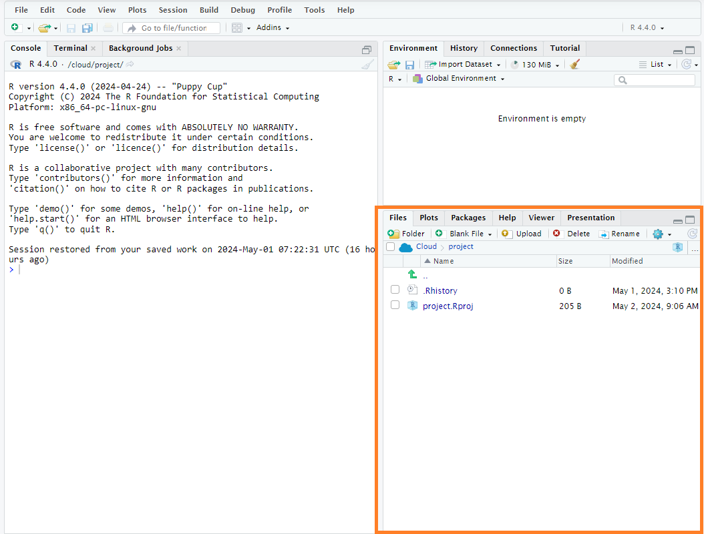

このタブの上部の「Upload」をクリックすると、ファイル選択画面が出てきて、データファイルを選択するとファイルがアップロードされる。

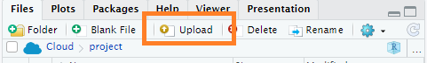

アップロードしたファイルはFileタブのリストに表示される（今回はtest.csvというファイルをアップロードした）。

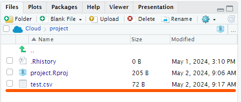

### CSVデータの読み込み

もっともシンプルな方法は表計算ソフトでデータファイルを保存する際にCSVというファイル形式で保存しておき、それをRで読み込む方法である。

CSVファイルとは、行ごとに要素が`,`（コンマ)で区切られたファイル形式である。例えば、先ほどの表の

| 名前 | 背番号 | 点数 |
|:-----|-------:|-----:|
| 赤木 |      4 |    7 |
| 桜木 |     10 |    4 |
| 三井 |     14 |   10 |
| 宮城 |      7 |    7 |
| 流川 |     11 |    9 |

の場合、CSVファイルでは以下のようになる。

```{r echo=FALSE, message=FALSE, warning=FALSE,  warning=F,comment = NA}
cat("名前, 背番号, 点数
赤木, 4, 7
桜木, 10,4
三井, 14,10
宮城, 7, 7
流川, 11, 9")
```

このようなファイル形式をRで読み込む場合には、`read.csv()`関数を使う。1つ目のオプションダブルクォーテーションで括った上で読み込むファイル（既にPosit
Cloudにアップロードしてある前提）を指定する。2つ目のオプションでは、最初の行をヘッダー、つまり各列の名前として読み込むのか、最初の行をデータとして読み込むのかの指定である。`TRUE`だとヘッダーとして読み込み、`FALSE`だとデータとして読み込む。以下の例では、test.csvというファイルを読み込み、その内容を`myData`というオブジェクトに格納している。

```{r error=TRUE}
myData <- read.csv("test.csv", header = TRUE)
myData
```

なお、ExcelでCSVファイルを作った場合には、上記のコマンドではうまく読まない場合がある。その場合には3つ目のfileEncodingのオプションを以下の通りに指定する。（上のコマンドでうまく行っている場合には、逆に以下のコマンドだとエラーとなる）

```{r error=TRUE}
myData <- read.csv("test.csv", header = TRUE, fileEncoding = "Shift-JIS") 
myData
```

ちなみに、`header=FALSE`だと以下の通りとなる。

```{r}
myData <- read.csv("test.csv", header = FALSE, fileEncoding = "Shift-JIS") 
myData
```

それぞれの列名が`V1`, `V2`,
`V3`となっており（自動的にそういう名前が割り当てられる）、もともと列名としていた`名前`,
`背番号`, `点数`がデータの1行目に含められてしまっているのがわかる。

1列目をヘッダとして読むのか、データとして読むのかは読み込みたいファイルの中身に合わせて設定する。また、1列目をデータとして読み込んだ際には、自分で分かりやすい名前を`colnames()`関数を使って設定すること。

### Excelデータの読み込み

Excelファイルを直接読み込みたい場合には、Posit
Cloudに読み込みたいExcelファイルをアップロードしたうえで、RStudioのFileメニュー-\>Import
Database -\>From Excelを選択する。

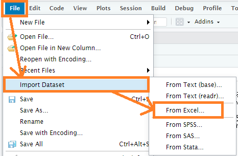

そのプロジェクト内で初めてExcelファイルを読み込む場合には、追加パッケージの読み込み確認の画面が出てくるが、そのまま「OK」をクリックすればよい。
すると、パッケージの読み込みが暫く行われたのち、以下のようなウィンドウが表示される。

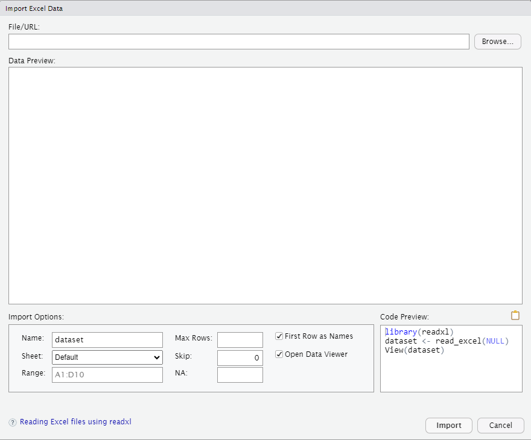

この画面の右上部の「Browse」ボタンをクリックすると、現在のプロジェクトにあるファイルリストが表示されるので、アップロードしておいたExcelファイルを選択する。すると、自動でファイルの中身が読み込まれ、プレビューが表示される。

このプレビューの下部にあるオプションを指定することによって、読み込みにあたっての細かな設定をする事が出来る。それぞれ、以下の通りである。

| 項目               | 内容                                                                                                           |
|:------------------|:----------------------------------------------------|
| Name               | 読み込んだデータを格納するオブジェクトの名前の設定。デフォルトでは読み込んだファイル名がそのまま入力されている |
| Sheet              | Excelファイルのどのシートのデータを読むのかの設定                                                              |
| Range              | 読み込む範囲の指定。エクセルの範囲表記の方法で記述する                                                         |
| Max Rows           | 読み込む最大行数の指定。データの行数よりも大きい数を指定した場合には無視される                                 |
| Skip               | 読み込みをスキップする行数。指定した行数分だけデータの読み込みが飛ばされる。なお、ヘッダ部はカウントされない   |
| First Row as Names | 読み込むにあたって最初の行をヘッダ（列名）として読むのかデータとして読むのかの指定                             |
| Open Data Viewer   | データの読み込みが終わったあと、自動的にデータ閲覧画面を開くかどうかの指定                                     |

以下の例では、オブジェクトの名前をmyDataに変更したものである。

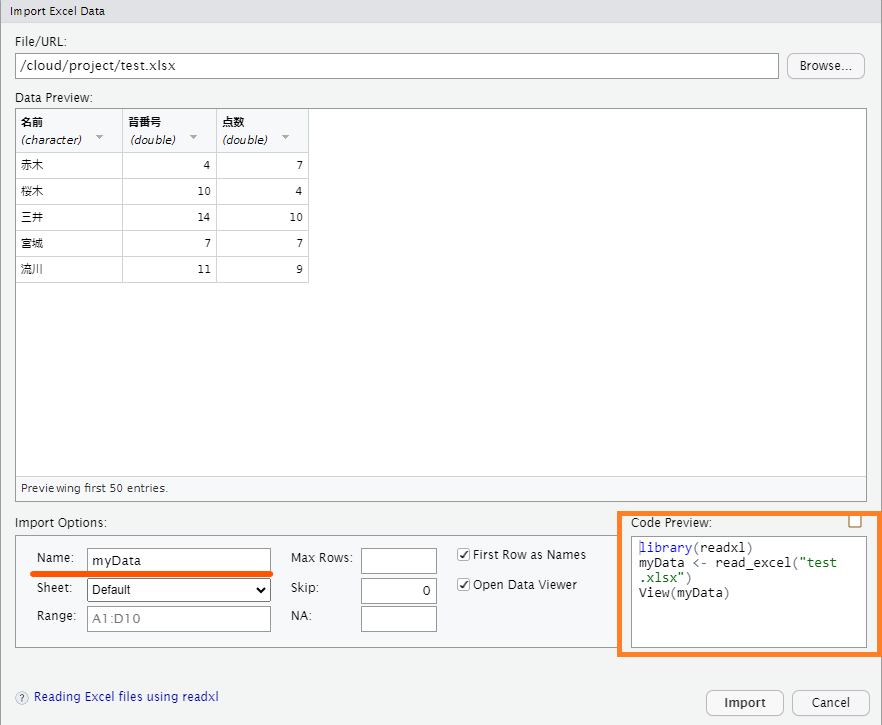

右下部には、設定したオプションでExcelファイルを読み込むための関数一式（スクリプトと呼ぶ）が表示されている（このスクリプトは後で重要になるので、ここに表示されているということは覚えておこう）。

この状態で「Import」を押すと、先ほど表示されていたスクリプトが実行され、以下の図のように読み込んだデータの閲覧画面が表示される。

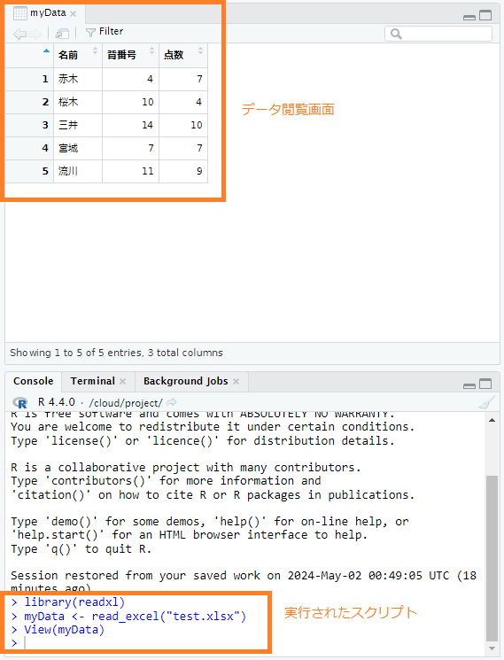

また、以下のようにConcoleに`myData`と入力すると、console中にmyDataの中身が表示される。

```{r}
myData  # print(myData)でも可
```

### データのアクセス、加工

読み込んだデータはデータフレーム型となるため、[データフレーム](#データフレーム)の中で説明した方法で、以下のようにして各列にアクセスしたり、データを書き換えたり、列を追加したりできる。

```{r}
myData <- read.csv("test.csv", header = TRUE, fileEncoding = "Shift-JIS") 
myData$名前
myData[1, "名前"] <- "Akagi"
myData
myData$名前[1] <- "赤木"
myData
myData$Yomi <- c("あかぎ", "さくらぎ", "みつい", "みやぎ", "るかわ")
myData
```

## スクリプト

これまでは命令を1行1行Console中に入力してきた。しかし、色々な処理をさせたり、複雑な処理をさせたりする場合には、命令を1つ1つconsole中に入力して実行していくよりも、命令を別ファイルとして入力し、一気に実行（あるいはある部分だけを実行）する方が作業効率が良い。またそうしておけば、一連の命令をファイルとして保存して、別な時に再度呼び出すことも用意となる。

このような一連の命令セットのことそスクリプトと呼び、それを保存したファイルをスクリプトファイルと呼ぶ。

### スクリプトファイルの作成

Rのスクリプトファイルを作成するには、File メニュー-\> New File -\>R
Scriptを選択する。

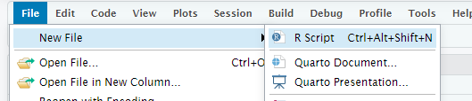

すると、以下のようなスクリプト編集画面が開く。この画面上で一連のコマンドを入力していく。

実際にスクリプトを入力した例を以下に示す。なお、このスクリプトではExcelのデータの読み込みから始めている。Excelデータの読み込みは、先ほどはImportボタンを押す前のプレビュー画面の右下部にスクリプトのプレビューも表示されていた。あの部分をマウスでコピーし、スクリプト編集画面で貼り付けるとよい。

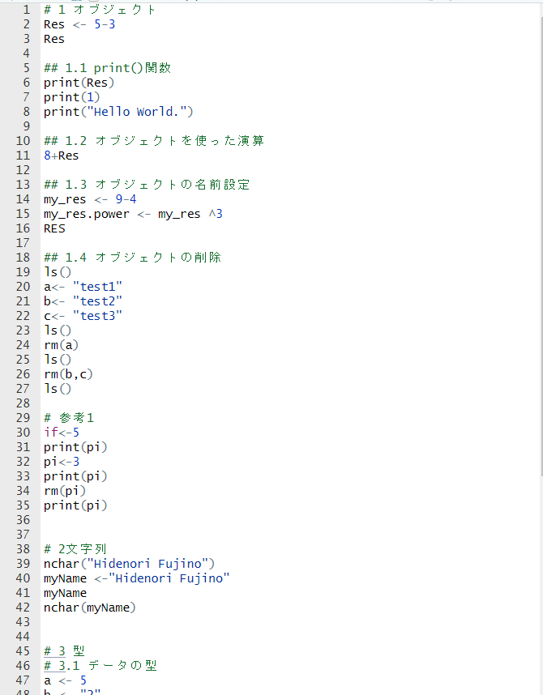

### スクリプトの実行

作成したスクリプトを実行する際には、実行したい部分をマウスで選択したうえで、編集画面上の「Run」ボタンをクリックするか、キーボードで`Ctrl`キーを押しながら`Enter`キーを押せばよい。

全体を選択して「Run」もしくは`Ctrl`+`Enter`すると、スクリプト全体が実行される。

マウスでどの部分も選択せずに「Run」もしくは`Ctrl`+`Enter`すると、入力カーソルが置かれている行のスクリプトが1行ずつ実行される。

### コメントアウト

すでに何度も出てきているが、コマンドを入力するときに`#`を記載すると、`#`以降の記述は全て無視される。この`#`記号はコメントアウト記号といい、スクリプトにコメントやメモを残すのに利用する。スクリプトを作成するときには、是非とも後から別の人がそのスクリプトを読んで内容が理解できるように、メモを残すようにしてほしい。

### スクリプトの保存

作成したスクリプトは画面上部の「保存」マークをクリックするか、`Ctrl`+`s`キーで保存することができる。Posit
Cloud上ではその時のプロジェクト全体の状態が自動的に保存されていくので、つい忘れがちだが、何かのはずみでスクリプトを保存しないまま閉じてしまうと、当然ながらそのスクリプトは帰ってこなくなるので、こまめにファイル保存するのを忘れないようにしてほしい。

保存すると、Posit
Cloud上のリストにスクリプトファイルが作成されて、リストに記載される。

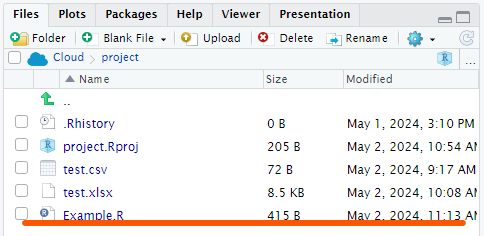

## ファイルのダウンロード

作成した一連のファイルはあくまでオンライン上に置かれている。手許のパソコンにファイルをダウンロードしたい場合には、左側の「Posit
Cloud」と書かれたサイドバーの中の「Your
Workspace」をクリックして、プロジェクト管理画面を開く。もしサイドバーを閉じていた場合には、左上にある三本線のマークをクリックするとサイドバーが現れる。

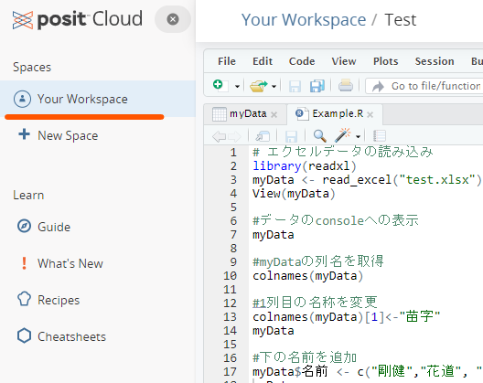

このプロジェクト管理画面の各プロジェクト名の右手にある下向きの矢印のアイコンをクリックすると、プロジェクト全体を圧縮したZipファイルをダウンロードできる。

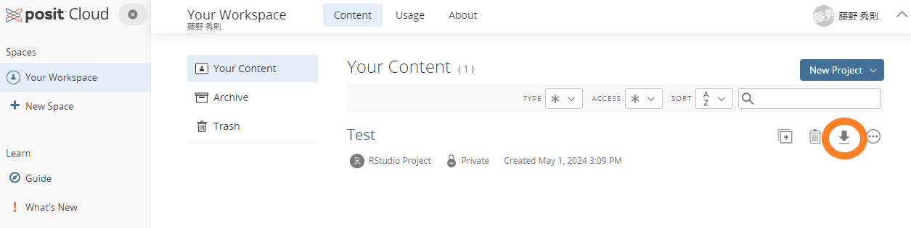

ダウンロードしたZipファイルを解凍すると、Posit
Cloud上のファイル一式が手許のPCに展開される。

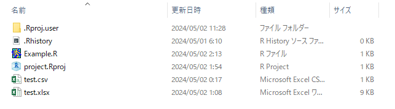

## オブジェクトの削除
作ったオブジェクトはRStudio上の右上ペインの「Environment」タブで確認することができる。

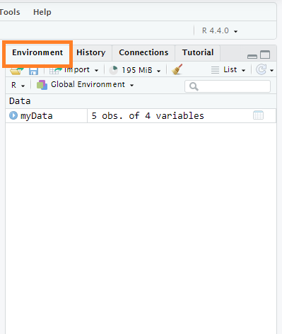

オブジェクトはいくつでも作ることができるが、あまりに多くなってくるとそれだけPCのメモリを喰ってしまうことになる。
そういった場合には作ったオブジェクトの中で使わなくなったオブジェクトを削除すると良い。
削除する方法は大きく2つある。
1つは、すべてのオブジェクトをまとめて削除する方法で、これは、単にEnvironmentタブの中にあるほうきのアイコンをクリックすればよい。

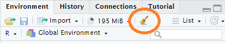
一方、特定のオブジェクトを削除したい場合には、Consoleで`rm()`関数を実行する。関数の引数には削除したいオブジェクトの名前を入力すればよい。
```{r}
a<- "test1"
b<- "test2"
c<- "test3"
ls() # 今あるオブジェクトを確認するコマンド。別に右上の「Environment」で確認できるが・・・
rm(a) # aオブジェクトを除く
ls()
```
`a`オブジェクトが除かれているのが確認できるだろう。

複数のオブジェクトを削除したい場合には、それらを書き込めばよい。`rm()`関数については、`c()`で括る必要はない。

```{r}
rm(b,c)
ls()
```
`b`と`c`が除かれたのが確認できる。

なお、`rm()`をスクリプトに書き入れても構わないが、スクリプトに書き入れると、そのスクリプトを実行する度にオブジェクトの削除が行われることになるので、必要に応じてConsoleで実行するのが良いだろう。


# 記述統計量と推測統計量

## 記述統計量

あるデータセットの特徴を把握するときに用いられる統計量。元のデータから算出される。なお、ここではデータとは数値のみで構成されているものとする。

以下では実際に以下のデータを使って例を示していく。

```{r}
Shohoku <- data.frame(
  name = c("赤木","桜木","三井","宮城","流川","木暮","潮崎","安田","角田","石井","佐々岡","桑田"),
  number=c(4,10,13,7,11,5, 8, 6, 9, 12, 13, 15),
  score= c(7,4,10,7,9,6,6, 7, 7,  5,  5,  4)
)
Shohoku
```

### 代表値（平均、中央値、最頻値）

あるデータセット全体的な特徴を一番端的に表現する値。あるいは、そのデータセットを文字通り「代表」する値。平均、中央値、最頻値の3種類がある。

#### 平均値 {-}

すべてのデータ（数値）を足し合わせて、データの数で割った値のこと。

$$
\bar{x} =\frac{1}{n}\sum^{n}_{i=1}x_{i}  
$$
Rで求めるには`mean()`関数を用いる。（各自、スクリプトファイルを作成し、以下の内容を自分でも入力・実行して出力結果を確認すること)

```{r}
example<-c(1,2,3,4,5) # 例として1,2,3,4,5という5つの数値からなるベクトルを使った
mean(example)
mean(Shohoku$score) #先ほどの湘北高校バスケ部のフリースロー10本勝負のスコアの平均
```

なお、実際のデータを扱う際には、CSVファイルやExcelファイルからデータを読み込むことが多くなる。そうしたデータファイルにはたまに「空白」が含まれているケースがある（例えばアンケートで無回答だったり、実験で計測に失敗したりした場合）。その場合、Rにそれらのデータを読み込むと、空白だった箇所には`NA`(Not
Available：利用不可能という意味)という記号が自動的に入力される。

`mean()`関数を用いる際に、与えたベクトルに`NA`が含まれていた場合、Errorにはならないが出力は`NA`となる。

このようなデータの場合には、以下のように`na.omit`オプションを`True`（真）に設定するとNAを除いた上で平均が算出される（データの総数はNAの数の分だけへることになる。）。

```{r error=T}
example<- c(1,2,3,4,NA)
mean(example)

example<- c(1,2,3,4,NA)
mean(example, na.rm = T) 

```

#### 中央値 {-}

全てのデータ（数値）を数の大小で順に並べ、ちょうど中央の順位に来る数値。データ点数が偶数だった場合には、中央の位置の前後の数字の平均値を中央値とする。

Rでは`median()`を用いる

```{R}
median(Shohoku$score)
```

先の湘北高校のデータは12人分なので、中央値は6位と7位の間をとることになるため、小数の値が出てきている。

#### 最頻値 {-}

全てのデータ（数値）について、度数分布をとり、最も度数が大きい（出現頻度が最も多い）数値。

Rでは最頻値を直接求める関数は存在しない。そのため、まずは`table()`コマンドを使って、対象となるデータの度数分布表を求める。
ついで、その度数分布表に度数が最も高いものを求める、という手続きで算出する。
ただし、度数分布表で最も度数が高いものを取り出したときのデータは「名前付きベクトル」{#名前付きベクトル}で出力され、最頻値を表す値は度数値に対する「名前」（すなわち文字列）として出力れる。そこでその名前を数値として読みなおす必要がある。
以下は例である。行っている一連の処理をよく確認しておくこと。

```{R}
table_data<-table(Shohoku$score) ## 度数分布表を作成
print(table_data)
d<-which.max(table_data) ##度数分布表から最も度数が高い値を取り出す
print(d) # 7と4が表示されている。わかりにくいが、これは"7"という名前の付いた列に4という度数データが入っている、ということを表している。ここで"7"は数値ではなく文字列である。
mode<-as.numeric(names(d)) #欲しいのは値としての7なので、names()を掛けた後に、as.numeric()を行っている。
print(mode)
```

ちなみに、上記のスクリプトファイルは細かく一つ一つ分けて書いているが、以下のように関数の中に関数を入れることで、シンプルに書くことができる。このように関数が入れ子になっている場合、内側の関数から順次実行されている。

```{r}
as.numeric(names(which.max(table(Shohoku$score))))
```

::: ref
<p>

さらには、`tidyvers`というライブラリを読み込んでおくことによって、以下のような書き方もできる。なお、初めてTidyverseを使う場合には、library(tidyverse)を読み込んだときにパッケージのインストールをするかどうか聞かれるので、installを選択しておく。tidyverseについては後ほど別章で詳しく説明する。

```{r message=FALSE, warning=FALSE}
library(tidyverse)
Shohoku$score %>%
  table() %>%
  which.max() %>%
  names() %>%
  as.numeric() 
```

</p>
:::

#### 平均・中央値・最頻値の関係 {-}

正規分布のように左右対象の一山の度数分布をしていた場合には、平均値・中央値・最頻値は全てほぼ一致する。

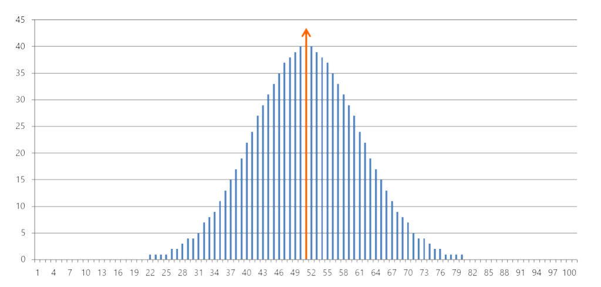

一方、次の図のように左右非対称であった場合には、平均値・中央値・最頻値は一致しなくなる。

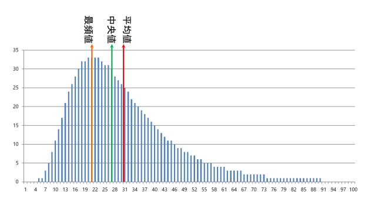

### ばらつき（分散・標準偏差、四分位数）

あるデータセットがどの程度ばらつき（広がり）を持っているのかを示す指標。平均系の平均偏差・分散・標準偏差と、中央値系の四分位数とがある。

#### 平均偏差 {-}

平均偏差とは、データ全体の平均値を予め求めておいた上で、各データと平均値との距離（差の絶対値）を全てのデータに対して求め、その平均をとったもの。

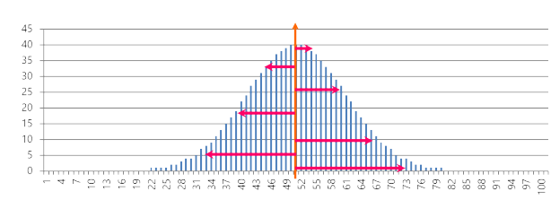

$$
M.A.D =\frac{1}{n}\sum^{n}_{i=1}|x_{i} - \bar{x}|
$$ 
Rでは`mad()`関数を用いる。

```{r}
MAD <- mad(Shohoku$score)
print(MAD)
```

#### 分散 {-}

平均偏差は数式のなかに絶対値記号が入ってきて、数値計算が非常に面倒になる。絶対値を加えたのは単純に$x_{i}-\bar{x}$を求めると$x_{i}$によっては負の数字になるからである。負を正にするためだけなら、$x_{i}-\bar{x}$を2乗するということでもよいのではないか。そこで、「差の絶対値」ではなく「差の2乗」の平均値をばらつきの指標としたものが分散(Variance)である。一般に
$S^{2}$と表現する。「2乗の平均」にしたことによって数値自体の絶対的な意味の解釈は難しくなるが、少なくとも2つのデータセットがある時に、どちらのデータのほうがよりばらついているかは分散の値を比較することによって分かる。

$$
S^{2} = \frac{1}{n}\sum^{n}_{i=1}(x_{i}-\bar{x})^2
$$

Rでは`var()`関数と`nrow()`関数を用いて以下のように書く。`nrow()`はデータフレームの行数、すなわちデータフレームに含まれているサンプル数を返す関数である。

```{R}
s2<- var(Shohoku$score)
n <- nrow(Shohoku)
VAR <- (n-1)/n*s2
print(VAR) #こちらが標本分散
```

複雑な式に見えるが、要するに、$\frac{データ数-1}{データ数}$を`var()`に掛けているということである。これは`var()`関数は[不偏分散](#分散の点推定)を算出する関数であり、データそのものの分散（標本分散）を算出するためには、補正をしてやる必要があるためである。[不偏分散](#分散の点推定)については後ほど改めて説明する。

#### 標準偏差 {-}
 
分散の場合、距離（差）の2乗にしてしまっているので、元のデータと次元が異なってしまい、出てきた数値が何を意味しているかがにわかには分からない。そこで分散の平方根を取ることによって、元のデータと同じ次元の数値とすることによって、元のデータと比較したり平均と組み合わせられるようにしたものが標準偏差(Standard Deviation)である。一般に$S$と表現する。


$$
S=\sqrt{S^{2}} = \sqrt{\frac{1}{n}\sum^{n}_{i=1}(x_{i}-\bar{x})^2}
$$

Rでは`sd()`関数を用いるが、データそのものの標準偏差を得たい場合には分散の時と同様に`nrow()`関数を用いた補正（標準偏差の場合にはさらに平方根を求める関数`sqrt()`も用いる）をしてやる必要がある。
```{r}
s <- sd(Shohoku$score) # こちらのsは小文字
S <- sqrt((n-1)/n)*s # nは先に求めたnrow()関数の出力。
print(S)
```
標準偏差は「ばらつき」の単位（ものさし）として用いることが一般的である。データが完全に正規分布をしていた場合、次の図のように、平均値から±1Sだけ離れたところに境界を引くと、その境界内には全データの約68.27%のデータが含まれる。同様に±2Sの範囲内であれば約95.45%のデータが、±3Sになると約99.73%のデータが含まれることになる。

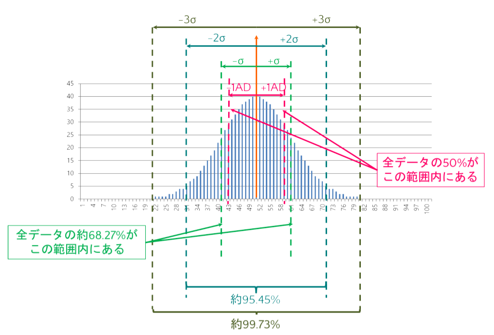

:::ref
#### データの標準化（正規化）得点 {-}
平均$\bar{x}$を基準（すなわち0）とし、それぞれのデータの値$x_{i}$と平均との距離を標準偏差$S$を単位として表現した値。要するに、そのデータ全体の中で、あるデータ値が相対的にどのくらいの位置にあるのかを表した値のことを標準化得点、もしくは正規化得点と呼ぶ。一般に$z_{i}$と表現する。さらに、こうした処理を行うことを標準化、あるいは正規化と呼ぶ。
$$
z_{i} = \frac{x_{i}-\bar{x}}{S}
$$

Rで標準化を行う場合、`scale()`関数を用いればよい。
```{r}
z <- scale(Shohoku$score)
print(z)
```
出力結果の上12個は各データ値を標準化した値である。続いて、`attr()`にあるのは、それぞれ標準化に用いた平均値と標準偏差である。先ほど求めた平均、標準偏差と比べてみると、平均は一致しているが標準偏差は異なる。これは、`scale()`関数が内部で計算に用いている標準偏差は、あくまで補正の掛けない不偏標準偏差、すなわち`sd()`関数の結果をそのまま計算に用いているからである。実際に、先ほど`sd()`関数の結果を格納した`s`（小文字）をプリントさせてみると、同じ値が出力される。
```{r}
print(s)
```

#### 偏差値{-}
標準化得点が得られれば、受験の際にお世話になった「偏差値」というものを以下の式で算出することができる。
$$
偏差値= z_{i}*10＋50
$$
すなわち、偏差値とは標準化得点を10倍したものに50を足したものである。この式から得点が平均点と一致していた場合に偏差値が50になることが理解できる。また、データが正規分布をしている場合には、先に示した標準偏差とデータの分布の図より、偏差値が60から40の範囲内に約68%のデータが含まれていることがわかる。さらに、偏差値が70を超えていた場合には、そのデータ値は全体の上位5%以内にある、ということになる。
:::

#### 四分位数 {-}
全てのデータ（数値）を小さいものから順に並べ、最小値(0%)、下位25%、中央値(50%)、上位25%、最大値(100%)の順位に来る数値。特に下位25%を第1四分位数、上位25％を第3四分位数と呼ぶ。
分散と標準偏差が平均値を代表値とした場合のばらつきの指標であるのに対して、中央値を代表値とした場合のばらつきの指標が四分位数となる。

四分位数を求めるRの基本関数は`quantile()`である。`quantile()`関数は算出対象となるデータを与えた後に、どの四分位数を求めるかを小数で与えてやる。
```{r results='hold'}
Q_1 <- quantile(Shohoku$score, 0.25) # 第1四分位数　下位25%の値。
Q_2 <- quantile(Shohoku$score, 0.75) # 第3四分位数　上位25%、すなわち下から75%の値
print(Q_1)
print(Q_2)
```
:::ref
このように関数を用いるときに`()`に与えるデータやオプションのことを**引数（ひきすう）**と呼ぶ。
:::

また、`quantile()`は以下のように2つ目の引数に`c()`を用いて複数のパラメータを指定してやることで、複数の四分位数を一度に求めることもできる。
```{R}
Q <- quantile(Shohoku$score, c(0.0, 0.25, 0.50, 0.75, 1.0))
print(Q)
```
ちなみに、`quantile()`の出力は[名前付きベクトル](#名前付きベクトル)である。

### 記述統計量をまとめて出力するコマンド
以上、個別に記述統計量を算出する方法について説明した。
算出したこれらの統計量を別の計算で用いたい場合には、個別にこれらのコマンドで算出する必要がある。
一方、レポートや論文などで記述統計量を報告したり、とりあえず全体的な傾向を把握したいといった場合には、`summary()`関数や`describe()`関数を利用することができる

#### summary()関数{-}
`summary()`関数を使うと、ベクトルやデータフレームに含まれている各列について、四分位数と平均値を一度に得ることができる。また、ベクトルやデータフレームの列が文字列型だった場合にはデータの点数が、ベクトルやデータフレームの列が要因型（factor型）だった場合には要因ごとのデータ点数が表示される。

簡単にデータ全体の傾向を把握することができるので、データを読み込んだ場合には`summary()`をまずは実施する、というのがデータ分析の基本フローと言えるだろう。

```{r}
summary(Shohoku) #データフレームを与えると、含まれているベクトルごとの平均と四分位数を出力される。
summary(Shohoku$score) #ベクトルを与えると、そのベクトルの平均と四分位数をが出力される。
```

#### describe()関数{-}

`psych`パッケージに含まれる`describe()`関数を用いるとより詳しい記述統計量を得ることができる。`psych`パッケージを利用するためには、上部のメニューの中からTools->install.packagesを選択したうえで、以下のようにPackagesに`psych`と入力してパッケージをインストールする。

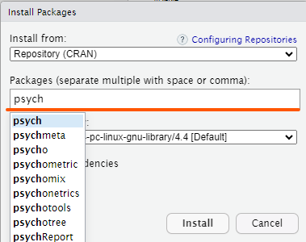
インストールが完了すれば、`library()`関数を使って`psych`パッケージを読み込み、`describe()`関数を実行すると、以下のような結果が表示される。

```{r results='hold'}
library(psych)
describe(Shohoku)
```
それぞれ、以下のような指標である

|名前|内容|
|:-|:-----------|
|mean|平均|
|sd|標準偏差（不偏標準偏差）|
|median|中央値|
|trimmed|トリム平均（データの上下5%ずつを取り除いて算出した平均）|
|mad|平均偏差|
|min|最小値|
|max|最大値|
|range|最大値－最小値|
|skew|歪度（データの分布がどの程度左右に偏っているか。負の場合は左に、正の場合には右に偏っている。また値が大きいほど偏りが大きい。）|
|kurtosis|尖度（データの分布がどの程度尖っているか。正規分布の尖り具合を0として、正の場合には正規分布より尖っており、負の場合には正規分布より平坦になっている）|
|se|標準誤差（詳しくは後述{#平均値の区間推定}。）|

なお、上記のname列に対する結果の通り、`describe()`関数はたとえ列の型が文字列であっても数字を出力してくる。当然ながら意味は全くない。参考までに、この出力結果は各要素のインデックス番号をデータとして計算を行ったものであある。


:::ref
<span id="PackagesInstall"/>
この例のようにRでは標準的なコマンド以外にも様々なコマンドが用意されている。ただし、それらのコマンドを利用するためには、そのコマンドが定義された外部パッケージをTools->install.packagesによってインストールし、さらにスクリプト内で`library()`関数を使ってそのパッケージを読み込む必要がある。
なお`library()`関数での外部パッケージの読み込みはスクリプトの実行中1回だけで良い。1度読み込みば、その後はその外部パッケージのコマンドを入力するだけでコマンドを実行することができる。
またパッケージのインストールも一度行えばその後は行う必要はなくなる。
:::

## 推測統計量

### 全数調査とサンプリング調査

何らかの調査をするときに、その調査が想定している対象全体のことを「母集団」という。それに対して、母集団の中から一部だけを抜け出して調査を行った場合、実際に調査を行った対象を「サンプル（標本）集団」と呼び、サンプル集団に含まれる個々のデータのことをサンプル（標本）と呼ぶ。また、母集団に対して行う調査を母集団調査、あるいは全数調査と呼び、サンプル集団に対して行う調査をサンプル調査と呼ぶ。

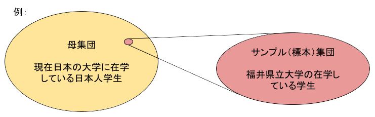

母集団調査（全数調査）を実施できればそれに越したことはないが、実際には費用的・時間的な制約であったり、現実に不可能であったりするために、母集団調査を実施できないことは多い。そういう場合には、現実的に実施可能な限られた数のサンプル調査を行い、その結果をもとに母集団の特徴を推測するということが行われる。

**母集団調査（全数調査）の例**

- **中学での校内の定期テスト**：あくまでその中学の中での成績を把握するためのものであり、対象はその中学の生徒に限られ、さらに全員が受けることが前提のテストであることから、母集団にアクセスできていると言える。同様に大学入試共通テストもその年度の全受験生が受けている（もちろん受けない受験生もいないわけではないが、そのような受験生はそもそも対象とはなっていない）ので、これも母集団全体にアクセスできている例である。
- **国勢調査**：国勢調査はその時の日本の状態を把握することを目的に、5年に一回、日本国に在住のすべての人を対象に行われる調査であり、母集団そのもの（その時に日本に在住している人全て）にアクセスしている例である。
- **小中学校で行われる健康診断**：日本の場合、小学校と中学校は義務教育として対象者全員が通うことが義務付けられている。さらに健康診断は学校保健安全法により全ての学校で実施することが定められている。したがって、小中学校における健康診断はその年度の日本の6歳児から15歳児までの全員に対する診断であり、母集団にアクセスしている例である。一方、高校や大学でも全員に対する健康診断は行われているが、これらの学校は義務教育ではない。したがって、これらの学校での健康診断結果は、日本の16歳〜22歳の母集団全体に対する調査結果ではない。

**母集団にアクセスできず、あくまでサンプル調査となる例**

- **血液型による性格の違いの検証のための性格診断調査**：実際に血液型によって性格が違っているかを全数調査によって検証するためには、全世界の全ての人に調査しなければならない。さらに現時点での全世界の人にアクセスできたとしても「単に今現在はそうなってるだけだろう」というツッコミが入り得るので、理論としての完全性を確保するためには、過去の全人類やこれから先の全人類を調査しなければならない。当然ながらそんなことは不可能である。したがって、血液型による性格の違いを母集団調査によって検証することは不可能であり、どれだけ多くのデータを集めたとしても、それはあくまでサンプル調査である。
- **新聞社等が実施する世論調査**：世論調査は各自治体が持つ選挙人名簿から10人おきや20人おきにピックアップされた人に対してハガキや電話、あるいは訪問によって調査している。得たいのはその時点での日本全体の世論であり、その時の日本人への全数調査ができれば良いが、それをするにはコスト的にも時間的にも現実的ではないので、限られた数のサンプルだけに調査を行い、そこから得た結果をもとに、日本全体の世論を推測している。
- **視聴率調査**：視聴率はビデオリサーチ社がモニター世帯に選ばれた世帯に対して「どの番組を視聴しているか」を記録する機械を設置し、その機械に記録された情報をもとに算出している。あくまでモニター世帯だけしか調査は行なっていないのでサンプル調査であり、その結果をもとに「日本全体でどの番組がどの程度視聴されているか」を推測している。

そのほか、マーケティング調査なども基本的に全てサンプル調査である。

## 母数と標本統計量
母集団全体での記述統計量を**母数**と呼ぶ。また、特に平均、分散については**母平均**、**母分散**と呼ぶこともある。
それに対してサンプル集団の記述統計量を**標本統計量**と呼び、平均を**標本平均**、分散を**標本分散**と呼ぶ。

母集団全体にアクセスできる場合には、得られたデータの記述統計量は母数そのものとなる。それに対してサンプル集団にしかアクセスできない場合には、そのデータの記述統計量はあくまで標本統計量であり母数ではない。

### 標本統計量からの母数の推測
先の例にも述べた通り、サンプル調査ではデータそのものの記述統計量（つまり標本統計量）が得たいのではなく、その結果を基に母数を推定することが目的である。従って、標本統計量から母数を推定する必要がある。

推定には大きく2種類あり、値を単刀直入に推定することを点推定と呼ぶ。一方、「95%の確率で、この範囲内に母数がある可能性が高い」という範囲を推定することを区間推定と呼ぶ。点推定の値のことを**不偏推定量**、区間推定の範囲のことを「95%信頼区間」と呼ぶ。なお、区間推定では「95%」が用いられることが多いが、場合によっては90%や99%が用いられることもああり、その場合には信頼区間の呼び名もそれぞれの確率値に変わる。

細かな導出過程や導出に当たっての考え方については省略するが、母数の推定値は以下の数式によって算出される。なお、以下では$\mu$, $\sigma^2$は母平均と簿分散、$\hat\mu$や$\hat{\sigma^2}$は母平均と簿分散の推定量、$\bar{x}$と$s^2$は標本平均、標本分散を表す。

#### 平均値の点推定{-}

母平均の不偏推定量を式で表すと以下のようになる。
$$
\mu \approx \hat{\mu}=\bar{x}=\frac{1}{n}\sum^{n}_{i=1}x_{i}
$$
要するに、母平均の推定量は標本平均そのものである。つまり、サンプル調査を行った時、得られたデータの平均を母集団全体の平均と見なそう、ということである。

したがってRで母平均の推定量を求めるときも、従来通り`mean()`関数を用いればよい。

```{r}
mean(Shohoku$score)
```

#### 分散の点推定{-}

母分散の不偏推定量（不偏分散）は以下の式となる。

$$
\sigma^2 \approx \hat{\sigma^2}=\frac{n}{n-1}s^2=\frac{1}{n-1}\sum^{n}_{i=1}(x_i-\bar{x})^2
$$

要するに、標本分散を求める時には「データと平均との差の二乗の和」を**n**で割っていたのを、**n-1**で割る形にしているだけである（なぜn-1になるかは結構面倒な話になるので省略。興味ある人は上の数式の導出過程をネットで調べてみてほしい）。

さらに母標準偏差の不偏推定量は、上記の式の平方根となる。

\begin{align}
\sigma \approx \hat{\sigma}&=\sqrt{\frac{n}{n-1}s^2} = \sqrt{\frac{1}{n-1}\sum^{n}_{i=1}(x_i-\bar{x})^2} \\
&= \sqrt{\frac{n}{n-1}}s
\end{align} 

Rで不偏分散や標準偏差の不偏推定量を求める方法については、すでに上記で説明したとおり、`var()`や`sd()`を用いればよい。

すなわち、先ほどの湘北高校のデータを用いるならば、以下の通りとなる。
```{r results='hold'}
var(Shohoku$score)
sd(Shohoku$score)
```

ちなみに、この数値の解釈として、湘北高校のバスケ部員はフリースローで10本中、約6本（平均の不偏推定量）を入れることができるが、メンバー間でのばらつきとして1.8点ほどの標準偏差を持っている、ということである。これはあくまで母数の推定量をであり、赤木・桜木・三井・宮城・流川の5人の得点の平均や5人の中でのばらつきではない。5人をサンプルとした「湘北高校のレギュラーメンバー」という母集団のフリースローの成績の推定値ということである。つまり、赤木・桜木・三井・宮城・流川が入学する前のレギュラーメンバーや、彼らが引退した後のレギュラーメンバーも対象に入れた、**湘北高校バスケ部のレギュラーメンバー一般**の成績の推定値ということになる。


#### 平均値の区間推定{-}
続いて、区間推定であるが、平均の区間推定を行う際には**標準誤差(Standard Error)**と呼ばれる統計量を算出する必要がある。標準誤差は以下の数式で算出される。

$$
SE = \sqrt{\frac{\hat{\sigma^2}}{n}}=\frac{\hat{\sigma}}{\sqrt{n}}
$$ 
要するに、標準偏差の不偏推定量を$\sqrt{n}$で割った値である。
この標準誤差（以下SE）を用いて、平均値の95%信頼区間（上限と下限）はそれぞれ以下の数式で得られる。

\begin{align}
上限 &= \hat\mu + t\times SE \\
下限 &= \hat\mu - t\times SE
\end{align}

ここで$t$とは**自由度$n-1$（$n$はサンプル数）のT分布表の両側95%から得られる値**である。T分布表は大抵の統計学の教科書の末尾に記載されている。具体的には以下のような表である。自由度n-1の行の$\alpha＝0.025$の値を読む。例えば、サンプル数が30の場合、自由度は29なので、t＝2.045となる。

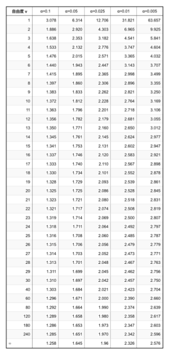

Rで平均値の信頼区間を求めるにあたっては、2つの方法がある。

まず一つ目は`t.test()`を使う方法である。本来`t.test()`関数は後で説明する[平均の比較](#平均と分散の比較)に用いる関数であるが、信頼区間を出力させるのに用いることができる。

```{r}
res<-t.test(Shohoku$score)
res$conf.int
```
$5.252698$が下限、$7.580636$が上限となる。$0.95$は信頼区間の確率である。

ちなみに、`res`自体を出力させると以下のような出力になる。ごちゃごちゃと書かれているが、真ん中あたりに`95 percent confidence interval:`とあり、信頼区間が記載されている。 
```{r}
print(res)
```

もし信頼区間の確率設定を変えたい場合には以下のようにすればよい。
```{r}
res<-t.test(Shohoku$score, conf.level = 0.99)
res$conf.int
```

二つ目の方法は、先に示した式を自分で打ち込む方法である。
```{r results='hold'}
#　平均と標準誤差の算出
n <-length(Shohoku$score)#length()はベクトルの長さ（要素数）を得る関数。もちろんnrow(Shohoku)としてもよい。
res_mean <- mean(Shohoku$score)
res_se <- sd(Shohoku$score)/sqrt(n)  

#ｔ値の取得
t_value <- qt(0.975, df=n-1) # 0.025でもよい。0.025とした場合、負の数字が出力される点に注意すること。

#信頼区間の算出
Band_Upper <- res_mean + t_value * res_se
Band_Lower <- res_mean - t_value * res_se

#出力
c(Band_Lower, Band_Upper)
```
先ほどと同じ数値が算出されていることが確認できる。


#### 分散の区間推定{-}

分散についての95%信頼区間については不偏分散$\hat{\sigma^2}$を用いて次の式で与えられる。

\begin{align}
上限 &= \frac{(n-1)\hat{\sigma^2}}{\chi^2_{0.975}} \\
下限 &= \frac{(n-1)\hat{\sigma^2}}{\chi^2_{0.025}}
\end{align}

$\chi^2$(カイ2乗と呼ぶ)は、$t$と同様に**自由度n-1（nはサンプル数）のカイ2乗分布表から得られる値**である。分布表と同様に、カイ2乗分布表も統計学の教科書には記載されている。具体的には次々項のような表である。自由度n-1の$\alpha＝0.025と0.975$の値を読み取る。例えば、サンプル数が30の場合、自由度は29なので、上限算出に使う$\chi^2$値は16.047、下限算出に使う$\chi^2$値は45.722となる

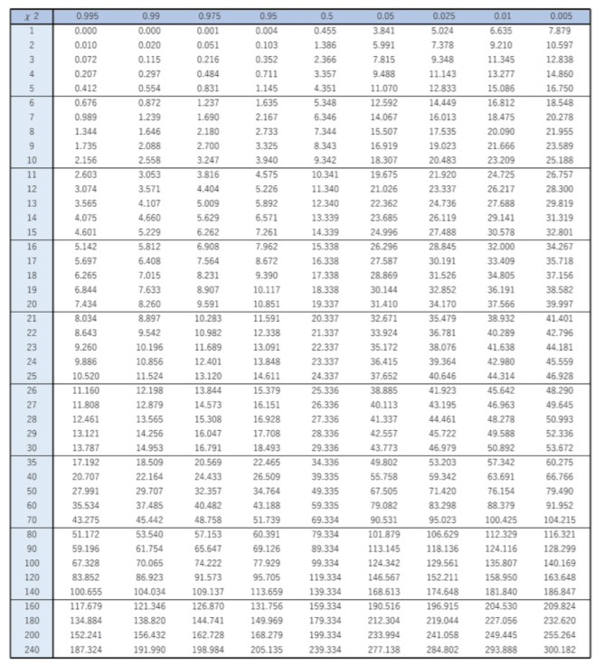

Rで分散の信頼区間を算出する方法も2つある。1つは`EnvStats`パッケージに含まれている`varTest()`関数を使う方法である。使うには`EnvStats`パッケージをインストールしたうえで、`library()`関数を実行する必要がある（[こちら参照](#PackagesInstall))。
```{r}
library(EnvStats)
res<-varTest(Shohoku$score)
res$conf.int
res<-varTest(Shohoku$score, conf.level = 0.90) #90%信頼区間の場合
res$conf.int
```

ちなみに`varTest()`自体の出力結果は以下の通りである。一番下に信頼区間が記載されている。なお、上のコードで確率を90%に設定したものをresに格納しているので、90%信頼区間の結果が表示されている。

```{r}
print(res)
```
もう一つの方法は、平均値の区間推定と同様に先に示した式を自分で打ち込む方法である。

```{r}
n <- nrow(Shohoku) # 今度はnrow()を用いた。当然length()を用いてもよい
res_var <- var(Shohoku$score)

# カイ二乗分布のクリティカル値を使用して信頼区間を計算
chi_upper <- qchisq(0.025, df = n - 1) #上で示した式の上限・下限の確率値が入れ替わっていることに注意
chi_lower <- qchisq(0.975, df = n - 1) 

# 分散の信頼区間
Band_Lower <- (n - 1) * res_var / chi_lower 
Band_Upper <- (n - 1) * res_var / chi_upper

#出力
c(Band_Lower, Band_Upper)
```

なお、Rで計算するときの$\chi^2$値算出の関数`qchisq()`での確率設定値と、先ほど式で示したものの中での$\chi^2$値の確率設定値が入れ替わっている。これは確率を「残された方」で見るのか、「切り落とす方」で見るのかの違いである。入れ替わってしまったとしても数値自体が変わるわけではないので、実際に出力させてみて、上限と下限の値が逆順になっていれば、数値を入れ替えればよい。

:::ref
平均値の区間推定にしろ、分散の区間推定にしろ、「95%」信頼区間なのに、$\alpha＝0.05や0.95$ではなく$\alpha＝0.025や0.975$の値を読むのはなぜなのか疑問に思う人もいると思う。これは「95％の確率でその区間の中に平均値がある」という範囲を取り出す、ということはその範囲よりも上下にある2.5%ずつを切り落とすということだからである。仮に5%と95%の値を読むことにしてしまうと、残された区間は90%となってしまう。
:::


# 基本的なデータの可視化

## ggplot2を用いた可視化


## 箱ひげ図
四分位数はその数字そのものを示すより、一般に「箱ひげ図」と呼ばれるグラフを作成する際に用いられることが多い。箱ひげ図の具体例を以下に示す。箱の上端と下端で第1、第3四分位数を示し、箱の中の線で中央値を示す。さらに上下に伸びたひげで最大値、最小値を示す。場合によっては、箱の中に点線で平均値を示したり、一点鎖線で最頻値を示したりといったことも可能である。

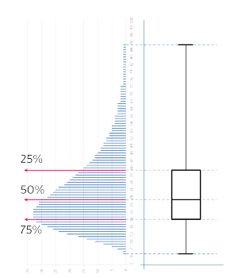


このグラフの秀逸な点は、データが概ねどのような分布をしているかを示すことができることである。例えば上の箱ひげ図の場合、上にひげが長く伸び、さらに第3四分位数と中央値の間が、第1四分位数と中央値の間よりも広がっていることから、データの分布として、全体として点の低いほうに山が偏っており、点の高いほうに裾野が伸びた分布をしているということが読み取れる。
以前は棒グラフで平均値を示したグラフや、平均値の棒グラフに標準偏差の幅分だけ「ひげ」（エラーバーと呼ぶ）をつけたグラフを示すのがほとんどであったが、平均と標準偏差を示すだけでは、上記のような分布の形状までは分からない。このため、最近では、箱ひげ図を示すことも多くなってきている。


# データハンドリング（基礎）

## 検索や置換

## tidyverseの利用

## 正規化データの構造

## グループ単位でのデータの取り扱い

### グループごとの統計量の算出

# 基本的な検定

## 平均と分散の比較

T検定とF検定 結果の可視化 結果の報告の仕方

## 比率の比較

X2乗検定 Fisherの正確確率検定 結果の報告の仕方

## 多重比較

検定の多重性問題 結果の可視化 結果の報告の仕方

# 分散分析

一要因分散分析 結果の報告の仕方 二要因分散分析 結果の報告の仕方
調整変数を含んだ分散分析

対応のあるデータでの分散分析 分散分析のタイプ

# 回帰分析と重回帰分析

## 相関分析

### 共分散と相関

### 疑似相関と重相関

## 回帰直線の可視化

# 主成分分析と因子分析

# クラスター分析

# 一般化線形モデル

# 混合モデル

# 共分散構造分析

## パス解析

## 構造方程式モデリング

# テキストマイニング

# RStudioのさらなる活用

## RmarkdownとHTML出力

## GitHubとPosit Cloudとの連携
