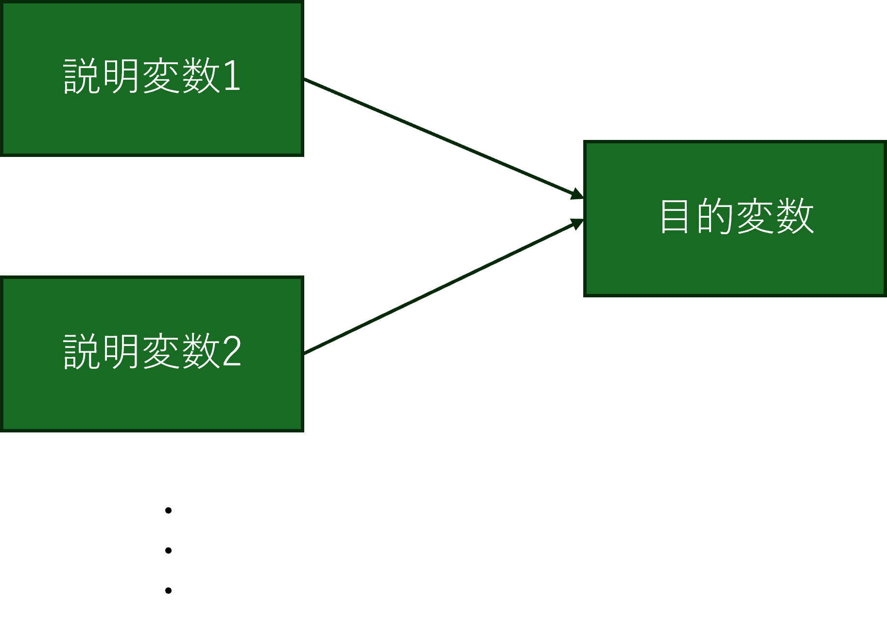
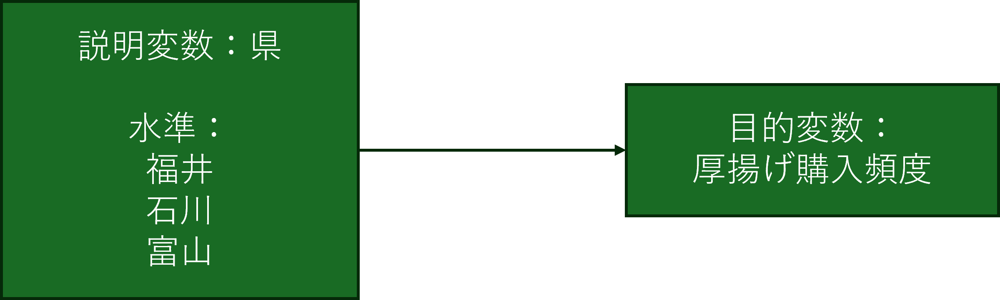
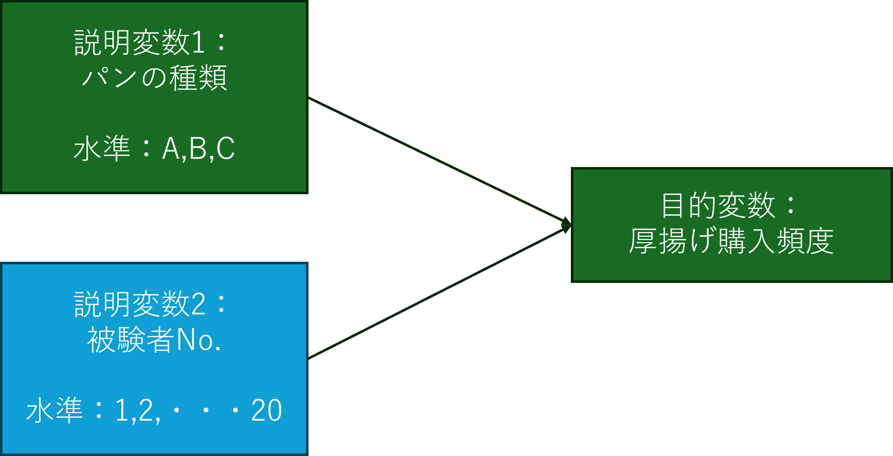

```{r setup, include=FALSE}
knitr::opts_chunk$set(echo = TRUE)
```

```{css, echo=FALSE}
.tocify-subheader { /* 全部のサブヘッダーを最初から表示する*/
    display: block !important;
}
.tocify-item {/*長いヘッダーも折り返さない*/
    white-space: nowrap;
}

body{/**カウンターのリセット**/
  counter-reset: ref_number practice_number;
}

.float img{
  /* 上右下左 */
  /* margin: 5% 0% 0% 0% ;*/ 
  /* width : 75%; */
  margin: auto;
  display: block;

  border-radius: 8px 8px 0 0 ;
  position: relative;
  width : 60%;
}

.float .figcaption {
  position: relative;
  font-style: italic;
  font-size: large;
  font-weight: bold;
  color: #666;
  text-align: center;
  margin:0% auto 5% auto;
  border-bottom: solid 1px #666;
  border-left: solid 1px #666;
  border-right: solid 1px #666;
  border-radius:0 0 8px 8px;
  width : 60%
}

img {
  margin: auto;
  display: block;
  border: solid 1px #666;
  border-radius: 8px;
  position: relative;
  width : 100%;
}

.ref {
  position: relative;
  margin:5%;
  padding:5px;
  background-color: rgba(255, 255, 128, .5);
  color: #666;
}
.ref::before{
  counter-increment: ref_number 1;
  content: "[参考 " counter(ref_number) "]";
  font-weight: bold;
  display: block;
  margin-bottom: 3px;
}

h1 {
  margin-top : 10px;
  padding-top : 50px;
}


.practice {
  position: relative;
  margin:5%;
  padding:5px;
  background-color: rgba(128, 255, 200, .5);
  color: #666;
}
.practice::before{
  counter-increment: practice_number 1;
  content: "[例題 " counter(practice_number) "]";
  font-weight: bold;
  display: block;
  margin-bottom: 3px;
}

.r{ 
　/**copy の禁止**/
  user-select: none;
  -moz-user-select: none;
  -webkit-user-select: none;
  -ms-user-select: none;
  -khtml-user-select: none;
  -webkit-touch-callout: none;
}

```

# R実行環境の整備

[こちらのページ](./RText_Preparing_REnvironment.html)を参照してください。


<!--
## Posit Cloudへのサインアップ

Rを使って統計分析を行う際には、本来は[R](https://cran.r-project.org/)と[RStudio](https://posit.co/download/rstudio-desktop/)という2つのアプリを自分のPCにインストールする必要があるが、インターネットに接続できている場合には、Posit
Cloudというオンラインサービスを利用することによって、これらのアプリを自分のPCにインストールすることなくWebブラウザ上でRStudioを利用することができる。

今回はPosit Cloudを利用することを前提に説明していく。

[Posit Cloud](https://posit.cloud/)にアクセス。
下記の通りのページが表示される。


「Get Started」をクリック

↓

Freeプランの「Learn more」をクリック

↓

「Sign Up」をクリック。下記のページが表示される。


「Sign Up with Google」を選択して、各自のGmailアドレスで登録。

↓

「Posit
Cloudにログイン」の画面で「次へ」を選択すると、サインアップが完了し、以下のような画面が表示される。


なお、Posit
Cloudは英語のサイトだが、GoogleChromeの「翻訳」で「日本語」にすればある程度は日本語表記がされる。（あくまである程度であって、Rを操作する画面までは残念ながら日本語化されない）

:::ref
posit cloudのFreeプランには毎月25時間までの利用制限があり、これを超えると一時的に利用できなくなる。ただし、次の月になればまた利用できるようになる。
もし制限を超えて利用したい場合には、各自でデスクトップ版をダウンロード・インストールして利用するとよい。
:::


## Procjectの作成

右上にある「New Project」をクリック

↓

「New RStduio Project」をクリック。「Deploying
Project」とプログレスバーがしばらく表示されたあと、以下のような画面が表示される。


この画面がR（Rstduio）の基本操作画面になる。

## Project名の設定

続いて、プロジェクトに名前を付ける。 画面トップにある「Untitled
Project」と書かれてある箇所をクリックして、名前を書き入れよう。


ただし、注意しないといけない点として、Project名は半角文字しか受け付けてくれない（アルファベットや数字、アンダーバーなど）。日本語を書き入れても、最初は表示されてもリロードされたときに「?」という表記に変わってしまう。


ページをリロード（再読み込み）すると、以下のようになる。


-->

# RとRStudioの基本操作
[こちら](./RText_BasicUsage.html)を参照してください。

<!--
## 基本的な計算の実行

「Console」と書かれた以下の画面に数式を入力することによって、Rに計算をさせることができる。


実際に各自で好きな数で四則演算をさせてみよう。以下は一例。

```{r}
5+1
5-7
6*4
9/3
```

さらには、カッコを使ったり、累乗演算をさせたり、剰余演算をさせたりもできる。

```{r parenthesis}
# カッコつき
5*3*(11-23)
# カッコを重ねることもできる（中カッコ[]や大カッコ{}は用いない）
5+3*(11-23*(4+3))
```

```{r power}
# 累乗演算
2^3
```

```{r remainder}
#　剰余演算
15%%6
```

このように、`+`、`-`、`*`、`/`、`()`、`^`、`%%`などの演算記号のことを<strong>演算子(Operator)</strong>と呼ぶ。演算子にはこれら以外にもいろいろある。以下にRで使われる代表的な演算子を示す。

| 演算子 | 説明                       | 例             |
|--------|----------------------------|----------------|
| \+     | 加算                       | `x + y`        |
| \-     | 減算                       | `x - y`        |
| \*     | 乗算                       | `x * y`        |
| /      | 除算                       | `x / y`        |
| \^     | 累乗                       | `x ^ y`        |
| %%     | 剰余                       | `x %% y`       |
| %/%    | 整数除算                   | `x %/% y`      |
| ==     | 等しい                     | `x == y`       |
| !=     | 等しくない                 | `x != y`       |
| \<     | より小さい                 | `x < y`        |
| \>     | より大きい                 | `x > y`        |
| \<=    | 以下                       | `x <= y`       |
| \>=    | 以上                       | `x >= y`       |
| &      | 論理積 (AND)               | `x & y`        |
| \|     | 論理和 (OR)                | `x | y`        |
| !      | 否定 (NOT)                 | `!x`           |
| %in%   | ベクトルの要素が含まれるか | `x %in% y`     |
| :      | シーケンスの生成           | `1:10`         |
| \<-    | 代入                       | `x <- 10`      |
| =      | 代入 (引数で使用)          | `func(x = 10)` |

平方根の場合には、`sqrt()`という**関数**を使う。

```{r sqrt}
sqrt(16)
```

ちなみに、出力結果の前にある`[1]`という表記は、出力結果が長さ1の**ベクトル(Vector)**の1つ目の要素であることを示している。このベクトルについては後で改めて説明する。

::: ref
<P>

なお、このようにconsoleに1行1行数式や関数（まとめて**コマンド**）を入力していく形をCommand
Line Interface (CLI)
と呼ぶ。CLIでは、操作できるのはあくまで現在カーソルが置かれている行だけである。過去の行はログとして見えているだけであり、ログを消したり、書き換えたりはできない。

</p>

<p>

もし誤ったコマンドを入力しているのに気づかずに実行してしまった場合には、もう一度正しいコマンドを改めて入力すればよい。

</P>
:::

## オブジェクト

Rでは<strong>オブジェクト</strong>と呼ばれる箱に計算結果の数値や読み込んだデータ（後で説明する）を格納することができる。オブジェクトに格納しておくことと、後からそれらの値やデータを再度利用したくなったときに、いちいち再度計算式を入力したり、データの読み込みをすることなく、オブジェクトを呼び出すだけで、それらの値やデータを呼び出すことができる。

以下の例では`5－3`の結果を`Res`という名前のオブジェクトに格納し、さらに`Res`というオブジェクト名を使ってその中身（計算結果）を呼び出している。

```{r object}
Res <- 5-3
Res
```

### print()関数
オブジェクトの内容は、上記のようにオブジェクト名を記載するだけでも出力されるが、`print()`関数使って出力させることもできる。なお、`print()`関数はオブジェクトだけでなく数字や文字列も表示させることが出来る。
```{R}
## print()関数を使って表記させることも可能
print(Res)
print(1)
print("Hello World.")
```

### オブジェクトを使った演算
オブジェクトに格納された値は、そのままオブジェクト名で計算させることもできる。

```{r object2}
8+Res
```

### オブジェクトの名前設定
オブジェクト名はどのような名前でも構わない。ただし、半角スペースや演算子に用いられている記号、アットマーク記号`@`などは利用することができない。また、数字から始まる名前を付けることも不可である（名前の途中に数字が入っている分には問題ない）。
ピリオド`.`やアンダーバー`_`は利用できる。一般的には、複数の単語を連結させて用いる場合には`_`で区切る。`.`は階層性を持ったデータを区別する使われる。以下はそれらの例。

```{r objectName}
my_res <- 9-4
my_res.power <- my_res ^3
```

なお、間違えた名前で呼び出すと、もしその名前のオブジェクトが他にないのであれば、以下のようなエラーが帰ってくる

```{r objectNameError,error=TRUE}
RES
```

「オブジェクトが見つかりません」ということで、このエラーが帰ってきたら、オブジェクト名が間違えているかを確認してほしい。

ただし、オブジェクト名を間違えていた時に、間違えた名前と同一の名前のオブジェクトが別に存在していた場合には、このようなエラーは帰って来ずに、そのまま間違えたオブジェクトを使って続く処理が実行されていくので、その場合には自分で間違いに気づきにくくなる。RStduioではすでに使われているオブジェクト名であれば、最初の数文字を入力するとリスト表示してくれる入力支援機能があるので、オブジェクトが増えてきたときにはそれを是非利用して入力するとよい。

## 文字列

これまで数値ばかりを扱ってきたが、Rでは数値だけでなく文字列を扱うこともできる。

```{r strings}
nchar("Hidenori Fujino")
```

`nchar()`は文字列の長さを求める関数である。ほかにも検索をしたり、置換したり、分割したり、結合したりといったことができる関数が用意されている。

また、オブジェクトに文字列を格納することもできる。

```{r strings2}
myName <-"Hidenori Fujino"
myName
nchar(myName)
```

## 型

### データの型

オブジェクトにどのようなデータが収められているかによって、そのオブジェクトには「型」と呼ばれる属性が付与される。数値が収められていれば、そのオブジェクトは数値型（`Numeric`）となるし、文字列が収められていれば文字列型(`Character`)となる。ほかにも論理型(`Logical`)や日付型(`Date`)などいろいろな型がある。

::: ref
<P>

厳密には、オブジェクトに入れていない数値や文字列そのものも、それぞれ数値型や文字列型のデータである。つまり型とはデータそのものに付随する属性であり、`オブジェクトの型＝その中見のデータの型`である。

</p>
:::

基本的に型が異なる者同士を計算させることはできない。

```{r defferenttype, error = T}
a <- 5
b <- "2"
a-b
```

この例では、bには`2`ではなく`"2"`という文字列が格納されている。このため`数値‐文字列`という形で方の異なるもの同士を計算しようとしたので、エラーとなった。

ただし、関数の場合には、数値でもそのまま文字列をとして扱ってくれるものもある。

```{r wrongtype, error=T}
a <- 12345
b <- "12345"
nchar(a)
nchar(b)
```

### 型の把握

あるオブジェクトがどの型なのかを知るためには、`class()`関数を用いる。

```{r class}
a <- 12345
b <- "12345"
class(a)
class(b)
```

### 型の変換

たとえば文字列として与えられた数値を数値型に変換して処理したり、逆に数値型として与えられた数値を文字列型に変換したい、といったケースはよくある。
その場合、`as.numeric`や`as.character`といった型変換関数を用いる。

例えば、以下は文字列型の数値を数値型に変換している例である。

```{r , error=T}
a <- 12345
b <- "12345"
a+b #　これはエラー
a + as.numeric(b) 
```

このほかにも、型変換関数はたくさんある。`as.`まで打つと様々な型変換関数がリスト表記される。データ分析でよく使用するものとしては`as.factor()`（データを要因型([参考](#要因型変数の作成))に変換する）や`as.data.frame()`（データをデータフレーム型に変換する）などがある。それぞれいずれ出てくるので、頭の片隅に置いておいてほしい。

## ベクトル

### ベクトルの作成

Rではこれまでの例のように単独の数値や文字列を扱うケースは極めて稀である。通常は複数の数値や文字列を1セットにして様々な処理を行っていく。そうした1セットにしたデータセットの最もシンプルなものが<strong>ベクトル</strong>（1次元配列）である。

例えば、バスケチームのStartingメンバー5名でフリースロー10本勝負をしたときの成績として以下のような成績が出たとする。

| 名前 | 点数 |
|:-----|-----:|
| 赤木 |    7 |
| 桜木 |    4 |
| 三井 |   10 |
| 宮城 |    7 |
| 流川 |    9 |

この表には名前のデータセットと得点のデータセットがある。これらがそれぞれベクトルとなる。Rでそれぞれのベクトルを作成するには、`c()`という関数を使う。`c`はconcatenate（連結する）の頭文字である。

```{r}
Starting <- c("赤木","桜木","三井","宮城","流川")
Score<- c(7,  4, 10, 7, 9)
print(Starting)
print(Score)
```

`c()`関数を使うと、複数のベクトルを1つのベクトルにまとめることもできる。

```{r}
Reserve <-c("小暮","潮崎","安田","石井","佐々岡","桑田")
Full <- c(Starting, Reserve)
print(Full)
```

データ上あまり意味はないが、文字列型のデータが収められたベクトルと数値型のデータが収められたベクトルを`c()`で連結することもできる。この場合、数値型のデータが文字列型に自動的に型変換される。

```{r}
hoge <- c(Starting, Score)
print(hoge) #Scoreのデータが文字列型として出力される。
```

#### 名前付きベクトル {-}
先ほど作成した`Score`は単に数値だけが並ぶベクトルであるが、以下のように各数値に「名前」を付けることができる。このようなベクトルを名前付きベクトルと呼ぶ。
なお、通常の文字列の扱いでは`""`で括らなければならないが、名前に対しては`""`で括らずにそのまま書いてもよいし、`""`で括ってもよい。
```{r}
NamedScore <-  c(赤木=7,  桜木=4, 三井=10, 宮城=7, 流川=9)
print(NamedScore)

NamedScore <-  c("赤木"=7,  "桜木"=4, "三井"=10, "宮城"=7, "流川"=9)
print(NamedScore)
```

名前を付けておくとベクトル内の個々のデータにアクセスする際に、インデックス番号だけでなく、名前でアクセスすることもできる。詳しくは[個々のデータへのアクセス](#個々のデータへのアクセス)で説明する。

### ベクトルの型

ベクトルオブジェクトの型はそのベクトルが内部に持つデータの型によって決まる。

```{r}
class(Starting)
class(Score)
```

### 個々のデータへのアクセス

ベクトルオブジェクトの内の個別のデータにアクセスする（取り出す）には`[]`を使って取り出したいデータのインデックス番号を指定する。

```{r}
Full[1]
Score[3]
```

複数のデータを同時に取り出すには`[]`の中へ、`c()`を使って複数の番号を指定する。

```{r}
Starting[c(3,5)]
Score[c(3,5)]
```

例えば2番目から5番目のデータを取り出したいという場合には、いちいち`c(2,3,4,5)`と打つのは面倒である。
そういう場合にはシーケンス演算子`:`を用いて以下のように書くことができる。

```{r}
Starting[c(2,3,4,5)] #めんどくさい
Starting[c(2:5)]
```

通常の指定とシーケンス演算子での指定は併せて用いることもできる。
```{r}
Starting[c(1,3,4,5)] #めんどくさい
Starting[c(1,3:5)]
```

名前付きベクトルの場合には、インデックス番号の代わりに名前を指定してもよい。
```{r}
NamedScore[5]
NamedScore["流川"]
NamedScore[c(1,3,4)]
NamedScore[c("赤木","三井","宮城")]
```
名前付きベクトルの場合には上記の通りに名前とベクトル値がセットになって返されてくる。
あくまで数値だけが欲しいという場合には、`unname()`関数を用いる。あるいは、要素が1つだけの場合には`[[]]`というように角カッコを重ねることでもよい。ただし、`[[]]`が使えるのは要素が1つの時だけであり、複数の要素に対して用いるとエラーとなる。

```{r error = T}
unname(NamedScore[5])
unname(NamedScore[c(1,3,4)])
unname(NamedScore[c("赤木","三井","宮城")])
NamedScore[["流川"]]
NamedScore[[c(1,3,4)]] #これはエラー
NamedScore[[c("赤木","三井","宮城")]] #これもエラー
```


### 個々のデータの削除

インデックス番号に`-`記号を付けると、その番号のデータが除かれたものが返ってくる。

```{r error=T}
Full[-3] #3番目の三井が除かれる
Full[c(-4,-6)] # 4番目の宮城と6番目の木暮が除かれる
Full[c(4,6,-7)] #これはエラー。取り出しと除外を同時できない。
```

### 個々のデータの書き換え

ベクトル内のデータへのアクセスと同じ要領で書き換えたいデータを指定し、代入演算子を使って値を与えればよい

```{r}
Starting[1] <- "Akagi"
Starting
```

同時に複数のものを書き換えることもできる。

```{r}
Starting[c(1,2)] <- c("Akagi", "Sakuragi")
Starting
```

### ベクトルと数値の演算

ベクトルに対して数値を使って演算をすると、ベクトル内のすべてのデータに対してその数値の演算が行われる。

```{r}
Score + 10
Score - 3
Score * 2
Score / 4
Score ^ 2
```

また名前付きベクトルの場合には、名前そのものは演算には影響せず、データだけに演算がされる。演算結果は名前付きベクトルが返ってくる。
```{r}
NamedScore + 10
NamedScore - 3
NamedScore * 2
NamedScore / 4
NamedScore ^ 2
```

### ベクトル同士の演算

同じ長さのベクトルであればベクトル同士の掛け算ができる。

```{r}
hoge <- c(3,5,0,2,1)
Score + hoge
Score * hoge
Score / hoge #3つ目の分母が0になるので、Infinity、つまり無限大を表すInfが表示される
```

名前付きベクトルの場合も同様。
```{r}
NamedScore + hoge
NamedScore * hoge
NamedScore / hoge 
```

さらに名前付きベクトル同士を演算させた場合。
```{r}
namedhoge<- c(A=3,B=5,C=0,D=2,E=1)
NamedScore + namedhoge
namedhoge + NamedScore
hoge + NamedScore + namedhoge
```
このように名前付きベクトル同士を演算させた場合には、式の中で最初に出てくる名前付きベクトルの名前だけが出力に反映される。


演算するベクトルの長さが異なっているとWarningが出力される。興味深いことに、Errorではなく、あくまでWarningであって計算結果は出力される。長さが短い方が長い方に合わせて循環していく。また、長い方のベクトルの長さが短い方のベクトルの長さの整数倍の時には、Warningも表示されない。

```{r}
hoge2 <- c(3,5,0,2,1,4,3)
Score + hoge2 # 長さが合ってないのでWarningが出てくる

hoge3 <- c(3,5,0,2,1,4,3,3,4,4) # hoge3の長さがScoreの2倍になっているのでWarningはでない
Score + hoge3 
```

### ベクトルへの要素の追加
ベクトルに要素を追加したい場合には、追加されるベクトルと追加したい要素やベクトルを`c()`で結び付けて、元のベクトルオブジェクトに格納すればよい。もちろん、元のベクトルではなく別のベクトルオブジェクトとして格納することもできる
```{r}
print(Starting)
Starting <- c(Starting, "小暮")
print(Starting)

Reserve <- c("潮崎","安田","角田","石井","佐々岡","桑田")
Full <- c(Starting, Reserve)
print(Full)
```
### ベクトルからの要素の削除
ベクトルから特定の要素を削除したい場合には、先に説明した[個々のデータへのアクセス](#個々のデータへのアクセス)の方法に従って、残したい要素だけを取り出し、それをもとのベクトルオブジェクトに格納すればよい。
```{r}
print(Starting) # 小暮が入っている
Starting <- Starting[c(1:5)]
print(Starting) # 小暮が除外された
```


## データフレーム

ベクトルはあくまで1次元配列であるが、実際のデータセットは行と列を持った2次元配列（要するに表）になっている。

| 名前 | 背番号 | 点数 |
|:-----|-------:|-----:|
| 赤木 |      4 |    7 |
| 桜木 |     10 |    4 |
| 三井 |     14 |   10 |
| 宮城 |      7 |    7 |
| 流川 |     11 |    9 |

このような表としてのデータを一まとめにして扱うのがデータフレームという型のオブジェクトである。

### データフレームの作成

データフレームを作るには以下のように`data.frame()`関数を用いる。

```{r}
Shohoku <- data.frame(
  name = c("赤木","桜木","三井","宮城","流川"),
  number=c(4,10,13,7,11),
  score= c(7,4,10,7,9)
)
Shohoku
```

`data.frame()`関数の中で`name`、`number`、`score`の3つのベクトルが作られている。つまりデータフレームとは**同じ長さのベクトルが複数まとまったもの**と捉えることができる。

::: ref
<p>上の例では分かりやすさのため`data.frame()`の中で改行（Enter）を入れているが、改行は入れても入れなくても良い。console上で`()`や`""`、`''`の中で改行を入れた場合、行頭が`>`から`+`にかわり、直近の`(`や`"`、`'`の範囲（**スコープ**と呼ぶ）閉じられずに続いていることを示す。スコープ閉じられていない限りはどれだけEnterを押してもコマンドは実行されない。適切にこれらが閉じられた場合には、閉じられた行でEnterキーを押すとことで一連の入力が一つながりのコマンドとして実行される。</p>
:::

なお、データフレームにおいては、行のことを`obs`(observation:観測の略)、列のことを`varialbles`(変数の意味)と呼ぶ。これは行方向（縦方向）は観察・測定されたサンプルで分かれており、列方向（横方向）は測定項目・測定変数を表している、ということである。

### 列（ベクトル）へのアクセス

データフレームの各列のベクトルにアクセスするには、`$`もしくは`[]`を使う。

```{r}
Shohoku$name # ベクトルとして出力される
Shohoku["name"] # nameだけを含んだデータフレームとして出力される
Shohoku[1] #[]を使う場合には列の番号を与えても良い
```

両者の出力結果は一見似ているが、`$`の方はベクトルそのものが出力されるのに対して、`[]`の方は指定したベクトルだけを含んだデータフレームが出力される。
それぞれの違いを確認するには、出力の型を確認すればよい。

```{r}
class(Shohoku$name) # ベクトルなので、文字列型となる
class(Shohoku["name"])#データフレームなのでdata.frame型となる
```

複数の列（ベクトル）を同時に取り出す場合には`c()`関数を使って複数の列を指定してやる。

```{r}
Shohoku[c("name","score")]
Shohoku[c(1,3)] #名前ではなく列番号で指定した場合
```

この場合の出力結果はdata.frame型となる。

### 列（ベクトル）の書き換え

列にアクセスするのと同じ要領で列を指定し、代入演算子によって書き換えたいベクトルを与えてやる。以下では`$`で指定する方法で名前をローマ字に書き換えた後、`[]`で指定する方法でローマ字になった名前を漢字に戻している。

```{r}
Shohoku$name <- c("Akagi","Sakuragi","Mitsui","Miyagi","Rukawa")
Shohoku
Shohoku[1] <- c("赤木","桜木","三井","宮城","流川")
Shohoku
```

注意しないといけない点として、あくまで元の列ベクトルに含まれるデータ数（要するに行数）と同じデータ数のベクトルを与えなければならない。異なるデータ数のベクトルを与えた場合、Errorが返される。

```{r error=TRUE}
Shohoku$name <- c("Akagi","Sakuragi","Mitsui","Miyagi") #データが1つ足りない
Shohoku[1] <- c("Akagi","Sakuragi","Mitsui","Miyagi") #データが1つ足りない
```

与えるベクトルデータが数値の場合には、演算を伴ったものでもよい。

```{r}
Shohoku$score <- Shohoku$score + 5 # 5を足した
Shohoku
Shohoku[3] <- Shohoku$score - 5 # 5を引いた
Shohoku
Shohoku$score <- Shohoku$score * 3
Shohoku
Shohoku[3] <- Shohoku$score / 3
Shohoku
```

### 個々のデータへのアクセス

方法としては`$`を使ってベクトルを取り出した上で`[]`で取り出したい値の番号を指定する方法（これは要するにベクトルでの個々のデータへのアクセスと同じ）と、`[]`を使って行番号と列番号を指定する方法とがある。

```{r}
Shohoku$name[1]
Shohoku[1,1]
```

なお`[行, 列]`である。

```{r}
Shohoku[1,1]
Shohoku[1,2]
Shohoku[1,3]
```

列番号は列名（ベクトル名）で指定しても良い。

```{r}
Shohoku[2,"name"]
Shohoku[2,"number"]
Shohoku[2,"score"]
```

`$`にせよ`[]`にせよ、複数の要素を同時に取り出すことができる。

```{r}
Shohoku$name[c(1,3,5)]  # これは単純にベクトルとして取り出した後に[]でベクトル要素をしている
Shohoku[c(1,3,5),1] #これはデータフレームから行番号と列番号に合致するものを直接とりだしている
Shohoku[c(1,3,5),"name"] #列番号をベクトル名で指定した
```

`[]`を使う場合で列を1つしか指定しなかった場合には上記のようにベクトルとしてデータが返される。一方、以下のように列を複数指定した場合には、データフレームとしてデータが返される。

```{r}
Shohoku[c(1,3,5),c(1,3)] #複数の列から複数の行番号のデータを同時に取り出そうとしている。
Shohoku[c(1,3,5),c("name","score")]#列指定を名前にした
```

### 個々のデータの書き換え

ベクトルの個々のデータの書き換えと同様に、それぞれの箇所にアクセスして代入演算子で書き換えてやる。以下では前と同様に`$`で指定する方法で名前をローマ字に替えた後、`[]`で指定する方法で名前を漢字に戻している

```{R}
Shohoku$name[1] <- "Akagi"
Shohoku
Shohoku[1,1] <-"赤木"
Shohoku
```

複数行を同時に書き換える場合には、ベクトルデータを与えてやる。

```{r}
Shohoku$name[c(1,3,5)]<-c("Akagi","Mitsui","Rukawa")
Shohoku
Shohoku[c(1,3,5),1] <-c("赤木","三井","流川")
Shohoku
```

複数行、複数列を同時に書き換えたい場合には、以下のように`data.frame()`関数を使ってデータを与える。

```{r}
Shohoku[c(1,3,5),c(1,3)] <-data.frame(c("Akagi","Mitsui","Rukawa"),c(1,1,1))
Shohoku
Shohoku[c(1,3,5),c("name","score")] <-data.frame(c("赤木","三井","流川"),c(7,10,9))
Shohoku
```

### 列の追加

既にあるデータフレームに新しい列（ベクトル）を追加したい場合には以下のように`$`や`[]`を用いて、新しい列名(ベクトル名）を指定して、その列に入れるデータをベクトルで与えるだけでよい。追加された列はデータフレームの末尾に入れられる。

```{r}
Shohoku$Initial <- c("T.A.","H.S.","H.M.","R.M.","K.R.")
Shohoku
Shohoku["Yomi"] <- c("あかぎたけのり","さくらぎはなみち","みついひさし","みやぎりょうた","るかわかえで")
Shohoku
```

以下の例のように、`[]`を使って複数の列を同時に追加することもできる。ただし、実用の場面では**記述している処理の分かりやすさ**の観点から、1つ1つ追加していく方が良い。

::: ref
<P>

Rの場合、それほど処理速度に敏感になる必要がないので、人から見た分かりやすさを重視した記述を心掛けるようにしよう。一方で、PythonやJavascript、あるいはC言語系などのプログラム言語を使って、動画像処理などリアルタイム性や高速な処理が求められるプログラムを記述する場合には、分かりやすさを犠牲にして、コンピュータ内部での計算処理回数の少ない書き方をすることもある。

</p>
:::

```{r}
Shohoku[c("UnderName","Roman")] <-data.frame(
  c("剛憲","花道","寿","亮太","楓"),
  c("Akagi","Sakuragi","Mitsui","Miyagi","Rukawa")
)
Shohoku
```

### 列の削除

列を削除する場合には、削除したい列にアクセスして`NULL`（ヌル）を代入すればよい。

```{r}
Shohoku$Yomi <- NULL
Shohoku
Shohoku["Initial"] <- NULL
Shohoku
Shohoku[c("UnderName","Roman")] <- data.frame(NULL,NULL)
Shohoku
```

### 行の追加

データフレームへの行の追加には`rbind()`関数を使う。以下では**同じ列名**を持ったkogureというデータフレームを作成し、Shouhokuに追加している。

```{r}
kogure <- data.frame(name="木暮", number=5, score=6)
Shohoku <- rbind(Shohoku , kogure)
Shohoku
```

さらに、複数の行を同時に追加する場合には、複数行をもったデータフレームを作成して`rbind()`で追加する。

```{r}
Reserve <- data.frame(
  name =c("潮崎","安田","角田","石井","佐々岡","桑田"),
  number=c(8, 6, 9, 12, 13, 15),
  score =c(6, 7, 7,  5,  5,  4)
)
Shohoku <-rbind(Shohoku, Reserve)
Shohoku
```

列名が異なると以下の通りにエラーとなる。

```{r error=TRUE}
Reserve2 <- data.frame(
  name2 =c("潮崎","安田","角田","石井","佐々岡","桑田"),# nameがname2となっている
  number=c(8, 6, 9, 12, 13, 15),
  score =c(6, 7, 7,  5,  5,  4)
)
Shohoku <-rbind(Shohoku, Reserve2)
Shohoku
```

### 行の削除

特定の行を削除したい場合には、以下のように削除したい行番号をベクトルで与えた上で`-`をつけてやる。

```{r}
Shohoku <- Shohoku[-c(6,7,8,9,10,11,12), ]
Shohoku
```

注意すべき点として、**行指定の後に`,`をつけるのを忘れないようにすること。**
もし`,`をつけ忘れた場合、それは列ベクトルへのアクセスを意味するようになる。今回の場合だと列数は3つしかないので特に何も起こらない。しかし、指定した列番号に対応するだけの列数があった場合には、それらの列が削除されたデータが返ってきてしまい、特にエラーにもならないので間違いに気づきにくくなる。

```{r error=TRUE}
Shohoku <-rbind(Shohoku, Reserve)#一旦元のデータに戻す
Shohoku <- Shohoku[-c(6,7,8,9,10,11,12) ] # 行番号を指定した後、","をつけ忘れている 
Shohoku
```

なお、上記のように連続した番号を指定する場合に、一々すべての番号を記載するのは面倒である。このような場合には、`:`（シーケンス演算子）を使って始端と終端を記述するとよい。

```{r}
Shohoku
Shohoku <- Shohoku[-c(6:12), ]
Shohoku
```

### データフレームに対する演算

今回のデータフレームには、`name`のような文字列型や`number`や`score`数値型など様々な型のベクトル（列）が含まれている。このような複数の型が混在するデータフレームに対しては演算処理を行うことはできない。演算処理を行いたい場合にはあくまで演算処理をしたい数値型の列のみを抜き出して、演算処理を行う。

```{r error=TRUE}
Shohoku * 2 #これはエラー
Shohoku$score*2 #これは数値型のベクトルなので演算処理が可能
Shohoku$name *2 #これは文字列型のベクトルなのでエラー
Shohoku[c("number","score")] *2 #データフレーム型だが、両方とも数値型なので演算処理が可能　
```

### 列名へのアクセスと変更

列名を把握したい（アクセスしたい）場合には`colnames()`関数を用いる。
また、列名を変更したい場合には、`colnames()`でアクセスした後に代入演算子を用いて、新しい列名を与えればよい。

```{r}
colnames(Shohoku)
colnames(Shohoku) <- c("名前", "背番号", "得点") 
Shohoku
```

`colnames()`は列名をベクトルで返してくるので、`[]`を用いてインデックス番号を指定してやることによって、個別の列名にアクセスしたり、個別の列名を変更することもできる。

```{r}
Shohoku
colnames(Shohoku)[3] <- "score"
Shohoku
```

自分で作れる程度のデータフレームであればあまり使うことは無いが、後で述べるように、外部のファイルからデータを読み込んだ場合には、そのファイルにどのような列が含まれているのかを把握したり、列名を変更したりするケースはよくある。

## データの読み込み

実際の調査結果のデータを扱うときには、data.frameを毎度自分でちまちま作ってなんていられないので、表計算ソフトで作成されたデータファイルを読み込むことになる。
以下では
[test.csv](https://b-fujino.github.io/RLessonText/test.csv)と[test.xlsx](https://b-fujino.github.io/RLessonText/test.xlsx)を用いるので、それぞれファイル名をクリックしてダウンロードしておくこと。

### データのアップロード

Posit
Cloudを利用している場合、Rにデータを読み込ませるには、データをPosit
Cloudにアップロードする必要がある。

画面の右下のペインのFileというタブをクリックすると、現在のプロジェクトのフォルダ構成が表示される。


このタブの上部の「Upload」をクリックすると、ファイル選択画面が出てきて、データファイルを選択するとファイルがアップロードされる。


アップロードしたファイルはFileタブのリストに表示される（今回はtest.csvというファイルをアップロードした）。


### CSVデータの読み込み

もっともシンプルな方法は表計算ソフトでデータファイルを保存する際にCSVというファイル形式で保存しておき、それをRで読み込む方法である。

CSVファイルとは、行ごとに要素が`,`（コンマ)で区切られたファイル形式である。例えば、先ほどの表の

| 名前 | 背番号 | 点数 |
|:-----|-------:|-----:|
| 赤木 |      4 |    7 |
| 桜木 |     10 |    4 |
| 三井 |     14 |   10 |
| 宮城 |      7 |    7 |
| 流川 |     11 |    9 |

の場合、CSVファイルでは以下のようになる。

```{r echo=FALSE, message=FALSE, warning=FALSE,  warning=F,comment = NA}
cat("名前, 背番号, 点数
赤木, 4, 7
桜木, 10,4
三井, 14,10
宮城, 7, 7
流川, 11, 9")
```

このようなファイル形式をRで読み込む場合には、`read.csv()`関数を使う。1つ目のオプションダブルクォーテーションで括った上で読み込むファイル（既にPosit
Cloudにアップロードしてある前提）を指定する。2つ目のオプションでは、最初の行をヘッダー、つまり各列の名前として読み込むのか、最初の行をデータとして読み込むのかの指定である。`TRUE`だとヘッダーとして読み込み、`FALSE`だとデータとして読み込む。以下の例では、test.csvというファイルを読み込み、その内容を`myData`というオブジェクトに格納している。

```{r error=TRUE}
myData <- read.csv("test.csv", header = TRUE)
myData
```

なお、ExcelでCSVファイルを作った場合には、上記のコマンドではうまく読まない場合がある。その場合には3つ目のfileEncodingのオプションを以下の通りに指定する。（上のコマンドでうまく行っている場合には、逆に以下のコマンドだとエラーとなる）

```{r error=TRUE}
myData <- read.csv("test.csv", header = TRUE, fileEncoding = "Shift-JIS") 
myData
```

ちなみに、`header=FALSE`だと以下の通りとなる。

```{r}
myData <- read.csv("test.csv", header = FALSE, fileEncoding = "Shift-JIS") 
myData
```

それぞれの列名が`V1`, `V2`,
`V3`となっており（自動的にそういう名前が割り当てられる）、もともと列名としていた`名前`,
`背番号`, `点数`がデータの1行目に含められてしまっているのがわかる。

1列目をヘッダとして読むのか、データとして読むのかは読み込みたいファイルの中身に合わせて設定する。また、1列目をデータとして読み込んだ際には、自分で分かりやすい名前を`colnames()`関数を使って設定すること。

### Excelデータの読み込み

Excelファイルを直接読み込みたい場合には、Posit
Cloudに読み込みたいExcelファイルをアップロードしたうえで、RStudioのFileメニュー-\>Import
Database -\>From Excelを選択する。


そのプロジェクト内で初めてExcelファイルを読み込む場合には、追加パッケージの読み込み確認の画面が出てくるが、そのまま「OK」をクリックすればよい。
すると、パッケージの読み込みが暫く行われたのち、以下のようなウィンドウが表示される。


この画面の右上部の「Browse」ボタンをクリックすると、現在のプロジェクトにあるファイルリストが表示されるので、アップロードしておいたExcelファイルを選択する。すると、自動でファイルの中身が読み込まれ、プレビューが表示される。

このプレビューの下部にあるオプションを指定することによって、読み込みにあたっての細かな設定をする事が出来る。それぞれ、以下の通りである。

| 項目               | 内容                                                                                                           |
|:------------------|:----------------------------------------------------|
| Name               | 読み込んだデータを格納するオブジェクトの名前の設定。デフォルトでは読み込んだファイル名がそのまま入力されている |
| Sheet              | Excelファイルのどのシートのデータを読むのかの設定                                                              |
| Range              | 読み込む範囲の指定。エクセルの範囲表記の方法で記述する                                                         |
| Max Rows           | 読み込む最大行数の指定。データの行数よりも大きい数を指定した場合には無視される                                 |
| Skip               | 読み込みをスキップする行数。指定した行数分だけデータの読み込みが飛ばされる。なお、ヘッダ部はカウントされない   |
| First Row as Names | 読み込むにあたって最初の行をヘッダ（列名）として読むのかデータとして読むのかの指定                             |
| Open Data Viewer   | データの読み込みが終わったあと、自動的にデータ閲覧画面を開くかどうかの指定                                     |

以下の例では、オブジェクトの名前をmyDataに変更したものである。


右下部には、設定したオプションでExcelファイルを読み込むための関数一式（スクリプトと呼ぶ）が表示されている（このスクリプトは後で重要になるので、ここに表示されているということは覚えておこう）。

この状態で「Import」を押すと、先ほど表示されていたスクリプトが実行され、以下の図のように読み込んだデータの閲覧画面が表示される。


また、以下のようにConcoleに`myData`と入力すると、console中にmyDataの中身が表示される。

```{r}
myData  # print(myData)でも可
```

### データのアクセス、加工

読み込んだデータはデータフレーム型となるため、[データフレーム](#データフレーム)の中で説明した方法で、以下のようにして各列にアクセスしたり、データを書き換えたり、列を追加したりできる。

```{r}
myData <- read.csv("test.csv", header = TRUE, fileEncoding = "Shift-JIS") 
myData$名前
myData[1, "名前"] <- "Akagi"
myData
myData$名前[1] <- "赤木"
myData
myData$Yomi <- c("あかぎ", "さくらぎ", "みつい", "みやぎ", "るかわ")
myData
```

## スクリプト

これまでは命令を1行1行Console中に入力してきた。しかし、色々な処理をさせたり、複雑な処理をさせたりする場合には、命令を1つ1つconsole中に入力して実行していくよりも、命令を別ファイルとして入力し、一気に実行（あるいはある部分だけを実行）する方が作業効率が良い。またそうしておけば、一連の命令をファイルとして保存して、別な時に再度呼び出すことも用意となる。

このような一連の命令セットのことそスクリプトと呼び、それを保存したファイルをスクリプトファイルと呼ぶ。

### スクリプトファイルの作成

Rのスクリプトファイルを作成するには、File メニュー-\> New File -\>R
Scriptを選択する。


すると、以下のようなスクリプト編集画面が開く。この画面上で一連のコマンドを入力していく。

実際にスクリプトを入力した例を以下に示す。なお、このスクリプトではExcelのデータの読み込みから始めている。Excelデータの読み込みは、先ほどはImportボタンを押す前のプレビュー画面の右下部にスクリプトのプレビューも表示されていた。あの部分をマウスでコピーし、スクリプト編集画面で貼り付けるとよい。


### スクリプトの実行

作成したスクリプトを実行する際には、実行したい部分をマウスで選択したうえで、編集画面上の「Run」ボタンをクリックするか、キーボードで`Ctrl`キーを押しながら`Enter`キーを押せばよい。

全体を選択して「Run」もしくは`Ctrl`+`Enter`すると、スクリプト全体が実行される。

マウスでどの部分も選択せずに「Run」もしくは`Ctrl`+`Enter`すると、入力カーソルが置かれている行のスクリプトが1行ずつ実行される。

### コメントアウト

すでに何度も出てきているが、コマンドを入力するときに`#`を記載すると、`#`以降の記述は全て無視される。この`#`記号はコメントアウト記号といい、スクリプトにコメントやメモを残すのに利用する。スクリプトを作成するときには、是非とも後から別の人がそのスクリプトを読んで内容が理解できるように、メモを残すようにしてほしい。

### スクリプトの保存

作成したスクリプトは画面上部の「保存」マークをクリックするか、`Ctrl`+`s`キーで保存することができる。Posit
Cloud上ではその時のプロジェクト全体の状態が自動的に保存されていくので、つい忘れがちだが、何かのはずみでスクリプトを保存しないまま閉じてしまうと、当然ながらそのスクリプトは帰ってこなくなるので、こまめにファイル保存するのを忘れないようにしてほしい。

保存すると、Posit
Cloud上のリストにスクリプトファイルが作成されて、リストに記載される。


## ファイルのダウンロード

作成した一連のファイルはあくまでオンライン上に置かれている。手許のパソコンにファイルをダウンロードしたい場合には、左側の「Posit
Cloud」と書かれたサイドバーの中の「Your
Workspace」をクリックして、プロジェクト管理画面を開く。もしサイドバーを閉じていた場合には、左上にある三本線のマークをクリックするとサイドバーが現れる。


このプロジェクト管理画面の各プロジェクト名の右手にある下向きの矢印のアイコンをクリックすると、プロジェクト全体を圧縮したZipファイルをダウンロードできる。


ダウンロードしたZipファイルを解凍すると、Posit
Cloud上のファイル一式が手許のPCに展開される。


## オブジェクトの削除
作ったオブジェクトはRStudio上の右上ペインの「Environment」タブで確認することができる。


オブジェクトはいくつでも作ることができるが、あまりに多くなってくるとそれだけPCのメモリを喰ってしまうことになる。
そういった場合には作ったオブジェクトの中で使わなくなったオブジェクトを削除すると良い。
削除する方法は大きく2つある。
1つは、すべてのオブジェクトをまとめて削除する方法で、これは、単にEnvironmentタブの中にあるほうきのアイコンをクリックすればよい。


一方、特定のオブジェクトを削除したい場合には、Consoleで`rm()`関数を実行する。関数の引数には削除したいオブジェクトの名前を入力すればよい。
```{r}
a<- "test1"
b<- "test2"
c<- "test3"
ls() # 今あるオブジェクトを確認するコマンド。別に右上の「Environment」で確認できるが・・・
rm(a) # aオブジェクトを除く
ls()
```
`a`オブジェクトが除かれているのが確認できるだろう。

複数のオブジェクトを削除したい場合には、それらを書き込めばよい。`rm()`関数については、`c()`で括る必要はない。

```{r}
rm(b,c)
ls()
```
`b`と`c`が除かれたのが確認できる。

なお、`rm()`をスクリプトに書き入れても構わないが、スクリプトに書き入れると、そのスクリプトを実行する度にオブジェクトの削除が行われることになるので、必要に応じてConsoleで実行するのが良いだろう。
-->

# 記述統計量と推測統計量
[こちら](./RText_DescriptiveStatistics.html)を参照してください。
<!--
## 記述統計量

あるデータセットの特徴を把握するときに用いられる統計量。元のデータから算出される。なお、ここではデータとは数値のみで構成されているものとする。

以下では実際に以下のデータを使って例を示していく。

```{r}
Shohoku <- data.frame(
  name = c("赤木","桜木","三井","宮城","流川","木暮","潮崎","安田","角田","石井","佐々岡","桑田"),
  number=c(4,10,13,7,11,5, 8, 6, 9, 12, 13, 15),
  score= c(7,4,10,7,9,6,6, 7, 7,  5,  5,  4)
)
Shohoku
```

### 代表値（平均、中央値、最頻値）

あるデータセット全体的な特徴を一番端的に表現する値。あるいは、そのデータセットを文字通り「代表」する値。平均、中央値、最頻値の3種類がある。

#### 平均値 {-}

すべてのデータ（数値）を足し合わせて、データの数で割った値のこと。

$$
\bar{x} =\frac{1}{n}\sum^{n}_{i=1}x_{i}  
$$
Rで求めるには`mean()`関数を用いる。（各自、スクリプトファイルを作成し、以下の内容を自分でも入力・実行して出力結果を確認すること)

```{r}
example<-c(1,2,3,4,5) # 例として1,2,3,4,5という5つの数値からなるベクトルを使った
mean(example)
mean(Shohoku$score) #先ほどの湘北高校バスケ部のフリースロー10本勝負のスコアの平均
```

なお、実際のデータを扱う際には、CSVファイルやExcelファイルからデータを読み込むことが多くなる。そうしたデータファイルにはたまに「空白」が含まれているケースがある（例えばアンケートで無回答だったり、実験で計測に失敗したりした場合）。その場合、Rにそれらのデータを読み込むと、空白だった箇所には`NA`(Not
Available：利用不可能という意味)という記号が自動的に入力される。

`mean()`関数を用いる際に、与えたベクトルに`NA`が含まれていた場合、Errorにはならないが出力は`NA`となる。

このようなデータの場合には、以下のように`na.omit`オプションを`True`（真）に設定するとNAを除いた上で平均が算出される（データの総数はNAの数の分だけへることになる。）。

```{r error=T}
example<- c(1,2,3,4,NA)
mean(example)

example<- c(1,2,3,4,NA)
mean(example, na.rm = T) 

```

#### 中央値 {-}

全てのデータ（数値）を数の大小で順に並べ、ちょうど中央の順位に来る数値。データ点数が偶数だった場合には、中央の位置の前後の数字の平均値を中央値とする。

Rでは`median()`を用いる

```{R}
median(Shohoku$score)
```

先の湘北高校のデータは12人分なので、中央値は6位と7位の間をとることになるため、小数の値が出てきている。

#### 最頻値 {-}

全てのデータ（数値）について、度数分布をとり、最も度数が大きい（出現頻度が最も多い）数値。

Rでは最頻値を直接求める関数は存在しない。そのため、まずは`table()`コマンドを使って、対象となるデータの度数分布表を求める。
ついで、その度数分布表に度数が最も高いものを求める、という手続きで算出する。
ただし、度数分布表で最も度数が高いものを取り出したときのデータは「名前付きベクトル」{#名前付きベクトル}で出力され、最頻値を表す値は度数値に対する「名前」（すなわち文字列）として出力れる。そこでその名前を数値として読みなおす必要がある。
以下は例である。行っている一連の処理をよく確認しておくこと。

```{R}
table_data<-table(Shohoku$score) ## 度数分布表を作成
print(table_data)
d<-which.max(table_data) ##度数分布表から最も度数が高い値を取り出す
print(d) # 7と4が表示されている。わかりにくいが、これは"7"という名前の付いた列に4という度数データが入っている、ということを表している。ここで"7"は数値ではなく文字列である。
mode<-as.numeric(names(d)) #欲しいのは値としての7なので、names()を掛けた後に、as.numeric()を行っている。
print(mode)
```

ちなみに、上記のスクリプトファイルは細かく一つ一つ分けて書いているが、以下のように関数の中に関数を入れることで、シンプルに書くことができる。このように関数が入れ子になっている場合、内側の関数から順次実行されている。

```{r}
as.numeric(names(which.max(table(Shohoku$score))))
```

::: ref
<p>

さらには、`tidyvers`というライブラリを読み込んでおくことによって、以下のような書き方もできる。なお、初めてTidyverseを使う場合には、library(tidyverse)を読み込んだときにパッケージのインストールをするかどうか聞かれるので、installを選択しておく。tidyverseについては後ほど別章で詳しく説明する。

```{r message=FALSE, warning=FALSE}
library(tidyverse)
Shohoku$score %>%
  table() %>%
  which.max() %>%
  names() %>%
  as.numeric() 
```

</p>
:::

#### 平均・中央値・最頻値の関係 {-}

正規分布のように左右対象の一山の度数分布をしていた場合には、平均値・中央値・最頻値は全てほぼ一致する。


一方、次の図のように左右非対称であった場合には、平均値・中央値・最頻値は一致しなくなる。


### ばらつき（分散・標準偏差、四分位数）

あるデータセットがどの程度ばらつき（広がり）を持っているのかを示す指標。平均系の平均偏差・分散・標準偏差と、中央値系の四分位数とがある。

#### 平均偏差 {-}

平均偏差とは、データ全体の平均値を予め求めておいた上で、各データと平均値との距離（差の絶対値）を全てのデータに対して求め、その平均をとったもの。


$$
M.A.D =\frac{1}{n}\sum^{n}_{i=1}|x_{i} - \bar{x}|
$$ 
Rでは`mad()`関数を用いる。

```{r}
MAD <- mad(Shohoku$score)
print(MAD)
```

#### 分散 {-}

平均偏差は数式のなかに絶対値記号が入ってきて、数値計算が非常に面倒になる。絶対値を加えたのは単純に$x_{i}-\bar{x}$を求めると$x_{i}$によっては負の数字になるからである。負を正にするためだけなら、$x_{i}-\bar{x}$を2乗するということでもよいのではないか。そこで、「差の絶対値」ではなく「差の2乗」の平均値をばらつきの指標としたものが分散(Variance)である。一般に
$S^{2}$と表現する。「2乗の平均」にしたことによって数値自体の絶対的な意味の解釈は難しくなるが、少なくとも2つのデータセットがある時に、どちらのデータのほうがよりばらついているかは分散の値を比較することによって分かる。

$$
S^{2} = \frac{1}{n}\sum^{n}_{i=1}(x_{i}-\bar{x})^2
$$

Rでは`var()`関数と`nrow()`関数を用いて以下のように書く。`nrow()`はデータフレームの行数、すなわちデータフレームに含まれているサンプル数を返す関数である。

```{R}
s2<- var(Shohoku$score)
n <- nrow(Shohoku)
VAR <- (n-1)/n*s2
print(VAR) #こちらが標本分散
```

複雑な式に見えるが、要するに、$\frac{データ数-1}{データ数}$を`var()`に掛けているということである。これは`var()`関数は[不偏分散](#分散の点推定)を算出する関数であり、データそのものの分散（標本分散）を算出するためには、補正をしてやる必要があるためである。[不偏分散](#分散の点推定)については後ほど改めて説明する。

#### 標準偏差 {-}
 
分散の場合、距離（差）の2乗にしてしまっているので、元のデータと次元が異なってしまい、出てきた数値が何を意味しているかがにわかには分からない。そこで分散の平方根を取ることによって、元のデータと同じ次元の数値とすることによって、元のデータと比較したり平均と組み合わせられるようにしたものが標準偏差(Standard Deviation)である。一般に$S$と表現する。


$$
S=\sqrt{S^{2}} = \sqrt{\frac{1}{n}\sum^{n}_{i=1}(x_{i}-\bar{x})^2}
$$

Rでは`sd()`関数を用いるが、データそのものの標準偏差を得たい場合には分散の時と同様に`nrow()`関数を用いた補正（標準偏差の場合にはさらに平方根を求める関数`sqrt()`も用いる）をしてやる必要がある。
```{r}
s <- sd(Shohoku$score) # こちらのsは小文字
S <- sqrt((n-1)/n)*s # nは先に求めたnrow()関数の出力。
print(S)
```
標準偏差は「ばらつき」の単位（ものさし）として用いることが一般的である。データが完全に正規分布をしていた場合、次の図のように、平均値から±1Sだけ離れたところに境界を引くと、その境界内には全データの約68.27%のデータが含まれる。同様に±2Sの範囲内であれば約95.45%のデータが、±3Sになると約99.73%のデータが含まれることになる。


:::ref
#### データの標準化（正規化）得点 {-}
平均$\bar{x}$を基準（すなわち0）とし、それぞれのデータの値$x_{i}$と平均との距離を標準偏差$S$を単位として表現した値。要するに、そのデータ全体の中で、あるデータ値が相対的にどのくらいの位置にあるのかを表した値のことを標準化得点、もしくは正規化得点と呼ぶ。一般に$z_{i}$と表現する。さらに、こうした処理を行うことを標準化、あるいは正規化と呼ぶ。
$$
z_{i} = \frac{x_{i}-\bar{x}}{S}
$$

Rで標準化を行う場合、`scale()`関数を用いればよい。
```{r}
z <- scale(Shohoku$score)
print(z)
```
出力結果の上12個は各データ値を標準化した値である。続いて、`attr()`にあるのは、それぞれ標準化に用いた平均値と標準偏差である。先ほど求めた平均、標準偏差と比べてみると、平均は一致しているが標準偏差は異なる。これは、`scale()`関数が内部で計算に用いている標準偏差は、あくまで補正の掛けない不偏標準偏差、すなわち`sd()`関数の結果をそのまま計算に用いているからである。実際に、先ほど`sd()`関数の結果を格納した`s`（小文字）をプリントさせてみると、同じ値が出力される。
```{r}
print(s)
```

#### 偏差値{-}
標準化得点が得られれば、受験の際にお世話になった「偏差値」というものを以下の式で算出することができる。
$$
偏差値= z_{i}*10＋50
$$
すなわち、偏差値とは標準化得点を10倍したものに50を足したものである。この式から得点が平均点と一致していた場合に偏差値が50になることが理解できる。また、データが正規分布をしている場合には、先に示した標準偏差とデータの分布の図より、偏差値が60から40の範囲内に約68%のデータが含まれていることがわかる。さらに、偏差値が70を超えていた場合には、そのデータ値は全体の上位5%以内にある、ということになる。
:::

#### 四分位数 {-}
全てのデータ（数値）を小さいものから順に並べ、最小値(0%)、下位25%、中央値(50%)、上位25%、最大値(100%)の順位に来る数値。特に下位25%を第1四分位数、上位25％を第3四分位数と呼ぶ。
分散と標準偏差が平均値を代表値とした場合のばらつきの指標であるのに対して、中央値を代表値とした場合のばらつきの指標が四分位数となる。

四分位数を求めるRの基本関数は`quantile()`である。`quantile()`関数は算出対象となるデータを与えた後に、どの四分位数を求めるかを小数で与えてやる。
```{r results='hold'}
Q_1 <- quantile(Shohoku$score, 0.25) # 第1四分位数　下位25%の値。
Q_2 <- quantile(Shohoku$score, 0.75) # 第3四分位数　上位25%、すなわち下から75%の値
print(Q_1)
print(Q_2)
```
:::ref
このように関数を用いるときに`()`に与えるデータやオプションのことを**引数（ひきすう）**と呼ぶ。
:::

また、`quantile()`は以下のように2つ目の引数に`c()`を用いて複数のパラメータを指定してやることで、複数の四分位数を一度に求めることもできる。
```{R}
Q <- quantile(Shohoku$score, c(0.0, 0.25, 0.50, 0.75, 1.0))
print(Q)
```
ちなみに、`quantile()`の出力は[名前付きベクトル](#名前付きベクトル)である。


:::ref
四分位数はその数字そのものを示すより、一般に「箱ひげ図」と呼ばれるグラフを作成する際に用いられることが多い。箱ひげ図の具体例を以下に示す。箱の上端と下端で第1、第3四分位数を示し、箱の中の線で中央値を示す。さらに上下に伸びたひげで最大値、最小値を示す。場合によっては、箱の中に点線で平均値を示したり、一点鎖線で最頻値を示したりといったことも可能である。


このグラフの秀逸な点は、データが概ねどのような分布をしているかを示すことができることである。例えば上の箱ひげ図の場合、上にひげが長く伸び、さらに第3四分位数と中央値の間が、第1四分位数と中央値の間よりも広がっていることから、データの分布として、全体として点の低いほうに山が偏っており、点の高いほうに裾野が伸びた分布をしているということが読み取れる。
以前は棒グラフで平均値を示したグラフや、平均値の棒グラフに標準偏差の幅分だけ「ひげ」（エラーバーと呼ぶ）をつけたグラフを示すのがほとんどであったが、平均と標準偏差を示すだけでは、上記のような分布の形状までは分からない。このため、最近では、箱ひげ図を示すことも多くなってきている。
:::

### 記述統計量をまとめて出力するコマンド
以上、個別に記述統計量を算出する方法について説明した。
算出したこれらの統計量を別の計算で用いたい場合には、個別にこれらのコマンドで算出する必要がある。
一方、レポートや論文などで記述統計量を報告したり、とりあえず全体的な傾向を把握したいといった場合には、`summary()`関数や`describe()`関数を利用することができる

#### summary()関数{-}
`summary()`関数を使うと、ベクトルやデータフレームに含まれている各列について、四分位数と平均値を一度に得ることができる。また、ベクトルやデータフレームの列が文字列型だった場合にはデータの点数が、ベクトルやデータフレームの列が要因型（factor型）だった場合には要因ごとのデータ点数が表示される。

簡単にデータ全体の傾向を把握することができるので、データを読み込んだ場合には`summary()`をまずは実施する、というのがデータ分析の基本フローと言えるだろう。

```{r}
summary(Shohoku) #データフレームを与えると、含まれているベクトルごとの平均と四分位数を出力される。
summary(Shohoku$score) #ベクトルを与えると、そのベクトルの平均と四分位数をが出力される。
```

#### describe()関数{-}

`psych`パッケージに含まれる`describe()`関数を用いるとより詳しい記述統計量を得ることができる。`psych`パッケージを利用するためには、上部のメニューの中からTools->install.packagesを選択したうえで、以下のようにPackagesに`psych`と入力してパッケージをインストールする。


インストールが完了すれば、`library()`関数を使って`psych`パッケージを読み込み、`describe()`関数を実行すると、以下のような結果が表示される。

```{r results='hold'}
library(psych)
describe(Shohoku)
```
それぞれ、以下のような指標である

|名前|内容|
|:-|:-----------|
|mean|平均|
|sd|標準偏差（不偏標準偏差）|
|median|中央値|
|trimmed|トリム平均（データの上下5%ずつを取り除いて算出した平均）|
|mad|平均偏差|
|min|最小値|
|max|最大値|
|range|最大値－最小値|
|skew|歪度（データの分布がどの程度左右に偏っているか。負の場合は左に、正の場合には右に偏っている。また値が大きいほど偏りが大きい。）|
|kurtosis|尖度（データの分布がどの程度尖っているか。正規分布の尖り具合を0として、正の場合には正規分布より尖っており、負の場合には正規分布より平坦になっている）|
|se|標準誤差（詳しくは後述{#平均値の区間推定}。）|

なお、上記のname列に対する結果の通り、`describe()`関数はたとえ列の型が文字列であっても数字を出力してくる。当然ながら意味は全くない。参考までに、この出力結果は各要素のインデックス番号をデータとして計算を行ったものであある。


:::ref
<span id="PackagesInstall"/>
この例のようにRでは標準的なコマンド以外にも様々なコマンドが用意されている。ただし、それらのコマンドを利用するためには、そのコマンドが定義された外部パッケージをTools->install.packagesによってインストールし、さらにスクリプト内で`library()`関数を使ってそのパッケージを読み込む必要がある。
なお`library()`関数での外部パッケージの読み込みはスクリプトの実行中1回だけで良い。1度読み込みば、その後はその外部パッケージのコマンドを入力するだけでコマンドを実行することができる。
またパッケージのインストールも一度行えばその後は行う必要はなくなる。
:::

## 推測統計量

### 全数調査とサンプリング調査

何らかの調査をするときに、その調査が想定している対象全体のことを「母集団」という。それに対して、母集団の中から一部だけを抜け出して調査を行った場合、実際に調査を行った対象を「サンプル（標本）集団」と呼び、サンプル集団に含まれる個々のデータのことをサンプル（標本）と呼ぶ。また、母集団に対して行う調査を母集団調査、あるいは全数調査と呼び、サンプル集団に対して行う調査をサンプル調査と呼ぶ。


母集団調査（全数調査）を実施できればそれに越したことはないが、実際には費用的・時間的な制約であったり、現実に不可能であったりするために、母集団調査を実施できないことは多い。そういう場合には、現実的に実施可能な限られた数のサンプル調査を行い、その結果をもとに母集団の特徴を推測するということが行われる。

**母集団調査（全数調査）の例**

- **中学での校内の定期テスト**：あくまでその中学の中での成績を把握するためのものであり、対象はその中学の生徒に限られ、さらに全員が受けることが前提のテストであることから、母集団にアクセスできていると言える。同様に大学入試共通テストもその年度の全受験生が受けている（もちろん受けない受験生もいないわけではないが、そのような受験生はそもそも対象とはなっていない）ので、これも母集団全体にアクセスできている例である。
- **国勢調査**：国勢調査はその時の日本の状態を把握することを目的に、5年に一回、日本国に在住のすべての人を対象に行われる調査であり、母集団そのもの（その時に日本に在住している人全て）にアクセスしている例である。
- **小中学校で行われる健康診断**：日本の場合、小学校と中学校は義務教育として対象者全員が通うことが義務付けられている。さらに健康診断は学校保健安全法により全ての学校で実施することが定められている。したがって、小中学校における健康診断はその年度の日本の6歳児から15歳児までの全員に対する診断であり、母集団にアクセスしている例である。一方、高校や大学でも全員に対する健康診断は行われているが、これらの学校は義務教育ではない。したがって、これらの学校での健康診断結果は、日本の16歳〜22歳の母集団全体に対する調査結果ではない。

**母集団にアクセスできず、あくまでサンプル調査となる例**

- **血液型による性格の違いの検証のための性格診断調査**：実際に血液型によって性格が違っているかを全数調査によって検証するためには、全世界の全ての人に調査しなければならない。さらに現時点での全世界の人にアクセスできたとしても「単に今現在はそうなってるだけだろう」というツッコミが入り得るので、理論としての完全性を確保するためには、過去の全人類やこれから先の全人類を調査しなければならない。当然ながらそんなことは不可能である。したがって、血液型による性格の違いを母集団調査によって検証することは不可能であり、どれだけ多くのデータを集めたとしても、それはあくまでサンプル調査である。
- **新聞社等が実施する世論調査**：世論調査は各自治体が持つ選挙人名簿から10人おきや20人おきにピックアップされた人に対してハガキや電話、あるいは訪問によって調査している。得たいのはその時点での日本全体の世論であり、その時の日本人への全数調査ができれば良いが、それをするにはコスト的にも時間的にも現実的ではないので、限られた数のサンプルだけに調査を行い、そこから得た結果をもとに、日本全体の世論を推測している。
- **視聴率調査**：視聴率はビデオリサーチ社がモニター世帯に選ばれた世帯に対して「どの番組を視聴しているか」を記録する機械を設置し、その機械に記録された情報をもとに算出している。あくまでモニター世帯だけしか調査は行なっていないのでサンプル調査であり、その結果をもとに「日本全体でどの番組がどの程度視聴されているか」を推測している。

そのほか、マーケティング調査なども基本的に全てサンプル調査である。

### 母数と標本統計量
母集団全体での記述統計量を**母数**と呼ぶ。また、特に平均、分散については**母平均**、**母分散**と呼ぶこともある。
それに対してサンプル集団の記述統計量を**標本統計量**と呼び、平均を**標本平均**、分散を**標本分散**と呼ぶ。

母集団全体にアクセスできる場合には、得られたデータの記述統計量は母数そのものとなる。それに対してサンプル集団にしかアクセスできない場合には、そのデータの記述統計量はあくまで標本統計量であり母数ではない。

### 標本統計量からの母数の推測
先の例にも述べた通り、サンプル調査ではデータそのものの記述統計量（つまり標本統計量）が得たいのではなく、その結果を基に母数を推定することが目的である。従って、標本統計量から母数を推定する必要がある。

推定には大きく2種類あり、値を単刀直入に推定することを点推定と呼ぶ。一方、「95%の確率で、この範囲内に母数がある可能性が高い」という範囲を推定することを区間推定と呼ぶ。点推定の値のことを**不偏推定量**、区間推定の範囲のことを「95%信頼区間」と呼ぶ。なお、区間推定では「95%」が用いられることが多いが、場合によっては90%や99%が用いられることもああり、その場合には信頼区間の呼び名もそれぞれの確率値に変わる。

細かな導出過程や導出に当たっての考え方については省略するが、母数の推定値は以下の数式によって算出される。なお、以下では$\mu$, $\sigma^2$は母平均と簿分散、$\hat\mu$や$\hat{\sigma^2}$は母平均と簿分散の推定量、$\bar{x}$と$s^2$は標本平均、標本分散を表す。

#### 平均値の点推定{-}

母平均の不偏推定量を式で表すと以下のようになる。
$$
\mu \approx \hat{\mu}=\bar{x}=\frac{1}{n}\sum^{n}_{i=1}x_{i}
$$
要するに、母平均の推定量は標本平均そのものである。つまり、サンプル調査を行った時、得られたデータの平均を母集団全体の平均と見なそう、ということである。

したがってRで母平均の推定量を求めるときも、従来通り`mean()`関数を用いればよい。

```{r}
mean(Shohoku$score)
```

#### 分散の点推定{-}

母分散の不偏推定量（不偏分散）は以下の式となる。

$$
\sigma^2 \approx \hat{\sigma^2}=\frac{n}{n-1}s^2=\frac{1}{n-1}\sum^{n}_{i=1}(x_i-\bar{x})^2
$$

要するに、標本分散を求める時には「データと平均との差の二乗の和」を**n**で割っていたのを、**n-1**で割る形にしているだけである（なぜ$n-1$になるかは結構面倒な話になるので省略。興味ある人は上の数式の導出過程をネットで調べてみてほしい。ちなみにこの$n-1$のことを**自由度**と呼ぶ）。

さらに母標準偏差の不偏推定量は、上記の式の平方根となる。

\begin{align}
\sigma \approx \hat{\sigma}&=\sqrt{\frac{n}{n-1}s^2} = \sqrt{\frac{1}{n-1}\sum^{n}_{i=1}(x_i-\bar{x})^2} \\
&= \sqrt{\frac{n}{n-1}}s
\end{align} 

Rで不偏分散や標準偏差の不偏推定量を求める方法については、すでに上記で説明したとおり、`var()`や`sd()`を用いればよい。

すなわち、先ほどの湘北高校のデータを用いるならば、以下の通りとなる。
```{r results='hold'}
var(Shohoku$score)
sd(Shohoku$score)
```

ちなみに、この数値の解釈として、湘北高校のバスケ部員はフリースローで10本中、約6本（平均の不偏推定量）を入れることができるが、メンバー間でのばらつきとして1.8点ほどの標準偏差を持っている、ということである。これはあくまで母数の推定量をであり、赤木・桜木・三井・宮城・流川の5人の得点の平均や5人の中でのばらつきではない。5人をサンプルとした「湘北高校のレギュラーメンバー」という母集団のフリースローの成績の推定値ということである。つまり、赤木・桜木・三井・宮城・流川が入学する前のレギュラーメンバーや、彼らが引退した後のレギュラーメンバーも対象に入れた、**湘北高校バスケ部のレギュラーメンバー一般**の成績の推定値ということになる。


#### 平均値の区間推定{-}
続いて、区間推定であるが、平均の区間推定を行う際には**標準誤差(Standard Error)**と呼ばれる統計量を算出する必要がある。標準誤差は以下の数式で算出される。

$$
SE = \sqrt{\frac{\hat{\sigma^2}}{n}}=\frac{\hat{\sigma}}{\sqrt{n}}
$$ 
要するに、標準偏差の不偏推定量を$\sqrt{n}$で割った値である。
この標準誤差（以下SE）を用いて、平均値の95%信頼区間（上限と下限）はそれぞれ以下の数式で得られる。

\begin{align}
上限 &= \hat\mu + t\times SE \\
下限 &= \hat\mu - t\times SE
\end{align}

ここで$t$とは**自由度$n-1$（$n$はサンプル数）のT分布表の両側95%から得られる値**である。T分布表は大抵の統計学の教科書の末尾に記載されている。具体的には以下のような表である。自由度n-1の行の$\alpha＝0.025$の値を読む。例えば、サンプル数が30の場合、自由度は29なので、t＝2.045となる。


Rで平均値の信頼区間を求めるにあたっては、2つの方法がある。

まず一つ目は`t.test()`を使う方法である。本来`t.test()`関数は後で説明する[平均の比較](#平均と分散の比較)に用いる関数であるが、信頼区間を出力させるのに用いることができる。

```{r}
res<-t.test(Shohoku$score)
res$conf.int
```
$5.252698$が下限、$7.580636$が上限となる。$0.95$は信頼区間の確率である。

ちなみに、`res`自体を出力させると以下のような出力になる。ごちゃごちゃと書かれているが、真ん中あたりに`95 percent confidence interval:`とあり、信頼区間が記載されている。 
```{r}
print(res)
```

もし信頼区間の確率設定を変えたい場合には以下のようにすればよい。
```{r}
res<-t.test(Shohoku$score, conf.level = 0.99)
res$conf.int
```

二つ目の方法は、先に示した式を自分で打ち込む方法である。
```{r results='hold'}
#　平均と標準誤差の算出
n <-length(Shohoku$score)#length()はベクトルの長さ（要素数）を得る関数。もちろんnrow(Shohoku)としてもよい。
res_mean <- mean(Shohoku$score)
res_se <- sd(Shohoku$score)/sqrt(n)  

#ｔ値の取得
t_value <- qt(0.975, df=n-1) # 0.025でもよい。0.025とした場合、負の数字が出力される点に注意すること。

#信頼区間の算出
Band_Upper <- res_mean + t_value * res_se
Band_Lower <- res_mean - t_value * res_se

#出力
c(Band_Lower, Band_Upper)
```
先ほどと同じ数値が算出されていることが確認できる。


#### 分散の区間推定{-}

分散についての95%信頼区間については不偏分散$\hat{\sigma^2}$を用いて次の式で与えられる。

\begin{align}
上限 &= \frac{(n-1)\hat{\sigma^2}}{\chi^2_{0.975}} \\
下限 &= \frac{(n-1)\hat{\sigma^2}}{\chi^2_{0.025}}
\end{align}

$\chi^2$(カイ2乗と呼ぶ)は、$t$と同様に**自由度n-1（nはサンプル数）のカイ2乗分布表から得られる値**である。分布表と同様に、カイ2乗分布表も統計学の教科書には記載されている。具体的には次々項のような表である。自由度n-1の$\alpha＝0.025と0.975$の値を読み取る。例えば、サンプル数が30の場合、自由度は29なので、上限算出に使う$\chi^2$値は16.047、下限算出に使う$\chi^2$値は45.722となる


Rで分散の信頼区間を算出する方法も2つある。1つは`EnvStats`パッケージに含まれている`varTest()`関数を使う方法である。使うには`EnvStats`パッケージをインストールしたうえで、`library()`関数を実行する必要がある（[こちら参照](#PackagesInstall))。
```{r}
library(EnvStats)
res<-varTest(Shohoku$score)
res$conf.int
res<-varTest(Shohoku$score, conf.level = 0.90) #90%信頼区間の場合
res$conf.int
```

ちなみに`varTest()`自体の出力結果は以下の通りである。一番下に信頼区間が記載されている。なお、上のコードで確率を90%に設定したものをresに格納しているので、90%信頼区間の結果が表示されている。

```{r}
print(res)
```
もう一つの方法は、平均値の区間推定と同様に先に示した式を自分で打ち込む方法である。

```{r}
n <- nrow(Shohoku) # 今度はnrow()を用いた。当然length()を用いてもよい
res_var <- var(Shohoku$score)

# カイ二乗分布のクリティカル値を使用して信頼区間を計算
chi_upper <- qchisq(0.025, df = n - 1) #上で示した式の上限・下限の確率値が入れ替わっていることに注意
chi_lower <- qchisq(0.975, df = n - 1) 

# 分散の信頼区間
Band_Lower <- (n - 1) * res_var / chi_lower 
Band_Upper <- (n - 1) * res_var / chi_upper

#出力
c(Band_Lower, Band_Upper)
```

なお、Rで計算するときの$\chi^2$値算出の関数`qchisq()`での確率設定値と、先ほど式で示したものの中での$\chi^2$値の確率設定値が入れ替わっている。これは確率を「残された方」で見るのか、「切り落とす方」で見るのかの違いである。入れ替わってしまったとしても数値自体が変わるわけではないので、実際に出力させてみて、上限と下限の値が逆順になっていれば、数値を入れ替えればよい。

:::ref
平均値の区間推定にしろ、分散の区間推定にしろ、「95%」信頼区間なのに、$\alpha＝0.05$や$0.95$ではなく$\alpha＝0.025$や$0.975$の値を読むのはなぜなのか疑問に思う人もいると思う。これは「95％の確率でその区間の中に平均値がある」という範囲を取り出す、ということはその範囲よりも上下にある2.5%ずつを切り落とすということだからである。仮に5%と95%の値を読むことにしてしまうと、残された区間は90%となってしまう。
:::

## グループごとの統計量の算出

これまでつかってきたデータ（湘北高校のデータ）には特にグループ（群）分けという概念は存在していないデータであった。
しかし実際のデータには大抵、属性項目（例えば、性別や、実験データにおいては実験条件、あるいは学年や年齢区分、国籍など）によるグループ分けというものが存在する。そういったグループ分けが存在するときに、グループごとに記述統計量（推測統計量）を算出するには、`aggregate()`関数を用いると良い。


以下では先の湘北高校のデータを、レギュラー組と控え組にグループ分けしたものにしたうえで、グループごとの平均と標準偏差を算出させてみる。

### 要因型変数の作成
まずは湘北高校のデータにグルプ分けのための変数`Group`を追加する。
```{r}
Shohoku["Group"] <- as.factor(c("レギュラー", "レギュラー", "レギュラー", "レギュラー", "レギュラー", "控え", "控え", "控え", "控え", "控え", "控え", "控え"))
Shohoku # 確認
```

`as.factor()`関数に関しては先に軽く触れたが([参考](#型の変換))、ここで改めて詳しく説明する。
グループ分けに使う変数の型は**「要因型」**と呼ぶ。要因型に設定するためには`c()`関数を使って作成したベクトルを`as.factor()`関数で括ってやる必要がある。内容は`レギュラー`や`控え`という文字列になっているが、列全体としては文字列型ではないことに注意してもらいたい。

文字列型と要因型とでは結果が異なる。`summary()`の実行結果として出力されるものが異なってくる。それぞれ以下で確認してみてほしい。

```{r results='hold'}
Shohoku$Group <- as.factor(c("レギュラー", "レギュラー", "レギュラー", "レギュラー", "レギュラー", "控え", "控え", "控え", "控え", "控え", "控え", "控え"))
summary(Shohoku)
```

```{r results='hold'}
Shohoku$Group <- c("レギュラー", "レギュラー", "レギュラー", "レギュラー", "レギュラー", "控え", "控え", "控え", "控え", "控え", "控え", "控え")
summary(Shohoku)
```

要因型にした場合には、それぞれのグループに含まれるデータの数が返されるのに対して、文字列型の場合には全体のデータ点数と文字列型であることを示す`Class: character`や`Mode: charater`という表示が返されるだけである。

なお、要因型に設定するのであれば、その内容は数値でも構わない。ただ、**数値をグループ分け変数に使用する場合には特に`as.factor()`を実行するのを忘れないようにしなければならない。文字列型だった場合には数値演算はできないので結果自体は要因型であってもなくても変わらないことはよくあるが、数値型のときに`as.factor()`を忘れてしまうと、グループ分け用の変数としていたつもりでも数値の変数として処理され、演算の中に組み込まれてしまうことがあり、誤った結果を出力するケースがある**（例えば、回帰分析）。

```{r results='hold'}
Shohoku$Group <- as.factor(c(1,1,1,1,1,2,2,2,2,2,2,2)) #1:レギュラー, 2:控え
summary(Shohoku)
```

```{r results='hold'}
Shohoku$Group <- c(1,1,1,1,1,2,2,2,2,2,2,2)
summary(Shohoku)
```

### グループ別での演算の実行

`aggregate()`関数の機能は、ベクトルデータに対して、グループ分けを行った上で、それぞれのグループのデータに対して設定した関数演算を実行するというものである。
第1引数には、**演算対象データの列名~グループ分けデータの列名**という書式で、それぞれのデータを指定する。第2引数には演算を行いたいデータが入っているデータフレームを与える。第3引数には、実行したい**演算関数の名前**を与える。入力するものはあくまで関数の名前だけでよく、`()`はつける必要はない。

結果はデータフレームで出力される。

```{r}
#グループ分け変数の設定
Shohoku$Group <- as.factor(c("レギュラー", "レギュラー", "レギュラー", "レギュラー", "レギュラー", "控え", "控え", "控え", "控え", "控え", "控え", "控え"))

#平均を算出
res.mean<-aggregate(score~Group, Shohoku,mean)
print(res.mean)


#標準偏差を算出
res.sd<-aggregate(score~Group, Shohoku, sd)
print(res.sd)
```
-->

# データハンドリング

[こちらのページ](./RText_DataHandling.html)を参照してください。

<!--
以下では具体的な例を示すためにRに最初から入っているデモ用データの`iris`を用いる。
irisデータはアイリス（菖蒲）のがく(Sepal)と花びら(Petal)の長さ(length)と幅(width)の実測データが3つの種類（`Setosa`, `vergicolor`, `virginica`）ごとに50点ずつ格納されている。
内容を確認するために、`summary()`関数と`head()`関数（データフレームの冒頭データを出力させる関数)を実行してみた。
```{r }
d <- iris #irisデータを呼び出してdというオブジェクトに格納
summary(d)
head(d)
```

列名が英語のままだと分かりにくいので、日本語に翻訳した名前に置き換える(->[参考](#列名へのアクセスと変更))。以下はそのためのコード。
```{R}
colnames(d) <-  c("がく長","がく幅","花びら長","花びら幅","種類")
head(d)
```


## 抽出


グループ分け変数を持ったデータを処理するときには、ある特定のグループのデータだけを抜き出したいということはよくある。
そうした「データの抽出」を行うための関数として`tidyverse`パッケージには`filter()`関数が設けられている。利用するためにはTools->install.packagesで`tidyverse`パッケージをインストールしたうえで、スクリプト上で`library(tidyverse)`と入力してパッケージを読み込む必要がある。

`filter()`関数の利用法は、第1引数に元のデータを与え、第2引数に検索条件を与える。検索条件の書式のパターンは以下の通り。

|書式|動作|
|:--|:----------|
|元データ\$列名==Key|列名で指定した列の値がKeyと一致しているものを抽出。「=」を重ねる点がポイント。|
|元データ\$列名>Key|列名で指定した列の値がKeyよりも大きいものを抽出|
|元データ\$列名>=Key|列名で指定した列の値がKeyと等しいかKeyよりも大きいものを抽出|
|元データ\$列名<Key|列名で指定した列の値がKeyよりも小さいものを抽出|
|元データ\$列名<=Key|列名で指定した列の値がKeyと等しいかKeyよりも小さいものを抽出|


```{r}
library(tidyverse)

summary(d)
res<- filter(d, d$種類=="virginica")
summary(res)
res <- filter(d, d$がく長<=5)
summary(res)
res <- filter(d, d$がく長>=6)
summary(res)
```

条件は複数並べることもできる。`|`は複数の条件のいずれかにマッチすれば抽出される。`&`は複数条件の全てにマッチするものが抽出される。
それぞれ以下に示す。
```{r}
res <- filter(d, d$がく長>=6 | d$花びら長>1.5)
summary(res)
res <- filter(d, d$がく長>=6 & d$花びら長>1.5)
summary(res)
res <- filter(d, d$がく長>=5 & d$がく長<6.5) # 5<=がく長<6.5
summary(res)
res <- filter(d, d$がく長<5 | d$がく長>=6.5) # がく長<5, 6.5<=学長
summary(res)

```
抽出したデータのある列だけが必要だという場合には、抽出したデータを収めたオブジェクトにに`$`や`[]`をつけて指定すればよい。以下では内容を確認するため、`head()`関数を使って最初の数行だけを表示させている。

```{r}
res <- filter(d, d$がく長>=6 | d$花びら長>1.5)
res<- res$花びら長
head(res)

res <- filter(d, d$がく長>=6 | d$花びら長>1.5)
res<- res["花びら長"]
head(res)


#次のように関数に対して直接[]や$を書ける
res2 <- filter(d, d$がく長>=6 | d$花びら長>1.5)$花びら長
head(res2)

#次のように関数に対して直接[]や$を書ける
res2 <- filter(d, d$がく長>=6 | d$花びら長>1.5)["花びら長"]
head(res2)

#複数の列を取り出す場合には[c()]を使う
res3 <- filter(d, d$がく長>=6 | d$花びら長>1.5)[c("花びら長","花びら幅")]
head(res3)

```
`$`と`[]`とで出力が違うのは[こちら](#列（ベクトル）へのアクセス)で説明したように、`$`は指定した列をベクトルとして取り出すのに対して、`[]`は指定した列だけで構成されるデータフレームとして取り出されるためである。

<!--以下、2024/5/16　追記 

## 数値の置換
数値の置換には`ifelse()`関数を応用する。`ifelse()`関数は、第1引数に条件を記述し（条件の記述方法は検索と同じ）、第2引数には条件にマッチした場合に置き換える値、第3引数にはマッチしなかった場合に置き換える値を記載する。`ifelse()`関数の実行結果として最終的に返ってくるのは、そうした置き換えが行われたベクトルとなる。あくまでベクトルが返ってくるだけなので、実際に置き換えをデータに反映させるためには、元のデータの元の列に返ってきたベクトルを代入するなり、元のデータに新しい列を作ってベクトルを代入するなりする必要がある。

:::ref
「値」と記載しているが、コンピュータの用語として「値」という場合には、数値だけでなく文字列も含められていることは覚えておこう。数値だけをいう場合には「数値」、文字列だけを言う場合には「文字列」とはっきりと言わなければならない。
:::

以下の例ではがく長が平均値より上か下かで平均以上なら1、未満なら0を割り当てる変数を作っている。

```{R}
d2 <- d 
d2$bがく長 <- ifelse(d2$がく長 >= mean(d2$がく長), 1, 0)
summary(d2)
d2$bがく長 <- as.factor(d2$bがく長)
summary(d2)
```
### 文字列の置換
文字列型の列や要因型の列を置換したい場合には`ifelse()`関数を使うよりも、`recorde()`関数を使うほうが簡単である。変換したいものの対応を第2引数に以下の例の通りに与えればよい。変換式が指定されていないものは元の値が維持される。
```{R}
d2 <- d 
d2$種類 <- recode(d2$種類, "setosa"="セトサ", "versicolor"="バーシカラー")
summary(d2$種類)
```

もちろん`ifelse()`関数を使うこともできるが、列が要因型の場合には、一旦文字列型に変換してからでないと、思ったような結果とならない場合がある。例えば、以下の例では`setosa`だけを`セトサ`に置き換えたいと思って実行したのにもかかわらず、列が要因型ではなく勝手に文字列型にされ、さらに、他のもの種類名も勝手に`2`や`3`に設定されてしまっているのがわかる。
```{r results='hold'}
d2 <- d
d2$種類 <- ifelse(d2$種類=="setosa", "セトサ", d2$種類 )
summary(d2$種類) #サマリー表示 classがCharacter（文字列型）となっている
d2$種類 #中身を確認してみる
```
意図した通りのことをしたいならば、以下のようになる。
```{r results='hold'}
d2 <- d
d2$種類 <- as.character(d2$種類) #要因型から文字列型に変換
d2$種類 <- ifelse(d2$種類=="setosa", "セトサ", d2$種類 )
d2$種類 #中身を確認してみる
summary(d2$種類) #サマリー表示
d2$種類 <- as.factor(d2$種類) #文字列型から要因型に変換
summary(d2$種類) #サマリー表示　要因型に変換したので表示が変わる
```

## 欠損データの除外
実験や調査を行った際にデータの一部が欠損しているケースは多々ある。Rでは欠損データはデータフレーム上で`NA`（Not Available：利用不可能の意味）と表記されている。

関数によっては欠損データを含んでいるデータを受け付けないケースがある。例えばすでに[平均値](#平均値)で紹介したように`mean()`関数は、そのままでは欠損値を含んだデータは受け付けない。

`mean()`関数では、関数の引数で`na.rm = T`を設定しておくと関数処理の中で`NA`を除いて処理してくれるが、そもそも与えるデータそのもので`NA`を除いておくほうが望ましい。

例えば、次のようなデータを処理するケースを考えよう。これはAからFまでの6人に対して10問セットの2種類のクイズを解いてもらった時のスコアである。ただ、1つめのデータセットではDさんのデータが、2つめのデータではEさんのデータが欠損してしまっている。このスコアをもとに、どちらのデータセットが難しいデータだったのかを比べたい。そこで、それぞれの平均や標準偏差を求めてみた。欠損データを含んでいるので`na.rm=T`を設定した。さて、このやり方は正しいだろうか。


```{r}
d3 <- data.frame(
  name = c("A", "B", "C", "D", "E", "F"),
  score1 = c(9,8,9,NA,6,7),
  score2 = c(8,7,8,10,NA,7)
)

mean(d3$score1, na.rm=T)
sd(d3$score1, na.rm=T)

mean(d3$score2, na.rm=T)
sd(d3$score2, na.rm=T)
```

このデータの場合、平均や標準偏差を単純比較してはまずい。理由として`score1`ではD以外のデータが使われているのに対して、`score2`ではE以外のデータが使われているからである。すなわち、それぞれを計算するときに使われたデータが異なっているからである。もしDさんがクイズがすごく得意な人であったならば、Dさんのデータが入っていない`score1`の方は、不当に低くくなってしまっているであろうし、逆にEさんがクイズが苦手な人であったならば、Eさんのデータが入っていない`score2`の方は不当に高くなっている可能性がある。

データを比較するときには、比較しようとしている項目以外で結果に影響を与えると考えられる項目（条件）は同一条件となっている、ということが大前提である。したがって、上記のようなデータを比較するときには、2種類のクイズのデータが両方ともそろっているA,B,C,Fの4人のデータだけで比較するべきである。

このように、データの一部に欠損値を含んでいるよな観測をすべて除外して、すべての変数でデータがそろっているものだけを残すには、`na.omit()`関数を用いる。
```{r}
d3.naomit <- na.omit(d3)
d3.naomit

mean(d3.naomit$score1)
sd(d3.naomit$score1)
mean(d3.naomit$score2)
sd(d3.naomit$score2)
```

こうした欠損値は特に任意回答の項目を入れているアンケート調査では間違いなく含まれてくるし、紙でとったアンケート調査においては無回答であったり、択一回答の質問なのに勝手に2つ以上の選ぶなど不正回答をしてくるケースも多々ある。そういう場合にはデータ上は`NA`として処理すべきデータとなる。そのような形で`NA`を含んだデータではデータを読み込んだ時点で上記の通りに`na.omit()`を実施しておくとよい。

## データの整理方法（ワイド形式とロング形式）

例えば、ある中学校のあるクラス(25人)での1年間の定期テストでの数学の得点をデータとして扱う事例を考えてみよう。

人がそのようなデータを扱うときには以下のような表を作るだろう。

| 学生番号 | 前期中間 | 前期期末 | 後期中間 | 後期期末 |
|:--|:--|:--|:--|:--|
| 1          | 75            | 94          | 89             | 65           |
| 2          | 60            | 81          | 70             | 95           |
| 3          | 68            | 84          | 65             | 70           |
| 4          | 99            | 78          | 80             | 88           |
| 5          | 73            | 59          | 85             | 64           |
|・・・|・・・|・・・|・・・|・・・|・・・|
| 24         | 85            | 62          | 75             | 88           |
| 25         | 72            | 77          | 87             | 92           |
<!-- | 6          | 79            | 93          | 55             | 80           | -->
<!-- | 7          | 96            | 97          | 76             | 85           | -->
<!-- | 8          | 56            | 78          | 58             | 89           | -->
<!-- | 9          | 77            | 60          | 94             | 97           | -->
<!-- | 10         | 83            | 74          | 99             | 82           | -->
<!-- | 11         | 71            | 88          | 86             | 77           | -->
<!-- | 12         | 55            | 71          | 80             | 91           | -->
<!-- | 13         | 81            | 83          | 67             | 87           | -->
<!-- | 14         | 67            | 61          | 54             | 99           | -->
<!-- | 15         | 92            | 75          | 99             | 72           | -->
<!-- | 16         | 74            | 79          | 97             | 76           | -->
<!-- | 17         | 87            | 64          | 96             | 55           | -->
<!-- | 18         | 58            | 94          | 71             | 84           | -->
<!-- | 19         | 93            | 96          | 92             | 69           | -->
<!-- | 20         | 64            | 66          | 83             | 78           | -->
<!-- | 21         | 69            | 91          | 90             | 75           | -->
<!-- | 22         | 84            | 73          | 68             | 81           | -->
<!-- | 23         | 70            | 65          | 78             | 94           | 


このようなデータの並べ方を**「ワイド形式」**と呼ぶ。ワイド形式は一般に人がみてわかりやすい表形式となる。
それに対して、Rで扱う表は以下のような並べ方のデータを並べている方が扱いやすい。このような並べ方を**「ロング形式」**と呼ぶ。

|データNo.| 生徒番号 | 時期     | 得点 |
|:--|:--|:--|:--|
|1| 1          | 前期中間  | 75    |
|2| 1          | 前期期末    | 94    |
|3| 1          | 後期中間 | 89    |
|4| 1          | 後期期末   | 65    |
|5| 2          | 前期中間  | 60    |
|6| 2          | 前期期末    | 81    |
|7| 2          | 後期中間 | 70    |
|8| 2          | 後期期末   | 95    |
|9| 3          | 前期中間  | 68    |
|10| 3          | 前期期末    | 84    |
|11| 3          | 後期中間 | 65    |
|12| 3          | 後期期末   | 70    |
|13| 4          | 前期中間  | 99    |
|・・・|・・・|・・・|・・・|
|92| 23         | 後期期末   | 94    |
|93| 24         | 前期中間  | 85    |
|94| 24         | 前期期末    | 62    |
|95| 24         | 後期中間 | 75    |
|96| 24         | 後期期末   | 88    |
|97| 25         | 前期中間  | 72    |
|98| 25         | 前期期末    | 77    |
|99| 25         | 後期中間 | 87    |
|100| 25         | 後期期末   | 92    |

ワイド形式では列は測定された変数の「属性」を並べるのに対して、ロング形式では「属性」は一つの変数として個別に列立てされて並べる点が異なる。

また、ワイド形式の場合、例えば、数学の得点を並べた表とは国語の得点を並べた表ば別個に作成する必要がある。
一方で、ロング形式の場合、数学の得点の列、国語の得点の列、というように並べて行けばよい。

データ処理という点では、人の目からはわかりづらいがロング形式のデータにしておく習慣を持っておこう。

なお、`tidyverse`パッケージ（正確には`tidyr`パッケージ）ではワイド形式のデータをロング形式のデータに変換する`pivot_longer()`関数が存在している。もし外部から提供されたデータがワイド形式であった場合には、`pivot_longer()`関数を用いればよい（もちろん、Excelで手作業で並べ変えを行っても構わない）。

```{R}
# ワイド形式のデータフレームを作成
wide_data <- data.frame(
  id = 1:3,
  time1 = c(10, 20, 30),
  time2 = c(40, 50, 60),
  time3 = c(70, 80, 90)
)

# ワイド形式のデータを表示
print(wide_data)

# ロング形式に変換
long_data <- pivot_longer(
  wide_data,
  cols=colnames(wide_data)[c(2:4)], #cols=c("time1","time2","time3")でも可
  names_to = "time", #属性変数に与える列名（変数名）
  values_to= "値" #測定変数に与える列名
)

#ロング形式のデータを表示
print(long_data)
```

ちなみに、`pivot_longer()`の出力結果は`data.frame`形式ではなく`tibble`形式となっている。`tibble`形式は`data.frame`形式の上位互換のデータ形式である。いくつかの違いがあるが、わかりやすい点としては`print()`させたときに、列名に各列の型が表示される点である。基本的な使い方は`data.frame`形式と変わらないが、もし`data.frame`形式にしたければ、`as.data.frmae()`関数を利用すればよい。

```{r}
class(long_data)
long_data <- as.data.frame(long_data)
class(long_data)
```
-->

# 基本的なデータの可視化
[こちらのページ](./RText_ggplot2_basicUsage.html)を参照してください。

<!-- 平均や分散、標準偏差、あるいは四分位数といった基本的な統計量の算出方法が分かったので、ここでggplot2というパッケージを用いたデータの可視化の方法の基礎について学習する。 -->

<!-- ## ggplot2のインストール -->
<!-- ggplot2は美しい描画をしてくれる様々な関数を提供する外部パッケージである。利用するためには、まずTools -> install.packagesを選択し、`tidyverse`と入力する。ついで、スクリプトの冒頭に`library(tidyvers)`と書き入れ、パッケージを読み込む。 -->

<!-- ```{r include=FALSE} -->
<!-- library(tidyverse) -->
<!-- ``` -->

<!-- :::ref -->
<!-- ggplot2自体は「ggplot2」という名前のパッケージであり、インストールするパッケージも本来であれば「ggplot2」パッケージで良いのだが、「tidyverse」パッケージではggplot2を含め様々な便利なパッケージがまとめられている。後々それらのパッケージも利用していきたいので、ここではtidyverseパッケージを利用する。 -->
<!-- ::: -->

<!-- ## ggplot2をつかった描画の基本的な流れ -->
<!-- Step1：データを与えて描画キャンバスを作る -->

<!-- ↓ -->

<!-- Step2：与えたデータに対して各種の描画命令を与える -->

<!-- ↓ -->

<!-- Step3：必要ならば凡例や軸の書式の設定をする -->

<!-- ↓ -->

<!-- Step4:`plot()`関数を実行する。 -->


<!-- ## キャンバスの作成 -->
<!-- キャンバスの作成には`ggplot()`関数を用いる。引数にはデータを与える。 -->
<!-- ```{r} -->
<!-- g <- ggplot(d) -->
<!-- ``` -->

<!-- これでキャンバスのオブジェクトが`g`という名前で格納された。この`g`に対して、色々な描画関数を与えていき、最後に`g`を`plot()`関数で実際に描画させる、というのが基本的な描画のフローとなる。 -->

<!-- ちなみに現時点で`plot()`を実行すると以下のようになる。 -->

<!-- ```{r} -->
<!-- plot(g) -->
<!-- ``` -->

<!-- このとおり、まだ中身がなにもないので描画エリアだけの描画となる。 -->

<!-- ## 描画関数の実行 -->
<!-- ### 箱ひげ図 -->
<!-- まずはがく長の箱ひげ図を書かせることにしよう。 -->

<!-- #### 単純な箱ひげ図 -->
<!-- 箱ひげ図を書かせる命令は`geom_boxplot()`関数となる。この関数の第1引数に`aes()`関数をあたえる。`aes()`関数ではさらにy軸のデータを設定する。 -->

<!-- ```{r} -->
<!-- g <- ggplot(d) + geom_boxplot(aes(y=がく長)) -->
<!-- plot(g) -->
<!-- ``` -->

<!-- y をxに返ると以下の通りとなる。 -->
<!-- ```{r} -->
<!-- g <- ggplot(d) + geom_boxplot(aes(x=がく長)) -->
<!-- plot(g) -->
<!-- ``` -->

<!-- #### 種類ごとの箱ひげ図 -->

<!-- 上記はxないしはyのいずれかの軸しか設定していないが、例えば、x軸を種類に設定して、種類ごとの箱ひげ図を書かせたいといった場合には以下の通りにする。 -->

<!-- ```{r} -->
<!-- g <- ggplot(d) + geom_boxplot(aes(x=種類, y=がく長)) -->
<!-- plot(g) -->
<!-- ``` -->

<!-- このように箱ひげ図が種類ごとに描かれる。 -->

<!-- #### 箱ひげ図へ塗色 -->
<!-- 箱ひげ図に色を塗りたい場合には、`aes()`に`fill`(塗りつぶし)の設定を与える。塗分けは箱ひげ図の場合にはグループ単位で行いたいであろう。そういう場合には、グループ分けに使っている変数、すなわち種類を与えると良い。 -->

<!-- ```{r} -->
<!-- g <- ggplot(d) + geom_boxplot(aes(x=種類, y=がく長, fill=種類)) -->
<!-- plot(g) -->
<!-- ``` -->

<!-- #### 箱の幅を変える -->
<!-- `geom_boxplot()`の第2引数（`aes()`関数の外の引数）としてwidthを与える。デフォルトは0.75に設定されてる。 -->

<!-- ```{r} -->
<!-- g <- ggplot(d) + geom_boxplot(aes(x=種類, y=がく長, fill=種類),width=0.3 ) -->
<!-- plot(g) -->

<!-- g <- ggplot(d) + geom_boxplot(aes(x=種類, y=がく長, fill=種類),width=1.0 ) -->
<!-- plot(g) -->

<!-- g <- ggplot(d) + geom_boxplot(aes(x=種類, y=がく長, fill=種類),width=0.75) -->
<!-- plot(g) -->
<!-- ``` -->

<!-- ### 点プロット -->

<!-- `geom_jitter()`を使う。引数として`aes()`を使って同じようにx、yを設定する。 -->

<!-- ```{R} -->
<!-- g <- ggplot(d)+geom_jitter(aes(x=種類, y=がく長)) -->
<!-- plot(g) -->
<!-- ``` -->
<!-- y軸（がく長）については、それぞれ値を持っているが、x軸については3種類のグループ分けしかない。それをそのまま描画したのでは、同じがく長になっているものが全部重なってしまうので、そうならないように、x軸方向にランダムにバラつかせて描画されている。このx軸方向のバラつきは描画のたびにランダムに変わる。 -->

<!-- もう一度描画させると、先ほどと違うばらつき方になる。 -->
<!-- ```{R} -->
<!-- g <- ggplot(d)+geom_jitter(aes(x=種類, y=がく長)) -->
<!-- plot(g) -->
<!-- ``` -->

<!-- #### 色やプロット範囲の幅を変える -->

<!-- 箱ひげ図の時と同様に、色や幅を変えることができる。色については`fill`（塗りつぶし）ではなく`color`を設定したり、`Width`を設定したりして、色や幅を変えることができる。 -->

<!-- ```{R} -->
<!-- g <- ggplot(d)+geom_jitter(aes(x=種類, y=がく長, color=種類)) -->
<!-- plot(g) -->
<!-- g <- ggplot(d)+geom_jitter(aes(x=種類, y=がく長, color=種類), width = 0.3) -->
<!-- plot(g) -->
<!-- ``` -->

<!-- #### Jitterではなく度数分布にする -->

<!-- 先の例では点をプロットするときに横方向にランダム化させるjitter表示にしていたが、度数分布にすることもできる。 -->
<!-- 度数分布の場合には、`geom_jitter()`の代わりに`geom_dotplot()`関数を用いる。引数がやや多いので以下に表で示す。 -->

<!-- |引数名|内容| -->
<!-- |:--|:--| -->
<!-- |aes(x=, y=)|x軸、y軸の設定| -->
<!-- |binaxis|どちらの軸の変数についての度数分布にするのか| -->
<!-- |dotsize|プロットする点のサイズ| -->
<!-- |stackdir|どの方向にプロットしていくか。Up(右向き), down(左向き), center(中心ぞろえ)のいずれか| -->
<!-- |binwidth|度数分布における区間幅の設定| -->
<!-- |position|` position_nudge()`関数によって描画開始をそれぞれのグループのx軸の中心からどちら向き（正か負か）にどれだけ離すかの設定する。stackdirをcenterにした場合には中心がずれる| -->

<!-- 以下に、実際にいくつか例示してみる。 -->
<!-- ```{R} -->
<!-- g <- ggplot(d)+ -->
<!--   geom_dotplot(aes(x=種類, y=がく長), binaxis = "y", dotsize = 1.0, stackdir = "down", -->
<!--                binwidth = 0.1, position = position_nudge(-0.025)) -->
<!-- plot(g) -->


<!-- g <- ggplot(d)+ -->
<!--   geom_dotplot(aes(x=種類, y=がく長), binaxis = "y", dotsize = 0.50, stackdir = "up", -->
<!--                binwidth = 0.1, position = position_nudge(0.025)) -->
<!-- plot(g) -->


<!-- g <- ggplot(d)+ -->
<!--   geom_dotplot(aes(x=種類, y=がく長), binaxis = "y", dotsize = 0.3, stackdir = "center", -->
<!--                binwidth = 0.3, position = position_nudge(0.225)) -->
<!-- plot(g) -->
<!-- ``` -->
<!-- 以下はbinaxisをxに設定しているためエラーとなる（xはグループ分け変数であり、概念上度数分布というものが存在しないので）。 -->
<!-- ```{r error=T} -->
<!-- g <- ggplot(d)+ -->
<!--   geom_dotplot(aes(x=種類, y=がく長), binaxis = "x", dotsize = 0.3, stackdir = "up", -->
<!--                binwidth = 0.1, position = position_nudge(0.025)) -->
<!-- plot(g) -->
<!-- ``` -->

<!-- #### 箱ひげ図との重ね合わせ -->

<!-- 点のプロットと箱ひげ図を重ねることもできる。以下のように`geom_boxplot()`と`geom_dotplot()`や`geom_jitter()`を`+`でつなげればよい。 -->

<!-- ```{r} -->
<!-- g<- ggplot(d)+ -->
<!--   geom_boxplot(aes(x=種類,y=がく長))+ -->
<!--   geom_jitter(aes(x=種類, y=がく長, color=種類)) -->
<!-- plot(g) -->

<!-- g<- ggplot(d)+ -->
<!--   geom_boxplot(aes(x=種類,y=がく長), width=0.5)+ -->
<!--   geom_dotplot(aes(x=種類, y=がく長, color=種類, fill=種類), binaxis = "y",  -->
<!--                dotsize = 0.75, stackdir = "down",binwidth = 0.1,  -->
<!--                position = position_nudge(-0.025)) -->
<!-- plot(g) -->

<!-- ``` -->

<!-- :::ref -->
<!-- `aes()`（エステティック）関数の設定項目はx、y軸とfill(塗りつぶし),　color(線や点の色設定)が出てきているが、それ以外に以下のようなものがある。 -->

<!-- |項目|内容| -->
<!-- |:--|:--| -->
<!-- |x, y| x軸に設定する変数、y軸に設定する変数 -->
<!-- |color|点や線の色 -->
<!-- |fill| 面の色 -->
<!-- |alpha|不透明度 (0が透明、1が不透明) -->
<!-- |size|点や文字の大きさ、線の太さ -->
<!-- |shape|点の形 -->
<!-- |linetype|線の種類 -->
<!-- |group|反復試行の折れ線グラフなど、色や形はそのままで切り分けたいときに。 -->
<!-- |xmin, xmax, ymin, ymax, xend, yend| ものによってつかう。 -->

<!-- ::: -->

<!-- :::ref -->
<!-- 極めて多いエラーとして、各`geom()`関数を実行していくときに、前の行の末尾に`+`を付け忘れたり、最後の行の末尾に`+`をつけたりしてしまうことがよくある。 -->
<!-- もし、エラーが出てグラフ描画ができなかった場合には、これらのミスをしていないかを確認してみてほしい。 -->
<!-- ::: -->

<!-- ### 棒グラフ -->
<!-- 平均や標準偏差が得られているなら棒グラフとしてそれらを描きたい。その場合には、まずは平均と標準偏差のグループごとのデータを用意した上で、以下のようにする。 -->

<!-- ```{R} -->
<!-- #データの準備 -->
<!-- d.mean <- aggregate(がく長~種類,d, mean) -->
<!-- d.sd <- aggregate(がく長~種類,d, sd) -->
<!-- d.mean -->
<!-- d.sd -->

<!-- d2 <- data.frame( -->
<!--   種類 = d.mean$種類, -->
<!--   平均 = d.mean$がく長, -->
<!--   標準偏差= d.sd$がく長 -->
<!-- ) -->
<!-- print(d2)  -->

<!--  g <- ggplot(d2)+ -->
<!--   geom_bar(aes(x=種類,y=平均,fill=種類),stat="identity")+ -->
<!--   geom_errorbar(aes(x=種類,y=平均,ymin=平均-標準偏差, ymax=平均+標準偏差,width=0.15)) -->
<!-- plot(g) -->
<!-- ``` -->

<!-- さらに、平均値自体を棒グラフに重ねて記述したい場合には以下のようにする。vjustは、テキストの位置を調整するためのパラメータで、数値が大きいほど下に移動する。負の値にした場合は棒グラフよりも上の表記される。 -->
<!-- ```{R} -->
<!-- g <- ggplot(d2)+ -->
<!--   geom_bar(aes(x=種類,y=平均,fill=種類),stat="identity")+ -->
<!--   geom_errorbar(aes(x=種類,y=平均,ymin=平均-標準偏差, ymax=平均+標準偏差,width=0.15))+ -->
<!--   geom_text(aes(x=種類,y=平均,label=round(平均,1)),vjust=5) -->
<!-- plot(g) -->
<!-- ``` -->


<!-- :::ref -->
<!-- 今まで、キャンバスを作った際にデータフレームを与え、その後、描画をする際にxとyを指摘してきたが、キャンバスを作るときにxとyも指定することができる。そうすると、描画をするときに、いちいちx、yを指定しなくても良くなる。以下に例を示す。 -->

<!-- ```{r} -->
<!-- g <- ggplot(d2)+ -->
<!--   geom_bar(aes(x=種類,y=平均,fill=種類),stat="identity")+ -->
<!--   geom_errorbar(aes(x=種類,y=平均,ymin=平均-標準偏差, ymax=平均+標準偏差,width=0.3))+ -->
<!--   geom_text(aes(x=種類,y=平均,label=round(平均,1)),vjust=5) -->
<!-- plot(g) -->

<!-- g <- ggplot(d2,aes(x=種類,y=平均))+ -->
<!--   geom_bar(aes(fill=種類),stat="identity")+ -->
<!--   geom_errorbar(aes(ymin=平均-標準偏差, ymax=平均+標準偏差,width=0.3))+ -->
<!--   geom_text(aes(label=round(平均,1)),vjust=5) -->
<!-- plot(g) -->
<!-- ``` -->
<!-- ::: -->

<!-- ### ヒストグラム -->

<!-- ヒストグラムを作成する方法は2つある。 -->

<!-- 1. `geom_bar()`で`stat`を`count`に設定する。 -->
<!-- 1. `geom_histgram()`を使う -->

<!-- #### geom_bar()を使う -->

<!-- 度数分布をグラフ表示したものをヒストグラムと呼ぶ。ヒストグラムは棒グラフの派生形として、以下のように、`stat`を`count`に設定することで描くことができる。ただし、この場合には区間幅を自分で設定することはできない。 -->
<!-- ```{r} -->
<!-- g <- ggplot(d)+ -->
<!--   geom_bar(aes(x=がく長),stat="count") -->
<!-- plot(g) -->
<!-- ``` -->

<!-- #### geom_histgram()を使う -->
<!-- `geom_histgram`を使う場合、区間幅はデフォルトではデータの範囲を30等分した値が自動的に設定されるが、`binwidth`を設定することによって任意の区間幅に設定することもできる。 -->
<!-- ```{r} -->
<!-- g <- ggplot(d)+ -->
<!--   geom_histogram(aes(x=がく長), binwidth = 0.1) -->
<!-- plot(g) -->
<!-- ``` -->

<!-- これだと区間の境界がわかりにくいので、境界を描かせるためには以下のようにする。 -->
<!-- ```{r} -->
<!-- g <- ggplot(d)+ -->
<!--   geom_histogram(aes(x=がく長),color="white", binwidth = 0.1) -->
<!-- plot(g) -->
<!-- ``` -->


<!-- #### 種類ごとの色分け -->

<!-- 種類ごとに分けて分布表を作る場合は、`geom_bar`にせよ、`geom_histgram`にせよ`aes()`の中で`fill`を設定する。 -->
<!-- ```{r} -->
<!-- g <- ggplot(d)+ -->
<!--   geom_bar(aes(x=がく長, fill=種類),stat="count") -->
<!-- plot(g) -->

<!-- g <- ggplot(d)+ -->
<!--   geom_histogram(aes(x=がく長, fill=種類),color="white", binwidth = 0.1) -->
<!-- plot(g) -->


<!-- ``` -->

<!-- なお、例えば、がく長が5.7は度数として8となっているが、これは3つの種類をすべて積み上げたものである。すなわち、setosaにおいてがく長5.8なのは2点、Versicolorでは5点、virginicaで1点となっている。 -->


<!-- #### 種類別のヒストグラム作成 -->

<!-- あくまで種類ごとにそれぞれ別々のヒストグラムにしたい、ということであれば、以下のように2つの方法が考えられる。 -->

<!-- **方法1 データを端からバラバラにして3つのグラフを別々に描く** -->

<!-- この場合には、データを`filter()`関数(->[参考](#抽出))を用いて種類ごとに分け、それぞれを描画する。ただし、この場合、`coord_cartesian(xlim =)`関数を使ってx軸の変域を設定しないと、3つのグラフのx軸の変域がバラバラになってしまう。 -->

<!-- ```{r} -->
<!-- g <- ggplot(filter(d,種類=="setosa"))+ -->
<!--   geom_histogram(aes(x=がく長),color="white", binwidth = 0.1)+ -->
<!--   coord_cartesian(xlim = c(4, 8)) -->
<!-- plot(g) -->
<!-- g <- ggplot(filter(d,種類=="versicolor"))+ -->
<!--   geom_histogram(aes(x=がく長),color="white", binwidth = 0.1)+ -->
<!--   coord_cartesian(xlim = c(4, 8)) -->
<!-- plot(g) -->
<!-- g <- ggplot(filter(d,種類=="virginica") )+ -->
<!--   geom_histogram(aes(x=がく長),color="white", binwidth = 0.1)+ -->
<!--   coord_cartesian(xlim = c(4, 8)) -->
<!-- plot(g) -->

<!-- ``` -->

<!-- :::ref -->
<!-- 変数の内容を知るための関数として`str()`という関数がある。実際にこれを`filter()`関数の結果に対してかけてみると、以下の通りとなる。 -->
<!-- ```{r} -->
<!-- res<-filter(d,種類=="setosa") -->
<!-- str(res) -->
<!-- ``` -->
<!-- データ点数は50点とあり、確かにsetosaのみを取り出せているのがわかる。一方で「種類」列の情報としては、この列は要因型であり、3つの水準（setosa, versicolorだけが表示されているが・・・）で構成されていることが記載されていることがわかる。 -->
<!-- ::: -->

<!-- **方法2: 1つの絵の中で3つに分割して描く(`facet_wrap()`の利用)** -->

<!-- `facet_wrap()`を利用することで1枚のキャンバスを分割して表示させることができる。 -->
<!-- ```{r} -->
<!-- g <- ggplot(d )+ -->
<!--   geom_histogram(aes(x=がく長),color="white", binwidth = 0.1)+ -->
<!--     facet_wrap(d$種類)  -->
<!-- plot(g) -->
<!-- ``` -->

<!-- デフォルトでは、横方向（列方向）に分割されていくが、`nrow`(行数)を設定することによって縦方向（行方向）にも分割させることができる。 -->
<!-- ```{r} -->
<!-- g <- ggplot(d )+ -->
<!--   geom_histogram(aes(x=がく長),color="white", binwidth = 0.1)+ -->
<!--     facet_wrap(d$種類,nrow=2)  -->
<!-- plot(g) -->
<!-- ``` -->


<!-- ### 散布図 -->
<!-- 2つのデータの関係性を可視化するグラフの代表格は散布図である。散布図は以下のようにして描く。 -->

<!-- ```{R} -->
<!-- g <- ggplot(d)+ -->
<!--   geom_point(aes(x=がく長, y=花びら長)) -->
<!-- plot(g) -->
<!-- ``` -->

<!-- #### 種類ごとに色分け -->

<!-- `geom_point()`の`aes()`に`color`を与える。 -->

<!-- ```{R} -->
<!-- g <- ggplot(d)+ -->
<!--   geom_point(aes(x=がく長, y=花びら長, color=種類)) -->
<!-- plot(g) -->
<!-- ``` -->

<!-- #### 種類ごとにプロットの形を分ける -->
<!-- `geom_point()`の`aes()`に`shape`を与える。 -->
<!-- ```{R} -->
<!-- g <- ggplot(d)+ -->
<!--   geom_point(aes(x=がく長, y=花びら長, color=種類, shape=種類)) -->
<!-- plot(g) -->
<!-- ``` -->

<!-- 分かりやすく、がく長と花びら長に関係性として、setosaにはほぼ関係性はないが、versicolorとvirginicaにはがく長が長くなると、花びら長も長くなる傾向にあることが分かった。 -->

<!-- 散布図は回帰分析を行う際の結果の可視化でも改めて触れることにする。 -->

<!-- ### 任意の位置に文字や図形を書き入れる -->

<!-- 任意の場所に任意の文字や線、図形を書き入れる場合には、`annotate()`関数を使う。以下のように、`geom_point()`の後に`annotate()`を使って、任意の位置に任意の文字を書き入れることができる。以下に代表的な引数を示す。これら以外にも円を描いたり、矢印を描いたりできるので、興味がある人はChatGPTに聞いてみてほしい。 -->


<!-- |引数名|内容| -->
<!-- |:--|:--| -->
<!-- |第1引数|アノテーションの種類の指定。"text"(テキスト)、"segment"(線分)、"rect"(四角形)などがある| -->
<!-- |x,y|アノテーションを書き入れるx,y座標| -->
<!-- |xend|線を引く場合の終点のx座標| -->
<!-- |yend|線を引く場合の終点のy座標| -->
<!-- |xmin, xmax, ymin, ymax|四角形を描く場合の座標 -->
<!-- |label|書き入れる文字列| -->
<!-- |color|文字の色、線の色| -->
<!-- |fill|四角形の塗りつぶしの色| -->
<!-- |size|文字の大きさ| -->
<!-- |angle|文字の角度| -->
<!-- |linewidth|線の幅| -->


<!-- ```{r} -->
<!-- g <- ggplot(d)+ -->
<!--   geom_point(aes(x=がく長, y=花びら長, color=種類, shape=種類))+ -->
<!--   annotate("text", x=5, y=2, label="ここに文字を書き入れる",color="orange",size=7, angle=39)+ -->
<!--   annotate("segment", x=4, y=2, xend=6, yend=3, linewidth=1.5)+ -->
<!--   annotate("rect", xmin=5, xmax=6, ymin=4, ymax=6,color="red",fill="blue") -->
<!-- plot(g) -->
<!-- ``` -->

<!-- ## 書式や凡例を弄る -->

<!-- ### 軸のタイトルを消したり書き換えたり -->
<!-- デフォルトでは軸タイトルは`aes()`で設定した各軸の変数名がそのまま入るが、`xlab`や`ylab`を使って自分の好きなように変えることができる。 -->
<!-- 引数に`NULL`を設定すると軸タイトルを消せる。 -->

<!-- ```{r} -->
<!-- g <- ggplot(d2,aes(x=種類,y=平均))+ -->
<!--   geom_bar(aes(fill=種類),stat="identity")+ -->
<!--   geom_errorbar(aes(ymin=平均-標準偏差, ymax=平均+標準偏差,width=0.3))+ -->
<!--   xlab(NULL)+ylab("がく長") -->
<!-- plot(g) -->
<!-- ``` -->


<!-- ### 凡例タイトルを書き換える -->
<!-- `labs()`を使う。 -->
<!-- 引数には、`aes()`で色を指定するときに使った引数に、書き換えたいタイトルを与える。 -->
<!-- 以下の例では、`fill`を使って色を与えているので、`fill=****`というのを引数としてlabelに与える。 -->

<!-- ```{r} -->
<!-- g <- ggplot(d2,aes(x=種類,y=平均))+ -->
<!--   geom_bar(aes(fill=種類),stat="identity")+ -->
<!--   geom_errorbar(aes(ymin=平均-標準偏差, ymax=平均+標準偏差,width=0.3))+ -->
<!--   xlab(NULL)+ylab("学長")+labs(fill="種類") -->
<!-- plot(g) -->
<!-- ``` -->

<!-- ちなみにlabsは引数として以下のものを取る。 -->

<!-- |項目|内容| -->
<!-- |:--|:--| -->
<!-- title|タイトル -->
<!-- subtitle|サブタイトル -->
<!-- x|x軸ラベル -->
<!-- y|y軸ラベル -->
<!-- caption|キャプション -->
<!-- fill またはcolor|凡例ラベルのタイトル -->

<!-- この通りに、xlabやylabもlabsでまとめて設定することもできる。 -->
<!-- ```{r} -->
<!-- g <- ggplot(d2,aes(x=種類,y=平均))+ -->
<!--   geom_bar(aes(fill=種類),stat="identity")+ -->
<!--   geom_errorbar(aes(ymin=平均-標準偏差, ymax=平均+標準偏差,width=0.3))+ -->
<!--   labs(x=NULL, y="がく長", fill="種類") -->
<!-- plot(g) -->
<!-- ``` -->

<!-- ### 凡例を消す -->
<!-- `theme(legend.position = "none")`を使う。 -->

<!-- ```{r} -->
<!-- g <- ggplot(d2,aes(x=種類,y=平均))+ -->
<!--   geom_bar(aes(fill=種類),stat="identity")+ -->
<!--   geom_errorbar(aes(ymin=平均-標準偏差, ymax=平均+標準偏差,width=0.3))+ -->
<!--   xlab(NULL)+ylab("がく長")+ -->
<!--   theme(legend.position = "none") -->
<!-- plot(g) -->
<!-- ``` -->

<!-- ### 軸タイトルや軸ラベル、凡例の文字サイズを換える -->

<!-- 凡例を消した時と同じようにthemeを使う。引数には以下のようなものを入れる。 -->
<!-- `axis.text.x=element_text(size=15)` -->
<!-- `axis.text.y=element_text(size=15)` -->
<!-- `axis.title.x=element_text(size=15)` -->
<!-- `axis.title.y=element_text(size=15)` -->
<!-- `legend.text=element_text(size=9)` -->

<!-- ```{r} -->
<!-- g <- ggplot(d2,aes(x=種類,y=平均))+ -->
<!--   geom_bar(aes(fill=種類),stat="identity")+ -->
<!--   geom_errorbar(aes(ymin=平均-標準偏差, ymax=平均+標準偏差,width=0.3))+ -->
<!--   xlab("種類")+ylab("花弁の幅")+ -->
<!--   theme(legend.position = 'none')+ -->
<!--   theme( -->
<!--     axis.title.x=element_text(size=15), -->
<!--     axis.title.y=element_text(size=15), -->
<!--     axis.text.x=element_text(size=10), -->
<!--     axis.text.y=element_text(size=10), -->
<!--     legend.text=element_text(size=5), -->
<!--     legend.title = element_text(size=8)  ) -->

<!-- plot(g) -->
<!-- ``` -->

<!-- :::ref -->
<!-- themeの設定項目 -->

<!-- themeは細かくいろいろ設定できる。設定できるものは以下の通り。 -->

<!-- |名前|説明|要素の型| -->
<!-- |:--|:--|:--| -->
<!-- |text|すべてのテキスト要素|element_text()| -->
<!-- |axis.title|両軸ラベルの体裁|element_text()| -->
<!-- |axis.title.x|x軸ラベルの体裁|element_text()| -->
<!-- |axis.title.y|y軸ラベルの体裁|element_text()| -->
<!-- |axis.text|両軸目盛ラベルの体裁|element_text()| -->
<!-- |axis.text.x|x軸目盛ラベルの体裁|element_text()| -->
<!-- |axis.text.y|y軸目盛ラベルの体裁|element_text()| -->
<!-- |legend.text|凡例項目の体裁|element_text()| -->
<!-- |legend.title|凡例タイトルの体裁|element_text()| -->
<!-- |plot.title|タイトルの体裁|element_text()| -->
<!-- |strip.text|両方向ファセットラベルテキストの体裁|element_text()| -->
<!-- |strip.text.x|水平方向ファセットラベルテキストの体裁|element_text()| -->
<!-- |strip.text.y|垂直方向ファセットラベルテキストの体裁|element_text()| -->
<!-- |legend.position|凡例の位置|left, right, bottom, top, c(x,y) :x,yは0~1| -->
<!-- |legend.background|凡例の背景|element_rect(fill="xxx", color="yyy") fillは塗りつぶし、colorは枠線| -->
<!-- |plot.background|プロット全体の背景|element_rect(fill="xxx", color="yyy")| -->
<!-- |panel.background|プロット領域の背景|element_rect()| -->
<!-- |panel.border|プロット領域の枠線|element_rect(linetype="xxx")| -->
<!-- |rect|全ての長方形要素|element_rect()| -->
<!-- |panel.grid.major|主目盛線|element_line()| -->
<!-- |panel.grid.major.x|主目盛線の垂直方向|element_line()| -->
<!-- |panel.grid.major.y|主目盛線の水平方向|element_line()| -->
<!-- |panel.grid.minor|補助目盛線|element_line()| -->
<!-- |panel.grid.minor.x|補助目盛線の垂直方向|element_line()| -->
<!-- |panel.grid.minor.y|補助目盛線の水平方向|element_line()| -->
<!-- |axis.line|軸に沿った線|element_line()| -->
<!-- |line|すべての線要素|element_line()| -->

<!-- 引用（順序は改変しました）：https://knknkn.hatenablog.com/entry/2019/02/23/181311 -->
<!-- ::: -->

<!-- :::ref -->
<!-- element_text()の設定項目 -->

<!-- 設定項目|element_text()の引数 -->
<!-- :--|:-- -->
<!-- 角度|angle -->
<!-- 水平位置	|hjust(0:左揃え～1:右揃え) -->
<!-- 垂直位置|vjust(0:下揃え～1:上揃え) -->
<!-- サイズ|	size -->
<!-- 色|	colour -->
<!-- スタイル|	face(bold or italic) -->
<!-- フォントファミリー|	family -->

<!-- 参考：http://mukkujohn.hatenablog.com/entry/2016/10/11/220722 -->
<!-- ::: -->

<!-- :::ref -->

<!-- element_xxxのその他の項目 -->
<!-- `element_rect(fill, color, size, linetype, inherit.blank)` — 長方形 -->

<!-- |項目|内容| -->
<!-- |:--|:--| -->
<!-- fill| 塗りつぶしの色 -->
<!-- color| 枠の色 -->

<!-- `element_line(color, size, linetype, lineend, arrow, inherit.blank) `— 線 -->

<!-- `element_blank()` — 空 -->
<!-- 消したい要素にはこれを指定する -->

<!-- 参考：https://heavywatal.github.io/rstats/ggplot2.html -->
<!-- ::: -->

<!-- ### 目盛ラベルを変える -->
<!-- 目盛ラベルを変えるには、`scale_x_****`や`scale_y_***`を使う。 -->
<!-- 以下は、x軸の目盛りをsetosa, versicolor, virgnicaから、a, b, cに変え、y軸を普通の目盛から対数目盛に変えた例である。 -->

<!-- ```{r} -->
<!-- g <- ggplot(d)+ -->
<!--   geom_bar(aes(x=種類,fill=種類),stat="count") + -->
<!--   scale_x_discrete(labels=c("a","b","c"))+ -->
<!--   scale_y_log10(limits=c(1,1000)) -->
<!-- plot(g) -->
<!-- ``` -->

<!-- `***`の部分には、いずれも以下のものが入る。 -->

<!-- |***|内容| -->
<!-- |:--|:--| -->
<!-- discrete|離散目盛 -->
<!-- continuous|連続目盛 -->
<!-- log10|対数目盛 -->
<!-- reverse|目盛の逆転 -->
<!-- sqrt|平方根目盛 -->

<!-- また、代表的な引数としては以下のものが入る。 -->

<!-- |引数|内容| -->
<!-- |:--|:--| -->
<!-- labels|離散目盛のラベルを変える（以下のbreaksを併用すると、連続変数でも可能） -->
<!-- breaks|連続変数の目盛のうち指定したものだけを表示させる -->
<!-- limits|連続変数の表示範囲を指定したものにする.xlim,ylimと同じ効果。 -->
<!-- name | 変数の軸ラベルを変える。xlab,ylabと同じ効果。 -->


<!-- 結局、軸タイトルを変える方法って、色々あるということである。 -->
<!-- xlabでもよいし、labs(x=)dでもよいし、scale_x_***(name=)でも変えれる。 -->

<!-- ### 凡例の各項目のラベルを書き換える。 -->
<!-- グループ分けにfillを使っている場合は、`sacle_fill_dicrete()`を、Colorを使っている場合は`scale_color_discrete()`を使う。 -->

<!-- ```{r} -->
<!-- g <- ggplot(d)+ -->
<!--   geom_bar(aes(x=種類,fill=種類),stat="count")+ -->
<!--   scale_fill_discrete(label=c("花1","花2","花3")) -->
<!-- plot(g) -->
<!-- ``` -->

<!-- :::ref -->
<!-- ggplot2で描画するときにエラーが出るケースとして、**行末の「＋」の付け忘れや消し忘れ**がある。もし思い通りにグラフが描画されない場合には、この点を確認してみるとよい。の絵が  -->
<!-- ::: -->

<!--   <!----------------------------- 仕切り -----------------------------------> -->


  <!----------------------------- 仕切り ----------------------------------->
  
# 基本的な検定

## 平均の比較

### 比較の原理

2つのグループの間で平均を比較したい場合にはt検定というものを行う。これは厳密には「2つのグループは元々は同じ母集団から抽出されたサンプルである」という仮説（これを帰無仮説と呼ぶ）の元で、両グループの平均値の間に有意といえるほどの差があるかどうかを検定する手法である。

「元々同じ母集団である」という仮説の元では、理想的には両群の平均値は一致する、すなわち差は0になるはずである。実際にはデータにはばらつきは付きものなので、完全に0となることはないだろうが、差の値は0に近い値になる確率は高いだろし、0から遠い値になる確率は低いだろう。

そこで、実際にデータから2つのグループの平均値の差を求めたうえで、「2つのグループは同じ母集団から抽出されたサンプルである」という仮説のもとでは、そのような差が出てくる確率はいくらであったかを算出する、というのがt検定が行っていることの数学的な中身である。

そして、その確率が0.05、すなわち5%未満であったならば「2つは同じ母集団から抽出されたサンプルである」という仮定のもとでは極めて珍しい（発生確率が5%未満でしかない）値が出た、ということになる。ここで解釈の転換をして、「そんな珍しい値が出るなんてそうそうあることではない。そもそも元の仮説が誤っていたのではないか」と考える。つまり、「2つは同じ母集団から抽出されたサンプルである」という仮説を否定するのである。この仮説を否定するということは、「2つのグループは互いに性質の異なる（それゆえ母平均も異なる）母集団から抽出されたサンプルである」という仮説を支持する、ということである。こうして、2つのグループには「母集団のレベルで差がある」と主張するのがt検定である。

### t検定の方法（ワイド形式データ）

t検定を行う場合、ワード形式でもロング形式でも、Rの`t.test()`関数を用いるが、ここではわかりやすさのため、まずワイド形式のデータを用いたt検定の方法を説明する。

Rでt検定を行うには`t.test()`関数を用いる。

第1引数と第2引数には比較したい2つのグループのデータを与える。いずれもベクトルデータで与える必要がある点に注意が必要である。

第3引数には`paired`のオプション設定がある。例えば2つのデータが「**同じ人**の1回目の測定と2回目の測定」というように、「同じサンプルから条件を変えて取得したデータ」である場合には、データの中で対応関係（ペア関係）があるので、`paried=TRUE`と設定する。対応関係は、データの並びによってとられる。すなわち、

データ1の1つ目のデータ⇔データ2の1つ目のデータ

データ1の2つ目のデータ⇔データ2の2つ目のデータ

データ1の3つ目のデータ⇔データ2の3つ目のデータ

・・・

という対応関係がとられる。対応関係がない場合にはこのオプション設定は省略しても構わない。

第4引数には`alternative`のオプションを設定する。これは、「両側検定」を行うのか「片側検定」を行うのかの違いである。両側検定は「データAの平均がデータBの平均に比べて有意に大きい」「データAの平均がデータBの平均に比べて有意に小さい」「両群に差があるとは言えない」という3つのいずれになるかを知りたい場合に用いる。一方片側検定では、事前に「データAの方がデータBに比べて大きい（小さい）はずである」ということが理論的に予想されている中で、「有意に大きい（小さい）」もしくは「大きい（小さい）といえない」という2つのいずれになるかを知りたい場合に用いる。すなわち、片側検定では逆の結論は全く想定していないことになる。数学的には、両側検定と片側検定では、算出される確率（P値）が2：1の関係にある。すなわち、両側検定で算出したP値を1/2すれば片側検定のP値となる。実際にはいずれを使うべきかは頭を悩ませるところであるが、一般的には両側検定を用いることがおおく、Rの`ttest()`でも第4引数の設定を省略した場合には自動的に両側検定が実行される。

:::practice
ある農作物に与える肥料を新しく開発し、その効果を確かめるために、新しい肥料を与えた畝と通常の肥料を与えた畝を20ずつ用意し、それぞれの収穫量を測定した。その結果、次のようなデータ（[リンク](./practice/example_ttest.csv)）が得られた。このデータから新しい肥料を使用した場合に収穫量が向上するのかどうかを検証せよ。
:::

```{R eval=FALSE, include=FALSE}
# 再現性を確保するために乱数シードを設定
set.seed(42)

# データの個数
num_samples <- 20

# 通常の肥料を使用した場合の収穫量（平均50、標準偏差5）
normal_fertilizer_yield <- round(rnorm(num_samples, mean = 45, sd = 5),2)

# 新しい肥料を使用した場合の収穫量（平均55、標準偏差5）
new_fertilizer_yield <- round(rnorm(num_samples, mean = 55, sd = 5),2)

# データフレームの作成
data <- tibble(
  通常の肥料を使用 = normal_fertilizer_yield,
  新しい肥料を使用 = new_fertilizer_yield
)

# CSVファイルにデータを保存
write_csv(data, "./practice/example_ttest.csv")

```

この例題の場合、以下の通りとなる。
```{r}
mydata_ttest <- read.csv( # データ読み込み オブジェクト名は自由につけてよい
  "./practice/example_ttest.csv", 
  header=T, 
  fileEncoding="UTF8"
)　

# もしデータの内容を確認したければ、
# 右上ペインのEvironmentのmydataをクリックするか、
# 以下のコマンドを実行。
# view(mydata)

t.test(mydata_ttest$新しい肥料を使用, mydata_ttest$通常の肥料を使用)

```

2行目の`p-value = 0.0002922`という箇所が結果を示す箇所であり、また最後の
```{}
mean of x mean of y 
   53.645    45.960 
```
は、それぞれのデータの平均値である。この結果から、平均値としては約8の違いがあるのがわかる。

このデータではP値は0.05を下回ってり、「二つのグループは同じ母集団から抽出されたサンプルである」という帰無仮説を棄却された。すなわち、両者の平均は有意な違いがあるという結論となり、新しい肥料を用いることで収穫量の向上が望めることが示されたこととなる。

:::practice
15人の協力者に、新しく試作した食パンと従来の食パンの食べ比べをしてもらい、おいしさを10段階で評価してもらったところ、次のようなデータ（[リンク](./practice/example_ttest_paried.csv)）が得られた。このデータをもとに、試作品と従来品とで美味しさの違いがあるのかを検証せよ。
:::

```{r eval=FALSE, include=FALSE}
# 再現性を確保するために乱数シードを設定
set.seed(42)

# データの個数
num_samples <- 15

# 従来の食パンの評価（平均6、標準偏差1.5）
traditional_bread_scores <- round(rnorm(num_samples, mean = 6, sd = 1.5),0)

# 新しい食パンの評価（平均7.5、標準偏差1.5）
new_bread_scores <- round(rnorm(num_samples, mean = 7.5, sd = 1.5),0)

# データフレームの作成
data <- tibble(
  従来品 = traditional_bread_scores,
  試作品 = new_bread_scores
)

# CSVファイルにデータを保存
write_csv(data, "./practice/example_ttest_paired.csv")
```

この例題の場合、以下の通りとなる。

```{r}
mydata_ttest_paired <- read.csv(
  "./practice/example_ttest_paired.csv", 
  header=T, 
  fileEncoding="UTF8"
) # データ読み込み
# もしデータの内容を確認したければ、右上ペインのEvironmentのmydataをクリックするか、以下のコマンドを実行。
# view(mydata)

t.test(mydata_ttest_paired$従来品, mydata_ttest_paired$試作品, paired=TRUE)

```
今回のデータの場合、p値は0.8123となっており、0.05を大きく上回っており、試作品と従来品とでおいしさに有意な差はない、という結論となる。
また、`paired`の設定をしたので、表題も`Paired t-test`となり、最後の結果も両群の平均値ではなく、群間の差のみが算出される。


:::ref
データに欠損値がある場合のｔ検定について、対応関係のないデータの場合には、互いにデータ点数が異なっていても問題なく検定を行うことができる。

一方で対応関係がある場合には、対応関係がある以上、互いにデータ点数が等しいことが前提となる。もし、一方のデータに欠損がある場合には、欠損しているものと対応する他方のデータは分析から自動的に除外される。
:::


### t検定の結果の報告方法
t検定の結果を報告する際には棒グラフを用いるのが一般的である（平均なので箱ひげ図は用いない）。二つの群の平均と標準偏差を棒グラフで表現したうえで、角傘（ブラケットと呼ぶ）をつけてp値を記載するる。

具体的にggplotを使って、先の2つの例題の結果を棒グラフで表記してみよう。まずは、[こちら](#棒グラフ)のコードを参考に棒グラフを作成する。まずは例題1。
```{r}
#まずは両群の平均と標準偏差を算出する。
mymean_new <- mean(mydata_ttest$新しい肥料を使用)
mymean_old <- mean(mydata_ttest$通常の肥料を使用)
mysd_new <- sd(mydata_ttest$新しい肥料を使用)
mysd_old <- sd(mydata_ttest$通常の肥料を使用)

mydf <- data.frame(
  条件=c("新しい肥料を使用", "通常の肥料を使用"),
  収穫量=c(mymean_new, mymean_old),
  標準偏差=c(mysd_new, mysd_old)
)

# ggplotで棒グラフを表示　
g <- ggplot(data=mydf)+ 
  geom_bar(aes(x=条件, y=収穫量, fill=条件), stat="identity")+
  geom_errorbar(aes(x=条件, ymin=収穫量-標準偏差, ymax=収穫量+標準偏差, width=0.1))
plot(g)
```

続いて、このグラフにブラケットをつけてp値を記載する。ブラケットをつけるためには、`annotate()`関数を用いて線分を描画する。この関数は第1引数として`"segment"`（線分の意味）を指定し、第2～４引数として始点と終点の座標を指定すると、その間に線分を描画する関数である。これを組み合わせてブラケットを描画する。x軸方向は「新しい肥料を使用」「通常の肥料を使用」というように数値ではなくラベルとなっているが、内部では座標として、それぞれ1、2とされているので、これを利用してブラケットを描画する。y座標については、エラーバーと干渉しないような値を設定してやる。以下では`y＝61, yend=64`としているが、別にこの値でなくてもよい。

```{r}
#エラーバーの上に実線を引く
g <- g + 
  annotate("segment",x=1, xend=1, y=61, yend=64)+
  annotate("segment",x=1, xend=2, y=64, yend=64)+
  annotate("segment",x=2, xend=2, y=61, yend=64)

plot(g)
```

さらに、これにp値を与える。これも`annotate()`関数を用いる。第1引数で`"text"`と指定して、`x`、`y`引数で座標（記載する文字列の中心位置）を指定し、`label`引数で表示する文字列を、`size`引数で文字の大きさを指定する。

```{r}
# 各傘の上に
g <- g+annotate("text",x=1.5, y=66, label="p=0.0002922, ***", size=3)
plot(g)
```

p値にはアスタリスクをつけるのが一般的である。アスタリスクの数はp値の大小に応じて変わる。p値が0.05未満であれば1つ、0.01未満であれば2つ、0.001未満であれば3つとする。

逆に有意でなかった場合には、P値を表記するだけで何も記載しないか、あるいは、`n.s.`と記載する。これは`not significant`の略であり、「有意でない」という意味である（さらに[多重比較](#多重比較)を行うケースでは有意でないものについてはブラケットも含め何も表記しないのが一般的である）。

また、上記の例のようにP値が0.000を下回っている場合には、桁を省略して、`P<0.001`と表記することもある。さらに、論文や報告書などでP値を文章中に明記している場合には、図ではP値を省略して、アスタリスクだけを記載することもある。

例題2の方でも同様に棒グラフを作成してみよう。今度は描画関数をすべてまとめて記載する。
```{r}
#まずは両群の平均と標準偏差を算出する。
mymean_new <- mean(mydata_ttest_paired$試作品)
mymean_old <- mean(mydata_ttest_paired$従来品)
mysd_new <- sd(mydata_ttest_paired$試作品)
mysd_old <- sd(mydata_ttest_paired$従来品)

# データフレームの作成
mydf <- data.frame(
  条件=c("試作品", "従来品"),
  おいしさ=c(mymean_new, mymean_old),
  標準偏差=c(mysd_new, mysd_old)
)

# ggplotで棒グラフを表示
g<- ggplot(data=mydf)+ 
  geom_bar(aes(x=条件, y=おいしさ, fill=条件), stat="identity")+
  geom_errorbar(aes(x=条件, ymin=おいしさ-標準偏差, ymax=おいしさ+標準偏差, width=0.1))+
  annotate("segment",x=1, xend=1, y=9, yend=10)+
  annotate("segment",x=1, xend=2, y=10, yend=10)+
  annotate("segment",x=2, xend=2, y=9, yend=10)+
  annotate("text",x=1.5, y=10.5, label="p=0.8123, n.s.", size=5)
plot(g)

```


### t検定の方法（ロング形式データ）

最後にロング型のデータの場合のt検定の方法を説明する。ロング形式のデータの場合、t検定を行う場合には、`t.test()`関数の第1引数には測定変数と属性変数を`~`（チルダ）で結んだ「式」を与える。なお、属性変数のデータは要因型である必要がある。第2引数にはそれぞれの変数を含んだデータフレームのオブジェクト名を与える。

```{r}
# ロング形式のデータを作成
long_data <- pivot_longer(
  mydata_ttest,
  cols=colnames(mydata_ttest),
  names_to = "肥料",
  values_to= "収穫量" #測定変数に与える列名
)

# 肥料列を要因型に変換
long_data$肥料 <- as.factor(long_data$肥料)

# 内容確認
summary(long_data)

#t検定
t.test(収穫量~肥料, long_data)
```

また、ロング型のデータの場合には、[こちら](#グループごとの統計量の算出)で説明した通り、平均や標準偏差は`aggregate()`関数を用いて算出するとよい。以下これらを使って棒グラフを表示させる。

```{r}
# 平均値の算出
平均<-aggregate(収穫量~肥料, long_data, mean)
# 標準偏差の算出
標準偏差<-aggregate(収穫量~肥料, long_data, sd)

#データフレームの作成
mydf <- data.frame(
  条件=平均$肥料,
  収穫量=平均$収穫量,
  標準偏差=標準偏差$収穫量
)

# ggplotで棒グラフを表示
g<- ggplot(data=mydf)+ 
  geom_bar(aes(x=条件, y=収穫量, fill=条件), stat="identity")+
  geom_errorbar(aes(x=条件, ymin=収穫量-標準偏差, ymax=収穫量+標準偏差, width=0.1))+
  annotate("segment",x=1, xend=1, y=61, yend=64)+
  annotate("segment",x=1, xend=2, y=64, yend=64)+
  annotate("segment",x=2, xend=2, y=61, yend=64)+
  annotate("text",x=1.5, y=66, label="p=0.0002922, ***", size=4)
plot(g)
```

## 分散の比較

先ほどは2つのグループの間での平均の比較、すなわち「2つのグループの間で平均値の差が意味のある差なのか誤差の範囲に収まる差なのか」を検証する方法について説明した。次に、2つのグループの間で「ばらつき」、すなわち分散に違いがあるのかどうかを検定する方法について説明する。

分散の場合には「差」をとるのではなく、「比率」（すなわち割り算をする）をとることになる。すなわち、2つのグループの分散の比率を求め、それが1（すなわち等しい）かどうかを検定することになる。この検定方法はF検定と呼ばれる。


### F検定の方法（ワイド形式データ）
F検定は、Rの`var.test()`関数を用いて行う。この関数は、第1引数と第2引数に比較したい2つのグループのデータを与える。この関数は、t検定と同様に「2つのグループは同じ母集団から抽出されたサンプルである」という仮説の元で、2つのグループの分散の比率が1であるかどうかを検定する。

:::practice
ある製品の製造工程を変更したところ、製品の重量にばらつきが生じた。このばらつきが工程変更の影響によるものなのか、単なる偶然によるものなのかを検証するために、工程変更前と工程変更後の製品の重量を測定した。その結果、次のようなデータ（[リンク](./practice/example_vartest.csv)）が得られた。このデータから工程変更によるばらつきの変化があるのかを検証せよ。
:::

```{r include=FALSE}
#./practice/example_vartest.csvの作成
set.seed(42)
num_samples <- 20
before_change <- round(rnorm(num_samples, mean = 100, sd = 5),2)
after_change <- round(rnorm(num_samples, mean = 100, sd = 10),2)
data <- tibble(
  工程変更前 = before_change,
  工程変更後 = after_change
)

write_csv(data, "./practice/example_vartest.csv")
```

Rのスクリプトは以下の通りとなる。

```{r}
mydata_vartest <- read.csv(
  "./practice/example_vartest.csv", 
  header=T, 
  fileEncoding="UTF8"
) # データ読み込み

var.test(mydata_vartest$工程変更前, mydata_vartest$工程変更後)

```

この結果から、P値が0.02となっており、5％の有意水準を下回っているため、工程変更によって製品の重量のばらつきに有意な変化が生じたと結論づけることができる。


### F検定の方法（ロング形式のデータ）

上記の例はワイド形式のデータであるが、ｔ検定の時と同様に、ロング形式のデータの場合にでも検定を行うことができる。以下にその例を示す。

```{r}
#ワイド形式からロング形式に変換
long_data_vartest <- pivot_longer(
  mydata_vartest,
  cols=colnames(mydata_vartest)[],
  names_to = "工程",
  values_to= "重量" #測定変数に与える列名
) 

# 工程を要因型（要因型）に変換
long_data_vartest$工程 <- as.factor(long_data_vartest$工程)

# F検定の実施
var.test(重量~工程, long_data_vartest)
```

### F検定の結果の報告方法
F検定の結果を報告する際には、一般には棒グラフを用いることは少ない。F検定の結果は、P値が有意水準を下回っているかどうかを確認するだけでよい。P値が有意水準を下回っている場合には「2つの群の分散は5%の有意水準のもとで有意な違いがある（F(`df1`, `df2`)=`F-Value`, P=`value`）」と記載する。`df1`と`df2`はそれぞれの2つの群の自由度（各群のサンプル数―1）を示し、`F-Value`はF値を示す。

例えば、上の例題の場合には、「工程変更前と工程変更後の製品の重量の分散に有意な違いがあることが示された（F(19, 19)=4.5, P=0.02）。」と記載する。


## 比率の比較
続いて比率の比較を行う方法を説明する。比率の検定とは、例えば以下の表のような「クロス集計表」が作られている時に、列方向に並べた属性変数Aと行方向に並べた属性変数Bが互いに独立しているのか、何等かの関係性があるのかを検定する方法である。**帰無仮説は「互いに独立している」**であり、それが否定することによって「関係性がある」、さらに言えば「$B:\bar{B}$の比が$A$と$\bar{A}$の間で有意に違っている」と結論づける統計方法である。

|  | Bあり | Bなし | 合計 |
|---|---|---|---|
| Aあり | 10 | 20 | 30 |
| Aなし | 20 | 60 | 80 |
| 合計 | 30 | 80 | 110 |

### 「独立」とは？

ここで、独立とは、たとえば上記の表の場合、条件Aが「あり」の場合での条件Bの「あり」と「なし」の比率は1:2であるが、条件Aが「なし」の場合での条件Bの「あり」と「なし」の比率も1:2である。すなわち、条件Aが「あり」か「なし」かによって、条件Bの「あり」か「なし」かのなり易さ（生起確率）に違いはない。このような場合には、条件Aと条件Bが互いに独立していると呼ぶ。

逆に以下の表のような場合、条件Aが「あり」の場合での条件Bの「あり」と「なし」の比率は1:2であるが、条件Aが「なし」の場合での条件Bの「あり」と「なし」の比率は1:6である。すなわち、条件Aが「あり」か「なし」かによって、条件Bの「あり」か「なし」かの生起確率が異なっている。このような場合には、条件Aと条件Bが互いに独立していないと呼ぶ。

|  | Bあり | Bなし | 合計 |
|---|---|---|---|
| Aあり | 10 | 20 | 30 |
| Aなし | 10 | 60 | 70 |
| 合計 | 20 | 80 | 100 |

### フィッシャーの正確確率検定


比率の検定では一般にカイ2乗($\chi^2$)検定というものを用いる。ただし、カイ2乗検定はクロス集計した際のいずれかのセルが5未満の値の場合には正確な値は返してこない場合がある。そこでそうしたケースでも対応できるような方法としてFisherの正確確率検定というものがある。以下では、カイ2乗検定とFisherの正確確率検定の両方の方法について説明する。

###カイ2乗検定の方法
カイ2乗検定は、Rの`chisq.test()`関数を用いて行う。この関数は、引数に比較したい2つのグループのデータを与える。

:::practice
ある試験を受験した100人の受験者について、性別(0:男性, 1:女性）と合否（0:不合格, 1:合格）のデータ（[リンク](./practice/example_chisq.csv)）がある。このデータから、クロス集計表を作成するとともに、性別と合否の間に関連性があるのかどうかを検証せよ。
:::

```{r include=FALSE}
#./practice/example_chisq.csvの作成
set.seed(42)
num_samples <- 100
性別 <- rbinom(num_samples, 1, 0.5)
合否 <- rbinom(num_samples, 1, 0.4)
data <- tibble(
  性別 = 性別,
  合否 = 合否,
)
write_csv(data, "./practice/example_chisq.csv")

```

Rのスクリプトは以下の通りとなる。

```{r}
mydata_chisq <- read.csv(
  "./practice/example_chisq.csv", 
  header=T, 
  fileEncoding="UTF8"
) # データ読み込み

mydata_chisq$合否 <- as.factor(mydata_chisq$合否)
mydata_chisq$性別 <- as.factor(mydata_chisq$性別)
summary(mydata_chisq)

#クロス集計表の作成
cross_table <- table(mydata_chisq$性別, mydata_chisq$合否)
cross_table

#カイ二乗検定
chisq.test(cross_table)
```
この結果から、P値が0.6284となっており、5%の有意水準を下回っていないため、性別と合否の間に有意な関連性があるとは言えない。すなわち、両者は「独立である」という可能性が否定出来ないという結果となった。


### Fisherの正確確率検定の方法
Fisherの正確確率検定は、Rの`Fisher.test()`関数を用いて行う。この関数は、引数に比較したい2つのグループのデータを与える。

:::practice
ある喫茶店でコーヒーを注文したかどうか（0:注文しなかった、1:注文した）と、スイーツを注文したかどうか（0:注文しなかった、1：注文した）のデータ（[リンク](./practice/example_fisher.csv)）がある。このデータから、クロス集計表を作成するとともに、コーヒーを注文するかどうかとスイーツを注文するかどうかの間に関連性があるのかどうかを検証せよ。
:::

```{r include=FALSE}
#./practice/example_fisher.csv
set.seed(2)
num_samples <- 50
珈琲 <- c(rep(1,35),rep(0,15))
甘味 <- c(rbinom(35, 1, 0.6),rbinom(15, 1, 0.1))
data <- tibble(
  珈琲 = 珈琲,
  甘味 = 甘味,
)
write_csv(data, "./practice/example_fisher.csv")

```

Rのスクリプトは以下の通りとなる。

```{r}
mydata_fisher <- read.csv(
  "./practice/example_fisher.csv", 
  header=T, 
  fileEncoding="UTF8"
) # データ読み込み

mydata_fisher$珈琲 <- as.factor(mydata_fisher$珈琲)
mydata_fisher$甘味 <- as.factor(mydata_fisher$甘味)
summary(mydata_fisher)

#クロス集計表の作成
cross_table <- table(mydata_fisher$珈琲, mydata_fisher$甘味)
cross_table

#Fisherの正確確率検定
fisher.test(cross_table)
```
この結果から、P値が0.0049となっており、1%の有意水準を下回っているため、コーヒーを注文するかしないかとスイーツを注文するかしないかの間に有意な関連性があると結論づけることができる。

### 結果の報告方法
クロス集計表の結果を報告する際には、まずはクロス集計表をしめす。その上で、カイ2乗検定を使った場合、「カイ2乗検定の結果2つの群の間に有意な関連性があることが確認された（$\chi^2$(`df`)=`X-squared`, P=`p-value`）」と記載する。`df`は自由度を示し、`X-squared`はカイ2乗値を、`p-value`はP値を示す。一方、フィッシャーの正確確率検定の場合には、「フィッシャーの正確確率検定の結果2つの群の間に有意な関連性があることが確認された（P=`p-value`）」と記載する。

## 多重比較

例えば以下のようなケースではどのような分析をすればよいだろうか。

:::practice
あるオンライン小売業者が、新しい広告キャンペーンを展開する際、3つの異なる広告バナーを作成した。それぞれの広告バナーには異なるキャッチコピーとデザインが使用されている。マーケティングチームは、どの広告がクリック率（広告が表示された回数に対する広告がクリックされた回数）を最も向上させるのかを調べるため、3つの広告キャンペーンを同時に2か月間実施し、毎日のA、B、Cのそれぞれの広告バナーのクリック率を調べた。その結果、次のようなデータが得られた。このデータをもとに、どの広告バナーが最もクリック率を向上させるのかを検証せよ（[リンク](./practice/example_multcomp.csv)）。

```{r include=FALSE}
#./practice/example_multcomp.csvの作成
set.seed(34)
num_samples <- 62
Date <- seq.Date(from = as.Date("2024-07-01"), by = "day", length.out = num_samples)
A <- round(rnorm(num_samples, mean = 0.08, sd = 0.02),4)
B <- round(rnorm(num_samples, mean = 0.05, sd = 0.003),4)
C <- round(rnorm(num_samples, mean = 0.06, sd = 0.004),4)

data <- tibble(
  Date = Date,
  A = A,
  B = B,
  C = C
)
write_csv(data, "./practice/example_multcomp.csv")

```
:::

2つのバナーでの比較だった場合には、単純にt検定を実施すれば良いが、今回の例の場合には3つのデータでの比較となっている。このように3つ以上のデータで、各データ間の平均の比較を行うような場合には、どのようにすればよいだろうか？

### 検定の多重性問題

こういうケースでシンプルに浮かぶ方法としては、「AとB」「BとC」「CとA」という形で、1対1の組み合わせを作り、それぞれの組み合わせで平均値の比較を行うというものである。例えば、平均値の値としてはA＜B＜Cとなっていたとして、上記の3つの組み合わせで、それぞれで差が有意であるかどうかを調べた結果、「ＢとＣの間には有意差はないが、AとB、CとAの間には有意差がある」という結果となった場合、「広告Ｂと広告Ｃの間にはそれほどの差はないが、AはB、Cに比べて広告としては弱い」という結論を出すことができる。

ただ、ここで注意しないといけないのは、***検定の多重性***という問題である

#### そもそもP値とは

検定では一般に5%を基準として、これをP値が下回れば「有意である」と判定し、逆に上回っていた時には「測定時に生じた単なる誤差の可能性を否定できない」と判断する。このP値とは何かというと、分かりやすく述べれば「判定結果が誤っている確率」である。つまり、P値が5％であった場合には、本当は「単なる誤差」であるのに「有意である」と誤って判定する確率が5％ある、という意味である（このことから「有意水準」という言葉の変わりに「**危険率**」という言葉が用いられることもある）。このことから、「有意水準を下回っていれば有意とする」ということについて、なぜ「下回っていれば」なのかは、要するに「誤っている確率が５%未満であれば、十分に誤っている可能性は低いわけだから、結果を信頼してもよいだろう」と判断しているということである。ちなみに、「5%」を「十分に低い」の基準としているのは特段の理由があってのことではなく、統計学において経験上、設定された基準でしかない。

#### 検定を多重化すると誤り率が上る
ある事柄Aについて、5%の有意水準で検定をしたときには、仮に「有意だ」と判定しても、それは5％の確率で誤っているということである。逆に言えば、95%の確率で正しいということである。
続けて、5％水準で別の事柄Bを検定して「有意だ」と判定した場合、同じようにその判定結果は95%の確率で正しい。

では、AとBの両方が正しい結果である、という確率はいくらであろうか？

Aが正しい確率：95%

Bが正しい確率：95%

⇒両方がそろって正しい確率：95%×95%＝90.25%となる。

これは言い換えると、AとBがそれぞれ個別には「95%の確率で正しい」となっていたとしても、AとB両方が同時に正しい結果である確率は90.25%となり、「AとBのいずれか一方が間違っている」、もしくは「両方間違っている」確率は約10%になるということである。

:::ref
より正確には、以下のような表となる。

|  | Bの判定は正しい | Bの判定は誤り |
|:---|:---|:---|
| **Aの判定は正しい** | 0.95×0.95＝0.9025 | 0.95×0.05＝0.0475 |
| **Aの判定は誤り** | 0.05×0.95＝0.0475 | 0.05×0.05＝0.025 |

この表から、AとBの両方が正しい確率は0.9025となる一方、AとBの少なくともどちらか一方が誤っている確率は0.0475×2＋0.025＝0.0975となる。
:::

当然ながら判定は「両方正しい結果」であってほしい。しかしながら、個別に5%水準で判定をして、それを組み合わせるということをすると、「両方ともに正しい結果である確率」は90%ほどとなってしまう。

これは、さらにCという事柄についての検定を行うとすると、A、B、Cの3つがそろって正しい結果である確率は、

95%×95%×95%＝85.73%

同様に事柄の検定の数を増やすと、

- 4つ：95% × 95% × 95% × 95%＝81.45%
- 5つ：95% × 95% × 95% × 95% × 95%＝77.38%
- 6つ：95% × 95% × 95% × 95% × 95%×95%＝73.51%

となってしまう。

このように、検定を多重に行ってしまうと、個々の検定の結果が正しい確率が95%（誤り率が5%）でも、多重に行った検定が全て正しい確率は95%を下回ってしまう。これが検定の多重性問題である。

#### 検定の多重性問題の解決方法
「検定の多重性問題を解決する」というのは、つまりは「多重に行った検定が全て正しい確率が95%を下回らないようにすること」である。そのための方法には様々な方法があるが、もっとも単純で簡単な方法は、個別の検定を行う際の有意水準である「5%」という値を検定を行う回数で割った値を個別の検定の有意水準とすることである。

より具体的には、例えば、

‐2回の検定を行うのであれば、5%÷2＝2.5%を個々の検定の有意水準とする。
- 3回の検定を行うのであれば、5%÷3≒1.67%を個々の検定の有意水準とする。（端数は切り上げ）
- 4回の検定を行うのであれば、5%÷4＝1.25%を個々の検定の有意水準とする。
- 5回の検定を行うのであれば、5%÷5＝1%を個々の検定の有意水準とする。
- 6回の検定を行うのであれば、5%÷6≒0.84%を個々の検定の有意水準とする。（端数は切り上げ）

ということである。

このように補正すると、多重に行った検定が全て正しい確率は以下の通りとなる。

| 検定回数 |全て正しい確率 |
|---|---|
|2回の場合|97.5% × 97.5％＝95.06%|
|3回の場合|98.33% × 98.33% × 98.33%＝95.07%|
|4回の場合|98.75% × 98.75% × 98.75% × 98.75%＝95.09%|
|5回の場合|99% × 99% × 99% × 99% × 99%＝95.10%|
|6回の場合|99.16% × 99.16% × 99.16% × 99.16% × 99.16% × 99.16%＝95.06%|

このような、多重検定を行う際に、行う検定の数で有意水準を割った値を個々の有意性評価の基準とする方法をボンフェローニ（Bonferroni）補正と呼ぶ。

補正方法には他にもいくつかの方法があるが、ボンフェローニ補正は最もシンプルで直感的な方法であるため、手計算を行う際にはよく使われる。

ただ、ボンフェローニ補正は、検定の数が増えるにつれて有意水準が厳しくなるという性質があるため、検定の数が多い場合には、ホルム法やシダック法、ダンスカー法などの補正方法を用いることもある。


### 平均の多重比較を行う方法
さて、先ほどの例題について考えてみよう。考え方としては、A-B、B-C、C-Aの3つの組み合わせでそれぞれの平均値の差を検定を行った後、そのP値を補正する、というものとなるが、Rでは`pairwise.t.test()`関数を用いることで、簡単に多重比較を行うことができる。第1引数には比較をしたい変数、第2引数にグループ分けに用いる属性変数を与える。

注意しなければならない点として、多重比較を行う場合にはデータはロング形式でなければならない。そのため、以下ではワイド形式のデータをロング形式に変換している。

```{r}
mydata_multcomp <- read.csv(
  "./practice/example_multcomp.csv", 
  header=T, 
  fileEncoding="UTF8"
) # データ読み込み

#ワイド形式からロング形式に変換
mydata_multcomp_long <- pivot_longer(
  mydata_multcomp,
  cols=colnames(mydata_multcomp)[2:4],
  names_to = "広告",
  values_to= "クリック率" #測定変数に与える列名
)

#平均と標準偏差の確認
aggregate(クリック率~広告, data=mydata_multcomp_long, FUN=mean)
aggregate(クリック率~広告, data=mydata_multcomp_long, FUN=sd)

#多重比較の実施
pairwise.t.test(mydata_multcomp_long$クリック率, mydata_multcomp_long$広告)
```
結果の見方として、A-Bの比較のP値（補正済み）が`< 2e-16`となっている。これは、「$2.0 \times 10^{-16}$よりもさらに小さい」を意味しており、ほぼ0と見なせる値である。この結果から、AとBの間には有意な差があると結論づけることができる。
同様に、A-Cの比較のP値（補正済み）は$1.1\times 10^{-15}$であり、有意な差であるといえる。さらに、B-Cについても$4.6\times10^{-6}$であり 、有意な差があるといえる。

これら結果から、広告バナーはAが最もクリック率を向上させる効果があり、次いでCとなり、Bがもっとも効果が低いと結論づけることができる。

なお、pairwise.t.test()関数はデフォルトではホルム補正を行う。ボンフェローニ補正を行いたい場合には、p.adjust.method引数に`"bonferroni"`を指定することで行うことができる。また補正前の値を確認したければ`"none"`を指定するとよい。

また、補正の結果、P値が1を超えてしまうケースが出てくるが、その場合には「1」と表記される。

### 対応ありデータでの

### 分散の多重比較
分散についての多重比較を行う場合も、基本的な考え方は1対1の組み合わせを作り、それらのP値を補正して評価する、というものである。ただし、平均の多重比較での`pairwise.t.test()`関数のような1度ですべてを行ってくれる関数は存在しないため、個別に1：1の比較を行ってP値を求めたうえで、得られたP値を`p.adjust()`関数を用いて補正を行うという方法をとる必要がある。

:::practice
ある製造工程において、製品の重量を測定した結果、以下のようなデータが得られた。このデータをもとに、各工程間の重量のばらつきに有意な差があるかどうかを検証せよ（[リンク](./practice/example_multcomp_var.csv)）。
```{r include=FALSE}
#./practice/example_multcomp_var.csvの作成
set.seed(42)
num_samples <- 20
工程A <- rnorm(num_samples, mean = 100, sd = 5)
工程B <- rnorm(num_samples, mean = 110, sd = 5)
工程C <- rnorm(num_samples, mean = 105, sd = 5)

data <- tibble(
  工程A = 工程A,
  工程B = 工程B,
  工程C = 工程C
)
write_csv(data, "./practice/example_multcomp_var.csv")
```
:::


```{r}
mydata_multcomp_var <- read.csv(
  "./practice/example_multcomp_var.csv",
  header=T,
  fileEncoding="UTF8"
) # データ読み込み

#分散の一対比較
p_ab <- var.test(mydata_multcomp_var$工程A, mydata_multcomp_var$工程B)
p_bc <- var.test(mydata_multcomp_var$工程B, mydata_multcomp_var$工程C)
p_ca <- var.test(mydata_multcomp_var$工程C, mydata_multcomp_var$工程A)

#P値の補正
p.adjust(c(p_ab$p.value, p_bc$p.value, p_ca$p.value), method = "holm")

# 参考：補正前のP値
p.adjust(c(p_ab$p.value, p_bc$p.value, p_ca$p.value), method = "none")
```

### 比率の多重比較
比率の多重比較を行う場合にも、基本的な考え方は平均や分散の多重比較と同様である。1対1の組み合わせを作り、それらのP値を補正して評価する、というものである。比率の多重比較に関しては、カイ2乗検定を行う場合には`pairwise.prop.test()`関数を用いることで簡単に多重比較を行うことができる。

:::practice
ある製造工程において、製品の不良品率を測定したするためにランダムに1000個のサンプルを取り出し、不良品かどうかを調べた（0：不良品ではない、1：不良品である）。その結果、以下のようなデータが得られた。このデータをもとに、各工程間の不良品率に有意な差があるかどうかを検証せよ（[リンク](./practice/example_multcomp_prop.csv)）。
```{r include=FALSE}
#./practice/example_multcomp_prop.csvの作成
set.seed(42)
num_samples <- 1000
工程A <- rbinom(num_samples, 1, 0.05)
工程B <- rbinom(num_samples, 1, 0.1)
工程C <- rbinom(num_samples, 1, 0.12)

data <- tibble(
  工程A = 工程A,
  工程B = 工程B,
  工程C = 工程C
)

write_csv(data, "./practice/example_multcomp_prop.csv")
```
:::

このような例題の場合は以下のようになる。

```{r}
mydata_multcomp_prop <- read.csv(
  "./practice/example_multcomp_prop.csv",
  header=T,
  fileEncoding="UTF8"
) # データ読み込み

#集計
正常 <- c(
  sum(mydata_multcomp_prop$工程A==0), 
  sum(mydata_multcomp_prop$工程B==0), 
  sum(mydata_multcomp_prop$工程C==0)
)

不良 <- c(
  sum(mydata_multcomp_prop$工程A==1), 
  sum(mydata_multcomp_prop$工程B==1), 
  sum(mydata_multcomp_prop$工程C==1)
)

# 集計データを作成
data_prop <- data.frame(
  正常=正常,
  不良=不良
) 
colnames(data_prop) <- c("正常", "不良")
rownames(data_prop) <- c("工程A", "工程B", "工程C")

#集計データを行列型（Matrix型）に変換
data_prop <- as.matrix(data_prop)

#多重比較
pairwise.prop.test(data_prop, p.adjust.method = "holm")

```
この結果から、工程Aと工程B、Cの間には不良率に有意な差があると結論づけることができる。一方で、工程Bと工程Cの間には有意な差がないといえる。

注意点として、`pairwise.prop.test()`関数が受け付けるデータはdata.frame型ではなくmatrix型（行列型）と呼ばれる形式となる。そのため、データを`as.matrix()`関数を用いてmatrix型に変換する必要がある


  <!----------------------------- 仕切り ----------------------------------->
  
# 分散分析

<!-- ## 分散分析とは -->
<!-- 分散分析とは、名前の通りにある変数（目的変数、従属変数、あるいは結果変数と呼ぶ）が持っているデータの「ばらつき」が、何を原因にして生じたものであるかを解析するための手法である。すなわち、データの因果関係を解析する手法の一つである。 -->

<!-- より正確には、目的変数のデータのばらつきについての仮説として、「目的変数のデータのばらつきは、ある変数（説明変数、独立変数、原因変数と呼ぶ）によって生じたものである」というものを立て、その仮説が正しいかどうかを検証するための手法である。 -->

<!-- この後の章で説明する回帰分析も基本的には同じ目的の下で用いられるものであるが、回帰分析では**目的変数も説明変数もともに連続変数である**のに対して、分散分析では**目的変数は連続変数であるものの、説明変数は離散的な変数である**という違いがある。 -->

<!-- 説明変数が離散的な値とをとることから、分散分析において結論として得られるのは基本的に「説明変数の値が異なっていると、目的変数の値も異なる」というものである。一方、説明変数が連続変数である回帰分析では、大小関係が結果に入ってくる。すなわち、「説明変数の値が大きく（小さく）なると、目的変数も大きく（小さく）なる」という結論が得られる。 -->

<!-- ちなみに、説明変数が取る離散的な値のことを、分散分析を行う場面では**水準(レベル)**と呼ぶことも多い。ぜひ覚えておいてほしい。 -->

<!-- :::ref -->
<!-- 変数と関連の深いものとして「尺度」（スケール）というものがある。尺度とは実際に何かを測定するときに用いるツールであり、尺度を使ってサンプルから得られたデータが「変数」となる。 -->

<!-- この尺度には、**名義尺度、順序尺度、間隔尺度、比例尺度**という4つの尺度がある。 -->

<!-- **名義尺度：**測定値の間に何ら順序関係が存在しない、単なる区分けのために用いられる尺度である。<br> -->
<!-- 例：血液型、性別、出身地、居住地など -->

<!-- **順序尺度：**測定値の間に順序関係が存在しているものであるが、その順序はあくまで概念上のものであり、順序の間に数値としての間隔が定義されていないものを指す<br> -->
<!-- 例：学歴（中卒・高卒・大卒・院卒など）、実験実施条件（実施前、実施中、実施後）、満足度評価（満足・普通・不満足）など -->

<!-- **間隔尺度：**測定値の間に順序関係があるとともに、その間隔が測定値間で均一であるものを指す。あくまで間隔が「均一」というだけで、その値は他のデータ値との比較上の意味は持つものの、絶対的な意味は持ち合わせていないものを指す<br> -->
<!-- 例:学力テストの得点、気温(℃)、日付時刻ど -->

<!-- **比例尺度：**測定値そのものに絶対的な意味があり（意味あるものとして絶対的な「0」存在している）、比率にも意味があるものを言います。 -->
<!-- 例：長さ、重さなどの物理量、年齢、起点からの時間など -->

<!-- 名義尺度、順序尺度は離散的な変数であり、間隔尺度、比例尺度が連続的な変数となる。 -->
<!-- すなわち、分散分析や回帰分析において、目的変数はいずれの場合も間隔尺度か比例尺度となるが、説明変数が名義尺度、順序尺度である場合には分散分析を、間隔尺度、比例尺度である場合には回帰分析を用いることとなる。 -->

<!-- ただし、アンケート調査で用いられる5段階尺度や7段階尺度など、選択肢に数値を割り振って処理する尺度では、本来は順序尺度ではあるものの、あくまで等間隔であると仮定して間隔尺度として分析が行われることは非常に多い。その場合には、それぞれの選択肢に付与される形容詞や副詞を工夫して、人が選択肢の文言の意味をできるだけ等間隔で捉えられるようにする必要がある。 -->
<!-- ::: -->

<!-- ## 分散分析の種類 -->

<!-- 分散分析にはいくつかの種類があるが、その中でも最も基本的なものが「1要因分散分析」である。1要因分散分析は、1つの説明変数（独立変数）によって目的変数（従属変数）のばらつきがどの程度説明できるかを検証する手法である。 -->

<!-- 一方、説明変数が2つの場合には「2要因分散分析」、3つの場合には「3要因分散分析」と呼ぶ。理論上は説明変数をいくつでも用意することはできるが、説明変数が増えるにつれて解析が複雑になるため、一般的には2要因分散分析程度でとどまることが行われることが多い。 -->

<!-- なお、Excelの分析ツールでは1要因分散分析を一元配置分散分析、2要因分散分析を二元配置分散分析と呼んでいる。二元配置分散分析にはさらに「くり返し」の有無によって、二元配置分散分析（くり返しなし）と二元配置分散分析（くり返しあり）に分かれる。「くり返し」のある2元配置分散分析とは、2つの要因を組み合わせた条件の下で複数回の測定を行っているケースに対応した分析手法である。それぞれの組み合わせで複数回の測定を行っている場合、それぞれの要因の交互作用（組み合わせ効果）を検証することができる。以上を整理すると以下の通りとなる。 -->

<!-- |一般的な呼び方|Excelの呼び方| -->
<!-- |:---|:---| -->
<!-- |1要因分散分析|一元配置分散分析| -->
<!-- |2要因分散分析（交互作用なし）|二元配置分散分析（繰り返しなし）| -->
<!-- |2要因分散分析（交互作用あり）|二元配置分散分析（繰り返しあり）| -->

<!-- 加えて、データの種類として**対応ありデータ**と**対応なしデータ**がある。対応ありデータとは、同じサンプルに対して複数の条件を設定して測定(こうしたことを**反復測定**と呼ぶ）を行うデータのことであり、対応なしデータとは、異なるサンプルに対して測定を行うデータのことである。 -->


<!-- ## モデリング -->
<!-- 分散分析（あとで説明する回帰分析でも）では、モデリングという作業が非常に重要である。モデリングとは、データを説明変数と目的変数の関係を表すモデル図やモデル式で表現することである。分散分析の場合、モデルは以下のようなモデル図とモデル式形をしている。 -->

<!--  -->


<!-- $$ -->
<!-- 目的変数~説明変数1+説明変数2+... -->
<!-- $$ -->
<!-- これは、目的変数に影響を与えると考えられる説明変数をすべて列挙したものであり、いわば仮説を式で表したものといえる。1要因分散分析の場合には、説明変数が1つだけとなるし、2要因分散分析の場合には、説明変数が2つとなる。このようなモデル式をRに与えて、このモデル式に含まれる説明変数が有意になるかどうかを検証するのが分散分析である。 -->

<!-- ## 1要因分散分析（対応なし） -->

<!-- さて、まずは基本である対応なしデータでの一要因分散分析の例として、以下のような例題を考えよう。 -->

<!-- :::practice -->
<!-- 北陸三県の出身者の間で、厚揚げを1カ月の間にどの程度の頻度で購入するかを調査した結果、以下のようなデータが得られた。このデータをもとに、厚揚げの購入頻度は**北陸三県の出身者の間で異なっていると言えるか**を検証せよ（[リンク](./practice/example_anova.csv)）。 -->
<!-- ```{r include=FALSE} -->
<!-- #./practice/example_anova.csvの作成 -->
<!-- set.seed(21) -->
<!-- num_samples <- 20 -->
<!-- 石川県 <- rpois(num_samples, 4) -->
<!-- 富山県 <- rpois(num_samples, 4) -->
<!-- 福井県 <- rpois(num_samples, 6) -->

<!-- data <- tibble( -->
<!--   石川県 = 石川県, -->
<!--   富山県 = 富山県, -->
<!--   福井県 = 福井県 -->
<!-- ) -->

<!-- write_csv(data, "./practice/example_anova.csv") -->
<!-- ``` -->
<!-- ::: -->

<!-- この例題の場合、モデル図は以下の通りとなる。 -->

<!--  -->

<!-- 分散分析を実施するコマンドは`aov()`関数である。この関数は、第1引数に`目的変数~説明変数`(`~`はチルダ)という形で表現される式を与え、第2引数に目的変数と説明変数を含んだデータフレームを与える。結果は一旦任意の名前を付けたオブジェクトとして保存し、`summary()`関数で結果を表示する。 -->

<!-- なお、**データは必ずロング形式でなければならない**。今回の場合、データはワイド形式であるため、`pivot_longer()`関数を用いてロング形式に変換する。 -->


<!-- ```{r results='hold'} -->
<!-- mydata_anova <- read.csv( -->
<!--   "./practice/example_anova.csv", -->
<!--   header=T, -->
<!--   fileEncoding="UTF8" -->
<!-- ) # データ読み込み -->

<!-- #ワイド形式からロング形式に変換 -->
<!-- mydata_anova_long <- pivot_longer( -->
<!--   mydata_anova, -->
<!--   cols=colnames(mydata_anova), -->
<!--   names_to = "県", -->
<!--   values_to= "購入頻度" #測定変数に与える列名 -->
<!-- ) -->

<!-- #平均と標準偏差の確認 -->
<!-- aggregate(購入頻度~県, data=mydata_anova_long, FUN=mean) -->
<!-- aggregate(購入頻度~県, data=mydata_anova_long, FUN=sd) -->

<!-- #分散分析の実施 -->
<!-- anova_res <- aov(購入頻度~県, data=mydata_anova_long) -->
<!-- summary(anova_res) -->

<!-- ``` -->

<!-- 色々と数値が出てきているが、一番重要な値は、「県」の行の最後にある「Pr(>F)」の値である。これがP値となる。今回の場合、これが0.0264という値となっており、有意水準5%の下で有意（アスタリスクが1つ表記）となった。すなわち、北陸三県の出身者の間で厚揚げの購入頻度は**異なっている**と結論づけることができる。 -->

<!-- :::ref -->
<!-- その他の値の意味については以下の通りである。 -->

<!-- |項目|意味| -->
<!-- |:---|:---| -->
<!-- |Df|自由度（Degree of Freedom）。基本的に$説明変数の水準数-1$の値となる。| -->
<!-- |Sum Sq|平方和（Sum of Squares）。平方和とは、各データの偏差（すなわち各データから平均を引いた値）を2乗したものの和。分散を求める際の$\frac{1}{n-1}$する前の値。データ全体でのばらつきの大きさを表す指標。| -->
<!-- |Mean Sq|平均平方（Mean Square）。平方和を自由度で割った値であり、要するに母分散の推定値。| -->
<!-- |F value|F値。F値とは、平均平方の比をとった値であり、F値が大きいほどデータのばらつきが大きいことを意味する。| -->
<!-- |Residuals|残差の自由度, 平方和, 平均平方| -->
<!-- ::: -->


<!-- ### 分散分析の結果の解釈の注意点 -->
<!-- 分散分析はあくまで「変数間の関係性」を検証するための手法であり、説明変数の中で設定されている水準（上の例では富山・石川・福井）の間の差が有意かどうかを検証するものではない。 -->

<!-- もし水準間の差が有意であるかどうかを検証したい場合には、既に説明した[多重比較](#多重比較)を行う必要がある。 -->

<!-- 特に分散分析の結果が有意であった場合に、続けて多重比較を行うことを「下位検定」と呼ぶ。但し、分散分析に続いて多重比較を行うことは、検定の多重性問題を引き起こす可能性があるため、最近ではあまり望ましい手法とは考えられていない。あくまで「変数間の関係性」に着目していたのであれば分散分析で留めるべきであり、逆に「水準間の差の有無」に着目していたのであれば、最初から多重比較を行うべきであるとされている。 -->

<!-- ただ、実際には分散分析の後の下位検定で多重比較を行っているケースも現時点ではまだ多々見られる。結局、それぞれの学問分野での慣習による。一般には医学系では多重性問題に対してより厳しい態度をとっているようである。 -->


<!-- ### 効果量 -->
<!-- 最近では、説明変数の影響が有意かどうかを検定するだけでなく、その影響の大きさを示す指標として**効果量**も示すことが求められるようになっている。効果量は、説明変数が目的変数に対してどの程度の影響を与えているかを示す指標であり、分散分析の場合には**$\eta^2$**（イータ2乗）と**偏$\eta^2$**という指標が用いられることが多い。 -->

<!-- 計算方法は、分散分析表の平方和の値を用いてそれぞれ以下の式で求められる。 -->
<!-- $$ -->
<!-- \eta^2 = \frac{平方和_{説明変数}}{平方和_{全体}}\\ -->
<!-- 　\\ -->
<!-- 偏\eta^2 = \frac{平方和_{説明変数}}{平方和_{説明変数} + 平方和_{残差}} -->
<!-- $$ -->
<!-- 全体とあるのは、説明変数の平方和と残差の平方和を合計したものを指す。1要因分散分析の場合には、$\eta^2$と$偏\eta^2$は結局は同じ値となるので、$\eta^2$を報告するだけでよい。 -->

<!-- $\eta^2$は0から1の間の値をとり、1に近いほど説明変数が目的変数に対して大きな影響を与えていることを示す。一般的には、0.01未満の場合には「ほぼ効果なし」、0.01から0.06で「小さな効果」、0.06から0.14で「中程度の効果」、0.14以上で「大きな効果」とされる。 -->

<!-- 一方$偏\eta^2$も0～1の値をとるが、目安というものは存在しない。あくまで他の変数との比較や他の関連する文献での値との比較の際に用いられる指標である。 -->


<!-- ### 分散分析の結果の報告方法 -->
<!-- 分散分析で結果を報告する際には、分散分析表を示したうえで、「表〇に示す通りに、（説明変数）は（目的変数）に対して有意な影響を与えていることが示された」といった形で報告するのが一般的である。 -->

<!-- 分散分析表とは先の例でいうと以下のような表となる。 -->

<!-- |項目|自由度|平方和|平均平方|F値|P値|$\eta^2$| -->
<!-- |:---|:---|:---|:---|:---|:---|:---| -->
<!-- |県|2|38.63|19.317|3.878|0.0264 *|0.203| -->
<!-- |残差|57|283.95|4.982|||| -->
<!-- |合計|59|322.58|5.47|||| -->

<!-- 県と残差については、Rの出力結果そのものを記載すればよい。合計については、説明変数の自由度、平方和を合計したものを記載する。平均平方は合計した平方和を合計した自由度（データ数全体-1）で割った値となる。 -->

<!-- 実はこの平均平方の値($合計の平方和/合計の自由度$)は母分散の不偏推定量そのものである(->[分散の点推定](#分散の点推定))。このことから要するに、分散分析とはデータ全体での分散（平方和）を説明変数の平方和と残差の平方和に**分割**し、残差と説明変数の分散比が有意に異なっているかをF検定によって求めたものといえる。もし、分散比が有為に異なっているならば、説明変数の平方和を考慮することは意味があるが、もし分散比に有意な違いがないならば、説明変数を考えることに大して意味はない、ということとなる。 -->


<!-- ## 1要因分散分析（対応あり） -->

<!-- 次に、[対応ありデータ](#t検定の方法（ワイド形式データ）)での1要因分散分析の例を考えよう。 -->

<!-- :::practice  -->
<!-- 新製品の食パンの試作品としてA,B,Cの3種類のパンを作り、20人の被験者に試食してもらい、それぞれのおいしさを10段階で評価してもらった。このデータをもとに、パンの種類によっておいしさが有意に異なっているかを検証せよ（[リンク](./practice/example_anova_within.csv)）。 -->
<!-- ::: -->

<!-- ```{r include=FALSE} -->
<!-- #./practice/example_anova_within.csvの作成 -->
<!-- set.seed(42) -->
<!-- num_samples <- 20 -->
<!-- A <- round(rnorm(num_samples, mean = 5, sd = 1),0) -->
<!-- B <- round(rnorm(num_samples, mean = 6, sd = 1),0) -->
<!-- C <- round(rnorm(num_samples, mean = 7, sd = 1),0) -->

<!-- data <- tibble( -->
<!--   被験者No. = c(1:num_samples), -->
<!--   A = A, -->
<!--   B = B, -->
<!--   C = C -->
<!-- ) -->

<!-- write_csv(data, "./practice/example_anova_within.csv") -->
<!-- ``` -->


<!-- このような対応ありデータ(反復測定のデータ）である場合には、サンプルごとの個人差（個体差）が結果に影響を与えうる。 -->
<!-- 例えば、普段から食パンをよく食べている人は食パンに対して全般に高い得点を付ける可能性や、食パンへのこだわりが強いことによって点数のバラつきが大きくなったりする可能性がある。逆に普段あまりパンを食べていない人は全般に低い得点を付ける可能性が考えられる。 -->
<!-- すなわち、「おいしさ」の得点には、「パンの種類」だけでなく、個々のサンプルの得点のつけ方も影響する可能性が考えられる。そこで、「おいしさ」に対するモデルとして、サンプルを識別する変数（今回の例では「被験者No.」）も説明変数に加えたモデルとする。 -->

<!-- すなわち、モデル図としては以下の通りとなる。 -->

<!--  -->

<!-- このような2つ以上の説明変数を持った分散分析では、`aov()`関数の代わりに`lm()`関数と`car`パッケージの`Anova()`関数を用いる。**`car`パッケージを利用するためにはTools -> Install Packagesから`car`パッケージをインストールする必要がある。** -->


<!-- この例題の場合は以下のようなコードとなる。 -->

<!-- なお、今回も人にとってはわかりやすいデータ形式（ワイド形式）となっているが、Rで処理するためにはロング形式でなければならないので、データをロング形式に変換する。     -->

<!-- ```{r results='hold'} -->
<!-- mydata_anova_within <- read.csv( -->
<!--   "./practice/example_anova_within.csv", -->
<!--   header=T, -->
<!--   fileEncoding="UTF8" -->
<!-- ) # データ読み込み -->

<!-- #ワイド形式からロング形式に変換 -->
<!-- mydata_anova_within_long <- pivot_longer( -->
<!--   mydata_anova_within, -->
<!--   cols=c("A", "B", "C"), -->
<!--   names_to = "パンの種類", -->
<!--   values_to= "おいしさ" #測定変数に与える列名 -->
<!-- ) -->

<!-- #　被験者No.を要因型に変換する。 -->
<!-- mydata_anova_within_long$被験者No. <- as.factor(mydata_anova_within_long$被験者No.) -->

<!-- #分散分析の実施 -->
<!-- library(car) -->
<!-- anova_res_within <- aov(おいしさ~パンの種類 + 被験者No., data=mydata_anova_within_long) -->
<!-- Anova(anova_res_within, type=2) -->
<!-- ``` -->

<!-- 注意すべき点として、 **as.factor()関数を用いて被験者No.を要因型に変換する点である**。被験者No.は本来は単なる名義尺度であるはずなのだが、今回のデータの場合、No.として数値を与えてしまっている。このため、このままでは大小関係が存在する数値の尺度として処理されてしまう。それを防ぐために、as.factor()関数を用いて要因型に変換する。 -->

<!-- 分析のコアになる部分は**aov()関数とAnova()関数を実行している箇所である。**`aov()`関数によって、入力したモデルに対する分析を行い、`Anova()`関数によって分散分析表の形で結果を出力させている。 -->


<!-- `Anova()`関数の引数には`type`というものがあり、これは分散分析の種類を指定するものである。`type=2`が今回の場合に用いるべき設定となるが、他にも`type=3`という設定があり、交互作用を考慮する場合に用いられる。交互作用については後で改めて説明する。 -->


<!-- ## 2要因分散分析(対応なし・交互作用なし) -->

<!-- ## 2要因分散分析(対応あり・交互作用なし) -->

<!-- ## 2要因分散分析(対応なし・交互作用あり) -->

<!-- ## 2要因分散分析(対応あり・交互作用あり) -->


<!-- # 練習問題 -->

<!-- ```{r include=FALSE} -->
<!-- # ToothGrowth -->
<!-- data_ToothGrowth <- ToothGrowth -->

<!-- # ToothGrowthのデータの変数名を日本語にする -->
<!-- colnames(data_ToothGrowth) <- c("歯の長さ","薬種",  "投与量") -->

<!-- # サプリメントの種類を因子型に変換する -->
<!-- data_ToothGrowth$薬種 <- as.factor(data_ToothGrowth$薬種) -->
<!-- data_ToothGrowth$投与量 <- as.factor(data_ToothGrowth$投与量) -->

<!-- # 内容確認 -->
<!-- head(data_ToothGrowth) -->
<!-- #  -->
<!-- #  -->
<!-- # # UKDriverDeaths -->
<!-- # data_UKDriverDeaths <- UKDriverDeaths -->
<!-- #  -->
<!-- # # UKDriverDeathsのデータの変数名を日本語にする -->
<!-- # colnames(data_UKDriverDeaths) <- c("年", "死亡者数") -->
<!-- #  -->
<!-- # # 内容確認 -->
<!-- # head(data_UKDriverDeaths) -->

<!-- library(car) -->

<!-- # type 3 の分散分析交互作用あり -->
<!-- data_ToothGrowth$歯の長さ <-scale(data_ToothGrowth$歯の長さ) -->
<!-- anova_res <- aov(歯の長さ~投与量*薬種 ,data_ToothGrowth) -->
<!-- Anova(anova_res, type=3) -->
<!-- summary(anova_res) -->

<!-- ``` -->

<!-- RにはデフォルトでToothGrowthというデータセットが含まれている。このデータセットは60匹のモルモットに対してサプリメントとしてビタミンC（VC）と単なるオレンジジュース（OJ）のいずれかを、それぞれ0.5mg/日, 1.0mg/日, 2.0㎎/日の3条件で一定期間与えた時のモルモットの歯の成長量を測定したものである。含まれている変数は`len`, `supp`, `dose`の3つであり、それぞれが「歯の長さ」、「薬種（VC/OJ)」、「投与量」を示している。このデータセットを使って以下の問いに答えよ。 -->

<!-- 1. モルモットの歯の成長量はサプリメントの種類によって異なるかどうかを検証せよ。 -->
<!-- 1. モルモットの歯の成長量は投与量によって異なるかどうかを検証せよ。 -->
<!-- 1. モルモットの歯の成長量はサプリメントの種類と投与量の間に交互作用があるかどうかを検証せよ。 -->


  <!----------------------------- 仕切り ----------------------------------->
  
# 関係性の分析

## 相関分析

### 共分散と相関

### 疑似相関と重相関

## 回帰分析・重回帰分析

### 回帰直線の可視化

  <!----------------------------- 仕切り ----------------------------------->
  

# 関係性の分析（2）
## 一般化線形モデル
## 混合モデル


  <!----------------------------- 仕切り ----------------------------------->
  

# 共分散構造分析
## パス解析
## 構造方程式モデリング


  <!----------------------------- 仕切り ----------------------------------->
  
# 主成分分析と因子分析


  <!----------------------------- 仕切り ----------------------------------->
  

# クラスター分析


  <!----------------------------- 仕切り ----------------------------------->
  

# テキストマイニング


  <!----------------------------- 仕切り ----------------------------------->
  

# R・RStudioのさらなる活用
## プログラムを活用した分析と自作関数の利用
## RmarkdownとHTML出力
## GitHubとPosit Cloudとの連携
