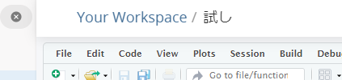

```{r setup, include=FALSE}
knitr::opts_chunk$set(echo = TRUE)
```

```{css, eval=FALSE, echo=FALSE}
.tocify-subheader { /* 全部のサブヘッダーを最初から表示する*/
    display: block !important;
}
.tocify-item {/*長いヘッダーも折り返さない*/
    white-space: nowrap;
}

body{
  counter-reset: ref_number practice_number work_number;
}

.float img{
  /* 上右下左 */
  /* margin: 5% 0% 0% 0% ;*/ 
  /* width : 75%; */
  margin: auto;
  display: block;

  border-radius: 8px 8px 0 0 ;
  position: relative;
  width : 60%;
}

.float .figcaption {
  position: relative;
  font-style: italic;
  font-size: large;
  font-weight: bold;
  color: #666;
  text-align: center;
  margin:0% auto 5% auto;
  border-bottom: solid 1px #666;
  border-left: solid 1px #666;
  border-right: solid 1px #666;
  border-radius:0 0 8px 8px;
  width : 60%
}

img {
  margin: auto;
  display: block;
  border: solid 1px #666;
  border-radius: 8px;
  position: relative;
  width : 100%;
}

.ref {
  position: relative;
  margin:5%;
  padding:5px;
  background-color: rgba(255, 255, 128, .5);
  color: #666;
}
.ref::before{
  counter-increment: ref_number 1;
  content: "[参考 " counter(ref_number) "]";
  font-weight: bold;
  display: block;
  margin-bottom: 3px;
}

h1 {
  margin-top : 10px;
  padding-top : 50px;
}


.practice {
  position: relative;
  margin:5%;
  padding:5px;
  background-color: rgba(128, 255, 200, .5);
  color: #666;
}
.practice::before{
  counter-increment: practice_number 1;
  content: "[例題 " counter(practice_number) "]";
  font-weight: bold;
  display: block;
  margin-bottom: 3px;
}


.work {
  position: relative;
  margin:5%;
  padding:5px;
  background-color: rgba(128, 200, 255, .2);
  color: #666;
}
.work::before{
  counter-increment: work_number 1;
  content: "[課題 " counter(work_number) "]";
  font-weight: bold;
  display: block;
  margin-bottom: 3px;
}


.r{ 
　/**copy の禁止**/
  user-select: none;
  -moz-user-select: none;
  -webkit-user-select: none;
  -ms-user-select: none;
  -khtml-user-select: none;
  -webkit-touch-callout: none;
}

```

# R実行環境の整備

## Posit Cloudへのサインアップ

Rを使って統計分析を行う際には，本来は[R](https://cran.r-project.org/)と[RStudio](https://posit.co/download/rstudio-desktop/)という2つのアプリを自分のPCにインストールする必要があるが，インターネットに接続できている場合には，Posit
Cloudというオンラインサービスを利用することによって，これらのアプリを自分のPCにインストールすることなくWebブラウザ上でRStudioを利用することができる．

今回はPosit Cloudを利用することを前提に説明していく．

[Posit Cloud](https://posit.cloud/)にアクセス．
下記の通りのページが表示される．


「Get Started」をクリック

↓

Freeプランの「Learn more」をクリック

↓

「Sign Up」をクリック．下記のページが表示される．


「Sign Up with Google」を選択して，各自のGmailアドレスで登録．

↓

「Posit
Cloudにログイン」の画面で「次へ」を選択すると，サインアップが完了し，以下のような画面が表示される．


なお，Posit
Cloudは英語のサイトだが，GoogleChromeの「翻訳」で「日本語」にすればある程度は日本語表記がされる．（あくまである程度であって，Rを操作する画面までは残念ながら日本語化されない）


## Procjectの作成

右上にある「New Project」をクリック

↓

「New RStduio Project」をクリック．「Deploying
Project」とプログレスバーがしばらく表示されたあと，以下のような画面が表示される．


この画面がR（Rstduio）の基本操作画面になる．

## Project名の設定

続いて，プロジェクトに名前を付ける． 画面トップにある「Untitled
Project」と書かれてある箇所をクリックして，名前を書き入れよう．


ただし，注意しないといけない点として，Project名は半角文字しか受け付けてくれない（アルファベットや数字，アンダーバーなど）．日本語を書き入れても，最初は表示されてもリロードされたときに「?」という表記に変わってしまう．



ページをリロード（再読み込み）すると，以下のようになる．


:::ref
posit cloudのFreeプランには毎月25時間までの利用制限があり，これを超えると一時的に利用できなくなる．ただし，次の月になればまた利用できるようになる．
もし制限を超えて利用したい場合には，各自でデスクトップ版をダウンロード・インストールして利用するとよい．

**[ダウンロード・インストール]**

デスクトップ版のダウンロード・インストールは以下の2つのサイトからダウンロードとなる．

- [R(Windows版)](https://cran.r-project.org/bin/windows/base/)
- [R(Mac版)](https://cran.r-project.org/bin/macosx/)
  - Mac版の場合にはCPUがIntelかApple Siliconかによってダウンロードするファイルが異なるので注意が必要．もし自分のPCのCPUがいずれかが不明である場合、[このサイト](https://tamoc.com/check-intel-mac/)を参考に各自で確認すること。
- [RStudio](https://posit.co/download/rstudio-desktop/)
  - 2 Install RStduioの方のボタンをクリックする．
  
それぞれダウンロードが済んだら，インストールを行えばよい．

インストールが済めば，プログラム一覧に「RStudio」が表示されるので，これをクリックして起動する．

**[アンインストール]**

RStudioをアンインストールしたい場合には，Windowsの場合には「設定」→「アプリ」→「アプリと機能」から「RStduio」と「R for xxxx」（xxxはバージョン情報）を見つけ出してアンインストールすればよい．

一方Macの場合には，RStudioについては他のアプリの削除方法と同様の方法でアンインストールする．R本体については以下の2つのフォルダを手動で削除る．
- 「/Applications/R.app」
- 「/Library/Frameworks/R.framework」


:::


# 基本的な計算の実行

「Console」と書かれた以下の画面に数式を入力することによって，Rに計算をさせることができる．


実際に各自で好きな数で四則演算をさせてみよう．以下は一例．数式は基本的に1行ごとに入力し，Enterキーを押すことで実行される．

```{r}
5+1
5-7
6*4
9/3
```

さらには，カッコを使ったり，累乗演算をさせたり，剰余演算をさせたりもできる．

```{r parenthesis}
# カッコつき
5*3*(11-23)
# カッコを重ねることもできる（中カッコ[]や大カッコ{}は用いない）
5+3*(11-23*(4+3))
```

```{r power}
# 累乗演算
2^3
```

```{r remainder}
#　剰余演算
15%%6
```

このように，`+`，`-`，`*`，`/`，`()`，`^`，`%%`などの演算記号のことを<strong>演算子(Operator)</strong>と呼ぶ．演算子にはこれら以外にもいろいろある．以下にRで使われる代表的な演算子を示す．

| 演算子 | 説明                       | 例             |
|--------|----------------------------|----------------|
| \+     | 加算                       | `x + y`        |
| \-     | 減算                       | `x - y`        |
| \*     | 乗算                       | `x * y`        |
| /      | 除算                       | `x / y`        |
| \^     | 累乗                       | `x ^ y`        |
| %%     | 剰余                       | `x %% y`       |
| %/%    | 整数除算                   | `x %/% y`      |
| ==     | 等しい                     | `x == y`       |
| !=     | 等しくない                 | `x != y`       |
| \<     | より小さい                 | `x < y`        |
| \>     | より大きい                 | `x > y`        |
| \<=    | 以下                       | `x <= y`       |
| \>=    | 以上                       | `x >= y`       |
| &      | 論理積 (AND)               | `x & y`        |
| \|     | 論理和 (OR)                | `x | y`        |
| !      | 否定 (NOT)                 | `!x`           |
| %in%   | ベクトルの要素が含まれるか | `x %in% y`     |
| :      | シーケンスの生成           | `1:10`         |
| \<-    | 代入                       | `x <- 10`      |
| =      | 代入 (引数で使用)          | `func(x = 10)` |

平方根（正の平方根）を求めたい場合には，`sqrt()`という**関数**を使う．

```{r sqrt}
sqrt(16)
```

ちなみに，出力結果の前にある`[1]`という表記は，出力結果が長さ1の**ベクトル(Vector)**の1つ目の要素であることを示している．このベクトルについては後で改めて説明する．

::: ref
<P>

なお，このようにconsoleに1行1行数式や関数（まとめて**コマンド**）を入力していく形をCommand
Line Interface (CLI)
と呼ぶ．CLIでは，操作できるのはあくまで現在カーソルが置かれている行だけである．過去の行はログとして見えているだけであり，ログを消したり，書き換えたりはできない．

</p>

<p>

もし誤ったコマンドを入力しているのに気づかずに実行してしまった場合には，もう一度正しいコマンドを改めて入力すればよい．

</P>
:::

:::work
次の計算を行いなさい．

- 25 * 3 + 4 / 2
- 11^3
- 100 %% 7
- 2 * (3 + 4) - 5
- 2^3 * 3^2
- ((2 + 3) * (4 + 5)) / 6
- 3+4*5-6/3
- 453 %/% 10
- 453 %% 10
- 256の正の平方根
:::