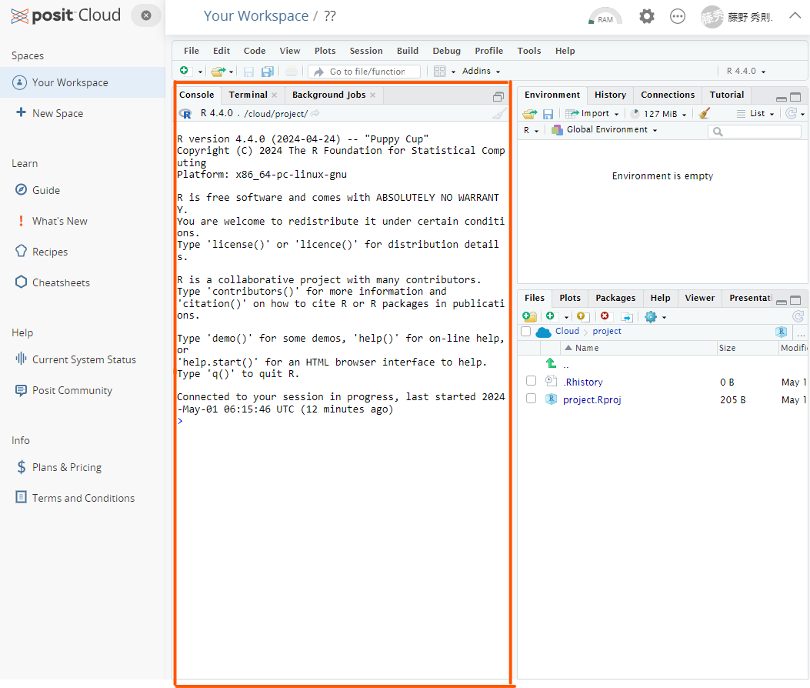
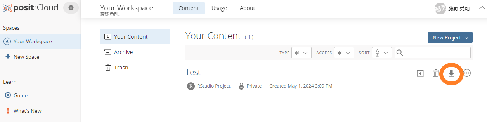

```{r setup, include=FALSE}
knitr::opts_chunk$set(echo = TRUE)
```

```{css, echo=FALSE}
.tocify-subheader { /* 全部のサブヘッダーを最初から表示する*/
    display: block !important;
}
.tocify-item {/*長いヘッダーも折り返さない*/
    white-space: nowrap;
}

body{
  counter-reset: ref_number practice_number;
}

.float img{
  /* 上右下左 */
  /* margin: 5% 0% 0% 0% ;*/ 
  /* width : 75%; */
  margin: auto;
  display: block;

  border-radius: 8px 8px 0 0 ;
  position: relative;
  width : 60%;
}

.float .figcaption {
  position: relative;
  font-style: italic;
  font-size: large;
  font-weight: bold;
  color: #666;
  text-align: center;
  margin:0% auto 5% auto;
  border-bottom: solid 1px #666;
  border-left: solid 1px #666;
  border-right: solid 1px #666;
  border-radius:0 0 8px 8px;
  width : 60%
}

img {
  margin: auto;
  display: block;
  border: solid 1px #666;
  border-radius: 8px;
  position: relative;
  width : 100%;
}

.ref {
  position: relative;
  margin:5%;
  padding:5px;
  background-color: rgba(255, 255, 128, .5);
  color: #666;
}
.ref::before{
  counter-increment: ref_number 1;
  content: "[参考 " counter(ref_number) "]";
  font-weight: bold;
  display: block;
  margin-bottom: 3px;
}

h1 {
  margin-top : 10px;
  padding-top : 50px;
}


.practice {
  position: relative;
  margin:5%;
  padding:5px;
  background-color: rgba(128, 255, 200, .5);
  color: #666;
}
.practice::before{
  counter-increment: practice_number 1;
  content: "[例題 " counter(practice_number) "]";
  font-weight: bold;
  display: block;
  margin-bottom: 3px;
}


.work {
  position: relative;
  margin:5%;
  padding:5px;
  background-color: rgba(128, 200, 255, .2);
  color: #666;
}
.work::before{
  counter-increment: practice_number 1;
  content: "[課題 " counter(practice_number) "]";
  font-weight: bold;
  display: block;
  margin-bottom: 3px;
}


.r{ 
　/**copy の禁止**/
  user-select: none;
  -moz-user-select: none;
  -webkit-user-select: none;
  -ms-user-select: none;
  -khtml-user-select: none;
  -webkit-touch-callout: none;
}

```

# 基本的な計算の実行

「Console」と書かれた以下の画面に数式を入力することによって、Rに計算をさせることができる。



実際に各自で好きな数で四則演算をさせてみよう。以下は一例。数式は基本的に1行ごとに入力し，Enterキーを押すことで実行される。

```{r}
5+1
5-7
6*4
9/3
```

さらには、カッコを使ったり、累乗演算をさせたり、剰余演算をさせたりもできる。

```{r parenthesis}
# カッコつき
5*3*(11-23)
# カッコを重ねることもできる（中カッコ[]や大カッコ{}は用いない）
5+3*(11-23*(4+3))
```

```{r power}
# 累乗演算
2^3
```

```{r remainder}
#　剰余演算
15%%6
```

このように、`+`、`-`、`*`、`/`、`()`、`^`、`%%`などの演算記号のことを<strong>演算子(Operator)</strong>と呼ぶ。演算子にはこれら以外にもいろいろある。以下にRで使われる代表的な演算子を示す。

| 演算子 | 説明                       | 例             |
|--------|----------------------------|----------------|
| \+     | 加算                       | `x + y`        |
| \-     | 減算                       | `x - y`        |
| \*     | 乗算                       | `x * y`        |
| /      | 除算                       | `x / y`        |
| \^     | 累乗                       | `x ^ y`        |
| %%     | 剰余                       | `x %% y`       |
| %/%    | 整数除算                   | `x %/% y`      |
| ==     | 等しい                     | `x == y`       |
| !=     | 等しくない                 | `x != y`       |
| \<     | より小さい                 | `x < y`        |
| \>     | より大きい                 | `x > y`        |
| \<=    | 以下                       | `x <= y`       |
| \>=    | 以上                       | `x >= y`       |
| &      | 論理積 (AND)               | `x & y`        |
| \|     | 論理和 (OR)                | `x | y`        |
| !      | 否定 (NOT)                 | `!x`           |
| %in%   | ベクトルの要素が含まれるか | `x %in% y`     |
| :      | シーケンスの生成           | `1:10`         |
| \<-    | 代入                       | `x <- 10`      |
| =      | 代入 (引数で使用)          | `func(x = 10)` |

平方根の場合には、`sqrt()`という**関数**を使う。

```{r sqrt}
sqrt(16)
```

ちなみに、出力結果の前にある`[1]`という表記は、出力結果が長さ1の**ベクトル(Vector)**の1つ目の要素であることを示している。このベクトルについては後で改めて説明する。

::: ref
<P>

なお、このようにconsoleに1行1行数式や関数（まとめて**コマンド**）を入力していく形をCommand
Line Interface (CLI)
と呼ぶ。CLIでは、操作できるのはあくまで現在カーソルが置かれている行だけである。過去の行はログとして見えているだけであり、ログを消したり、書き換えたりはできない。

</p>

<p>

もし誤ったコマンドを入力しているのに気づかずに実行してしまった場合には、もう一度正しいコマンドを改めて入力すればよい。

</P>
:::

:::work
次の計算を行いなさい。

- 25 * 3 + 4 / 2
- 11^3
- 100 %% 7
- 2 * (3 + 4) - 5
- 2^3 * 3^2
- ((2 + 3) * (4 + 5)) / 6
- 3+4*5-6/3
- 453 %/% 10
- 453 %% 10
:::

# オブジェクト

Rでは<strong>オブジェクト</strong>と呼ばれる箱に計算結果の数値や読み込んだデータ（後で説明する）を格納することができる。オブジェクトに格納しておくと、後からそれらの値やデータを再度利用したくなったときに、いちいち再度計算式を入力したり、データの読み込みをすることなく、オブジェクトを呼び出すだけで、それらの値やデータを呼び出すことができる。

以下の例では`5－3`の結果を`Res`という名前のオブジェクトに格納し、さらに`Res`というオブジェクト名を使ってその中身（計算結果）を呼び出している。

```{r object}
Res <- 5-3
Res
```

## print()関数
オブジェクトの内容は、上記のようにオブジェクト名を記載するだけでも出力されるが、`print()`関数使って出力させることもできる。なお、`print()`関数はオブジェクトだけでなく数字や文字列も表示させることが出来る。
```{R}
## print()関数を使って表記させることも可能
print(Res)
print(1)
print("Hello World.")
```

## オブジェクトを使った演算
オブジェクトに格納された値は、そのままオブジェクト名で計算させることもできる。

```{r object2}
8+Res
```

## オブジェクトの名前設定
オブジェクト名はどのような名前でも構わない。ただし、半角スペースや演算子に用いられている記号、アットマーク記号`@`などは利用することができない。また、数字から始まる名前を付けることも不可である（名前の途中に数字が入っている分には問題ない）。
ピリオド`.`やアンダーバー`_`は利用できる。一般的には、複数の単語を連結させて用いる場合には`_`で区切る。`.`は階層性を持ったデータを区別する使われる。以下はそれらの例。

```{r objectName}
my_res <- 9-4
my_res.power <- my_res ^3
```

なお、間違えた名前で呼び出すと、もしその名前のオブジェクトが他にないのであれば、以下のようなエラーが帰ってくる

```{r objectNameError,error=TRUE}
RES
```

「オブジェクトが見つかりません」ということで、このエラーが帰ってきたら、オブジェクト名が間違えているかを確認してほしい。

ただし、オブジェクト名を間違えていた時に、間違えた名前と同一の名前のオブジェクトが別に存在していた場合には、このようなエラーは帰って来ずに、そのまま間違えたオブジェクトを使って続く処理が実行されていくので、その場合には自分で間違いに気づきにくくなる。RStduioではすでに使われているオブジェクト名であれば、最初の数文字を入力するとリスト表示してくれる入力支援機能があるので、オブジェクトが増えてきたときにはそれを是非利用して入力するとよい。


:::work
課題1の計算課題について，それぞれ計算結果をオブジェクトに出力させるとともに，print()関数を用いてその内容を出力させないさい．なお，オブジェクト名は好きな名前をつけて構わない．
:::


## オブジェクトの削除
作ったオブジェクトはRStudio上の右上ペインの「Environment」タブで確認することができる。


オブジェクトはいくつでも作ることができるが、あまりに多くなってくるとそれだけPCのメモリを喰ってしまうことになる。
そういった場合には作ったオブジェクトの中で使わなくなったオブジェクトを削除すると良い。
削除する方法は大きく2つある。
1つは、すべてのオブジェクトをまとめて削除する方法で、これは、単にEnvironmentタブの中にあるほうきのアイコンをクリックすればよい。


一方、特定のオブジェクトを削除したい場合には、Consoleで`rm()`関数を実行する。関数の引数には削除したいオブジェクトの名前を入力すればよい。
```{r}
a<- "test1"
b<- "test2"
c<- "test3"
ls() # 今あるオブジェクトを確認するコマンド。別に右上の「Environment」で確認できるが・・・
rm(a) # aオブジェクトを除く
ls()
```
`a`オブジェクトが除かれているのが確認できるだろう。

複数のオブジェクトを削除したい場合には、それらを書き込めばよい。`rm()`関数については、`c()`で括る必要はない。

```{r}
rm(b,c)
ls()
```
`b`と`c`が除かれたのが確認できる。

なお、`rm()`をスクリプトに書き入れても構わないが、スクリプトに書き入れると、そのスクリプトを実行する度にオブジェクトの削除が行われることになるので、必要に応じてConsoleで実行するのが良いだろう。


# 文字列

これまで数値ばかりを扱ってきたが、Rでは数値だけでなく文字列を扱うこともできる。

```{r strings}
nchar("Hidenori Fujino")
```

`nchar()`は文字列の長さを求める関数である。ほかにも検索をしたり、置換したり、分割したり、結合したりといったことができる関数が用意されている。

また、オブジェクトに文字列を格納することもできる。

```{r strings2}
myName <-"Hidenori Fujino"
myName
nchar(myName)
```

:::work
あなたの名前を文字列としてオブジェクトに格納し，print()関数を用いて出力させなさい．またnchar()関数を用いてその文字列の長さを求めなさい．
:::


# 型

## データの型

オブジェクトにどのようなデータが収められているかによって、そのオブジェクトには「型」と呼ばれる属性が付与される。数値が収められていれば、そのオブジェクトは数値型（`Numeric`）となるし、文字列が収められていれば文字列型(`Character`)となる。ほかにも論理型(`Logical`)や日付型(`Date`)などいろいろな型がある。

::: ref
<P>

厳密には、オブジェクトに入れていない数値や文字列そのものも、それぞれ数値型や文字列型のデータである。つまり型とはデータそのものに付随する属性であり、`オブジェクトの型＝その中見のデータの型`である。

</p>
:::

基本的に型が異なる者同士を計算させることはできない。

```{r defferenttype, error = T}
a <- 5
b <- "2"
a-b
```

この例では、bには`2`ではなく`"2"`という文字列が格納されている。このため`数値‐文字列`という形で方の異なるもの同士を計算しようとしたので、エラーとなった。

ただし、関数の場合には、数値でもそのまま文字列をとして扱ってくれるものもある。

```{r wrongtype, error=T}
a <- 12345
b <- "12345"
nchar(a)
nchar(b)
```

## 型の把握

あるオブジェクトがどの型なのかを知るためには、`class()`関数を用いる。

```{r class}
a <- 12345
b <- "12345"
class(a)
class(b)
```

## 型の変換

たとえば文字列として与えられた数値を数値型に変換して処理したり、逆に数値型として与えられた数値を文字列型に変換したい、といったケースはよくある。
その場合、`as.numeric`や`as.character`といった型変換関数を用いる。

例えば、以下は文字列型の数値を数値型に変換している例である。

```{r , error=T}
a <- 12345
b <- "12345"
a+b #　これはエラー
a + as.numeric(b) 
```

:::work
課題1の任意の問題を1つとりあげ，その計算結果を収めたオブジェクトの型をclass()関数を用いて確認しなさい．また，その計算結果をas.charctor()関数を用いて文字列型に変換させたものを別のオブジェクトに格納したうえで，そのオブジェクトの内容をprint()関数を用いて表示させなさい．そして，もとの計算結果を収めたオブジェクトをprint()関数で表示させたときとどの点で異なっているかを述べなさい．
:::

このほかにも、型変換関数はたくさんある。`as.`まで打つと様々な型変換関数がリスト表記される。データ分析でよく使用するものとしては`as.factor()`（データを要因型([参考](./RText_04_DescriptiveStatistics.html#要因型変数の作成))に変換する）や`as.data.frame()`（データをデータフレーム型に変換する）などがある。それぞれいずれ出てくるので、頭の片隅に置いておいてほしい。


# スクリプト

これまでは命令を1行1行Console中に入力してきた。しかし、色々な処理をさせたり、複雑な処理をさせたりする場合には、命令を1つ1つconsole中に入力して実行していくよりも、命令を別ファイルとして入力し、一気に実行（あるいはある部分だけを実行）する方が作業効率が良い。またそうしておけば、一連の命令をファイルとして保存して、別な時に再度呼び出すことも容易となる。

このような一連の命令セットのことを**スクリプト**と呼び、それを保存したファイルを**スクリプトファイル**と呼ぶ。

## スクリプトファイルの作成

Rのスクリプトファイルを作成するには、File メニュー-\> New File -\>R
Scriptを選択する。


すると、以下のようなスクリプト編集画面が開く。この画面上で一連のコマンドを入力していく。

実際にスクリプトを入力した例を以下に示す。
<!-- なお、このスクリプトではExcelのデータの読み込みから始めている。Excelデータの読み込みは、先ほどはImportボタンを押す前のプレビュー画面の右下部にスクリプトのプレビューも表示されていた。あの部分をマウスでコピーし、スクリプト編集画面で貼り付けるとよい。 -->


## スクリプトの実行

作成したスクリプトを実行する際には、実行したい部分をマウスで選択したうえで、編集画面上の「Run」ボタンをクリックするか、キーボードで`Ctrl`キーを押しながら`Enter`キーを押せばよい。

全体を選択して「Run」もしくは`Ctrl`+`Enter`すると、スクリプト全体が実行される。

どの部分も選択せずに「Run」もしくは`Ctrl`+`Enter`すると、入力カーソルが置かれている行のスクリプトが1行ずつ実行される。

なお、行選択をしたり全体を選択したりする際に、一々マウスを操作して選択するのは面倒である。その場合には、`Ctrl`+`a`で全体を選択、`Shift`+`上下左右矢印キー`で範囲選択、`Ctrl`+`Shift`+`左右矢印キー`で単語単位の範囲選択ができるので、これらのキーボードショートカットを使うとよい。

## コメントアウト

コマンドを入力するときに`#`を記載すると、`#`以降の記述は全て無視される。この`#`記号はコメントアウト記号といい、スクリプトにコメントやメモを残すのに利用する。スクリプトを作成するときには、是非とも後から別の人がそのスクリプトを読んで内容が理解できるように、メモを残すようにしてほしい。

## スクリプトの保存

作成したスクリプトは画面上部の「保存」マークをクリックするか、`Ctrl`+`s`キーで保存することができる。Posit
Cloud上ではその時のプロジェクト全体の状態が自動的に保存されていくので、つい忘れがちだが、何かのはずみでスクリプトを保存しないまま閉じてしまうと、当然ながらそのスクリプトは帰ってこなくなるので、こまめにファイル保存するのを忘れないようにしてほしい。またこまめに保存するためには`Ctrl`+`s`キーのショートカットキーは是非とも覚えておくこと．また，このショートカットキーはRに限らずWordやExcel，PowerPointなどあらゆるソフトウェアで保存のためのショートカットキーとして機能するので，それらのアプリケーション利用のためにも覚えておくこと．

保存すると、Posit
Cloud上のリストにスクリプトファイルが作成されて、リストに記載される。


# RMakrdown

RStudioでは、スクリプトファイルの他にも、RMarkdownファイルというものを作成することができる。RMarkdownファイルは、スクリプトに加えて、そのスクリプトの実行結果やグラフ、文章を含めた文書（HtmlやPDF，あるいはWord文書）を作成することができる。
なお，このRのテキストもRMarkdownを用いて作成しているものである．

## RMarkdownファイルの作成
RMarkdownファイルは、スクリプトファイルと同様にFile メニュー-\> New File -\>R Markdownを選択することで作成できる。


そのプロジェクトで初めてRMarkdownファイルを作成する際には，以下のようなWindowが現れるので，「Yes」を選択する．なお，これはRMarkdownファイルを利用するにあたって，いくつかのパッケージをバージョンアップする必要があるので，それらをバージョンアップしてよいかを尋ねてきているものである．


## RMarkdownの初期設定

パッケージのバージョンアップが済むと以下のような初期設定のWindowが現れる．このWindowでは，どのような文書を作成するかを選択することができる．


左側の`Document`，`Presentation`，`Shiny`，`From Template`のいずれかを選択することで，それぞれの文書を作成することができる．
とりあえずは`Document`を選択しおく．

- **Title**：文書のタイトルを入力する．
- **Author**：文書の著者名を入力する．
- **Date**：文書の作成日を入力する．
- **Defalut Output Format**：出力する文書の種類を選択する．
  - **HTML**：HTML文書を作成する．
  - **PDF**：PDF文書を作成する．
  - **Word**：Word文書を作成する．

とりあえずは，`HTML`を選択しておこう．

## RMarkdownの編集

初期設定画面で`OK`をクリックすると，以下のような例文が記載されたRMarkdownファイルが作成される．


RMarkdownは、スクリプトファイルとは異なり、テキストセル（背景が白色の部分）とコードセル（背景が灰色の部分）が混在している。テキストセルには文章を入力する．コードセルにはRのスクリプトを入力し、コードを実行するとその結果がコードセルの下に表示される。

### コードセルの実行
コードセルの実行方法は，そのコードを選択して`Ctrl`+`Enter`を押すか，コードセルの左上にある`Run Current Chunk`ボタンをクリックする．

実際に，初期画面で表示されている例文の`{r car}`と書かれたコードセルを実行すると，以下のような出力が得られる．
（出力結果の箇所を黄色の線で示している）


### コードセルの追加
コードセルを新たに追加する場合には，画面の右の上にある`+Ｃ`ボタンをクリックして「R」を選択するか（下図），`Ctrl`+`Alt`+`I`を押す，あるいは，自分で直接「\`\`\`{r}」～「\`\`\`」と書いてもよい．個人的にはマウス操作をするのも，ショートカットを覚えるのも面倒なので直接入力することをお勧めする．

ただし，直接記載するときには，

 - **\`\`\`\{r\}の前に空白行をいれること**
 - **\`\`\`でコードセルを閉じるのを忘れないこと**
 - **閉じる際の\`\`\`の後に空白行を入れること**
 - **開始の\`\`\`{r}と終了の\`\`\`はそれぞれ単独の行として，他に何も記載しないこと．**


なお，「\`」は「バッククォート」と呼び，`Shift`キー＋`@`キー（右小指あたりにある）で入力できる．入力モードが半角入力か全角入力かは注意すること．全角入力の時は「‘」と表示される．この形のバッククオートの場合，そのままではバッククオートとしては処理されず，単にテキストセルに「‘」という文字が入力されているだけとして処理されるので，半角入力に切り替えてから「\`」を入力すること（変換によって「\`」にしても良い）．


コードセルには名前を振ることができる．例えば，先ほど実行したコードセルでは`{r car}`という形でcarという名前が付与されていた．このように，`{r}`のなかに半角スペースを置いて任意の単語を書き込むことで，そのコードセルに名前を付けることができる．
名前を付けておくと，コードセルの実行結果が表示される際に，その名前が表示されるので，どのコードセルがどの結果を出力しているのかがわかりやすくなる．

そのほかにも，例えば，`{r, echo=FALSE}`と記載すると，knit（後述）した際にそのコードセルのコードが表示されなくなるなど，`{r}`の中には様々なオプションを記載することができる．


### テキストセルの追加
テキストセルの追加は，そのまま文章を記載していけばよい．記載に当たっては各種のマークダウン記法を利用できる．

代表的な記法を以下に示す．

#### 改行

マークダウンでは改行は「空白行」を入れることで反映される．空白行を入れていない場合，たとえ編集画面で改行していても，実際の表示では改行されない．

```markdown
行1
行2
```

上記のように記載すると，以下のように表示される．

行1
行2

```markdown
行1

行2
```
上記のように記載すると，以下のように表示される．

行1

行2


#### 見出し

```markdown
# 見出し1

## 見出し2

### 見出し3
```
このように記載することで，以下のような表示が得られる（文字サイズは環境によって多少異なる）．

<span style="font-size: 48px;">見出し1 </span>

<span style="font-size: 36px;">見出し2 </span>

<span style="font-size: 24px;">見出し3 </span>

なお，**見出しの前後は空白行をいれておくこと**．空白行は入っていないと見出しとして機能しない．

#### 箇条書き

```markdown
- 箇条書き1
- 箇条書き2
- 箇条書き3

1. 番号付きリスト1
1. 番号付きリスト2
1. 番号付きリスト3
```
- 箇条書き1
- 箇条書き2
- 箇条書き3

1. 番号付きリスト1
1. 番号付きリスト2
1. 番号付きリスト3

この場合も箇条書きやリストの開始前，終了後には空白行をいれておくこと．

#### 強調表現

```markdown
強調表現1:**太字**にする
強調表現2:*斜体*にする
強調表現3:***太字・斜体***にする

見え消し：~~取り消し線~~を書く
```

強調表現1:**太字**にする

強調表現2:*斜体*にする

強調表現3:***太字・斜体***にする

見え消し：~~取り消し線~~を書く


他にも画像を挿入したり，URLリンクを挿入したり，表を書いたりといった様々な記述が可能である．
マークダウン記法自体は，R以外にもさまざまな場面で出てくる記法である．例えば，ChatGPTに与えるプロンプトをマークダウンで記述するとうまく指示を出しやすいといったことがある．興味があれば調べてみたり，ChagGPTなどに「～～～をMarkdwownで記述するには？」といった形で尋ねるとよいだろう．

以下に参考となるページを挙げておく．

[Markdown記法 サンプル集](https://qiita.com/tbpgr/items/989c6badefff69377da7)

[Markdown記法 チートシート](https://qiita.com/Qiita/items/c686397e4a0f4f11683d)

[【マークダウン記法とは？】マークダウンの書き方を網羅的に解説](https://backlog.com/ja/blog/how-to-write-markdown/)

## ヘッダーの記述

RMarkdownファイルの冒頭にはヘッダーが記述されている．例文のままでも特に問題はないが，以下のようなヘッダーにしておくと，dateが自動的に更新されていくほか，目次が追加される．

```YAML
---
title: "RとRStuidoの基本操作"
author: "藤野秀則,"
date: 
  初版日:2024-05-02
  更新日:`r Sys.Date()`
output:
  html_document: 
    toc: true
    toc_depth: 4
    toc_float: true
---
```

この部分の記法はYAMLと呼ばれるもので，この部分はRMarkdownファイルのメタデータとして扱われる．
記法そのものを覚えておくのは面倒なので，上記のヘッダーを毎回コピペして，例文のヘッダーを上書きするとよいだろう．

:::ref
もともとYAMLは"Yet Another Markup Langage"（一応まだもう一つのマークアップ言語）という意味だったが，その後「マークアップ言語ではない」という意味の"YAML Ain't Markup Language"という意味に変更された．
:::

ここを弄ることで他にも色々と文書の体裁を変えることもできる（例えば，この資料のように見出し番号を付与する等）が，それはかなり応用になるので，この場では省略する．興味のある人は以下のリンクを見てみるとよいだろう．

[https://kazutan.github.io/kazutanR/Rmd_intro.html#yamlヘッダの基本](https://kazutan.github.io/kazutanR/Rmd_intro.html#yaml%E3%83%98%E3%83%83%E3%83%80%E3%81%AE%E5%9F%BA%E6%9C%AC)

[R Markdownのhtml_documentで指定できるyamlヘッダ項目について](https://qiita.com/kazutan/items/726e03dfcef1615ae999)

(いずれも，2024年9月30日時点で確認)


なお，YAMLの記述ではインデントが非常に重要になる．インデントが崩れていると機能しなくなるので，全体としてインデントが統一されているか（レベル下げの時の半角スペースの数が統一されているか）に注意しておくこと．


## RMarkdownの保存とKnit
RMarkdownファイルは，スクリプトファイルと同様に保存することができる．さらに保存したRMarkdownファイルは，画面上部の「Knit」ボタンをクリックすることで，選択した出力形式（HTML，PDF，Word）に変換される．


実際にこれまでに入力してきた内容（エラーを出力するものを除いている）をRMarkdownで記載すると以下のようになる．
（なお，初期設定で入力されている内容は，冒頭のヘッダーと最初のコードセルを除いて削除している．最初のコードセルのみ後で利用するケースがあるので残している)


これをKnitすると以下のようなwindowが得られる．なお，初回のみ，ファイル名を指定するためのWindowが表示されるので，ファイル名を入力して「Save」をクリックすると，Knitが実行される．


Knitが完了すると，指定した出力形式（今回であればhtml）のファイルが作成され，右下のペインに作成されたhtmlファイルが追加される．このファイルをクリックすることで，作成したhtmlファイルをブラウザで表示することもできる．

:::work
こでまでの課題1～4の内容をRMarkdownで記述し，Knitしてhtmlファイルを作成しなさい．
:::


## RMarkdownファイルを開く
右下の「Files」タブ内に作成したファイルの一覧が表示されている．この中で開きたいファイルを選択すると，そのファイルが開かれる．

# ファイルのダウンロード

作成したスクリプトファイルやrmdファイル，htmlファイルはあくまでオンライン上に置かれている。手許のパソコンにファイルをダウンロードしたい場合には、左側の「Posit
Cloud」と書かれたサイドバーの中の「Your
Workspace」をクリックして、プロジェクト管理画面を開く。もしサイドバーを閉じていた場合には、左上にある三本線のマークをクリックするとサイドバーが現れる。


このプロジェクト管理画面の各プロジェクト名の右手にある下向きの矢印のアイコンをクリックすると、プロジェクト全体を圧縮したZipファイルをダウンロードできる。



ダウンロードしたZipファイルを解凍すると、Posit
Cloud上のファイル一式が手許のPCに展開される。


# ここまでで用いられていたR関数

* sqrt()
  * 説明：平方根を計算する．
  * 引数：平方根を求めたい数値，またはオブジェクト．

* print()
  * 説明：オブジェクトの内容や指定した文字列をコンソールに表示する．
  * 引数：表示させたい数値，文字，オブジェクト．


* nchar()
  * 説明：文字列の長さを求める.
  * 引数：文字列，もしくは文字列を格納しているオブジェクト．

* class()
  * 説明：オブジェクトの型を確認する.
  * 引数：任意のオブジェクト．


* as.numeric()
  * 説明：文字列型などを数値型に変換する．
  * 引数：文字列として格納されている数字，もしくはそれを格納しているオブジェクト．

* as.character()
  * 説明：数値型などを文字列型に変換する
  * 引数：数値，もしくはそれを格納しているオブジェクト

- rm()
  - 説明：特定のオブジェクトをメモリから削除するための関数。
  - 引数：削除したいオブジェクトの名前。

- ls()
  - 説明：現在の環境に存在するオブジェクトの一覧を表示する。
  - 引数：なし。
