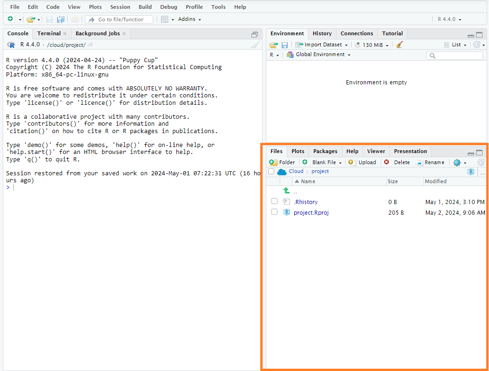
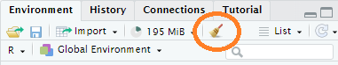
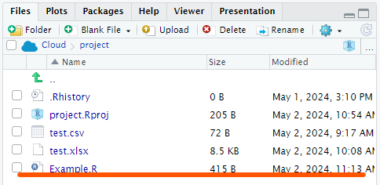
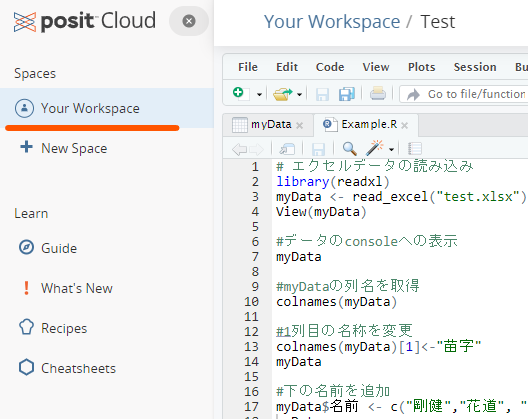
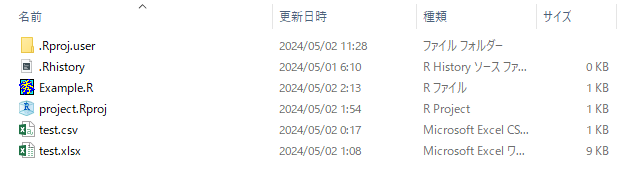

```{r setup, include=FALSE}
knitr::opts_chunk$set(echo = TRUE)
```

```{css, echo=FALSE}
.tocify-subheader { /* 全部のサブヘッダーを最初から表示する*/
    display: block !important;
}
.tocify-item {/*長いヘッダーも折り返さない*/
    white-space: nowrap;
}

body{
  counter-reset: ref_number practice_number;
}

.float img{
  /* 上右下左 */
  /* margin: 5% 0% 0% 0% ;*/ 
  /* width : 75%; */
  margin: auto;
  display: block;

  border-radius: 8px 8px 0 0 ;
  position: relative;
  width : 60%;
}

.float .figcaption {
  position: relative;
  font-style: italic;
  font-size: large;
  font-weight: bold;
  color: #666;
  text-align: center;
  margin:0% auto 5% auto;
  border-bottom: solid 1px #666;
  border-left: solid 1px #666;
  border-right: solid 1px #666;
  border-radius:0 0 8px 8px;
  width : 60%
}

img {
  margin: auto;
  display: block;
  border: solid 1px #666;
  border-radius: 8px;
  position: relative;
  width : 100%;
}

.ref {
  position: relative;
  margin:5%;
  padding:5px;
  background-color: rgba(255, 255, 128, .5);
  color: #666;
}
.ref::before{
  counter-increment: ref_number 1;
  content: "[参考 " counter(ref_number) "]";
  font-weight: bold;
  display: block;
  margin-bottom: 3px;
}

h1 {
  margin-top : 10px;
  padding-top : 50px;
}


.practice {
  position: relative;
  margin:5%;
  padding:5px;
  background-color: rgba(128, 255, 200, .5);
  color: #666;
}
.practice::before{
  counter-increment: practice_number 1;
  content: "[例題 " counter(practice_number) "]";
  font-weight: bold;
  display: block;
  margin-bottom: 3px;
}


.work {
  position: relative;
  margin:5%;
  padding:5px;
  background-color: rgba(128, 200, 255, .2);
  color: #666;
}
.work::before{
  counter-increment: practice_number 1;
  content: "[課題 " counter(practice_number) "]";
  font-weight: bold;
  display: block;
  margin-bottom: 3px;
}


.r{ 
　/**copy の禁止**/
  user-select: none;
  -moz-user-select: none;
  -webkit-user-select: none;
  -ms-user-select: none;
  -khtml-user-select: none;
  -webkit-touch-callout: none;
}

```


# ベクトル

## ベクトルの作成

Rではこれまでの例のように単独の数値や文字列を扱うケースは極めて稀である。通常は複数の数値や文字列を1セットにして様々な処理を行っていく。そうした1セットにしたデータセットの最もシンプルなものが<strong>ベクトル</strong>（1次元配列）である。

例えば、バスケチームのStartingメンバー5名でフリースロー10本勝負をしたときの成績として以下のような成績が出たとする。

| 名前 | 点数 |
|:-----|-----:|
| 赤木 |    7 |
| 桜木 |    4 |
| 三井 |   10 |
| 宮城 |    7 |
| 流川 |    9 |

この表には名前のデータセットと得点のデータセットがある。これらがそれぞれベクトルとなる。Rでそれぞれのベクトルを作成するには、`c()`という関数を使う。`c`はconcatenate（連結する）の頭文字である。

```{r}
Starting <- c("赤木","桜木","三井","宮城","流川")
Score<- c(7,  4, 10, 7, 9)
print(Starting)
print(Score)
```

`c()`関数を使うと、複数のベクトルを1つのベクトルにまとめることもできる。

```{r}
Reserve <-c("小暮","潮崎","安田","石井","佐々岡","桑田")
Full <- c(Starting, Reserve)
print(Full)
```

データ上あまり意味はないが、文字列型のデータが収められたベクトルと数値型のデータが収められたベクトルを`c()`で連結することもできる。この場合、数値型のデータが文字列型に自動的に型変換される。

```{r}
hoge <- c(Starting, Score)
print(hoge) #Scoreのデータが文字列型として出力される。
```

### 名前付きベクトル
先ほど作成した`Score`は単に数値だけが並ぶベクトルであるが、以下のように各数値に「名前」を付けることができる。このようなベクトルを名前付きベクトルと呼ぶ。
なお、通常の文字列の扱いでは`""`で括らなければならないが、名前に対しては`""`で括らずにそのまま書いてもよいし、`""`で括ってもよい。
```{r}
NamedScore <-  c(赤木=7,  桜木=4, 三井=10, 宮城=7, 流川=9)
print(NamedScore)

NamedScore <-  c("赤木"=7,  "桜木"=4, "三井"=10, "宮城"=7, "流川"=9)
print(NamedScore)
```

名前を付けておくとベクトル内の個々のデータにアクセスする際に、インデックス番号だけでなく、名前でアクセスすることもできる。詳しくは[個々のデータへのアクセス](#個々のデータへのアクセス)へ。

## ベクトルの型

ベクトルオブジェクトの型はそのベクトルが内部に持つデータの型によって決まる。

```{r}
class(Starting)
class(Score)
```

## 個々のデータへのアクセス

ベクトルオブジェクトの内の個別のデータにアクセスする（取り出す）には`[]`を使って取り出したいデータのインデックス番号を指定する。

```{r}
Full[1]
Score[3]
```

複数のデータを同時に取り出すには`[]`の中へ、`c()`を使って複数の番号を指定する。

```{r}
Starting[c(3,5)]
Score[c(3,5)]
```

例えば2番目から5番目のデータを取り出したいという場合には、いちいち`c(2,3,4,5)`と打つのは面倒である。
そういう場合にはシーケンス演算子`:`を用いて以下のように書くことができる。

```{r}
Starting[c(2,3,4,5)] #めんどくさい
Starting[c(2:5)]
```

通常の指定とシーケンス演算子での指定は併せて用いることもできる。
```{r}
Starting[c(1,3,4,5)] #めんどくさい
Starting[c(1,3:5)]
```

名前付きベクトルの場合には、インデックス番号の代わりに名前を指定してもよい。
```{r}
NamedScore[5]
NamedScore["流川"]
NamedScore[c(1,3,4)]
NamedScore[c("赤木","三井","宮城")]
```
名前付きベクトルの場合には上記の通りに名前とベクトル値がセットになって返されてくる。
あくまで数値だけが欲しいという場合には、`unname()`関数を用いる。あるいは、要素が1つだけの場合には`[[]]`というように角カッコを重ねることでもよい。ただし、`[[]]`が使えるのは要素が1つの時だけであり、複数の要素に対して用いるとエラーとなる。

```{r error = T}
unname(NamedScore[5])
unname(NamedScore[c(1,3,4)])
unname(NamedScore[c("赤木","三井","宮城")])
NamedScore[["流川"]]
NamedScore[[c(1,3,4)]] #これはエラー
NamedScore[[c("赤木","三井","宮城")]] #これもエラー
```


## 個々のデータの削除

インデックス番号に`-`記号を付けると、その番号のデータが除かれたものが返ってくる。

```{r error=T}
Full[-3] #3番目の三井が除かれる
Full[c(-4,-6)] # 4番目の宮城と6番目の木暮が除かれる
Full[c(4,6,-7)] #これはエラー。取り出しと除外を同時できない。
```

## 個々のデータの書き換え

ベクトル内のデータへのアクセスと同じ要領で書き換えたいデータを指定し、代入演算子を使って値を与えればよい

```{r}
Starting[1] <- "Akagi"
Starting
```

同時に複数のものを書き換えることもできる。

```{r}
Starting[c(1,2)] <- c("Akagi", "Sakuragi")
Starting
```

## ベクトルと数値の演算

ベクトルに対して数値を使って演算をすると、ベクトル内のすべてのデータに対してその数値の演算が行われる。

```{r}
Score + 10
Score - 3
Score * 2
Score / 4
Score ^ 2
```

また名前付きベクトルの場合には、名前そのものは演算には影響せず、データだけに演算がされる。演算結果は名前付きベクトルが返ってくる。
```{r}
NamedScore + 10
NamedScore - 3
NamedScore * 2
NamedScore / 4
NamedScore ^ 2
```

## ベクトル同士の演算

同じ長さのベクトルであればベクトル同士の掛け算ができる。

```{r}
hoge <- c(3,5,0,2,1)
Score + hoge
Score * hoge
Score / hoge #3つ目の分母が0になるので、Infinity、つまり無限大を表すInfが表示される
```

名前付きベクトルの場合も同様。
```{r}
NamedScore + hoge
NamedScore * hoge
NamedScore / hoge 
```

さらに名前付きベクトル同士を演算させた場合。
```{r}
namedhoge<- c(A=3,B=5,C=0,D=2,E=1)
NamedScore + namedhoge
namedhoge + NamedScore
hoge + NamedScore + namedhoge
```
このように名前付きベクトル同士を演算させた場合には、式の中で最初に出てくる名前付きベクトルの名前だけが出力に反映される。


演算するベクトルの長さが異なっているとWarningが出力される。興味深いことに、Errorではなく、あくまでWarningであって計算結果は出力される。長さが短い方が長い方に合わせて循環していく。また、長い方のベクトルの長さが短い方のベクトルの長さの整数倍の時には、Warningも表示されない。

```{r}
hoge2 <- c(3,5,0,2,1,4,3)
Score + hoge2 # 長さが合ってないのでWarningが出てくる

hoge3 <- c(3,5,0,2,1,4,3,3,4,4) # hoge3の長さがScoreの2倍になっているのでWarningはでない
Score + hoge3 
```

## ベクトルへの要素の追加

ベクトルに要素を追加したい場合には、追加されるベクトルと追加したい要素やベクトルを`c()`で結び付けて、元のベクトルオブジェクトに格納すればよい。もちろん、元のベクトルではなく別のベクトルオブジェクトとして格納することもできる。

`木暮`を追加してみよう。
```{r}
print(Starting)
Starting <- c(Starting, "小暮")
print(Starting)
```

さらに、リザーブメンバーも加えて、フルメンバのベクトルを作成する。
```{r}

Reserve <- c("潮崎","安田","角田","石井","佐々岡","桑田")
Full <- c(Starting, Reserve)
print(Full)
```

## ベクトルからの要素の削除
ベクトルから特定の要素を削除したい場合には、先に説明した[個々のデータへのアクセス](#個々のデータへのアクセス)の方法に従って、残したい要素だけを取り出し、それをもとのベクトルオブジェクトに格納すればよい。

先ほど`木暮`を追加した`Starting`から`木暮`を削除してみよう。

```{r}
print(Starting) # 小暮が入っている
Starting <- Starting[c(1:5)]
print(Starting) # 小暮が除外された
```


# データフレーム

ベクトルはあくまで1次元配列であるが、通常、データセットは以下のように行と列を持った2次元配列（要するに表）になっている。

| 名前 | 背番号 | 点数 |
|:-----|-------:|-----:|
| 赤木 |      4 |    7 |
| 桜木 |     10 |    4 |
| 三井 |     14 |   10 |
| 宮城 |      7 |    7 |
| 流川 |     11 |    9 |

このような表としてのデータを一まとめにして扱うのがデータフレームという型のオブジェクトである。

## データフレームの作成

データフレームを作るには以下のように`data.frame()`関数を用いる。

```{r}
Shohoku <- data.frame(
  name = c("赤木","桜木","三井","宮城","流川"),
  number=c(4,10,13,7,11),
  score= c(7,4,10,7,9)
)
Shohoku
```

`data.frame()`関数の中で`name`、`number`、`score`の3つのベクトルが作られている。つまりデータフレームとは**同じ長さのベクトルが複数まとまったもの**と捉えることができる。

::: ref
上の例では分かりやすさのため`data.frame()`の中で改行（Enter）を入れているが、改行は入れても入れなくても良い。console上で`()`や`""`、`''`の中で改行を入れた場合、行頭が`>`から`+`にかわり、直近の`(`や`"`、`'`の範囲（**スコープ**と呼ぶ）が閉じられずに続いていることを示す。スコープ閉じられていない限りはどれだけEnterを押してもコマンドは実行されない。適切にこれらが閉じられた場合には、閉じられた行でEnterキーを押すとことで一連の入力が一つながりのコマンドとして実行される。
:::

なお、データフレームにおいては、行のことを`obs`(observation:観測の略)、列のことを`varialbles`(変数の意味)と呼ぶ。これは行方向（縦方向）は観察・測定されたサンプルが並べられており、列方向（横方向）は測定項目・測定変数が並べられている、ということである。

## 列へのアクセス

データフレームの各列のベクトルにアクセスするには、`$`もしくは`[]`を使う。

```{r}
Shohoku$name # ベクトルとして出力される
Shohoku["name"] # nameだけを含んだデータフレームとして出力される
Shohoku[1] #[]を使う場合には列の番号を与えても良い
```

両者の出力結果は一見似ているが、`$`の方は指定した列をベクトルとして出力されるのに対して、`[]`の方は指定した列だけを含んだデータフレームとして出力される。
それぞれの違いを確認するには、出力の型を確認すればよい。

```{r}
class(Shohoku$name) # ベクトルなので、文字列型となる
class(Shohoku["name"])#データフレームなのでdata.frame型となる
```

複数の列を同時に取り出す場合には`c()`関数を使って複数の列を指定してやる。

```{r}
Shohoku[c("name","score")]
Shohoku[c(1,3)] #名前ではなく列番号で指定した場合
```

この場合の出力結果はdata.frame型となる。

## 列の書き換え

列にアクセスするのと同じ要領で列を指定し、代入演算子によって書き換えたいベクトルを与えてやる。以下では`$`で指定する方法で名前をローマ字に書き換えた後、`[]`で指定する方法でローマ字になった名前を漢字に戻している。

```{r}
Shohoku$name <- c("Akagi","Sakuragi","Mitsui","Miyagi","Rukawa")
Shohoku
Shohoku[1] <- c("赤木","桜木","三井","宮城","流川")
Shohoku
```

注意しないといけない点として、あくまで元の列ベクトルに含まれるデータ数（要するに行数）と同じデータ数のベクトルを与えなければならない。異なるデータ数のベクトルを与えた場合、Errorが返される。

```{r error=TRUE}
Shohoku$name <- c("Akagi","Sakuragi","Mitsui","Miyagi") #データが1つ足りない
Shohoku[1] <- c("Akagi","Sakuragi","Mitsui","Miyagi") #データが1つ足りない
```

与えるベクトルデータが数値の場合には、演算を伴ったものでもよい。

```{r}
Shohoku$score <- Shohoku$score + 5 # 5を足した
Shohoku
Shohoku[3] <- Shohoku$score - 5 # 5を引いた
Shohoku
Shohoku$score <- Shohoku$score * 3
Shohoku
Shohoku[3] <- Shohoku$score / 3
Shohoku
```

## 個々のデータへのアクセス

方法としては`$`を使ってベクトルを取り出した上で`[]`で取り出したい値のインデックス番号を指定する方法（これは要するにベクトルでの個々のデータへのアクセスと同じ）と、`[]`を使って行番号と列番号を指定する方法とがある。

```{r}
Shohoku$name[1]
Shohoku[1,1]
```

なお`[行, 列]`である。

```{r}
Shohoku[1,1]
Shohoku[1,2]
Shohoku[1,3]
```

列番号は以下のように、列名（ベクトル名）で指定しても良い。

```{r}
Shohoku[2,"name"]
Shohoku[2,"number"]
Shohoku[2,"score"]
```

`$`にせよ`[]`にせよ、複数の要素を同時に取り出すことができる。

```{r}
Shohoku$name[c(1,3,5)]  # これは単純にベクトルとして取り出した後に[]でベクトル要素をしている
Shohoku[c(1,3,5),1] #これはデータフレームから行番号と列番号に合致するものを直接とりだしている
Shohoku[c(1,3,5),"name"] #列番号をベクトル名で指定した
```

`[]`を使う場合で列を1つしか指定しなかった場合には上記のようにベクトルとしてデータが返される。一方、以下のように列を複数指定した場合には、データフレームとしてデータが返される。

```{r}
Shohoku[c(1,3,5),c(1,3)] #複数の列から複数の行番号のデータを同時に取り出そうとしている。
Shohoku[c(1,3,5),c("name","score")]#列指定を名前にした
```

## 個々のデータの書き換え

ベクトルの個々のデータの書き換えと同様に、それぞれの箇所にアクセスして代入演算子で書き換えてやる。以下では前と同様に`$`で指定する方法で名前をローマ字に替えた後、`[]`で指定する方法で名前を漢字に戻している

```{R}
Shohoku$name[1] <- "Akagi"
Shohoku
Shohoku[1,1] <-"赤木"
Shohoku
```

複数行を同時に書き換える場合には、ベクトルデータを与えてやる。

```{r}
Shohoku$name[c(1,3,5)]<-c("Akagi","Mitsui","Rukawa")
Shohoku
Shohoku[c(1,3,5),1] <-c("赤木","三井","流川")
Shohoku
```

複数行、複数列を同時に書き換えたい場合には、以下のように`data.frame()`関数を使ってデータを与える。

```{r}
# 赤木、三井、流川の名前をローマ字にするとともに、スコアを1にする
# name列とscore列は1列目と3列目にあるので、c(1,3)とインデックス番号で指定している
Shohoku[c(1,3,5),c(1,3)] <-data.frame(c("Akagi","Mitsui","Rukawa"),c(1,1,1))
Shohoku

# 赤木、三井、流川の名前を漢字に戻すとともに、スコアも戻す
# name列とscore列は列名で指定している
Shohoku[c(1,3,5),c("name","score")] <-data.frame(c("赤木","三井","流川"),c(7,10,9))
Shohoku
```

## 列の追加

既にあるデータフレームに新しい列（ベクトル）を追加したい場合には以下のように`$`や`[]`を用いて、新しい列名(ベクトル名）を指定して、その列に入れるデータをベクトルで与えるだけでよい。追加された列はデータフレームの末尾に入れられる。

```{r}
Shohoku$Initial <- c("T.A.","H.S.","H.M.","R.M.","K.R.")
Shohoku
Shohoku["Yomi"] <- c("あかぎたけのり","さくらぎはなみち","みついひさし","みやぎりょうた","るかわかえで")
Shohoku
```

以下の例のように、`[]`を使って複数の列を同時に追加することもできる。ただし、実用の場面では**記述している処理の分かりやすさ**の観点から、1つ1つ追加していく方が良い。

```{r}
Shohoku[c("UnderName","Roman")] <-data.frame(
  c("剛憲","花道","寿","亮太","楓"),
  c("Akagi","Sakuragi","Mitsui","Miyagi","Rukawa")
)
Shohoku
```

:::ref
Rの場合、それほど処理速度に敏感になる必要がないので、人から見た分かりやすさを重視した記述を心掛けるようにしよう。一方で、PythonやJavascript、あるいはC言語系などのプログラム言語を使って、動画像処理などリアルタイム性や高速な処理が求められるプログラムを記述する場合には、分かりやすさを犠牲にして、コンピュータ内部での計算処理回数の少ない書き方をすることもある。
:::

## 列の削除

列を削除する場合には、削除したい列にアクセスして`NULL`（ヌル）を代入すればよい。

```{r}
Shohoku$Yomi <- NULL
Shohoku
Shohoku["Initial"] <- NULL
Shohoku
Shohoku[c("UnderName","Roman")] <- data.frame(NULL,NULL)
Shohoku
```

## 行の追加

データフレームへの行の追加には`rbind()`関数を使う。以下では**同じ列名**を持ったkogureというデータフレームを作成し、Shouhokuに追加している。

```{r}
kogure <- data.frame(name="木暮", number=5, score=6)
Shohoku <- rbind(Shohoku , kogure)
Shohoku
```

さらに、複数の行を同時に追加する場合には、複数行をもったデータフレームを作成して`rbind()`で追加する。

```{r}
Reserve <- data.frame(
  name =c("潮崎","安田","角田","石井","佐々岡","桑田"),
  number=c(8, 6, 9, 12, 13, 15),
  score =c(6, 7, 7,  5,  5,  4)
)
Shohoku <-rbind(Shohoku, Reserve)
Shohoku
```

列名が異なると以下の通りにエラーとなる。

```{r error=TRUE}
Reserve2 <- data.frame(
  name2 =c("潮崎","安田","角田","石井","佐々岡","桑田"),# nameがname2となっている
  number=c(8, 6, 9, 12, 13, 15),
  score =c(6, 7, 7,  5,  5,  4)
)
Shohoku <-rbind(Shohoku, Reserve2)
Shohoku
```

## 行の削除

特定の行を削除したい場合には、以下のように削除したい行番号をベクトルで与えた上で`-`をつけてやる。

```{r}
Shohoku <- Shohoku[-c(6,7,8,9,10,11,12), ]　
Shohoku
```

注意すべき点として、**行指定の後に`,`をつけるのを忘れないようにすること。**
もし`,`をつけ忘れた場合、それは列ベクトルへのアクセスを意味するようになる。今回の場合だと列数は3つしかないので、以下の例のように特に何も起こらない。しかし、指定した列番号に対応するだけの列数があった場合には、それらの列が削除されたデータが返ってきてしまい、特にエラーにもならないので間違いに気づきにくくなる。

```{r error=TRUE}
Shohoku <-rbind(Shohoku, Reserve)#一旦元のデータに戻す
Shohoku <- Shohoku[-c(6,7,8,9,10,11,12) ] # 行番号を指定した後、","をつけ忘れている 
Shohoku
```

なお、上記のように連続した番号を指定する場合に、一々すべての番号を記載するのは面倒である。このような場合には、`:`（シーケンス演算子）を使って始端と終端を記述するとよい。

```{r}
Shohoku
Shohoku <- Shohoku[-c(6:12), ]
Shohoku
```

## データフレームに対する演算

今回のデータフレームには、`name`のような文字列型や`number`や`score`のような数値型など様々な型のベクトル（列）が含まれている。このような複数の型が混在するデータフレームに対しては演算処理を行うことはできない。演算処理を行いたい場合にはあくまで演算処理をしたい数値型の列のみを抜き出して、演算処理を行う。

```{r error=TRUE}
Shohoku * 2 #これはエラー
Shohoku$score*2 #これは数値型のベクトルなので演算処理が可能
Shohoku$name *2 #これは文字列型のベクトルなのでエラー
Shohoku[c("number","score")] *2 #データフレーム型だが、両方とも数値型なので演算処理が可能　
```

## 列名へのアクセスと変更

列名を把握したい（アクセスしたい）場合には`colnames()`関数を用いる。
また、列名を変更したい場合には、`colnames()`でアクセスした後に代入演算子を用いて、新しい列名を与えればよい。

```{r}
colnames(Shohoku)
colnames(Shohoku) <- c("名前", "背番号", "得点") 
Shohoku
```

`colnames()`は列名をベクトルで返してくるので、`[]`を用いてインデックス番号を指定してやることによって、個別の列名にアクセスしたり、個別の列名を変更することもできる。

```{r}
Shohoku
colnames(Shohoku)[3] <- "score"
Shohoku
```

自分で作れる程度のデータフレームであればあまり使うことは無いが、後で述べるように、外部のファイルからデータを読み込んだ場合には、そのファイルにどのような列が含まれているのかを把握したり、列名を変更したりするケースはよくある。

# データの読み込み

実際の調査結果のデータを扱うときには、data.frameを毎度自分でちまちま作ってなんていられないので、表計算ソフトで作成されたデータファイルを読み込むことになる。
以下では
[test.csv](https://b-fujino.github.io/RLessonText/test.csv)と[test.xlsx](https://b-fujino.github.io/RLessonText/test.xlsx)を用いるので、それぞれファイル名をクリックしてダウンロードしておくこと。

## データのアップロード

Posit
Cloudを利用している場合、Rにデータを読み込ませるには、データをPosit
Cloudにアップロードする必要がある。

画面の右下のペインのFileというタブをクリックすると、現在のプロジェクトのフォルダ構成が表示される。



このタブの上部の「Upload」をクリックすると、ファイル選択画面が出てきて、データファイルを選択するとファイルがアップロードされる。


アップロードしたファイルはFileタブのリストに表示される（今回はtest.csvというファイルをアップロードした）。


## CSVデータの読み込み

もっともシンプルな方法は表計算ソフトでデータファイルを保存する際にCSVというファイル形式で保存しておき、それをRで読み込む方法である。

CSVファイルとは、行ごとに要素が`,`（コンマ)で区切られたファイル形式である。例えば、先ほどの表の

| 名前 | 背番号 | 点数 |
|:-----|-------:|-----:|
| 赤木 |      4 |    7 |
| 桜木 |     10 |    4 |
| 三井 |     14 |   10 |
| 宮城 |      7 |    7 |
| 流川 |     11 |    9 |

の場合、CSVファイルでは以下のようになる。

```{r echo=FALSE, message=FALSE, warning=FALSE,  warning=F,comment = NA}
cat("名前, 背番号, 点数
赤木, 4, 7
桜木, 10,4
三井, 14,10
宮城, 7, 7
流川, 11, 9")
```

このようなファイル形式をRで読み込む場合には、`read.csv()`関数を使う。1つ目のオプションダブルクォーテーションで括った上で読み込むファイル（既にPosit
Cloudにアップロードしてある前提）を指定する。2つ目のオプションでは、最初の行をヘッダー、つまり各列の名前として読み込むのか、最初の行をデータとして読み込むのかの指定である。`TRUE`だとヘッダーとして読み込み、`FALSE`だとデータとして読み込む。以下の例では、test.csvというファイルを読み込み、その内容を`myData`というオブジェクトに格納している。

```{r error=TRUE}
myData <- read.csv("test.csv", header = TRUE, fileEncoding = "UTF8")
myData
```

なお、ExcelでCSVファイルを作った場合には、上記のコマンドではうまく読まない場合がある。その場合には3つ目のfileEncodingのオプションを以下の通りに指定する。（上のコマンドでうまく行っている場合には、逆に以下のコマンドだとエラーとなる）

```{r error=TRUE}
myData <- read.csv("test.csv", header = TRUE, fileEncoding = "Shift-JIS") 
myData
```

ちなみに、`header=FALSE`だと以下の通りとなる。

```{r}
myData <- read.csv("test.csv", header = FALSE, fileEncoding = "Shift-JIS") 
myData
```

それぞれの列名が`V1`, `V2`,
`V3`となっており（自動的にそういう名前が割り当てられる）、もともと列名としていた`名前`,
`背番号`, `点数`がデータの1行目に含められてしまっているのがわかる。

1列目をヘッダとして読むのか、データとして読むのかは読み込みたいファイルの中身に合わせて設定する。また、1列目をデータとして読み込んだ際には、自分で分かりやすい名前を`colnames()`関数を使って設定すること。

## Excelデータの読み込み

Excelファイルを直接読み込みたい場合には、Posit
Cloudに読み込みたいExcelファイルをアップロードしたうえで、RStudioのFileメニュー-\>Import
Database -\>From Excelを選択する。


そのプロジェクト内で初めてExcelファイルを読み込む場合には、追加パッケージの読み込み確認の画面が出てくるが、そのまま「OK」をクリックすればよい。
すると、パッケージの読み込みが暫く行われたのち、以下のようなウィンドウが表示される。


この画面の右上部の「Browse」ボタンをクリックすると、現在のプロジェクトにあるファイルリストが表示されるので、アップロードしておいたExcelファイルを選択する。すると、自動でファイルの中身が読み込まれ、プレビューが表示される。

このプレビューの下部にあるオプションを指定することによって、読み込みにあたっての細かな設定をする事が出来る。それぞれ、以下の通りである。

| 項目               | 内容                                                                                                           |
|:------------------|:----------------------------------------------------|
| Name               | 読み込んだデータを格納するオブジェクトの名前の設定。デフォルトでは読み込んだファイル名がそのまま入力されている |
| Sheet              | Excelファイルのどのシートのデータを読むのかの設定                                                              |
| Range              | 読み込む範囲の指定。エクセルの範囲表記の方法で記述する                                                         |
| Max Rows           | 読み込む最大行数の指定。データの行数よりも大きい数を指定した場合には無視される                                 |
| Skip               | 読み込みをスキップする行数。指定した行数分だけデータの読み込みが飛ばされる。なお、ヘッダ部はカウントされない   |
| First Row as Names | 読み込むにあたって最初の行をヘッダ（列名）として読むのかデータとして読むのかの指定                             |
| Open Data Viewer   | データの読み込みが終わったあと、自動的にデータ閲覧画面を開くかどうかの指定                                     |

以下の例では、オブジェクトの名前をmyDataに変更したものである。


右下部には、設定したオプションでExcelファイルを読み込むための関数一式（スクリプトと呼ぶ）が表示されている（このスクリプトは後で重要になるので、ここに表示されているということは覚えておこう）。

この状態で「Import」を押すと、先ほど表示されていたスクリプトが実行され、以下の図のように読み込んだデータの閲覧画面が表示される。


また、以下のようにConcoleに`myData`と入力すると、console中にmyDataの中身が表示される。

```{r}
myData  # print(myData)でも可
```

## データのアクセス、加工

読み込んだデータはデータフレーム型となるため、[データフレーム](#データフレーム)の中で説明した方法で、以下のようにして各列にアクセスしたり、データを書き換えたり、列を追加したりできる。

```{r}
myData <- read.csv("test.csv", header = TRUE, fileEncoding = "Shift-JIS") 
myData$名前
myData[1, "名前"] <- "Akagi"
myData
myData$名前[1] <- "赤木"
myData
myData$Yomi <- c("あかぎ", "さくらぎ", "みつい", "みやぎ", "るかわ")
myData
```

# オブジェクトの削除
作ったオブジェクトはRStudio上の右上ペインの「Environment」タブで確認することができる。


オブジェクトはいくつでも作ることができるが、あまりに多くなってくるとそれだけPCのメモリを喰ってしまうことになる。
そういった場合には作ったオブジェクトの中で使わなくなったオブジェクトを削除すると良い。
削除する方法は大きく2つある。
1つは、すべてのオブジェクトをまとめて削除する方法で、これは、単にEnvironmentタブの中にあるほうきのアイコンをクリックすればよい。



一方、特定のオブジェクトを削除したい場合には、Consoleで`rm()`関数を実行する。関数の引数には削除したいオブジェクトの名前を入力すればよい。
```{r}
a<- "test1"
b<- "test2"
c<- "test3"
ls() # 今あるオブジェクトを確認するコマンド。別に右上の「Environment」で確認できるが・・・
rm(a) # aオブジェクトを除く
ls()
```
`a`オブジェクトが除かれているのが確認できるだろう。

複数のオブジェクトを削除したい場合には、それらを書き込めばよい。`rm()`関数については、`c()`で括る必要はない。

```{r}
rm(b,c)
ls()
```
`b`と`c`が除かれたのが確認できる。

なお、`rm()`をスクリプトに書き入れても構わないが、スクリプトに書き入れると、そのスクリプトを実行する度にオブジェクトの削除が行われることになるので、必要に応じてConsoleで実行するのが良いだろう。

# スクリプト

これまでは命令を1行1行Console中に入力してきた。しかし、色々な処理をさせたり、複雑な処理をさせたりする場合には、命令を1つ1つconsole中に入力して実行していくよりも、命令を別ファイルとして入力し、一気に実行（あるいはある部分だけを実行）する方が作業効率が良い。またそうしておけば、一連の命令をファイルとして保存して、別な時に再度呼び出すことも容易となる。

このような一連の命令セットのことを**スクリプト**と呼び、それを保存したファイルを**スクリプトファイル**と呼ぶ。

## スクリプトファイルの作成

Rのスクリプトファイルを作成するには、File メニュー-\> New File -\>R
Scriptを選択する。


すると、以下のようなスクリプト編集画面が開く。この画面上で一連のコマンドを入力していく。

実際にスクリプトを入力した例を以下に示す。なお、このスクリプトではExcelのデータの読み込みから始めている。Excelデータの読み込みは、先ほどはImportボタンを押す前のプレビュー画面の右下部にスクリプトのプレビューも表示されていた。あの部分をマウスでコピーし、スクリプト編集画面で貼り付けるとよい。


## スクリプトの実行

作成したスクリプトを実行する際には、実行したい部分をマウスで選択したうえで、編集画面上の「Run」ボタンをクリックするか、キーボードで`Ctrl`キーを押しながら`Enter`キーを押せばよい。

全体を選択して「Run」もしくは`Ctrl`+`Enter`すると、スクリプト全体が実行される。

どの部分も選択せずに「Run」もしくは`Ctrl`+`Enter`すると、入力カーソルが置かれている行のスクリプトが1行ずつ実行される。

なお、行選択をしたり全体を選択したりする際に、一々マウスを操作して選択するのは面倒である。その場合には、`Ctrl`+`a`で全体を選択、`Shift`+`上下左右矢印キー`で範囲選択、`Ctrl`+`Shift`+`左右矢印キー`で単語単位の範囲選択ができるので、これらのキーボードショートカットを使うとよい。

## コメントアウト

すでに何度も出てきているが、コマンドを入力するときに`#`を記載すると、`#`以降の記述は全て無視される。この`#`記号はコメントアウト記号といい、スクリプトにコメントやメモを残すのに利用する。スクリプトを作成するときには、是非とも後から別の人がそのスクリプトを読んで内容が理解できるように、メモを残すようにしてほしい。

## スクリプトの保存

作成したスクリプトは画面上部の「保存」マークをクリックするか、`Ctrl`+`s`キーで保存することができる。Posit
Cloud上ではその時のプロジェクト全体の状態が自動的に保存されていくので、つい忘れがちだが、何かのはずみでスクリプトを保存しないまま閉じてしまうと、当然ながらそのスクリプトは帰ってこなくなるので、こまめにファイル保存するのを忘れないようにしてほしい。

保存すると、Posit
Cloud上のリストにスクリプトファイルが作成されて、リストに記載される。



# ファイルのダウンロード

作成した一連のファイルはあくまでオンライン上に置かれている。手許のパソコンにファイルをダウンロードしたい場合には、左側の「Posit
Cloud」と書かれたサイドバーの中の「Your
Workspace」をクリックして、プロジェクト管理画面を開く。もしサイドバーを閉じていた場合には、左上にある三本線のマークをクリックするとサイドバーが現れる。



このプロジェクト管理画面の各プロジェクト名の右手にある下向きの矢印のアイコンをクリックすると、プロジェクト全体を圧縮したZipファイルをダウンロードできる。


ダウンロードしたZipファイルを解凍すると、Posit
Cloud上のファイル一式が手許のPCに展開される。




