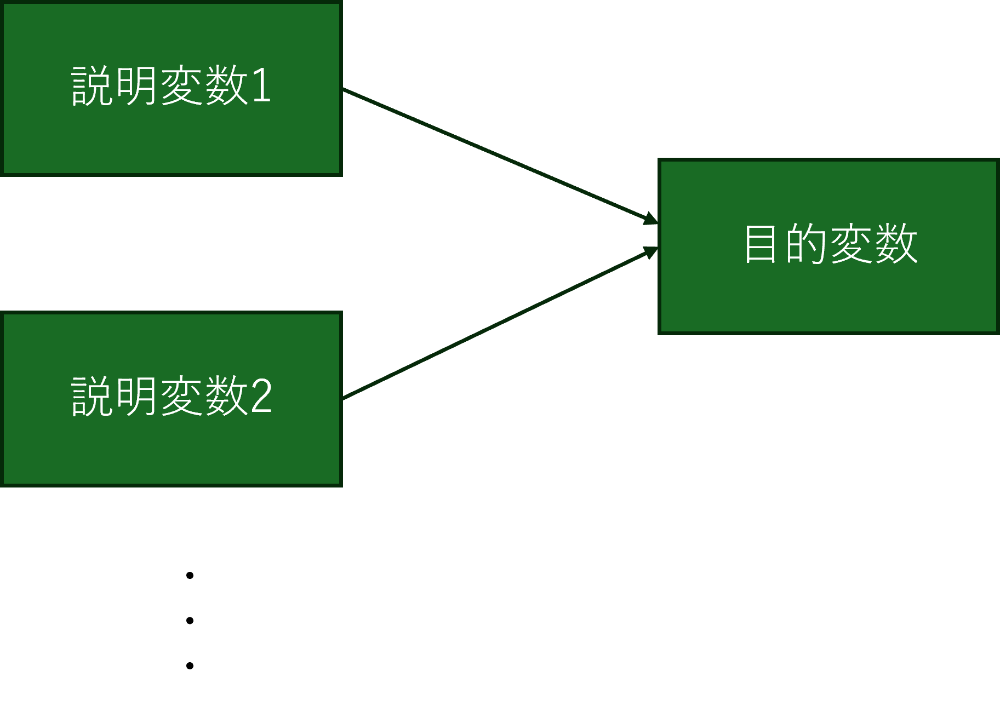
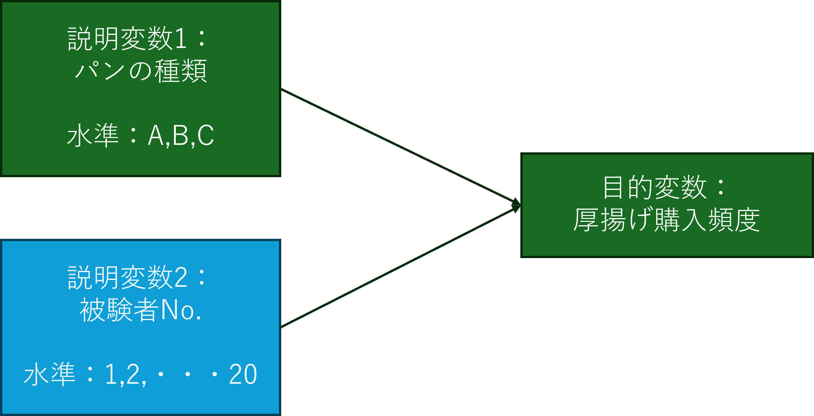

```{r setup, include=FALSE}
knitr::opts_chunk$set(echo = TRUE)
```

分散分析とは，名前の通りにある変数（目的変数）が持っているデータの分散（ばらつき）が，何を原因にして生じたものであるかを解析するための手法である．すなわち，データの因果関係を解析する手法の一つである．

より正確には，目的変数のデータのばらつきについての仮説として，「目的変数のデータのばらつきは，説明変数によって生じたものである」というものを立て，その仮説が正しいかどうかを検証するための手法である．
すなわち，[回帰分析](./RText_10_Regression.html)と基本的な考え方としては同じものである．ただ，回帰分析では**目的変数も説明変数もともに連続変数である**のに対して，分散分析では**目的変数は連続変数であるものの，説明変数は離散的な変数である**という違いがある．

説明変数が離散的な値とをとることから，分散分析において結論として得られるのは基本的に「説明変数の値が異なっていると，目的変数の値も異なる」というものである．一方，回帰分析では説明変数が連続変数であることから，説明変数の数値の大小が結果に入ってくる．すなわち，「説明変数の値が大きく（小さく）なると，目的変数も大きく（小さく）なる」という結論が得られる．

ちなみに，分散分析において説明変数が取る離散的な値のことを**水準(レベル)**と呼ぶ．

:::ref
変数と関連の深いものとして「尺度」（スケール）というものがある．尺度とは実際に何かを測定するときに用いるツールであり，尺度を使ってサンプルから得られたデータが「変数」となる．

この尺度には，**名義尺度，順序尺度，間隔尺度，比例尺度**という4つの尺度がある．

|尺度|解説|
|:-|:------|
|**名義尺度**|測定値の間に何ら順序関係が存在しない，単なる区分けのために用いられる尺度である．<br>例：血液型，性別，出身地，居住地など|
|**順序尺度**|測定値の間に順序関係が存在しているものであるが，その順序はあくまで概念上のものであり，順序の間に数値としての間隔が定義されていないものを指す<br>例：学歴（中卒・高卒・大卒・院卒など），実験実施条件（実施前，実施中，実施後）など|
|**間隔尺度**|測定値の間に順序関係があるとともに，その間隔が測定値間で均一であるものを指す．あくまで間隔が「均一」というだけで，その値は他のデータ値との比較上の意味は持つものの，絶対的な意味は持ち合わせていないものを指す<br>例：学力テストの得点，気温(℃)，日付時刻ど|
|**比例尺度**|測定値そのものに絶対的な意味があり（意味あるものとして絶対的な「0」存在している），比率にも意味があるものを言う．<br>例：長さ，重さなどの物理量，年齢，起点からの時間など|

名義尺度，順序尺度は離散的な変数であり，間隔尺度，比例尺度が連続的な変数となる．
すなわち，分散分析や回帰分析において，目的変数はいずれの場合も間隔尺度か比例尺度となるが，説明変数が名義尺度，順序尺度である場合には分散分析を，間隔尺度，比例尺度である場合には回帰分析を用いることとなる．

ただし，アンケート調査で用いられる3段階尺度や5段階尺度，7段階尺度など，選択肢に数値を割り振って処理する尺度では，厳密に言えば順序尺度ではあるものの，あくまで等間隔であると仮定して間隔尺度として分析が行われることは非常に多い．その場合には，それぞれの選択肢に付与される形容詞や副詞を工夫して，人が選択肢の文言の意味をできるだけ等間隔で捉えられるようにする必要がある（例：**全く**そうではない・**どちらかと言えば**そうではない・どちらともいえない・**どちらかと言えば**その通りである・**全く**その通りである）．
:::

# 分散分析の種類

分散分析にはいくつかの種類があるが，その中でも最も基本的なものが「一要因分散分析」である．すなわち，目的変数（従属変数）のばらつきを，ある1つの説明変数（独立変数）がどの程度説明できるかを検証する手法である．

一方，説明変数が2つの場合には「二要因分散分析」，3つの場合には「三要因分散分析」と呼ぶ．理論上は説明変数をいくつでも用意することはできるが，説明変数が増えるにつれて解析が複雑になるため，一般的には二要因程度でとどまることが多い．

なお，Excelの分析ツールでは一要因分散分析を一元配置分散分析，二要因分散分析を二元配置分散分析と呼んでいる．
また，Excelの二元配置分散分析は二元配置分散分析（くり返しなし）と二元配置分散分析（くり返しあり）に分かれる．「くり返しのある」2元配置分散分析とは，2つの要因を組み合わせた条件の下で**複数回の測定**を行っているケースに対応した分析手法である．それぞれの組み合わせで複数回の測定を行っている場合，それぞれの要因の**交互作用（相乗効果・組み合わせ効果）**を検証することができる．交互作用とは，2つの要因が組み合わさった時に初めて現れる効果のことである．


|一般的な呼び方|Excelの呼び方|
|:---|:---|
|一要因分散分析|一元配置分散分析|
|二要因分散分析（交互作用なし）|二元配置分散分析（繰り返しなし）|
|二要因分散分析（交互作用あり）|二元配置分散分析（繰り返しあり）|


### 対応の有無（被験者内計画，被験者間計画）
加えて，データの種類として**対応ありデータ**と**対応なしデータ**がある．対応ありデータとは，同じサンプルに対して複数の条件を設定して測定(こうしたことを**反復測定**と呼ぶ）を行うデータのことであり，対応なしデータとは，異なるサンプルに対して測定を行うデータのことである．「対応あり」のことを「被験者内計画(Within-subjects Design)」，「対応なし」のことを「被験者間計画(Between subjects Design)」と呼ぶこともある．

対応ありデータの場合，サンプル間の個体差（個人差）の影響を分析時に取り除くことができるため，対応なしデータに比べてより正確な結果が得られることがある．ただし，対応ありデータの場合，サンプル間の個体差が大きい場合には，その個体差が結果に影響を与える可能性があるため，その点に留意する必要がある．

# モデリング
分散分析（回帰分析でも）では，モデリングという作業が非常に重要である．モデリングとは，データを説明変数と目的変数の関係を表すモデル図やモデル式で表現することである．分散分析の場合，モデルは以下のようなモデル図とモデル式となる．




$$
目的変数 ～ 説明変数1+説明変数2+...
$$
これは，目的変数に影響を与えると考えられる説明変数をすべて列挙したものであり，いわば仮説を式で表したものといえる．一要因分散分析の場合には，説明変数が1つだけとなるし，二要因分散分析の場合には，説明変数が2つとなる．このようなモデル式を与えて，このモデル式に含まれる説明変数の影響が有意になるかどうかを検証するのが分散分析である．

# 準備
分散分析を行うためには，以下のパッケージを読み込む必要がある．またこれらの読み込みにあたっては，予めtidyverseやcarというパッケージをインストールしておく必要がある．インストールはこれまで何度も出てきているが，Tools->install.packagesから行う．インストールが済んだら，以下の通りに`library()`関数にて，両パッケージを読み込む．

```{r results="hold", echo=TRUE, message=FALSE, warning=FALSE}
library(tidyverse)
library(car)
```

# 一要因分散分析（対応なし）

さて，まずは基本である対応なしデータでの一要因分散分析の例として，以下のような例題を考えよう．

:::practice
北陸三県の出身者の間で，厚揚げを1カ月の間にどの程度の頻度で購入するかを調査した結果，以下のようなデータが得られた．このデータ（[リンク](./practice/example_anova.csv)）をもとに，厚揚げの購入頻度は**北陸三県の出身者の間で異なっていると言えるか**を検証せよ．
```{r include=FALSE}
#./practice/example_anova.csvの作成
set.seed(21)
num_samples <- 20
石川県 <- rpois(num_samples, 4)
富山県 <- rpois(num_samples, 4)
福井県 <- rpois(num_samples, 6)

data <- tibble(
  石川県 = 石川県,
  富山県 = 富山県,
  福井県 = 福井県
)

write_csv(data, "./practice/example_anova.csv")
```
:::

この例題の場合，モデル図は以下の通りとなる．


分散分析を実施するコマンドは`aov()`関数である．この関数は，第1引数に`目的変数~説明変数`(`~`はチルダ)という形で表現される式を与え，第2引数に目的変数と説明変数を含んだデータフレームを与える．結果は一旦任意の名前を付けたオブジェクトとして保存し，`summary()`関数で結果を表示する．

なお，**データは必ずロング形式でなければならない**．今回の場合，データはワイド形式であるため，`pivot_longer()`関数を用いてロング形式に変換する．また，以下の例では一旦，平均と標準偏差を確認している．


```{r results='hold'}
mydata_anova <- read.csv(
  "./practice/example_anova.csv",
  header=T,
  fileEncoding="UTF8"
) # データ読み込み

#ワイド形式からロング形式に変換
mydata_anova_long <- pivot_longer(
  mydata_anova,
  cols=colnames(mydata_anova),
  names_to = "県",
  values_to= "購入頻度" #測定変数に与える列名
)

#平均と標準偏差の確認
print("平均:")
aggregate(購入頻度~県, data=mydata_anova_long, FUN=mean)
print("標準偏差:")
aggregate(購入頻度~県, data=mydata_anova_long, FUN=sd)

#分散分析の実施
anova_res <- aov(購入頻度~県, data=mydata_anova_long)
summary(anova_res)

```

色々と数値が出てきているが，一番重要な値は，「県」の行の最後にある「Pr(>F)」の値である．これがP値となる．今回の場合，これが0.0264という値となっており，有意水準5%の下で有意（アスタリスクが1つ表記）となった．すなわち，北陸三県の出身者の間で厚揚げの購入頻度は**異なっている**と結論づけることができる．

:::ref
その他の値の意味については以下の通りである．

|項目|意味|
|:-|:-----|
|Df|自由度（Degree of Freedom）．基本的に$説明変数の水準数-1$の値となる．|
|Sum Sq|平方和（Sum of Squares）．平方和とは，各データの偏差（すなわち各データから平均を引いた値）を2乗したものの和．分散を求める際の$\frac{1}{n-1}$する前の値．データ全体でのばらつきの大きさを表す指標．|
|Mean Sq|平均平方（Mean Square）．平方和を自由度で割った値であり，要するに母分散の推定値．|
|F value|F値．F値とは，平均平方の比をとった値であり，F値が大きいほどデータのばらつきが大きいことを意味する．|
|Residuals|残差の自由度, 平方和, 平均平方|
:::


## 分散分析の結果の解釈の注意点
分散分析はあくまで「変数間の関係性」を検証するための手法であり，説明変数の中で設定されている水準（上の例では富山・石川・福井）の間の差が有意かどうかを検証するものではない．

もし水準間の差が有意であるかどうかを検証したい場合には，既に説明した[多重比較](./RText_07_BasicTest.html#多重比較)を行う必要がある．

特に分散分析の結果が有意であった場合に，続けて多重比較を行うことを**「下位検定」**と呼ぶ．但し，分散分析に続いて多重比較を行うことは，検定の多重性問題を引き起こす可能性があるため，最近ではあまり望ましい手法とは考えられていない．あくまで「変数間の関係性」に着目していたのであれば分散分析で留めるべきであり，逆に「水準間の差の有無」に着目していたのであれば，分散分析は行わず最初から多重比較だけを行うべきであるとされている．

ただ，実際には例えば心理学や行動科学の分野では，分散分析の後の下位検定で多重比較を行っているケースも現時点ではまだ多々見られる．結局，それぞれの学問分野での慣習による．一般には医学系では多重性問題に対してより厳しい態度をとっているようである．


## 効果量
最近では，説明変数の影響が有意かどうかを検定するだけでなく，その影響の大きさを示す指標として**効果量**も示すことが求められるようになっている．効果量は，説明変数が目的変数に対してどの程度の影響を与えているかを示す指標であり，分散分析の場合には**$\eta^2$**（イータ2乗）と**偏$\eta^2$**という指標が用いられることが多い．

計算方法は，分散分析表の平方和の値を用いてそれぞれ以下の式で求められる．
$$
\eta^2 = \frac{平方和_{説明変数}}{平方和_{全体}}\\
　\\
偏\eta^2 = \frac{平方和_{説明変数}}{平方和_{説明変数} + 平方和_{残差}}
$$
全体とあるのは，説明変数の平方和と残差の平方和を合計したものを指す．一要因分散分析の場合には，$\eta^2$と$偏\eta^2$は結局は同じ値となるので，$\eta^2$を報告するだけでよい．

$\eta^2$は0から1の間の値をとり，1に近いほど説明変数が目的変数に対して大きな影響を与えていることを示す．一般的には，0.01未満の場合には「ほぼ効果なし」，0.01から0.06で「小さな効果」，0.06から0.14で「中程度の効果」，0.14以上で「大きな効果」とされる．

一方$偏\eta^2$も0～1の値をとるが，目安というものは存在しない．あくまで他の変数との比較や他の関連する文献での値との比較の際に用いられる指標である．


## 分散分析の結果の報告方法
分散分析で結果を報告する際には，分散分析表を示したうえで，「表〇に示す通りに，（説明変数）は（目的変数）に対して有意な影響を与えていることが示された」といった形で報告するのが一般的である．

分散分析表とは先の例でいうと以下のような表となる．

|項目|自由度|平方和|平均平方|F値|P値|$\eta^2$|
|:---|:---|:---|:---|:---|:---|:---|
|県|2|38.63|19.317|3.878|0.0264 *|0.203|
|残差|57|283.95|4.982||||
|合計|59|322.58|5.47||||

県と残差については，Rの出力結果そのものを記載すればよい．合計については，説明変数の自由度，平方和を合計したものを記載する．平均平方は合計した平方和を合計した自由度（データ数全体-1）で割った値となる．


:::ref
実はこの平均平方の値($合計の平方和/合計の自由度$)は母分散の不偏推定量そのものである(->[分散の点推定](./RText_04_DescriptiveStatistics.html#分散の点推定))．このことから，要するに分散分析とはデータ全体での分散（平方和）を説明変数の平方和と残差の平方和に**分割**し，残差と説明変数の分散比が有意に異なっているかをF検定によって求めたものといえる．もし，分散比が有意に異なっているならば，説明変数の平方和を考慮することは意味があるが，もし分散比に有意な違いがないならば，説明変数を考えることに大して意味はない，ということとなる．
:::

# 一要因分散分析（対応あり）

次に，[対応ありデータ](./RText_07_BasicTest.html#t検定の方法（ワイド形式データ）)での一要因分散分析の例を考えよう．

:::practice 
新製品の食パンの試作品としてA,B,Cの3種類のパンを作り，20人の被験者に試食してもらい，それぞれのおいしさを10段階で評価してもらった．このデータ（[リンク](./practice/example_anova_within.csv)）をもとに，パンの種類によっておいしさが有意に異なっているかを検証せよ．
:::

```{r include=FALSE}
#./practice/example_anova_within.csvの作成
set.seed(42)
num_samples <- 20
A <- round(rnorm(num_samples, mean = 5, sd = 1),0)
B <- round(rnorm(num_samples, mean = 6, sd = 1),0)
C <- round(rnorm(num_samples, mean = 7, sd = 1),0)

data <- tibble(
  被験者No. = c(1:num_samples),
  A = A,
  B = B,
  C = C
)

write_csv(data, "./practice/example_anova_within.csv")
```


このような対応ありデータ(反復測定のデータ）である場合には，サンプルごとの個人差（個体差）が結果に影響を与えうる．
例えば，普段から食パンをよく食べている人は食パンに対して全般に高い得点を付ける可能性や，食パンへのこだわりが強いことによって点数のバラつきが大きくなったりする可能性がある．逆に普段あまりパンを食べていない人は全般に低い得点を付ける可能性が考えられる．
すなわち，「おいしさ」の得点には，「パンの種類」だけでなく，個々のサンプルの得点のつけ方も影響する可能性が考えられる．そこで，「おいしさ」に対するモデルとして，サンプルを識別する変数（今回の例では「被験者No.」）も説明変数に加えたモデルとする．

すなわち，モデル図としては以下の通りとなる．



このような2つ以上の説明変数を持った分散分析では，`aov()`関数を行ったあとに，`car`パッケージの`Anova()`関数を実行する必要がある．なお，`car`パッケージは[こちら](#準備)で既に読み込みをしているので，改めてlibrary()関数で読み込む必要はない．

この例題の場合は以下のようなコードとなる．

なお，今回も人にとってはわかりやすいデータ形式（ワイド形式）となっているが，Rで処理するためにはロング形式でなければならないので，データをロング形式に変換する． 
また，特に注意すべき点として， **as.factor()関数を用いて被験者No.を要因型に変換する点である**．被験者No.は本来は単なる名義尺度なのだが，今回のデータの場合，No.として数値を与えてしまっている．このため，このままでは大小関係が存在する「間隔尺度/比例尺度」として処理されてしまう．それを防ぐために，as.factor()関数を用いて要因型に変換する．   

```{r results='hold'}
mydata_anova_within <- read.csv(
  "./practice/example_anova_within.csv",
  header=T,
  fileEncoding="UTF8"
) # データ読み込み

#ワイド形式からロング形式に変換
mydata_anova_within_long <- pivot_longer(
  mydata_anova_within,
  cols=c("A", "B", "C"),
  names_to = "パンの種類",
  values_to= "おいしさ" #測定変数に与える列名
)

#　被験者No.を要因型に変換する．
mydata_anova_within_long$被験者No. <- as.factor(mydata_anova_within_long$被験者No.)

#分散分析の実施
anova_res_within <- aov(おいしさ~パンの種類 + 被験者No., mydata_anova_within_long)
Anova(anova_res_within, type=2)
summary(anova_res_within)
```

この結果から，被験者要因を考慮に入れた上で，パンの種類によるおいしさの違いが検証され，結果，人それぞれ好みはあれど，全体としてパンの種類によっておいしさは有意に異なっていることが示された．

`Anova()`関数の引数には`type`というものがあり，これは分散分析の種類を指定するものである．`type=2`が今回の場合に用いるべき設定となるが，他にも`type=3`という設定があり，交互作用を考慮する場合に用いられる．

:::ref
分散分析における「タイプ」の違いについては以下の通りである．

**タイプ1**:
変数をモデルに投入する毎に，その時点での残差とその変数の平方和の比をF検定する．
変数の投入順序によって各変数の平方和が変わり得るので，同じモデルでも変数のモデルへの投入順序によって結果が変わることがある．このため，**対応のないデータでの一要因分散分析でのみ使用される**のが一般的である．

**タイプ2**:
モデルに投入された変数の平方和を以下の式によって算出する．ここでは，変数$\alpha$と変数$\beta$の二要因を考える．

$$
\begin{align}
 \alphaの平方和=データ全体での平方和-モデル全体に対する残差の平方和-\betaの平方和　　　　　　　　　\\
 \betaの平方和=データ全体での平方和-モデル全体に対する残差の平方和-\alphaの平方和　　　　　　　　　\\
 交互作用の平方和=データ全体での平方和-モデル全体に対する残差の平方和-\alphaと\betaを合わせた平方和
\end{align}
$$

このように各変数の平方和は，他の要因では説明できない部分を取り除いたものとなり，また，F検定を実施する対象となる残差も，モデル全体に対する残差となるため，変数のモデルへの投入順序に依存しなくなる．
ただし，それそれの変数の平方和（主効果）を検討するときに交互作用項を考慮していないため交互作用を軽視した分析となる．

**タイプ3**:
タイプ2と同様の考え方で各変数の平方和を計算していくが，タイプ2と異なり，各変数の主効果を検討するときに，交互作用も考慮した平方和を算出する点が異なる．

$$
\begin{align}
 \alphaの平方和 =データ全体での平方和-モデル全体に対する残差の平方和-\betaと交互作用を合わせた平方和 \\
 \betaの平方和=データ全体での平方和-モデル全体に対する残差の平方和-\alphaと交互作用を合わせた平方和 \\
 交互作用の平方和 =データ全体での平方和-モデル全体に対する残差の平方和-\alphaと\betaを合わせた平方和
\end{align}
$$
このため，タイプ3では交互作用を検討するときに行う分析として優れている．

なお，上記のような分析であることから，各変数の平方和と残差平方和の総和がデータ全体の平方和と一致するとは限らなくなる．このため，タイプ2にせよ，タイプ3にせよ，分散分析表においては，合計の平方和や平均平方は示す必要はない．

ただ，交互作用を含む場合の分析をタイプ2とすべきかタイプ3とすべきかは現時点でも意見が分かれている．
両方をためして結果が違うかを検証し，いずれを採用するかを確認したり，それぞれの分野での先行研究がどちらのタイプを用いているかを調べてそれに倣うのがよい．

**[参考]**

[田辺健一郎: ``glmにおけるTypeI,TypeIIおよびTypeIIIの計算例'', SASユーザー総会アカデミア/テクノロジー&ソリューションセッション論文集, pp.397--406, 2011.](https://www.sas.com/content/dam/SAS/ja_jp/doc/event/sas-user-groups/usergroups11-p-04.pdf)

:::

:::ref
この対応あるデータでの一要因分散分析は，t検定における対応あるデータでの分析の拡張であり，水準が2つであればt検定を，水準が3つ以上であれば分散分析を行うことになる．
ただ，水準が2つの場合に分散分析を行ってはいけないということはなく，両者は一致した結果を出力する．実際には，水準が2つの場合にも分散分析を行うことが多い．
以下に実際に行った事例を示す．分散分析の結果とt検定の結果のP値が一致しているのが見て取れる．

```{r}
#水準Aを除外する
mydata_anova_within_long <- filter(mydata_anova_within_long, パンの種類 != "A")
# 確認
summary(mydata_anova_within_long)
mydata_anova_within_long$パンの種類<-as.factor(mydata_anova_within_long$パンの種類)

#分散分析の実施
anova_res_within <- aov(おいしさ~パンの種類 + 被験者No., mydata_anova_within_long)
Anova(anova_res_within, type=2)

#t検定のためにBとCのみのデータをとりだす
B<- filter(mydata_anova_within_long, パンの種類=="B")
C<- filter(mydata_anova_within_long, パンの種類=="C")
summary(B)
summary(C)

#B, Cのおいしさのデータを取り出してt検定
t.test(B$おいしさ,C$おいしさ, paired=T)
```


:::

:::ref
実は非常にややこしいのだが，対応ありデータでの一要因分散分析は，**交互作用のない**二要因分散分析ともいうことができる．したがってExcelの分析ツールで対応ありデータでの一要因分散分析を実施する場合には，**2元配置分散分析（繰り返しなし）**を選択する．

|一般的な呼び方|Excelの呼び方|
|:---|:---|
|一要因分散分析（対応なし）|一元配置分散分析|
|一要因分散分析（対応あり）<br>=二要因分散分析（交互作用なし） |二元配置分散分析（繰り返しなし）|
|二要因分散分析（交互作用あり・対応なし）|二元配置分散分析（繰り返しあり）|
|二要因分散分析（交互作用あり・対応あり）|Excelは対応していない|


ただし，通常，二要因分散分析，すなわち説明変数を2つ想定した分析を行う場合には，交互作用を考慮することが一般的である．そのため，「交互作用のない二要因分散分析」という表現は，あまり一般的ではない．
:::


# 二要因分散分析(対応なし)

次のような例題を考えてみよう．

:::practice
ある農業試験場では新しい小麦の品種開発とその品種向けの新しい肥料の開発を行っている．今回，新しい小麦の品種Aと新しい肥料Xが開発された．AとXが既製品種B，既製肥料Yよりもより病気に強く収穫量が多くなることを実証するために，実際にそれぞれ40の畝を10ずつの4グループに分け，A-X，A-Y，B-X，B-Yの組み合わせで小麦を作付けし収穫量を評価することにした．結果そうして得られたデータである．このデータ（[リンク](./practice/example_anova_2way.csv)）をもとに，新しい品種，新しい肥料がそれぞれ既製のものに比べて優れているのかを検証せよ．
:::

```{r include=FALSE}
#./practice/example_anova_2way.csvの作成
set.seed(32)
num_samples <- 10
A_X <- round(rnorm(num_samples, mean = 60, sd = 10),0)
A_Y <- round(rnorm(num_samples, mean = 48, sd = 20),0)
B_X <- round(rnorm(num_samples, mean = 42, sd = 20),0)
B_Y <- round(rnorm(num_samples, mean = 50, sd = 15),0)

data <- tibble(
  肥料=c(rep("X", num_samples), rep("Y", num_samples)),
  A = c(A_X, A_Y),
  B = c(B_X, B_Y),
)

write_csv(data, "./practice/example_anova_2way.csv")
```

この事例の場合，説明変数として「小麦品種（水準：A，B）」と「肥料（水準：X，Y）」という2つの変数があり，目的変数として「収穫量（連続変数）」があることになる．したがって，この例でのモデル図は以下のものがまず考えられる．


しかしながら，このモデル図は誤りとなる．二要因分散分析では基本的に**交互作用**というものを考慮する必要がある．これは「説明変数同士の掛け算の効果」あるいは「相乗効果」のことである．例えば，品種AはBよりも病気に強い，肥料Xは肥料Yに対して基本的に効果が高い，ということであれば，A＋Xが最も収穫量が高く，B＋Yがもっとも収穫量が低いということになるだろう．しかしながら，既製品同士のBとYは非常に相性が良く，この二つを組み合わせると，AとYを組み合わせたり，BとXを組み合わせたりするよりも収穫量が高くなる，ということもあり得る．こうした**組み合わせたことによって相乗的に生じてくる効果のことを交互作用と呼ぶ**．
二要因分散分析では基本的にこうした交互作用も含めたモデル図にする必要があるので，正しくは以下のようなモデル図となる．


こうした交互作用を含んだ二要因分散分析を行う方法も，基本的に[一要因分散分析（対応あり）](#一要因分散分析（対応あり）)と大して変わらない．すなわち，使うコマンドは`aov()`関数と`car`パッケージの`Anova()`関数である．違う点は，`aov()`関数に与えるモデル式に交互作用項が加わることと，`Anova()`関数の`type`引数に`3`を指定することである．

今回のデータもワイド形式となっているのでロング形式に変換する必要がある．
```{r results='hold'}
mydata_anova_2way <- read.csv(
  "./practice/example_anova_2way.csv",
  header=T,
  fileEncoding="UTF8"
) # データ読み込み

#ワイド形式からロング形式に変換
mydata_anova_2way_long <- pivot_longer(
  mydata_anova_2way,
  cols=c("A", "B"),
  names_to = "小麦",
  values_to= "収穫量" #測定変数に与える列名
)

#分散分析の実施
anova_res_2way <- aov(収穫量~小麦+肥料+小麦:肥料, mydata_anova_2way_long)
Anova(anova_res_2way, type=3)
```

この結果から，小麦の主効果とこれらの交互作用が収穫量に対して有意な影響を与えていることが示された．
すなわち，全体としては小麦の種類の違いは収穫量に影響を及ぼすこと，肥料の種類の違い単独では収穫量には影響がないことが示されたが，**肥料と小麦の種類の組み合わせによって収穫量が違ってくる**ことも示された．


ちなみに，交互作用を考慮した分散分析を行う際に`aov()`に与える式は，以下のように`*`を用いて記述することもできる．
```{r}
anova_res_2way <- aov(収穫量~小麦*肥料, mydata_anova_2way_long)
Anova(anova_res_2way, type=3)
```
このようにすることで，`小麦:肥料`という交互作用項の記述を省略することができる．


## 下位検定（単純主効果検定）

このように交互作用が有意であった場合には，下位検定として「単純主効果検定」というものを実施するのが一般的である．これは，交互作用の内容を把握するために行われる分析で，一方の説明変数の水準ごとに，他方の要因の効果を調べる分析である．つまり，以下のようなモデル図でそれぞれ分析をする，ということである．


単純主効果検定を実際に行うには以下のようにする．


```{r results='hold'}
# 小麦の種類別のデータを切り出す
data_A <- filter(mydata_anova_2way_long, 小麦 == "A")
data_B <- filter(mydata_anova_2way_long, 小麦 == "B")

# それぞれの中で肥料の効果を検証する
print("小麦Aの場合")
t.test(収穫量~肥料, data=data_A)
print("小麦Bの場合")
t.test(収穫量~肥料, data=data_B)
```
この結果から，新しい小麦品種Aの場合には新しい肥料Xを用いた方が，既製品の肥料Yを用いるよりも収穫量が高いことが示された．一方で，既成の小麦品種Bの場合には新しい肥料Xと既製品の肥料Yを用いた場合とでは収穫量に有意な差が無いことが示された．

なお，単純主効果検定ではどちらの説明変数を基準にして検定を行うかは，得たい結果に基づいて決める．例えば，上のモデル図の場合には，「品種の違いによって肥料の効果の出方が異なっているか」を知りたい場合のモデル図になる．逆に，下のモデル図の場合には「肥料の違いによって品種ごとの収穫量が異なるか」を知りたい場合のモデル図となる．


## ggplotでの結果の可視化

二要因分散分析において，特に交互作用が有意であった場合には，単純主効果検定の結果をグラフで平均と標準偏差を可視化するのが一般的である．

以下では順番にそれぞれを説明していく．

### 平均と標準偏差の算出

まずは，[`filter()`関数](./RText_DataHandling.html#抽出)と[`aggregate()`関数](./RText_DescriptiveStatistics.html#グループごとの統計量の算出)を用いて，それぞれの平均と標準偏差を算出する．

```{r}
#A-Xのデータの抽出
data_A_X <- filter(data_A, 肥料 == "X")
#A-Yのデータの抽出
data_A_Y <- filter(data_A, 肥料 == "Y")
#B-Xのデータの抽出
data_B_X <- filter(data_B, 肥料 == "X")
#B-Yのデータの抽出
data_B_Y <- filter(data_B, 肥料 == "Y")

# 平均と標準偏差の算出
mean_A_X <- mean(data_A_X$収穫量)
mean_A_Y <- mean(data_A_Y$収穫量)
mean_B_X <- mean(data_B_X$収穫量)
mean_B_Y <- mean(data_B_Y$収穫量)
sd_A_X <- sd(data_A_X$収穫量)
sd_A_Y <- sd(data_A_Y$収穫量)
sd_B_X <- sd(data_B_X$収穫量)
sd_B_Y <- sd(data_B_Y$収穫量)

#データフレーム化
mean_data <- data.frame(
  小麦 = c("A", "A", "B", "B"),
  肥料 = c("X", "Y", "X", "Y"),
  収穫量 = c(mean_A_X, mean_A_Y, mean_B_X, mean_B_Y),
  sd = c(sd_A_X, sd_A_Y, sd_B_X, sd_B_Y)
)

```

### ggplotで平均を点でプロット
続いて，`ggplot2`パッケージを用いて，平均を点でプロットする．ggplot2の使い方については[こちら](./RText_ggplot2_basicUsage.html)を参照．特に今回は冒頭のデータを与えた段階で`aes()`関数も記述している．こうすることで，それ以降のgeom_***関数内で`aes()`関数を記述する必要がなくなる．

```{r}
g<-ggplot(mean_data, aes(x=肥料, y=収穫量, group=小麦)) +
  geom_point(size=3)
plot(g)
```


```{r}
# ggplotでの点プロットし点を線分で結ぶ
g<-ggplot(mean_data, aes(x=肥料, y=収穫量, group=小麦, color=小麦)) +
  geom_point(size=3) +
  geom_line() +
  labs(title="肥料の効果", x="肥料", y="収穫量")

print(g)

# gのy軸の範囲を0から最大値までに設定
g<-g + coord_cartesian(ylim = c(0, max(mean_data$収穫量) + 10))
print(g)

# エラーバーを表記．そのために点プロットはすこし左右にずらす
g <-ggplot(mean_data, aes(x=肥料, y=収穫量, group=小麦, color=小麦)) +
  geom_errorbar(aes(ymin=収穫量-sd, ymax=収穫量+sd), width=.1, position=position_dodge(width=0.2)) +
  geom_point(position=position_dodge(width=0.2), size=3) +
  geom_line(position=position_dodge(width=0.2)) +
  coord_cartesian(ylim = c(0, max(mean_data$収穫量) + 10))
print(g)


```

# 二要因分散分析(対応あり)

次のような例題を考えてみよう．

:::practice
3つのメーカの同価格帯の食パンA，B，Cと，2つのメーカの同価格帯の苺ジャムX，Yを用いて，苺ジャムを塗った食パンのおいしさを20人に試食してもらい，それぞれのおいしさを10段階で評価してもらった．この結果から，メーカーによって食パンや苺ジャムの味に違いがあるのかを検討せよ．なお，評価の際には，食べる量はあくまで1口大（3㎝四方）とし，ジャムを塗る量は全てで統一している．また，それぞれ試食のたびに水で口をゆすいでもらっており，食べる順序については考慮しなくてもよいようにしている．[データはこちら](./practice/example_anova_2way_within.csv)
:::

```{r include=FALSE}
#./practice/example_anova_2way_within.csvの作成
set.seed(32)
num_samples <- 20
A_X <- round(rnorm(num_samples, mean = 5, sd = 1),0)
A_Y <- round(rnorm(num_samples, mean = 4, sd = 1),0)
B_X <- round(rnorm(num_samples, mean = 3, sd = 1),0)
B_Y <- round(rnorm(num_samples, mean = 6, sd = 1),0)
C_X <- round(rnorm(num_samples, mean = 4, sd = 1),0)
C_Y <- round(rnorm(num_samples, mean = 5, sd = 1),0)

data <- tibble(
  個人No.=rep(1:num_samples, 6),
  メーカー=c(rep("A", num_samples*2), rep("B", num_samples*2), rep("C", num_samples*2)),
  ジャム = c(rep("X", num_samples), 
              rep("Y", num_samples),
              rep("X", num_samples), 
              rep("Y", num_samples),
              rep("X", num_samples), 
              rep("Y", num_samples)
            ),
  評価 = c(A_X, A_Y, B_X, B_Y, C_X, C_Y)
)

write_csv(data, "./practice/example_anova_2way_within.csv")
```


この事例の場合，説明変数として「食パン（水準：A，B，C）」と「苺ジャム（水準：X，Y）」という2つの変数があり，目的変数として「おいしさ（1～10の連続変数）」を設定している．そしてさらに，個人差要因も入っている．この事例の場合のモデル図は以下のようなものとなる．


このような対応ありデータ(反復測定のデータ）での二要因分散分析を行う方法も，基本的に[一要因分散分析（対応あり）](#一要因分散分析（対応あり）)と大して変わらない．すなわち，使うコマンドは`aov()`関数と`car`パッケージの`Anova()`関数である．違う点は，`aov()`関数に与えるモデル式に交互作用項が加わることと，`Anova()`関数の`type`引数に`3`を指定することである．


この例題の場合は以下のようなコードとなる．なお，今回のデータでは，「パンの種類」「苺ジャム」「被験者No.」という3つの変数が存在しているため，ワイド形式では1枚の表で記述するのは不可能となる．このため，今回読み込むデータでも予めロング形式のデータとしている．また交互作用項の記述に関しても`*`を用いて省略した記述法を行っている．


```{r results='hold'}
mydata_anova_2way_within <- read.csv(
  "./practice/example_anova_2way_within.csv",
  header=T,
  fileEncoding="UTF8"
) # データ読み込み

#分散分析の実施
anova_res_2way_within <- aov(評価~メーカー*ジャム + 個人No., mydata_anova_2way_within)
Anova(anova_res_2way_within, type=3)
```

この結果から，メーカーの主効果，ジャムの主効果とこれらの交互作用が評価に対して有意な影響を与えていることが示された．

## 下位検定（単純主効果検定）

交互作用が有意であったことから下位検定として単純主効果検定を行うことになる．先に紹介した通り，単純主効果検定では，どちらの独立変数をデータ切り分けの基軸にするかによって2通りの単純主効果検定が可能である．

なお，分析に先立って，それぞれの組み合わせの下での平均と標準偏差を算出しておく．

```{r}
#メーカーAのデータきりだし
data_A <- filter(mydata_anova_2way_within, メーカー == "A")
#メーカーAのジャムXの評価の平均・標準偏差
mean_A_X <- mean(filter(data_A, ジャム == "X")$評価)
sd_A_X <- sd(filter(data_A, ジャム == "X")$評価)
#メーカーAのジャムYの評価の平均・標準偏差
mean_A_Y <- mean(filter(data_A, ジャム == "Y")$評価)
sd_A_Y <- sd(filter(data_A, ジャム == "Y")$評価)

#メーカーBの場合
data_B <- filter(mydata_anova_2way_within, メーカー == "B")
mean_B_X <- mean(filter(data_B, ジャム == "X")$評価)
sd_B_X <- sd(filter(data_B, ジャム == "X")$評価)
mean_B_Y <- mean(filter(data_B, ジャム == "Y")$評価)
sd_B_Y <- sd(filter(data_B, ジャム == "Y")$評価)

#メーカーCの場合
data_C <- filter(mydata_anova_2way_within, メーカー == "C")
mean_C_X <- mean(filter(data_C, ジャム == "X")$評価)
sd_C_X <- sd(filter(data_C, ジャム == "X")$評価)
mean_C_Y <- mean(filter(data_C, ジャム == "Y")$評価)
sd_C_Y <- sd(filter(data_C, ジャム == "Y")$評価)

#データフレーム化
mean_data <- data.frame(
  メーカー = c("A", "A", "B", "B", "C", "C"),
  ジャム = c("X", "Y", "X", "Y", "X", "Y"),
  評価 = c(mean_A_X, mean_A_Y, mean_B_X, mean_B_Y, mean_C_X, mean_C_Y),
  sd = c(sd_A_X, sd_A_Y, sd_B_X, sd_B_Y, sd_C_X, sd_C_Y)
)

print(mean_data)
```


### メーカーを基軸にした単純主効果検定

メーカーを基軸にして見る場合，食パンA，B，Cごとのジャム間の差を見ることになる．ジャムはX，Yの2水準しかないので，単純にT検定すればよい．
個人で対応のあるデータなので，paired＝TRUEをつける必要がある点には注意してほしい．

**RのVer.4.3.3まではt.testに(式, data)の形でデータ与えた場合でもpairedオプションの設定が出来たが，R Ver.4.4.1(2024.10.9に時点でのPosit Cloudのバージョンはこちら）においては(式,data)方式でデータを与えた場合にはpairedオプションの設定が出来なくなった．このため，以下のコードはエラーを吐き出す．したがって，R Ver. 4.4.1の場合には，一つしたのコードを使うこと！！(2024.10.9)**

```{r error=TRUE}
# R 4.3.3ではこちらのコードでも正常に動作するが，R 4.4.1ではこちらだとエラーになる
# メーカーAの場合
data_A <- filter(mydata_anova_2way_within, メーカー == "A")
t.test(評価~ジャム, data=data_A, paired=TRUE)

# メーカーBの場合
data_B <- filter(mydata_anova_2way_within, メーカー == "B")
t.test(評価~ジャム, data=data_B, paired=TRUE)

# メーカーCの場合
data_C <- filter(mydata_anova_2way_within, メーカー == "C")
t.test(評価~ジャム, data=data_C, paired=TRUE)
```

```{r}
# R 4.4.1ではこちらのコード.(R 4.3.3でも動作する)
# メーカーAの場合
data_A <- filter(mydata_anova_2way_within, メーカー == "A")
data_A_X <- filter(data_A, ジャム=="X")
data_A_Y <- filter(data_A, ジャム=="Y")
t.test(data_A_X$評価,data_A_Y$評価, paired=TRUE)

# メーカーBの場合
data_B <- filter(mydata_anova_2way_within, メーカー == "B")
data_B_X <- filter(data_B, ジャム=="X")
data_B_Y <- filter(data_B, ジャム=="Y")
t.test(data_B_X$評価,data_B_Y$評価, paired=TRUE)

# メーカーCの場合
data_C <- filter(mydata_anova_2way_within, メーカー == "C")
data_C_X <- filter(data_C, ジャム=="X")
data_C_Y <- filter(data_C, ジャム=="Y")
t.test(data_C_X$評価,data_C_Y$評価, paired=TRUE)
```


この結果から，食パンAでは，ジャムXの方がジャムYよりも有意に評価が高い一方，B，Cでは，ジャムYの方がジャムXよりも有意に評価が高いことが示された．

### ggplotによる可視化
ggplotでこの結果を可視化すると以下の通りとなる．

```{r}
# ggplotで棒グラフで表示
g<-ggplot(mean_data, aes(x=メーカー, y=評価, fill=ジャム)) +
  geom_bar(stat="identity", position="dodge") +
  geom_errorbar(aes(ymin=評価-sd, ymax=評価+sd), width=.1, position=position_dodge(width=0.9)) +
  coord_cartesian(ylim = c(0, max(mean_data$評価) + 3))

# Aに対するブラケットを記述
g <- g + 
  annotate("segment",x=0.775, xend=0.775, y=6, yend=6.5,color="darkgray")+
  annotate("segment",x=0.775, xend=1.225, y=6.5, yend=6.5,color="darkgray")+
  annotate("segment",x=1.225, xend=1.225, y=6.5, yend=5.5,color="darkgray")+
  annotate("text", x=1, y=7, label="p=.006,**", color="black")
# Bに対するブラケットを記述
g <- g + 
  annotate("segment",x=1.775, xend=1.775, y=3.8, yend=7,color="darkgray")+
  annotate("segment",x=1.775, xend=2.225, y=7, yend=7,color="darkgray")+
  annotate("segment",x=2.225, xend=2.225, y=7, yend=6.5,color="darkgray")+
  annotate("text", x=2, y=7.5, label="p<.001,***", color="black")

# Cに対するブラケットを記述
g <- g + 
  annotate("segment",x=2.775, xend=2.775, y=5.6, yend=7.5,color="darkgray")+
  annotate("segment",x=2.775, xend=3.225, y=7.5, yend=7.5,color="darkgray")+
  annotate("segment",x=3.225, xend=3.225, y=7.5, yend=6,color="darkgray")+  
  annotate("text", x=3, y=8, label="p=.010,*", color="black")


plot(g)


```


### ジャムを基軸にした単純主効果検定

ジャムを基軸にして見る場合，ジャムX，Yごとの食パンA, B, C間の差を見ることになる．この場合には，多重比較となるので`pairwise.t.test()`を用いる．
なお，ここでも個人で対応のあるデータなので，paired＝TRUEをつける必要がある点には注意してほしい．

```{r}
# メーカーAの場合
data_X <- filter(mydata_anova_2way_within, ジャム == "X")
pairwise.t.test(data_X$評価, data_X$メーカー, paired=TRUE)

# メーカーBの場合
data_Y <- filter(mydata_anova_2way_within, ジャム == "Y")
pairwise.t.test(data_Y$評価, data_Y$メーカー, paired=TRUE)
```

### ggplotによる可視化
ggplotでこの結果を可視化すると以下の通りとなる．

```{r}
# ggplotで棒グラフで表示
g<-ggplot(mean_data, aes(x=ジャム, y=評価, fill=メーカー)) +
  geom_bar(stat="identity", position="dodge") +
  geom_errorbar(aes(ymin=評価-sd, ymax=評価+sd), width=.1, position=position_dodge(width=0.9)) +
  coord_cartesian(ylim = c(0, max(mean_data$評価) + 3))

# Xに対するブラケットを記述
g <- g + 
#A-C
  annotate("segment",x=0.65, xend=0.65, y=6, yend=7.5,color="darkgray")+
  annotate("segment",x=0.65, xend=1.35, y=7.5, yend=7.5,color="darkgray")+
  annotate("segment",x=1.35, xend=1.35, y=7.5, yend=5.5,color="darkgray")+
  annotate("text", x=1, y=8, label="p<.001,***", color="black")+
#A-B
  annotate("segment",x=0.75, xend=0.75, y=6, yend=6.5,color="darkgray")+
  annotate("segment",x=0.75, xend=0.95, y=6.5, yend=6.5,color="darkgray")+
  annotate("segment",x=0.95, xend=0.95, y=6.5, yend=4.0,color="darkgray")+
  annotate("text", x=0.85, y=7, label="p<.001,***", color="black")+
#B-C
  annotate("segment",x=1.05, xend=1.05, y=4.0, yend=6.5,color="darkgray")+
  annotate("segment",x=1.05, xend=1.25, y=6.5, yend=6.5,color="darkgray")+
  annotate("segment",x=1.25, xend=1.25, y=6.5, yend=5.5,color="darkgray")+
  annotate("text", x=1.15, y=7, label="p<.001,***", color="black")


# Yに対するブラケットを記述
g <- g + 
#A-B
  annotate("segment",x=1.75, xend=1.75, y=5.5, yend=7.0,color="darkgray")+
  annotate("segment",x=1.75, xend=1.95, y=7.0, yend=7.0,color="darkgray")+
  annotate("segment",x=1.95, xend=1.95, y=7.0, yend=6.5,color="darkgray")+
  annotate("text", x=1.85, y=7.5, label="p=.002,**", color="black")+
#B-C
  annotate("segment",x=2.05, xend=2.05, y=6.5, yend=7.0,color="darkgray")+
  annotate("segment",x=2.05, xend=2.25, y=7.0, yend=7.0,color="darkgray")+
  annotate("segment",x=2.25, xend=2.25, y=7.0, yend=6.0,color="darkgray")+
  annotate("text", x=2.15, y=7.5, label="p<.024,*", color="black")


plot(g)


```

:::work

```{r include=FALSE}
# ToothGrowth
data_ToothGrowth <- ToothGrowth

# ToothGrowthのデータの変数名を日本語にする
colnames(data_ToothGrowth) <- c("歯の長さ","薬種",  "投与量")

# サプリメントの種類を因子型に変換する
data_ToothGrowth$薬種 <- as.factor(data_ToothGrowth$薬種)
data_ToothGrowth$投与量 <- as.factor(data_ToothGrowth$投与量)

# 内容確認
head(data_ToothGrowth)
# 
# 
# # UKDriverDeaths
# data_UKDriverDeaths <- UKDriverDeaths
# 
# # UKDriverDeathsのデータの変数名を日本語にする
# colnames(data_UKDriverDeaths) <- c("年", "死亡者数")
# 
# # 内容確認
# head(data_UKDriverDeaths)

library(car)

# type 3 の分散分析交互作用あり
data_ToothGrowth$歯の長さ <-scale(data_ToothGrowth$歯の長さ)
anova_res <- aov(歯の長さ~投与量*薬種 ,data_ToothGrowth)
Anova(anova_res, type=3)
summary(anova_res)

```

RにはデフォルトでToothGrowthというデータセットが含まれている．このデータセットは60匹のモルモットに対してサプリメントとしてビタミンC（VC）と単なるオレンジジュース（OJ）のいずれかを，それぞれ0.5mg/日, 1.0mg/日, 2.0㎎/日の3条件で一定期間与えた時のモルモットの歯の成長量を測定したものである．含まれている変数は`len`, `supp`, `dose`の3つであり，それぞれが「歯の長さ」，「薬種（VC/OJ)」，「投与量」を示している．このデータセットを使って以下の問いに答えよ．

1. モルモットの歯の成長量はサプリメントの種類によって異なるかどうかを検証せよ．
1. モルモットの歯の成長量は投与量によって異なるかどうかを検証せよ．
1. モルモットの歯の成長量はサプリメントの種類と投与量の間に交互作用があるかどうかを検証せよ．
:::

:::work
二要因分散分析の例で示した単純主効果検定について，肥料ごとの小麦の品種の収穫量への影響を調べよ．結果はグラフで示せ．
:::
