```{r setup, include=FALSE}
knitr::opts_chunk$set(echo = TRUE)
library(tidyverse)
```


「ある変数Aの値が上がると，他の変数Bの値も上がる」「ある変数Aの値が上がると，他の変数Bの値は下がる」といったように，2つの変数の動きが連動しているような場合，二つの変数の間に**相関がある**という．そして，その関係性の強さを数値で表したものを**相関係数**と呼び，相関係数を計算したり，その有意性を評価したりすることを**相関分析**と呼ぶ．

# 相関係数
相関係数は上述しているように，2つの変数の間の関係性の強さを数値で表したものである．数値は-1から1の間の値を取り，1に近いほど強い正の相関があることを示し，-1に近いほど強い負の相関があることを示す．0に近いほど相関が弱い，もしくは無相関であることを示す．

相関係数を算出する式は以下の通りである．

$$
\begin{align}
R_{ab} &= \frac{aとbの共分散}{aの標準偏差\times bの標準偏差}\\\\  & = \frac{\frac{1}{n}\sum_{i=1}^{n} (a_i - \bar{a})(b_i - \bar{b})}{\sqrt{\frac{1}{n}\sum_{i=1}^{n} (a_i - \bar{a})^2}\sqrt{\frac{1}{n} \sum_{i=1}^{n} (b_i - \bar{b})^2}}\\
\\
& = \frac{\sum_{i=1}^{n} (a_i - \bar{a})(b_i - \bar{b})}{\sqrt{\sum_{i=1}^{n} (a_i - \bar{a})^2}\sqrt{\sum_{i=1}^{n} (b_i - \bar{b})^2}}
\end{align}
$$


数式そのものはそこそこ複雑な数式であるが，Rで相関を算出するのは極めて簡単である．以下のような例題を考えよう．

:::practice
次のデータは，ある高校の生徒たち100人の数学と英語のテストの点数である．[このデータ](./practice/example_09_Correl.csv)を用いて，数学と英語の点数の相関係数を求めよ．


```{r include=FALSE}
#./practice/example_09_Correl.csvの作成
set.seed(123)
math <- round(rnorm(100, mean=60, sd=10),0)
english <- round(math + rnorm(100, mean=0, sd=5),0)
data <- data.frame(math, english)
write.csv(data, file = "./practice/example_09_Correl.csv", row.names = FALSE)
```

:::

相関係数を算出する関数は`cor()`である．この関数の引数は2つあり，互いの相関を求めたい変数のベクトルがそれぞれ入る．
```{r}
data <- read.csv("./practice/example_09_Correl.csv")
head(data)
summary(data)
nrow(data)
cor(data$math, data$english)
```

なお，出力させる際に桁数を制限したい場合には以下のようにすればよい（->[【参考】](./RText_02_BasicUsage.html#print()関数))．

```{r}
Res<-cor(data$math, data$english)
print(Res, digits=3)
```

# 相関係数の解釈

分野によって数値の見方は多少異なるが一般的には以下の基準が用いられる（負の場合には絶対値で考える）．

|相関係数|解釈|
|:---:|:---:|
|0.7~8以上|強い相関|
|0.5から0.7~8|中程度の相関|
|0.2~3から0.5|弱い相関|
|0.2~3未満|実質的に無相関|

ただし，人の心理を扱う場合には，色々な外的影響が想定されることから，基本的に高い相関値となることはあり得ないため，以下のような基準で評価される．

|相関係数|解釈|
|:---:|:---:|
|0.5以上|強い相関|
|0.3～0.5|中程度の相関|
|0.1~0.3|弱い相関|
|0.1未満|実質的に無相関|


# 相関係数の有意性

相関係数の有意検定とは「両者の相関係数は本当は０（無相関）である」ということを帰無仮説とする検定である．Pが0.05 (5%) を下回っていれば帰無仮説を棄却して「両者の間に有意な相関がある」と結論付ける．逆にP>=0.05であった場合には「両者は本当は無相関である可能性は否定できない」という結論となる．
相関係数の有意性を確認するにはcor.test()関数を用いる．

:::practice
先の例題において，数学と英語の点数の相関係数の有意性を確認せよ．
:::

```{r}
cor.test(data$math, data$english)
```

この結果から，例題の数学と英語の点数の相関係数は，p値が0.05よりも小さいため，有意な相関があると結論付けられる．

:::ref
`2.2e-16`や`1.34e+5`などの表記は，数字の桁数が大きい場合に用いられる表記であり，`2.2e-16`は$2.2 \times 10^{-16}$（つまり小数第15位まで0がずっと続いている数字）を，`1.34e+5`は$1.34 \times 10^{5}$を意味する．

今回の例のように`<2.2e-16`となっている場合は，p値が$2.2 \times 10^{-16}$
よりも小さいことを意味し，非常に小さな値であることを示している．
:::

注意しないといけないのは，相関係数が有意である，というのは単に「本当の相関は0ではない」という意味でしかない．また，サンプルサイズが100より大きくなると（心理学分野でも500より大きくなると）相関係数が実質的に相関がないという値でも5%水準で有意になり得る．従って，サンプルサイズが大きい場合には，相関係数の有意性の評価に大した意義はなく，数値そのものからの実質的な相関の有無を評価すべきである．


なお，相関係数の有意性はサンプル数だけで決まるので，以下の表を用いて，算出された相関の値が表の値よりも大きな値になっていれば，5%水準，もしくは1%水準で相関係数が有意である，ということができる．


```{r eval=FALSE, include=FALSE}
# 相関係数表を出すためのコード

# 必要な関数を定義
t_to_r <- function(t, n) {
  return (t / sqrt(t^2 + (n - 2)))
}

# サンプルサイズの範囲
sample_sizes <- c(3:40,45,50,60,70,80,90,100,125,150,175,200,250,300,400,500,750,1000)

# 結果を格納するリスト
results <- data.frame(SampleSize = integer(), 
  R_95 = numeric(), 
  R_99 = numeric())

# サンプル数ごとに境界値を計算
for (n in sample_sizes) {
  df <- n - 2  # 自由度
  
  # 95%および99%水準のt値を計算
  t_95 <- qt(1 - 0.05 / 2, df)
  t_99 <- qt(1 - 0.01 / 2, df)
  
  # 相関係数に変換
  r_95 <- t_to_r(t_95, n)
  r_99 <- t_to_r(t_99, n)
  
  # 結果を追加
  results <- rbind(results, data.frame(SampleSize = n, R_95 = round(r_95, 3), R_99 = round(r_99, 3)))
}

# マークダウン形式で出力
cat("## 相関係数の有意境界値 (95%と99%)\n")
cat("| サンプルサイズ | 95% 有意境界値 | 99% 有意境界値 |\n")
cat("|----------------|----------------|----------------|\n")
for (i in 1:nrow(results)) {
  cat(sprintf("| %13d | %15.3f | %15.3f |\n", 
    results$SampleSize[i], 
    results$R_95[i], 
    results$R_99[i]))
}

```


| サンプル数 | 5%有意境界  | 1%有意境界  || サンプル数 | 5%有意境界  | 1%有意境界  |
|:---:|---:|---:|-----|:---:|---:|---:|
|   3 | 0.997 | 1.000 ||  31 | 0.355 | 0.456 |
|   4 | 0.950 | 0.990 ||  32 | 0.349 | 0.449 |
|   5 | 0.878 | 0.959 ||  33 | 0.344 | 0.442 |
|   6 | 0.811 | 0.917 ||  34 | 0.339 | 0.436 |
|   7 | 0.754 | 0.875 ||  35 | 0.334 | 0.430 |
|   8 | 0.707 | 0.834 ||  36 | 0.329 | 0.424 |
|   9 | 0.666 | 0.798 ||  37 | 0.325 | 0.418 |
|  10 | 0.632 | 0.765 ||  38 | 0.320 | 0.413 |
|  11 | 0.602 | 0.735 ||  39 | 0.316 | 0.408 |
|  12 | 0.576 | 0.708 ||  40 | 0.312 | 0.403 |
|  13 | 0.553 | 0.684 ||  45 | 0.294 | 0.380 |
|  14 | 0.532 | 0.661 ||  50 | 0.279 | 0.361 |
|  15 | 0.514 | 0.641 ||  60 | 0.254 | 0.330 |
|  16 | 0.497 | 0.623 ||  70 | 0.235 | 0.306 |
|  17 | 0.482 | 0.606 ||  80 | 0.220 | 0.286 |
|  18 | 0.468 | 0.590 ||  90 | 0.207 | 0.270 |
|  19 | 0.456 | 0.575 || 100 | 0.197 | 0.256 |
|  20 | 0.444 | 0.561 || 125 | 0.176 | 0.230 |
|  21 | 0.433 | 0.549 || 150 | 0.160 | 0.210 |
|  22 | 0.423 | 0.537 || 175 | 0.148 | 0.194 |
|  23 | 0.413 | 0.526 || 200 | 0.139 | 0.182 |
|  24 | 0.404 | 0.515 || 250 | 0.124 | 0.163 |
|  25 | 0.396 | 0.505 || 300 | 0.113 | 0.149 
|  26 | 0.388 | 0.496 || 400 | 0.098 | 0.129 |
|  27 | 0.381 | 0.487 || 500 | 0.088 | 0.115 |
|  28 | 0.374 | 0.479 || 750 | 0.072 | 0.094 |
|  29 | 0.367 | 0.471 ||1000 | 0.062 | 0.081 |


# 相関係数と散布図

実際に見た目がどの程度の時に，どの程度の相関値となるかを示したのが以下のグラフである．いずれも50サンプルのデータを用いている．

<div class="float" style=" width:45%;display:inline-block">
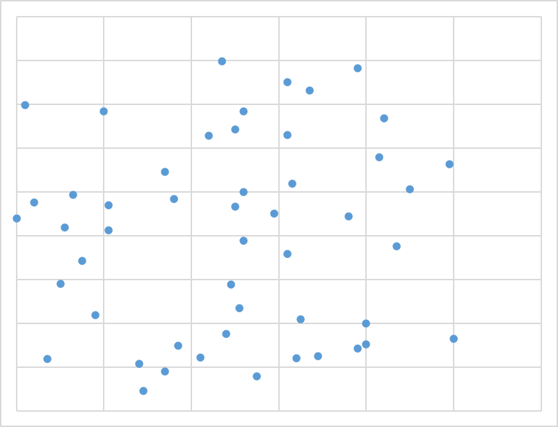
<div class="figcaption" style=" width:100%;">相関係数:0.051</div>
</div>

<div class="float" style=" width:45%;display:inline-block">
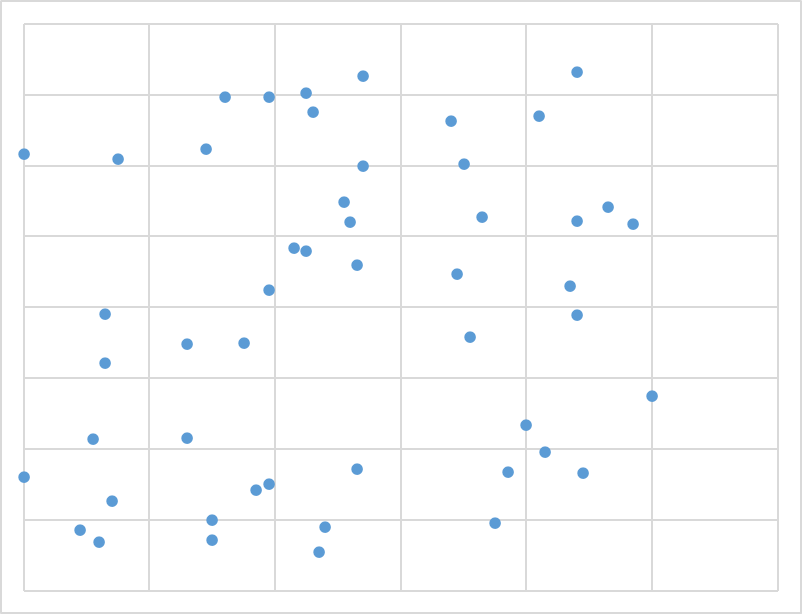
<div class="figcaption" style=" width:100%;">相関係数:0.200</div>
</div>

<div class="float" style=" width:45%;display:inline-block">
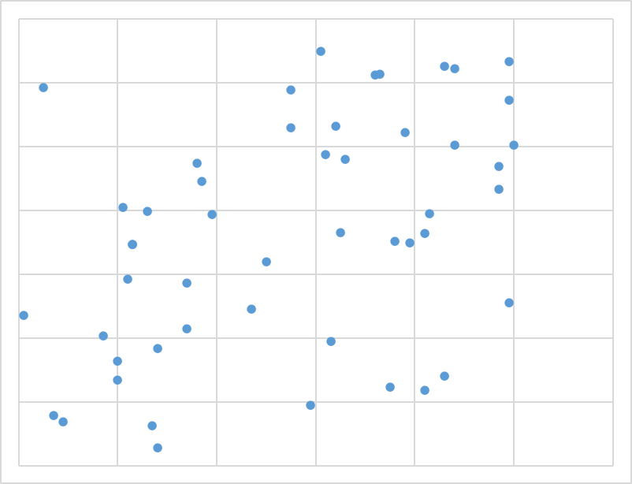
<div class="figcaption" style=" width:100%;">相関係数:0.441</div>
</div>

<div class="float" style=" width:45%;display:inline-block">
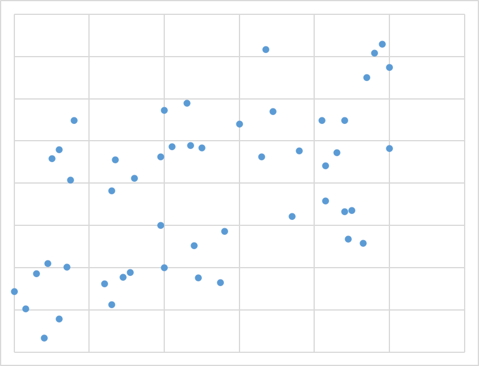
<div class="figcaption" style=" width:100%;">相関係数:0.542</div>
</div>

<div class="float" style=" width:45%;display:inline-block">
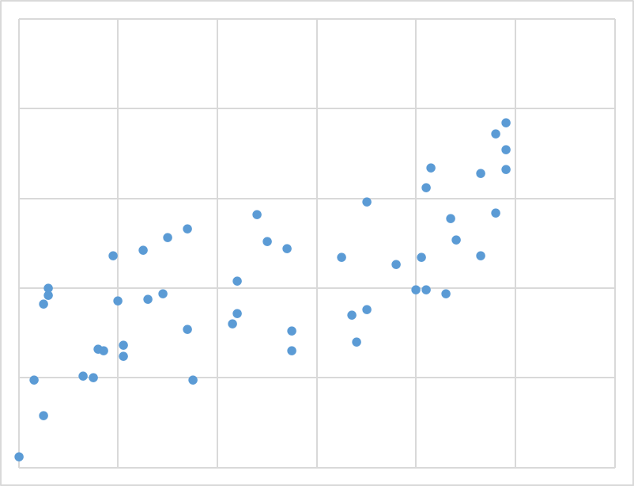
<div class="figcaption" style=" width:100%;">相関係数:0.712</div>
</div>

<div class="float" style=" width:45%;display:inline-block">
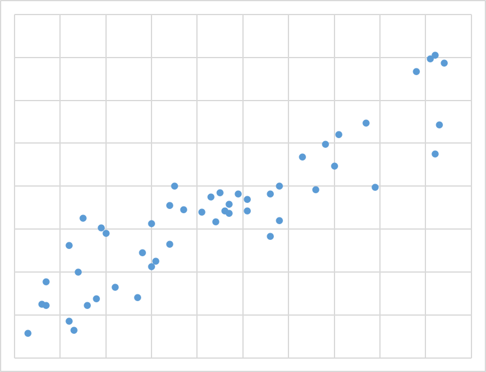
<div class="figcaption" style=" width:100%;">相関係数:0.905</div>
</div>


サンプル数50の場合では，人の目には0.7程度でようやく関係があるように見える程度であり，弱い相関とされる0.2では到底相関があるようには見えない．この程度のサンプル数であれば，相関値よりも有意性の方が重要であると言える（サンプル数50の5%有意境界値は先の表より0.279）．


# 相関行列
3つ以上の変数がある場合，ペアの組み合わせの数だけ相関係数があり得る．Rを用いればそれらを一度に計算することができ，それらは表形式で出力される．出力結果は相関行列と呼ぶ．

:::practice
次のデータは，リーダーシップに関するアンケート調査から得られたデータ（抜粋）である．[このデータ](./practice/example_09_CorMatrix.csv)を用いて，すべての変数間の相関行列を求めよ．
:::

相関行列を求める関数は`cor()`である．この関数の引数にはデータフレームを入れる．

```{r}
data <- read.csv("./practice/example_09_CorMatrix.csv")
head(data)
summary(data)
nrow(data)
cor(data)
```
相関行列は対角成分を除いて対称行列となる．また，対角成分は自分を相手とする相関なので必ず1となる．

cor()関数のそのままの出力だと小数以下の表示桁数が多くなってしまうので，以下のようにして表示桁数を制限する．
```{r}
Res<-cor(data)
print(Res, digits=3)
```


さらに，データフレームをそのまま入力すると，データフレームに含まれるすべての変数同士の相関が算出されるが，特定の変数同士の相関だけを算出したい場合には，以下のようにする[->参考](./RText_03_BasicUsage2.html#列へのアクセス)．

```{r}
Res<-cor(data[c(1,7,8,9,10)])
# 以下のようにしてもよい
# Res<-cor(data[c(1,7:10)]) # 連続している箇所をシーケンス演算子で省略表記した
# あるいは，以下のように直接変数名を書き込んでもよい．
# また下記の通り変数名を指定する際には変数名と変数名の間には改行が入っていても構わない
# Res<-cor(data[c("指導.アドバイス", 
#                 "リーダー行動", 
#                 "心理的安全",
#                 "上司への満足度", 
#                 "離職意思")])
print(Res, digits=3)
```

論文などでは，しばしば調査で用いた変数の相関行列が表形式で記述されるが，多くの場合対角成分よりも下のものだけを記述されている．

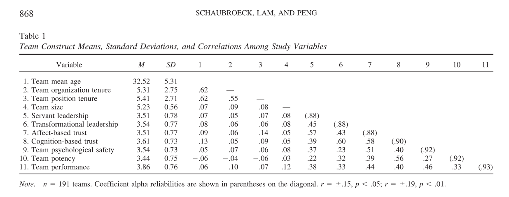
(出典:Schaubroeck, J., Lam, S. S. K., & Peng, A. C. (2011). Cognition-based and affect-based trust as mediators of leader behavior influences on team performance. Journal of Applied Psychology, 96(4), 863–871. https://doi.org/10.1037/a0022625
)

なおこの例では，相関行列と合わせて，各尺度のM（平均）とSD（標準偏差）も記述している．論文ではこのような表記の仕方をするのが一般的である．

:::ref
さらにこの例では，対角行列の1の代わりに(.88)や(.90)といった値が記述されているが，これはクロンバックの$\alpha$係数と呼ばれる統計量で，心理学的なアンケート調査（複数の質問項目の回答を集約（合算したり，平均にしたり）して一つの尺度とするもの）でよく用いられる，心理尺度の信頼性（内的整合性，合算することの妥当性）を示す指標である．この値が高いほど，その尺度が信頼性が高いとされる．一般的には0.7以上であれば信頼性が高いとされる．
:::


:::ref
<details>
<summary>相関行列の可視化</summary>

相関行列を可視化する方法として，ヒートマップが用いられることがある．ヒートマップは，相関係数の値によって色を変えて表示することで，相関係数の強さを視覚的に把握することができる．

以下のコードは，先のCSVファイルから算出した相関行列をヒートマップで表示する例である．$-1$を青，$1$を赤，$0$を白に設定し，間の値はそれに合わせてグラデーションしていくような形で表示させている．

```{r}
library(ggplot2)
library(reshape2)
data <- read.csv("./practice/example_09_CorMatrix.csv")
cor_matrix <- cor(data)
melted_cor_matrix <- melt(cor_matrix)
ggplot(melted_cor_matrix, aes(Var1, Var2, fill = value)) +
  geom_tile() +
  scale_fill_gradient2(low = "blue", high = "red", mid = "white", midpoint = 0) +
  theme_minimal() +
  theme(axis.text.x = element_text(angle = 45, hjust = 1))
```

今回の例の場合，表示がいずれも1に近いため，赤色に近い色が多くなっているが，一般的にはもっと薄い色が多い．

このようにして可視化することで，相関係数の強さを視覚的に把握することができる．
</details>
:::

# 疑似相関

数値的に関連しているからといって，実際にそれらの変数の元となる「事象」が実際に関連しているとは限らない．
<!-- 逆に相関が低いからといって，実際に相関がないとは言えない場合もある．以下でそれぞれの事例を見ていく． -->

## 例1　アイスの売上高と海辺での人身事故

アイスの売上高と海辺での人身事故は一般に高い相関係数を示す．実際に2018年～2022年の間での月次の統計値を散布図にしてみよう([参考](./RText_06_ggplot2_basicUsage.html#散布図)．なお，統計値はアイスクリームについては[総務省統計局 家計調査(月次・356アイスクリーム・シャーベット)](https://www.e-stat.go.jp/dbview?sid=0003343671)から，人身事故の発生件数は[海上保安庁の統計年報](https://www.kaiho.mlit.go.jp/doc/hakkou/toukei/)から取得した．CSVは[こちら](./practice/example_09_ice_and_accident).

```{r}
data <- read.csv("./practice/example_09_ice_and_accident.csv")
# データの確認
head(data)

# 散布図
library(ggplot2)
ggplot(data, aes(x=`アイスクリームの購入金額_世帯当たり`, y=`海浜事故発生件数_全国計`)) + 
  geom_point() + 
  labs(title="アイスの売上高と海辺での人身事故の関係", x="アイスの売上高", y="海辺での人身事故の発生件数")

```

見ての通り，非常に強い相関があることがうかがえる．
実際に相関係数を求めてみよう．
```{r}
cor(data$`アイスクリームの購入金額_世帯当たり`, data$`海浜事故発生件数_全国計`)
cor.test(data$`アイスクリームの購入金額_世帯当たり`, data$`海浜事故発生件数_全国計`)
```


以下のように高い相関となっている（当然ながら有意な相関値である）．しかし，当然ながら，アイスが売れたから海辺での人身事故が発生するわけではないし，海辺での人身事故が起こるとアイスが売れるわけでもない．このような関係を**疑似相関**と呼ぶ．

考えられるのは，気温が背後要因にある，ということである．気温が高くなるとアイスクリームの購入金額が増えるのは十分に理解できる．同様に気温が高くなると海でのレジャーに出かける人が増えるので，それに比例して事故の発生件数も増えるはずであろう．実際に2018年から2022年の[東京の月別平均気温](https://www.data.jma.go.jp/obd/stats/etrn/view/monthly_s3.php?prec_no=44&block_no=47662)とこれらのデータとの関係を図示すると以下のようになる．

```{r}
ggplot(data, aes(x=`東京の月別平均気温`, y=`アイスクリームの購入金額_世帯当たり`)) + 
  geom_point() + 
  labs(title="東京の月別平均気温とアイスの売上高の関係", x="東京の月別平均気温", y="アイスの売上高")

cor(data$`東京の月別平均気温`, data$`アイスクリームの購入金額_世帯当たり`)
```

```{r}
ggplot(data, aes(x=`東京の月別平均気温`, y=`海浜事故発生件数_全国計`)) + 
  geom_point() + 
  labs(title="東京の月別平均気温と海浜事故発生件数", x="東京の月別平均気温", y="海浜事故発生件数")

cor(data$`東京の月別平均気温`, data$`海浜事故発生件数_全国計`)
```

このように，気温とアイスの売上高，気温と海浜事故発生件数の間にも強い相関があることがわかる．このように，疑似相関は背後にある要因が同じであることが原因で生じることがある．

## 例2　コロナ感染者数とNHK受信料支払世帯

次の例を見てほしい．2021年度NHK受信料世帯支払率と都道府県別の人口あたりの新型コロナウイルス感染者数の推定値から取得した2022年10月1日時点の累計コロナ罹患者の散布図は以下となり，相関値は-0.85と非常に強い負の相関を示す．

```{r echo=FALSE}
data <- read.csv("./practice/example_09_Corona_NHK.csv")
# データの確認
#head(data)

# 散布図
library(ggplot2)
ggplot(data, aes(x=`NHK支払率`, y=`コロナ患者数`,label=`都道府県`)) + 
  geom_point() + 
  geom_text(nudge_y = 5000, check_overlap = TRUE)+
  labs(title="NHK受信料支払世帯率とコロナ感染者数の関係", x="NHK受信料支払世帯率", y="コロナ感染者数")
```

では，NHKの受信料世帯支払率とコロナ罹患者数との間に直接的な関係性があると言えるだろうか？普通に考えて，NHK受信料をキチンと支払う世帯が多くなるとコロナに罹患しなくなる，あるいは，コロナに罹患したらNHK受信料を支払わなくなる，ということは考えにくい．

これに関して考察するとすると，
まず，NHK受診料をきちんと支払う世帯が多い地域を見ていると，東北や北陸，山陰などが多い．
実際に支払い率の上位10県は以下の通りである（ちなみに福井は88.5\%で11位）．

|ランク|都道府県|支払率|
|:---:|:---:|:---:|
|1|秋田|97.9|
|2|新潟|94.9|
|3|岩手|94.6|
|4|島根|94.3|
|5|山形|93.5|
|6|鳥取|92.9|
|7|青森|92.5|
|8|富山|91.9|
|9|山口|91.1|
|10|岐阜|89.4|

これらの地域に共通しているのは高齢化率が高いことだろう．実際に[2021年（令和3年）の高齢化率についてのデータ](https://www8.cao.go.jp/kourei/whitepaper/w-2022/html/zenbun/s1_1_4.html)をもとに，高齢化率とNHK受信料支払率の相関を求めてみると，0.68と高い相関があることがわかる．社会問題の一つとして若年層がNHK受信料を支払わない（NHKを視聴しない）ことが問題視されていることから，高齢者ほどNHK受信料を真面目に払っているということは十分に考えられる．

翻って，コロナ感染については，高齢者ほど重症化しやすいと言われていたことから，コロナ対策は高齢者ほど厳格に行っていたであろうし，ワクチンの接種も高齢者を優先して進められていた．こうしたことから，高齢者が多い地域ほどコロナ感染者数が少ないということは十分に考えられる （重症患者に絞れば，逆に高齢者が多い地域ほど重症患者が多い，ということかもしれない）．

すなわち，NHK受信料支払率とコロナ感染者数は，互いに「地域の高齢化」という要因と強い関連があると考えられ，この背後要因によって，表面上，NHK受信料支払率とコロナ感染者数の間に高い相関が生じてしまっていたのではないかと考えられる．このように考えると，両者の間の相関（疑似相関）が生じた理屈として納得がいくだろう．

:::work
NHK受信料支払率とコロナ感染者数,高齢化率についてのデータ[こちら](./practice/example_09_Corona_NHK.csv)の以下の変数の組み合わせについて，散布図と相関係数をそれぞれ求めよ．

1. NHK受信料とコロナ感染者数
1. 高齢化率とNHK受信料
1. 高齢化率とコロナ感染症
:::


# 疑似相関と偏相関

このように，相関係数は単なる数値計算で算出されるものなので，理論的にはなんの直接的な関係がないものであっても高い相関が算出されることがある．このような関係のことを疑似相関と呼ぶ．
疑似相関が生じるのは，背後に別の共通要因があり，その共通要因がそれぞれと相関しているためである．

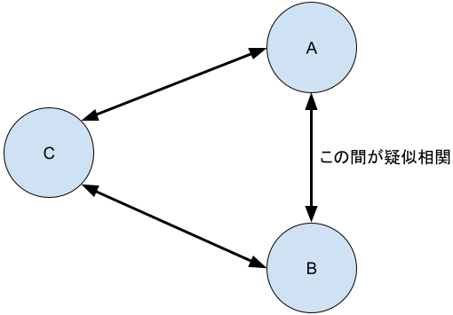


このような場合には，AとBの間の相関係数の高さは共通要因CとA，CとBのそれぞれの相関の高さに由来している．そこで，CからA，Bへの相関の影響を取り除いた，より純粋なAとBの間の相関をもとめたい．そのような場合には以下の数式を用いる．こうして得られた値のことを**偏相関**と呼ぶ．
$R_{ab}$はA-Bの相関，$R_{ca}$はC-Aの相関，$R_{cb}$はC-Bの相関とする．

$$
偏相関R_{ab|c} = \frac{R_{ab} - R_{ca}\times R_{cb}}{\sqrt{(1-R_{ca}^2)}\sqrt{(1-R_{cb}^2)}}
$$

なお，Cの相関の影響を取り除くことを「Cの影響を**統制する**」と表現する．
相関係数自体には特に因果関係の方向性はないため，上記の図で言えば，A-B間の偏相関のほか，B-C間の偏相関（Aの影響を統制），C-A間の偏相関（Bの影響を統制）という形で，3つの偏相関を考えることができる．同様に，4つの変数を見ている場合には6つの偏相関を，5つの変数を見ている場合には，10の偏相関を考えることができる．このように見ている変数の間でのペアの組み合わせの数だけ偏相関を考えることができる．

## 偏相関の算出

偏相関を求めるには，`ppcor`パッケージの`pcor()`関数もしくは`pcor.test()`関数を用いる．`pcor()`関数は，データフレームを引数に取り，そのデータフレームに含まれる変数間の偏相関行列と各偏相関の有意確率，並びに有意確率を算出するための統計量を返す．

`pcor.test()`関数は，3つの変数を引数に取り，第3引数に置いた変数の影響を統制した場合の第1引数と第2引数の両変数間の偏相関係数とその有意確率を返す．

いずれも利用にあたっては，「Tools」-\>「install.packages」から`ppcor`パッケージをインストールしてた上で，`library(ppcor)`でパッケージを読み込む必要がある．

:::practice
アイスの売上高と海辺での人身事故のデータを用いて，アイスの売上高と海辺での人身事故の間の偏相関を求めよ．
:::

```{r}
library(ppcor)
data <- read.csv("./practice/example_09_ice_and_accident.csv")
head(data)

# 普通の相関行列の算出
Res<-cor(data[c("アイスクリームの購入金額_世帯当たり","海浜事故発生件数_全国計","東京の月別平均気温")])
print(Res, digits=3)

# 偏相関行列の算出
Res.pcor<-pcor(data[c("アイスクリームの購入金額_世帯当たり","海浜事故発生件数_全国計","東京の月別平均気温")])
print(Res.pcor, digits=3)

# 偏相関の検定
pcor.test(data$`アイスクリームの購入金額_世帯当たり`, data$`海浜事故発生件数_全国計`, data$`東京の月別平均気温`)
```

結果として，元々アイスクリームの売上高と海浜事故発生件数の相関係数は0.712であったが，東京の月別平均気温の影響を統制した場合の偏相関係数は0.542となり，単純な相関係数より偏相関係数が低くなっていることがわかる．
ただ，それでもまだ強い相関値が出ているため，その他の共通要因も潜在している可能性がある．その点はさらに別なデータを用いて検証する必要があるだろう．

なお，偏相関行列を見てみると，アイスクリームの売り上げ高で統制した場合の海浜事故発生件数と気温の偏相関係数は  -0.0283という値が出ている．この結果から，海浜事故と気温の間には関係がないのではないかという主張をすることが考えられるが，これは誤りである．
あくまで因果関係として，気温が高いとアイスクリームの売上高が上がるし，気温が高いと海で遊ぶ人が増えて結果として海浜事故が増える，という関係が論理的に成り立ち得るからこそ，気温で統制した場合のアイスクリームの売上高と海浜事故発生件数の偏相関係数を算出することに意味が出てくる．
アイスクリームの売り上げで統制した場合の海浜事故発生件数と気温の偏相関係数を求める，ということは，アイスクリームの売り上げが気温と事故発生件数の共通の背後要因になっているという因果関係を想定していることとなる．そのような因果関係が成立しないのは明らかである．

このように偏相関を検討するときには，あくまで**事前にどのような変数間にどのような因果関係があるのかを理論的に考えて仮説を立てておく**ことが大切である．

:::work
先ほどのコロナ感染者数とNHK受信料支払世帯のデータについて，高齢化率を統制した場合の偏相関を求めよ．
:::

```{r eval=FALSE, include=FALSE}
data <- read.csv("./practice/example_09_Corona_NHK.csv")
head(data)
# 普通の相関行列の算出
Res<-cor(data$X2021年度NHK受信料世帯支払率,data$X2022年10月1日時点における人口100万人当たりの累計コロナ罹患者数)
print(Res, digits=3)

# 偏相関行列の算出
Res.pcor<-pcor.test(data$X2021年度NHK受信料世帯支払率,
               data$X2022年10月1日時点における人口100万人当たりの累計コロナ罹患者数, 
               data$X2021年度高齢化率)
print(Res.pcor, digits=3)
```


# 潜在していた相関関係

疑似相関は，本当は相関がないのに数値上，高い相関の値となる，という現象であるが，逆に，**本当は相関があるのに，数値上相関が低い値となる**という現象もある．

以下はシミュレーションとして作成したデータであるが，パッと見は相関がないように見えるが，色分けすると正負の相関があり，それが組み合わさったデータになっていることがわかる．

<div class="float">
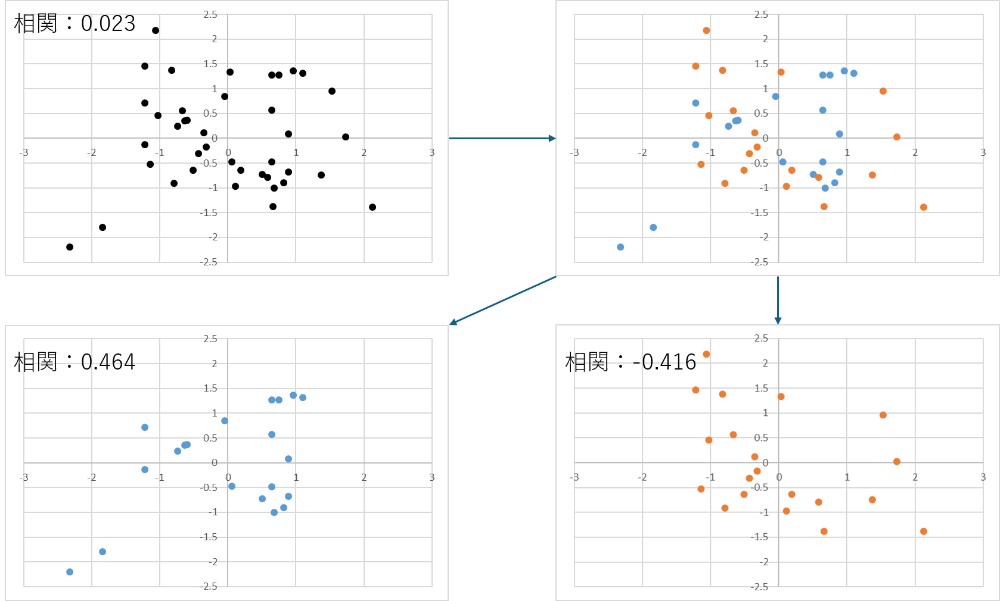
<div class="figcaption"  style="width:90%;">潜在していた相関関係</div>
</div>


具体的な例としては，日本においては低所得世帯と高所得者世帯とでは，食事の摂取カロリー量にほとんど違いはない（[平成 30 年 国民健康・栄養調査結果の概要](https://www.mhlw.go.jp/content/10900000/000688863.pdf)より），一方で，米国においては低所得世帯と高所得世帯では，食事の摂取カロリー量は低所得世帯の方が高くなりがちであると言われている（[子どもの頃の家庭環境と健康格差：肥満の要因分析](https://www.ipss.go.jp/syoushika/bunken/data/pdf/19857406.pdf)（研究論文），　[米国人の肥満率，１０年以内に５０％超える恐れ　研究報告](https://www.cnn.co.jp/fringe/35147412.html)（CNNニュースより））．こうしたデータを，「国別である」ということを考慮せずに，まとめて相関分析に掛けた場合，アメリカにおける世帯収入と摂取カロリーの相関関係が，日本の低い相関関係によって希薄化する可能性がある．

このように一見相関がないという結果になっていたとしても，ある属性でデータを切り分けてみると，それぞれの属性で逆方向の相関ががある，ということはたまにある．このため，相関分析を行う際には，手許にある生のデータを実際に眺めてみて「もしかして，この属性で分けたら相関関係が出てくるのでは？」という直感を働かせてみたり，属性ごとで散布図を描いてみるなどして，潜在していた相関関係を探ることが大切である．


:::work
[このデータ](./practice/example_09_HiddenCorrel.csv)は高校生における対人依存欲求（他者と親密な関係を築くことで自身の心の安定を得るとともに，問題に直面したときに他者に助けを求めようとする欲求）と，SNSの利用時間との関係を調べたものである．

1. このデータにhead()とsummary()を適用し，データの概要を把握せよ．
1. このデータの散布図を作成せよ．
1. このデータを用いて，対人依存欲求とSNSの利用時間の間の相関係数を求めよ．
1. このデータの「性別」を要因型に変換し，男性と女性のそれぞれのデータを抽出してsummary()を適用し，それぞれのデータの概要を把握せよ.
1. 先ほど作成した散布図を男女別に色分けした散布図にせよ．
1. 男女別で，対人依存欲求とSNSの利用時間の相関係数を求めよ．


```{r include=FALSE}
# データの作成
# 相関係数が-0.29となるようにデータを作成
library(truncnorm)
set.seed(1342)
n_m <- 161
dep_m <- round(rtruncnorm(n_m, 1, 6,2.35, 0.65), 1)
dep_m <- round((dep_m - min(dep_m) )/(max(dep_m) - min(dep_m))  * 4 + 1,1)
sns_m <- round(scale(dep_m * -0.29 + rnorm(n_m, 0, 1))*45,0) + 39.8
data_m <- data.frame(
  性別 = "男",
  対人依存欲求 = dep_m, 
  SNS利用時間=sns_m)

n_f <- 122
dep_f <- round(rtruncnorm(n_f, 1, 5,2.74,  1.09), 1)
sns_f <- round(scale(dep_f * 0.60 + rnorm(n_f, 0, 1))*35,0) + 89.9
data_f <- data.frame(
  性別="女",
  対人依存欲求=dep_f, 
  SNS利用時間=sns_f)

data <- rbind(data_m, data_f)

# データの保存
write.csv(data, "./practice/example_09_HiddenCorrel.csv", row.names = FALSE)
```

※　本データは次の論文を参考に作成した．

- [稲垣 俊介, 和田 裕一, 堀田 龍也. 高校生における対人依存欲求とインターネット利用の性差との関係. 日本教育工学会論文誌, Vol.41 (Suppl.), pp.89-92，2017.](https://www.jstage.jst.go.jp/article/jjet/41/Suppl./41_S41049/_pdf/-char/ja)

:::

# 相関係数の差の検定

相関係数の差が有意かどうかを検定することが可能である．帰無仮説は，2つの相関係数が等しいということである．
差の有意性を検定することによって，二つの要因のいずれがより強くある変数と相関しているかを比較することが可能となる．

相関の差の検定の方法には次の3つの種類がある．
いずれもcocorパッケージを用いるので，**パッケージのインストールと読み込みが必要**である．


## 独立サンプルにおける相関の差の検定
互いに異なるサンプルから得られた2つの相関係数の差が有意かどうかを検定するには，`cocor`パッケージの`cocor.indep.groups()`関数を用いる．引数は以下の通りである．

- 第1引数r1: 1つ目（比較先）の相関係数
- 第2引数r2: 2つ目（比較元）の相関係数
- 第3引数n1: 1つ目のサンプルサイズ
- 第4引数n2: 2つ目のサンプルサイズ

:::practice
ある高校の3年生（男子165名，女子181名）で，数学と英語のテストの点数についての相関を調べたところ，男性の相関係数は0.65，女性の相関係数は0.72であった．この2つの相関係数の差が有意かどうかを検定せよ．
:::

```{r}
library(cocor)

# 独立サンプルにおける相関の差の検定
cocor.indep.groups(r1=0.65, r2=0.72, n1=165, n2=181)
```
結果の表記は大きく3つのパートに分かれているが，前半は入力した値の情報が記載されているだけである．
検定結果は中段の`fisher1925`の部分にあり，この中の`p-value`が有意確率である．これが有意水準0.05より小さければ，帰無仮説を棄却し，相関係数の差が有意であると結論する（この検定のことをFisherのZ検定もしくはFisherのZ変換を用いた検定と呼ぶ）．

下段にあるのは，差の推定値の信頼区間が表記されており，今回の例の場合には，信頼区間は-0.1868から0.0423である．


## 同一サンプルにおける1つの変数が共通している相関の差の検定

1つの変数を共有した相関とは，変数J, K, Hという3つの変数があるとき，**Jを共通の変数とした(オーバーラップさせた)**  JとKの相関係数と，JとHの相関係数の差を検定することである．

この場合には，`cocor`パッケージの`cocor.dep.groups.overlap()`関数を用いる．引数は以下の通りである．

- 第1引数r.jk: 1つ目(J-K)の相関係数
- 第2引数r.jh: 2つ目(J-H)の相関係数
- 第3引数r.kh: オーバーラップさせていない変数間の相関係数
- 第4引数n: サンプルサイズ

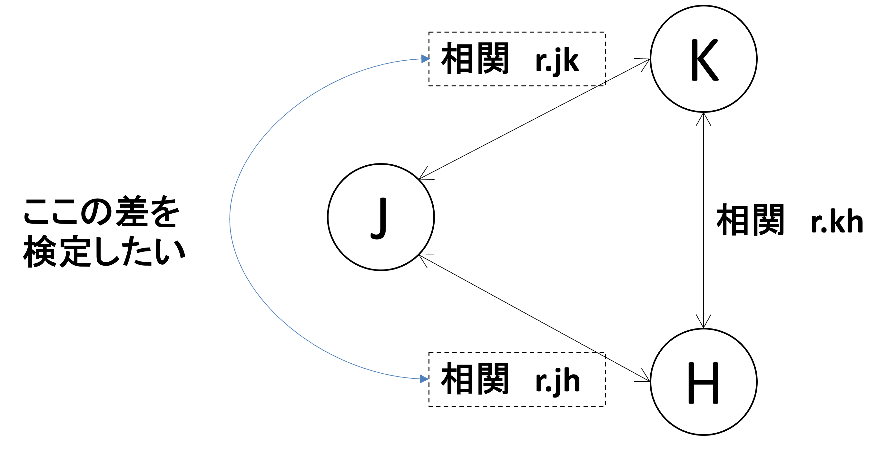


:::practice
ある高校の男子生徒165名で，数学と英語と物理のテストの点数についての相関を調べたところ，数学と英語の相関係数は0.65，数学と物理の相関係数は0.72，物理と英語の相関は0.52であった．数学と英語の相関係数と数学と物理の差が有意かどうかを検定せよ．
:::

```{r}
# 同一サンプルにおける1つの変数が共通している相関の差の検定
cocor.dep.groups.overlap(0.65, 0.72, 0.52, 165)
```

さまざまな種類の検定結果が出力されるが，この中で`steiger1980`の結果を見るのが一般的である．今回の結果だと，P値は0.1582となっており有意ではない，という結果となっている（この検定のことをStiegerのZ検定と呼ぶ）．

加えて，一番下の段 (`zou2007`)には，差の推定値の信頼区間が表記されている．今回の例の場合には，信頼区間は- -0.1712から0.0272となっている．

## 同一サンプルにおける互いに異なる変数間の相関の差の検定

同一サンプルにおいて，互いに異なる変数間の相関の差（J-K間の相関とH-M間の相関）が有意かどうかを検定する場合には，`cocor`パッケージの`cocor.dep.groups.nonoverlap()`関数を用いる．引数は以下の通りである．

- 第1引数r.jk: 1つ目(J-K)の相関係数
- 第2引数r.hm: 2つ目(H-M)の相関係数
- 第3引数r.jh: J-H間の相関係数
- 第4引数r.jm: J-M間の相関係数
- 第5引数r.kh: K-H間の相関係数
- 第6引数r.km: K-M間の相関係数
- 第7引数n: サンプルサイズ

与えなければならない引数が多く，この順番が入れ替わると結果もかわってしまうので注意が必要である．それぞれの引数の添え字に注意してほしい．


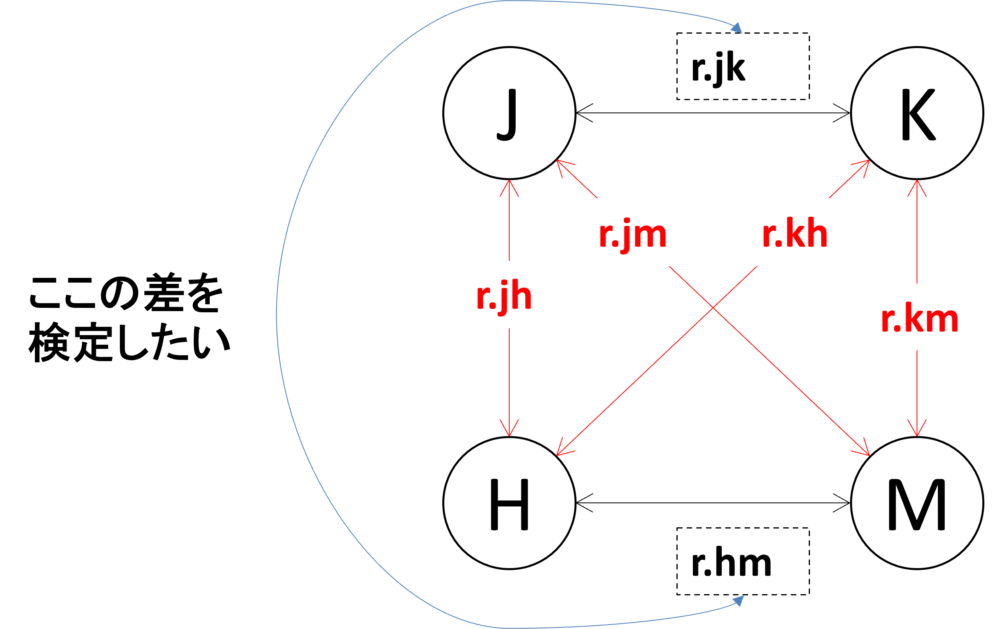


:::practice
ある高校の女子生徒181名で，数学と物理と英語と国語の点数の相関を調べたところ，次のような表となった．


```{r echo=FALSE}
# クロス集計表の作成
mydata_cross <- matrix(c(c(1, 0.41, 0.53, 0.32),
                         c(" ",1,0.62,0.43),
                         c(" "," ",1,0.72),
                         c(" "," "," ",1)), nrow=4)
#mydata_corss <- t(mydata_cross)
colnames(mydata_cross) <- c("数学", "物理", "英語", "国語")
rownames(mydata_cross) <- c("数学", "物理", "英語", "国語")
mydata_cross <- as.table(mydata_cross)


knitr::kable(mydata_cross, format = "html", table.attr = "class='custom-table'")


```


数学と物理の相関係と，英語と国語の相関の差が有意かどうか検定せよ．
:::

この場合，数学がJ，物理がK,英語がH，国語がMだと考えればよい．

```{r}
# 同一サンプルにおける互いに異なる変数間の相関の差の検定
cocor.dep.groups.nonoverlap(r.jk=0.42, r.hm=0.72,
                            r.jh=0.53, r.jm=0.32,
                            r.kh=0.62, r.km=0.43,
                            181)
```

結果は`steiger1980`のP値を読み取る．今回の例だと0.0000となっていおり，0.1%の有意水準でも有意ということになる（必ずしもP=0というわけではなく，小数第4位までは0であった，ということである）．

これまでと同様に最下部には差の推定値の信頼区間が表記されている．

## 多重比較

平均や分散，比率の比較のときと同様に，3つ以上の相関係数の比較を行う場合には，多重比較の考え方を導入する．すなわち，まずは一対比較を行い，その後，p.adjust()関数を用いて多重比較の補正を行う．

## 偏相関の有意差検定
たとえば，J-KとJ-Hの間の相関を比較したい場合に，その背後で別の変数ZがJ-K，J-Hの相関に影響を与えている場合には，Zを統制した偏相関を求め，その差の有意性を検定することができる．その方法は，単にZを統制したJ-K，J-Hの偏相関を求め，その偏相関を上記の`cocor.indep.groups()`や`cocor.dep.groups.overlap()`，`cocor.dep.groups.nonoverlap()`にそれぞれ代入すればよい．

:::work
ある組織で従業員満足度調査として，従業員323名（課長級以上の管理職は除く）に対して以下の項目について調査した．

- Q1: 直属の上司のリーダーシップの評価（7段階評価）
- Q2: 自身の職務内容に対する満足度（7段階評価）
- Q3: 自身の給与に対する満足度（7段階評価）
- Q4: 所属している部署の雰囲気に対する満足度（7段階評価）
- F1: 所属部署（13の部署からの選択）
- F2: 性別（男女）
- F3: 年齢（20歳から65歳まで5年区切り）

その結果，[次のようなデータ](./practice/09_work_Cor.csv)が得られた．このデータについて以下の課題を行え．

- Q1からQ4について，部署ごとの平均と標準偏差を求めよ（[参考](./RText_04_DescriptiveStatisitcs.html#グループごとの統計量の算出)）．
- Q1からQ4について，データ全体での相関行列を求めよ．
- データ全体でのQ1とQ2の相関とQ1とQ3の相関に有意な差があるかどうかを検定せよ．
― 営業部におけるQ1からQ4の相関行列を求めよ．
- 営業部におけるQ1とQ4の相関と，開発部におけるQ1とQ4の相関に有意な差があるかどうかを検定せよ．
― 営業部におけるQ1とQ4の相関と，同じく営業部におけるQ2とQ3の相関に有意な差があるかどうかを検定せよ．

```{r include=FALSE}
# データの作成
## 経理部
## 人事部
## 総務部
## 営業部
## 流通管理部
## 開発部
## 情報システム管理部
## 製造部
## マーケティング部
## 資材調達部
## 品質管理部
## 法務部
## 経営企画室

library(truncnorm)
set.seed(34)

n <- 323
所属名 <- c("経理部","人事部","総務部","営業部","流通管理部","開発部","情報システム管理部","製造部","マーケティング部","資材調達部","品質管理部","法務部","経営企画室")

部署人数 <-c("経理部"=15,
       "人事部"=12,
       "総務部"=12,
       "営業部"=50,
       "流通管理部"=20,
       "開発部"=25,
       "情報システム管理部"=18,
       "製造部"=100,
       "マーケティング部"=20,
       "資材調達部"=18,
       "品質管理部"=15,
       "法務部"=8,
       "経営企画室"=10)

# 年齢
年齢 <- c("20-24","25-29","30-34","35-39","40-44","45-49","50-54","55-59","60-64","65-69")

# 年齢ごとの人数
年齢人数 <-c("20-24"=35,
       "25-29"=34,
       "30-34"=35,
       "35-39"=36,
       "40-44"=35,
       "45-49"=28,
       "50-54"=31,
       "55-59"=41,
       "60-64"=40,
       "65-69"=8)

#性別
性別 <- c("男"=195, "女"=128)

#平均とSDのパラメータ
dparam <- list(
  経理=c(q1.m=4.0, q1.sd=2.3, q2.m=3.5, q2.sd=2.0, q3.m=3.2, q3.sd=2.5, q4.m=5.0, q4.sd=2.3),
  人事=c(q1.m=4.2, q1.sd=2.1, q2.m=4.5, q2.sd=2.0, q3.m=4.2, q3.sd=2.5, q4.m=4.5, q4.sd=2.3),
  総務=c(q1.m=3.8, q1.sd=2.5, q2.m=3.5, q2.sd=2.0, q3.m=3.2, q3.sd=2.5, q4.m=3.0, q4.sd=2.3),
  営業=c(q1.m=4.5, q1.sd=2.0, q2.m=4.0, q2.sd=2.0, q3.m=3.7, q3.sd=2.5, q4.m=3.0, q4.sd=3.3),
  流通=c(q1.m=4.3, q1.sd=2.2, q2.m=4.0, q2.sd=2.0, q3.m=3.7, q3.sd=2.5, q4.m=4.0, q4.sd=2.3),
  開発=c(q1.m=4.1, q1.sd=2.4, q2.m=4.5, q2.sd=2.0, q3.m=4.2, q3.sd=2.5, q4.m=5.0, q4.sd=2.3),
  情報=c(q1.m=4.2, q1.sd=2.3, q2.m=3.5, q2.sd=2.0, q3.m=3.2, q3.sd=2.5, q4.m=4.0, q4.sd=2.3),
  製造=c(q1.m=4.0, q1.sd=2.3, q2.m=4.0, q2.sd=2.0, q3.m=3.7, q3.sd=2.5, q4.m=4.5, q4.sd=3.3),
  マー=c(q1.m=4.5, q1.sd=2.0, q2.m=4.5, q2.sd=2.0, q3.m=4.2, q3.sd=2.5, q4.m=4.0, q4.sd=2.3),
  資材=c(q1.m=4.3, q1.sd=2.2, q2.m=3.5, q2.sd=2.0, q3.m=3.2, q3.sd=2.5, q4.m=4.0, q4.sd=2.3),
  品質=c(q1.m=4.1, q1.sd=2.4, q2.m=3.5, q2.sd=2.0, q3.m=3.2, q3.sd=2.5, q4.m=3.5, q4.sd=2.3),
  法務=c(q1.m=4.2, q1.sd=2.3, q2.m=4.5, q2.sd=2.0, q3.m=4.5, q3.sd=2.5, q4.m=5.0, q4.sd=2.3),
  経営=c(q1.m=4.0, q1.sd=2.3, q2.m=4.5, q2.sd=2.0, q3.m=4.5, q3.sd=2.5, q4.m=5.0, q4.sd=2.3)  
)

#相関のパラメータ設定
rparam <- list(
  経理=c(r_q2q1=0.25, r_q3q1=0.1, r_q3q2=0.3, r_q4q1=0.5, r_q4q2=0.3, r_q4q3=0.2),
  人事=c(r_q2q1=0.32, r_q3q1=0.1, r_q3q2=0.3, r_q4q1=0.5, r_q4q2=0.2, r_q4q3=0.2),
  総務=c(r_q2q1=0.35, r_q3q1=0.1, r_q3q2=0.3, r_q4q1=0.5, r_q4q2=0.2, r_q4q3=0.1),
  営業=c(r_q2q1=0.40, r_q3q1=0.1, r_q3q2=0.2, r_q4q1=0.2, r_q4q2=0.3, r_q4q3=0.2),
  流通=c(r_q2q1=0.32, r_q3q1=0.1, r_q3q2=0.3, r_q4q1=0.2, r_q4q2=0.2, r_q4q3=0.2),
  開発=c(r_q2q1=0.20, r_q3q1=0.1, r_q3q2=0.4, r_q4q1=0.4, r_q4q2=0.3, r_q4q3=0.2),
  情報=c(r_q2q1=0.25, r_q3q1=0.1, r_q3q2=0.2, r_q4q1=0.5, r_q4q2=0.2, r_q4q3=0.2),
  製造=c(r_q2q1=0.40, r_q3q1=0.1, r_q3q2=0.2, r_q4q1=0.4, r_q4q2=0.3, r_q4q3=0.2),
  マー=c(r_q2q1=0.31, r_q3q1=0.1, r_q3q2=0.3, r_q4q1=0.3, r_q4q2=0.3, r_q4q3=0.2),
  資材=c(r_q2q1=0.28, r_q3q1=0.1, r_q3q2=0.2, r_q4q1=0.4, r_q4q2=0.2, r_q4q3=0.1),
  品質=c(r_q2q1=0.32, r_q3q1=0.1, r_q3q2=0.2, r_q4q1=0.4, r_q4q2=0.3, r_q4q3=0.2),
  法務=c(r_q2q1=0.20, r_q3q1=0.1, r_q3q2=0.1, r_q4q1=0.3, r_q4q2=0.2, r_q4q3=0.1),
  経営=c(r_q2q1=0.40, r_q3q1=0.1, r_q3q2=0.4, r_q4q1=0.4, r_q4q2=0.3, r_q4q3=0.2)
)


# 部署別のデータ作成
for(i in 1:length(所属名)){
  n <- 部署人数[i]
  q1.m<- dparam[[i]]["q1.m"] 
  q1.sd<- dparam[[i]]["q1.sd"] 
  q2.m<- dparam[[i]]["q1.m"] 
  q2.sd<- dparam[[i]]["q1.sd"] 
  q3.m<- dparam[[i]]["q1.m"] 
  q3.sd<- dparam[[i]]["q1.sd"] 
  q4.m<- dparam[[i]]["q1.m"] 
  q4.sd<- dparam[[i]]["q1.sd"] 
  
  r_q2q1<- rparam[[i]]["r_q2q1"] 
  r_q3q1<- rparam[[i]]["r_q3q1"] 
  r_q3q2<- rparam[[i]]["r_q3q2"] 
  r_q4q1<- rparam[[i]]["r_q4q1"] 
  r_q4q2<- rparam[[i]]["r_q4q2"]
  r_q4q3<- rparam[[i]]["r_q4q3"]
  
  F1 <- rep(所属名[i], n)
  F2 <- sample(年齢, n, replace = TRUE, prob = 年齢人数/323)
  F3 <- sample(c("男","女"), n, replace = TRUE, prob=性別/323)
  Q1 <- rnorm(n, q1.m, q1.sd)
  Q2 <- scale(r_q2q1*scale(Q1)                                  +(1+r_q2q1              )*rnorm(n))*q2.sd+q2.m
  Q3 <- scale(r_q3q1*scale(Q1)+r_q3q2*scale(Q2)                 +(0.7+r_q3q1+r_q3q2       )*rnorm(n))*q3.sd+q3.m
  Q4 <- scale(r_q4q1*scale(Q1)+r_q4q2*scale(Q2)+r_q4q3*scale(Q3)+(0.5+r_q4q1+r_q4q2+r_q4q3)*rnorm(n))*q4.sd+q4.m
  
  if(i==1){
    data <- data.frame(Q1=Q1, Q2=Q2, Q3=Q3, Q4=Q4, F1=factor(F1), F2=factor(F2), F3=factor(F3))
  }else{
    data <- rbind(data, data.frame(Q1=Q1, Q2=Q2, Q3=Q3, Q4=Q4, F1=factor(F1), F2=factor(F2), F3=factor(F3)))
  }
}

# 数値を7段階に戻す
data$Q1 <- round((data$Q1-min(data$Q1))/(max(data$Q1)-min(data$Q1))*6+1,0)
data$Q2 <- round((data$Q2-min(data$Q2))/(max(data$Q2)-min(data$Q2))*6+1,0)
data$Q3 <- round((data$Q3-min(data$Q3))/(max(data$Q3)-min(data$Q3))*6+1,0)
data$Q4 <- round((data$Q4-min(data$Q4))/(max(data$Q4)-min(data$Q4))*6+1,0)

#データの確認
summary(data)

#クロス集計表の確認
table(data$F1, data$F2)
table(data$F1, data$F3)

#相関の確認
cor(data[c("Q1","Q2","Q3","Q4")])

# データの保存
write.csv(data, "./practice/09_work_Cor.csv", row.names = FALSE)
```

```{r include=FALSE}
# 部署別の平均と標準偏差
data <- read.csv("./practice/09_work_Cor.csv")
data$F1 <- as.factor(data$F1)
data$F2 <- as.factor(data$F2)
data$F3 <- as.factor(data$F3)

data %>%
  group_by(F1) %>%
  summarise_at(vars(Q1:Q4), list(mean=mean, sd=sd))%>%
  print()


# F1因子でデータをグループ化し、Q1～Q4の相関行列を計算
correlation_matrices <- data %>%
  group_by(F1) %>%
  summarise(correlation_matrix =  list(cor(across(Q1:Q4)))) %>%  print()

psych::describeBy(data[c("Q1","Q2","Q3","Q4")], group=data$F1)


```

:::