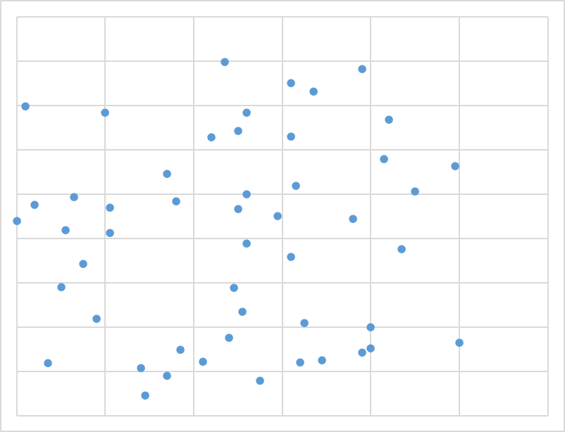
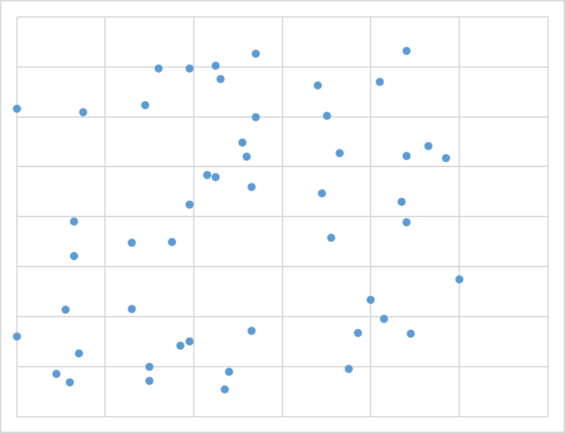
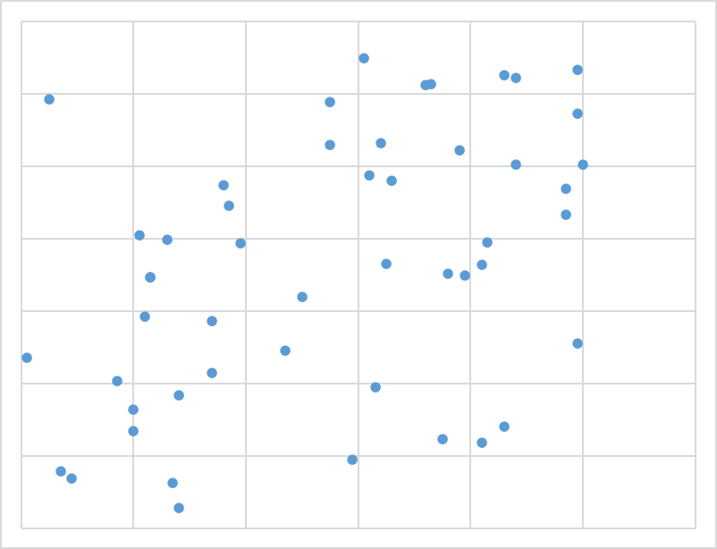
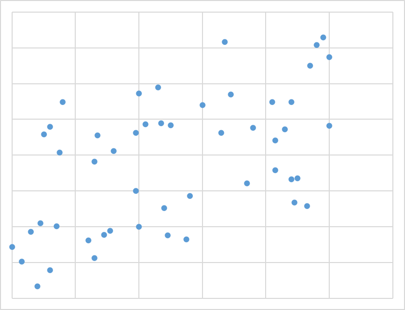
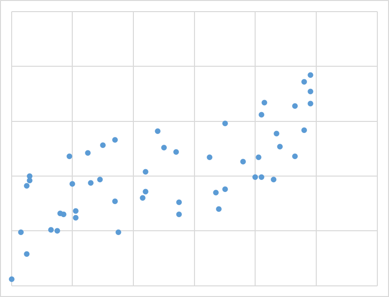
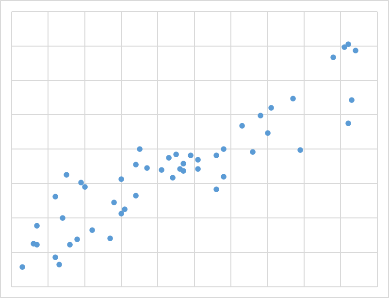
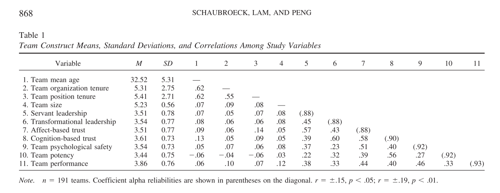
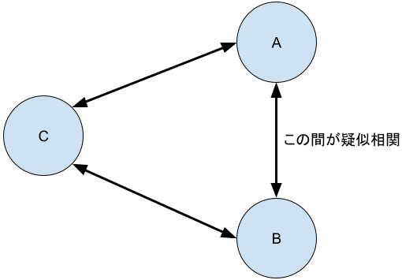
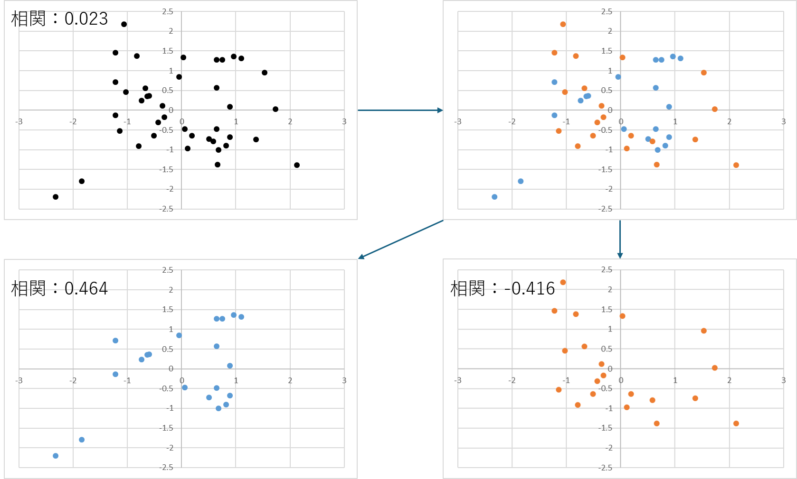

```{r setup, include=FALSE}
knitr::opts_chunk$set(echo = TRUE)
```

```{css, eval=FALSE, echo=FALSE}
.tocify-subheader { /* 全部のサブヘッダーを最初から表示する*/
    display: block !important;
}
.tocify-item {/*長いヘッダーも折り返さない*/
    white-space: nowrap;
}

body{
  counter-reset: ref_number practice_number work_number;
}

.float img{
  /* 上右下左 */
  /* margin: 5% 0% 0% 0% ;*/
  /* width : 75%; */
  margin: auto;
  display: block;

  border-radius: 8px 8px 0 0 ;
  position: relative;
  width : 60%;
}

.float .figcaption {
  position: relative;
  font-style: italic;
  font-size: large;
  font-weight: bold;
  color: #666;
  text-align: center;
  margin:0% auto 5% auto;
  border-bottom: solid 1px #666;
  border-left: solid 1px #666;
  border-right: solid 1px #666;
  border-radius:0 0 8px 8px;
  width : 60%
}

img {
  margin: auto;
  display: block;
  border: solid 1px #666;
  border-radius: 8px;
  position: relative;
  width : 75%;
}

.ref {
  position: relative;
  margin:5%;
  padding:5px;
  background-color: rgba(255, 255, 128, .5);
  color: #666;
}
.ref::before{
  counter-increment: ref_number 1;
  content: "[参考 " counter(ref_number) "]";
  font-weight: bold;
  display: block;
  margin-bottom: 3px;
}

h1 {
  margin-top : 10px;
  padding-top : 50px;
}

.practice {
  position: relative;
  margin:5%;
  padding:5px;
  background-color: rgba(128, 255, 200, .5);
  color: #666;
}
.practice::before{
  counter-increment: practice_number 1;
  content: "[例題 " counter(practice_number) "]";
  font-weight: bold;
  display: block;
  margin-bottom: 3px;
}


.work {
  position: relative;
  margin:5%;
  padding:5px;
  background-color: rgba(128, 200, 255, .2);
  color: #666;
}
.work::before{
  counter-increment: work_number 1;
  content: "[課題 " counter(work_number) "]";
  font-weight: bold;
  display: block;
  margin-bottom: 3px;
}


.r{
　/**copy の禁止**/
  user-select: none;
  -moz-user-select: none;
  -webkit-user-select: none;
  -ms-user-select: none;
  -khtml-user-select: none;
  -webkit-touch-callout: none;
}


.res_table {
  border-collapse: collapse;
  width: 50%;
  margin: 0 auto;
  border-top: 1px solid #666;
  border-bottom: 1px solid #666;
}
.res_table th {
  border-bottom: 1px solid #666;
  text-align: center;
}

.res_table td {
  text-align: right;
}
.res_table .td_left {
  text-align: left;
}
.res_table .tr_topborder {
  border-top: 1px solid #666;
}

```


# 相関分析

「ある変数Aの値が上がると、他の変数Bの値も上がる」「ある変数Aの値が上がると、他の変数Bの値は下がる」といったように、2つの変数の動きが連動しているような場合、その変数の間にある関係性の強さを数値で表したものを**相関係数**と呼び、相関係数を計算したり、その有意性を評価したりすることを**相関分析**と呼ぶ。

## 相関係数

相関係数を算出する式は以下の通りである．

$$
\begin{align}
R_{ab} &= \frac{aとbの共分散}{{aの標準偏差}\times{bの標準偏差}}\\\\  & = \frac{\frac{1}{n}\sum_{i=1}^{n} (a_i - \bar{a})(b_i - \bar{b})}{\sqrt{\frac{1}{n}\sum_{i=1}^{n} (a_i - \bar{a})^2}\sqrt{\frac{1}{n} \sum_{i=1}^{n} (b_i - \bar{b})^2}}\\
\\
& = \frac{\sum_{i=1}^{n} (a_i - \bar{a})(b_i - \bar{b})}{\sqrt{\sum_{i=1}^{n} (a_i - \bar{a})^2}\sqrt{\sum_{i=1}^{n} (b_i - \bar{b})^2}}
\end{align}
$$


数式そのものはそこそこ複雑な数式であるが、Rで相関を算出するのは極めて簡単である．以下のような例題を考えよう．

:::practice
次のデータは，ある高校の生徒数学と英語のテストの点数である．[このデータ](./practice/example_09_Correl.csv)を用いて，数学と英語の点数の相関係数を求めよ．


```{r include=FALSE}
#./practice/example_09_Correl.csvの作成
set.seed(123)
math <- round(rnorm(100, mean=60, sd=10),0)
english <- round(math + rnorm(100, mean=0, sd=5),0)
data <- data.frame(math, english)
write.csv(data, file = "./practice/example_09_Correl.csv", row.names = FALSE)
```

:::

相関係数を算出する関数は`cor()`である．この関数の引数には互いの相関を求めたい変数のベクトルがそれぞれ入る．
```{r}
data <- read.csv("./practice/example_09_Correl.csv")
cor(data$math, data$english)
```

なお，出力させる際に桁数を制限したい場合には以下のようにすればよい（->[【参考】](./RText_02_BasicUsage.html#print()関数))．

```{r}
Res<-cor(data$math, data$english)
print(Res, digits=3)
```

## 相関係数の解釈

分野によって数値の見方は多少異なるが一般的には以下の基準が用いられる（負の場合には絶対値で考える）。

|相関係数|解釈|
|:---:|:---:|
|0.7~8以上|強い相関|
|0.5から0.7~8|中程度の相関|
|0.2~3から0.5|弱い相関|
|0.2~3未満|実質的に無相関|

ただし、人の心理を扱う場合には、色々な外的影響が想定されることから、基本的に高い相関値となることはあり得ないため、以下のような基準で評価される。

|相関係数|解釈|
|:---:|:---:|
|0.5以上|強い相関|
|0.3～0.5|中程度の相関|
|0.1~0.3|弱い相関|
|0.1未満|実質的に無相関|


## 相関係数の有意性

相関係数の有意検定とは「両者の相関係数は本当は０（無相関）である」ということを帰無仮説とする検定である。Pが0.05を下回っていれば帰無仮説を棄却して「両者の間に有意な相関がある」と結論付ける。逆にP>=0.05であった場合には「両者は本当は無相関である可能性は否定できない」という結論となる。
相関係数の有意性を確認するにはcor.test()関数を用いる．

:::practice
先の例題において，数学と英語の点数の相関係数の有意性を確認せよ．
:::

```{r}
cor.test(data$math, data$english)
```

この結果から，例題の数学と英語の点数の相関係数は，p値が0.05よりも小さいため，有意な相関があると結論付けられる．

:::ref
`2.2e-16`や`1.34e+5`などの表記は，数字の桁数が大きい場合に用いられる表記であり，`2.2e-16`は$2.2 \times 10^{-16}$（つまり小数第15位まで0がずっと続いている数字）を，`1.34e+5`は$1.34 \times 10^{5}$を意味する．

今回の例のように`<2.2e-16`となっている場合は，p値が$2.2 \times 10^{-16}$
よりも小さいことを意味し，非常に小さな値であることを示している．
:::

注意しないといけないのは、相関係数が有意である、というのは単に「本当の相関は0ではない」という意味でしかない。また、サンプルサイズが100より大きくなると（心理学分野でも500より大きくなると）相関係数が実質的に相関がないという値でも5%水準で有意になり得る。従って、サンプルサイズが大きい場合には、相関係数の有意性の評価に大した意義はなく、数値そのものからの実質的な相関の有無を評価すべきである。


なお、相関係数の有意性はサンプル数だけで決まるので、以下の表を用いて、算出された相関の値が表の値よりも大きな値になっていれば、5%水準、もしくは1%水準で相関係数が有意である、ということができる。


```{r eval=FALSE, include=FALSE}
# 必要な関数を定義
t_to_r <- function(t, n) {
  return (t / sqrt(t^2 + (n - 2)))
}

# サンプルサイズの範囲
sample_sizes <- c(3:40,45,50,60,70,80,90,100,125,150,175,200,250,300,400,500,750,1000)

# 結果を格納するリスト
results <- data.frame(SampleSize = integer(), 
  R_95 = numeric(), 
  R_99 = numeric())

# サンプル数ごとに境界値を計算
for (n in sample_sizes) {
  df <- n - 2  # 自由度
  
  # 95%および99%水準のt値を計算
  t_95 <- qt(1 - 0.05 / 2, df)
  t_99 <- qt(1 - 0.01 / 2, df)
  
  # 相関係数に変換
  r_95 <- t_to_r(t_95, n)
  r_99 <- t_to_r(t_99, n)
  
  # 結果を追加
  results <- rbind(results, data.frame(SampleSize = n, R_95 = round(r_95, 3), R_99 = round(r_99, 3)))
}

# マークダウン形式で出力
cat("## 相関係数の有意境界値 (95%と99%)\n")
cat("| サンプルサイズ | 95% 有意境界値 | 99% 有意境界値 |\n")
cat("|----------------|----------------|----------------|\n")
for (i in 1:nrow(results)) {
  cat(sprintf("| %13d | %15.3f | %15.3f |\n", 
    results$SampleSize[i], 
    results$R_95[i], 
    results$R_99[i]))
}

```


| サンプル数 | 5%有意境界  | 1%有意境界  || サンプル数 | 5%有意境界  | 1%有意境界  |
|:---:|---:|---:|-----|:---:|---:|---:|
|   3 | 0.997 | 1.000 ||  31 | 0.355 | 0.456 |
|   4 | 0.950 | 0.990 ||  32 | 0.349 | 0.449 |
|   5 | 0.878 | 0.959 ||  33 | 0.344 | 0.442 |
|   6 | 0.811 | 0.917 ||  34 | 0.339 | 0.436 |
|   7 | 0.754 | 0.875 ||  35 | 0.334 | 0.430 |
|   8 | 0.707 | 0.834 ||  36 | 0.329 | 0.424 |
|   9 | 0.666 | 0.798 ||  37 | 0.325 | 0.418 |
|  10 | 0.632 | 0.765 ||  38 | 0.320 | 0.413 |
|  11 | 0.602 | 0.735 ||  39 | 0.316 | 0.408 |
|  12 | 0.576 | 0.708 ||  40 | 0.312 | 0.403 |
|  13 | 0.553 | 0.684 ||  45 | 0.294 | 0.380 |
|  14 | 0.532 | 0.661 ||  50 | 0.279 | 0.361 |
|  15 | 0.514 | 0.641 ||  60 | 0.254 | 0.330 |
|  16 | 0.497 | 0.623 ||  70 | 0.235 | 0.306 |
|  17 | 0.482 | 0.606 ||  80 | 0.220 | 0.286 |
|  18 | 0.468 | 0.590 ||  90 | 0.207 | 0.270 |
|  19 | 0.456 | 0.575 || 100 | 0.197 | 0.256 |
|  20 | 0.444 | 0.561 || 125 | 0.176 | 0.230 |
|  21 | 0.433 | 0.549 || 150 | 0.160 | 0.210 |
|  22 | 0.423 | 0.537 || 175 | 0.148 | 0.194 |
|  23 | 0.413 | 0.526 || 200 | 0.139 | 0.182 |
|  24 | 0.404 | 0.515 || 250 | 0.124 | 0.163 |
|  25 | 0.396 | 0.505 || 300 | 0.113 | 0.149 
|  26 | 0.388 | 0.496 || 400 | 0.098 | 0.129 |
|  27 | 0.381 | 0.487 || 500 | 0.088 | 0.115 |
|  28 | 0.374 | 0.479 || 750 | 0.072 | 0.094 |
|  29 | 0.367 | 0.471 ||1000 | 0.062 | 0.081 |


## 相関係数と散布図

実際に見た目がどの程度の時に、どの程度の相関値となるかを示したのが以下のグラフである。いずれも50サンプルのデータを用いている。

<div class="float" style=" width:45%;display:inline-block">

<div class="figcaption" style=" width:100%;">相関係数:0.051</div>
</div>

<div class="float" style=" width:45%;display:inline-block">

<div class="figcaption" style=" width:100%;">相関係数:0.200</div>
</div>

<div class="float" style=" width:45%;display:inline-block">

<div class="figcaption" style=" width:100%;">相関係数:0.441</div>
</div>

<div class="float" style=" width:45%;display:inline-block">

<div class="figcaption" style=" width:100%;">相関係数:0.542</div>
</div>

<div class="float" style=" width:45%;display:inline-block">

<div class="figcaption" style=" width:100%;">相関係数:0.712</div>
</div>

<div class="float" style=" width:45%;display:inline-block">

<div class="figcaption" style=" width:100%;">相関係数:0.905</div>
</div>


サンプル数50の場合では，人の目には0.7程度でようやく関係があるように見える程度であり、弱い相関とされる0.2では到底相関があるようには見えない。この程度のサンプル数であれば，相関値よりも有意性の方が重要であると言える（サンプル数50の5%有意境界値は先の表より0.279）。


## 相関行列
3つ以上の変数がある場合、ペアの組み合わせの数だけ相関係数があり得る。Rを用いればそれらを一度に計算することができ、それらは表形式で出力される。出力結果は相関行列と呼ぶ。

:::practice
次のデータは，リーダーシップに関するアンケート調査から得られたデータ（抜粋）である．[このデータ](./practice/example_09_CorMatrix.csv)を用いて，すべての変数間の相関行列を求めよ．
:::

相関行列を求める関数は`cor()`である．この関数の引数にはデータフレームを入れる．

```{r}
data <- read.csv("./practice/example_09_CorMatrix.csv")
cor(data)
```
相関行列は対角成分を除いて対称行列となる。また、対角成分は自分を相手とする相関なので必ず1となる。

cor()関数のそのままの出力だと小数以下の表示桁数が多くなってしまうので、以下のようにして表示桁数を制限する．
```{r}
Res<-cor(data)
print(Res, digits=3)
```


さらに，データフレームをそのまま入力すると，データフレームに含まれるすべての変数同士の相関が算出されるが，特定の変数同士の相関だけを算出したい場合には，以下のようにする[->参考](./RText_03_BasicUsage2.html#列へのアクセス)．

```{r}
Res<-cor(data[c(1,7,8,9,10)])
# 以下のようにしてもよい
# Res<-cor(data[c(1,7:10)]) # 連続している箇所をシーケンス演算子で省略表記した
# あるいは，以下のように直接変数名を書き込んでもよい．
# また下記の通り変数名を指定する際には変数名と変数名の間には改行が入っていても構わない
# Res<-cor(data[c("指導.アドバイス", 
#                 "リーダー行動", 
#                 "心理的安全",
#                 "上司への満足度", 
#                 "離職意思")])
print(Res, digits=3)
```

論文などでは，しばしば調査で用いた変数の相関行列が表形式で記述されるが，多くの場合対角成分よりも下のものだけを記述されている．


(出典:Schaubroeck, J., Lam, S. S. K., & Peng, A. C. (2011). Cognition-based and affect-based trust as mediators of leader behavior influences on team performance. Journal of Applied Psychology, 96(4), 863–871. https://doi.org/10.1037/a0022625
)

なおこの例では，相関行列と合わせて，各尺度のM（平均）とSD（標準偏差）も記述している．論文ではこのような表記の仕方をするのが一般的である．

:::ref
さらにこの例では，対角行列の1の代わりに(.88)や(.90)といった値が記述されているが，これはクロンバックの$\alpha$係数と呼ばれる統計量で，心理学的なアンケート調査（複数の質問項目の回答を集約（合算したり，平均にしたり）して一つの尺度とするもの）で良く用いられる，心理尺度の信頼性（内的整合性，合算することの妥当性）を示す指標である。この値が高いほど，その尺度が信頼性が高いとされる．一般的には0.7以上であれば信頼性が高いとされる．
:::


:::ref
**相関行列の可視化**

相関行列を可視化する方法として，ヒートマップが用いられることがある．ヒートマップは，相関係数の値によって色を変えて表示することで，相関係数の強さを視覚的に把握することができる．

以下のコードは，先のCSVファイルから算出した相関行列をヒートマップで表示する例である．$-1$を青，$1$を赤，$0$を白に設定し，間の値はそれに合わせてグラデーションしていくような形で表示させている．

```{r}
library(ggplot2)
library(reshape2)
data <- read.csv("./practice/example_09_CorMatrix.csv")
cor_matrix <- cor(data)
melted_cor_matrix <- melt(cor_matrix)
ggplot(melted_cor_matrix, aes(Var1, Var2, fill = value)) +
  geom_tile() +
  scale_fill_gradient2(low = "blue", high = "red", mid = "white", midpoint = 0) +
  theme_minimal() +
  theme(axis.text.x = element_text(angle = 45, hjust = 1))
```

今回の例の場合，表示がいずれも1に近いため，赤色に近い色が多くなっているが，一般的にはもっと薄い色が多い．

このようにして可視化することで，相関係数の強さを視覚的に把握することができる．
:::

## 疑似相関

数値的に関連しているからといって、実際にそれらの変数の元となる「事象」が実際に関連しているとは限らない。
<!-- 逆に相関が低いからといって、実際に相関がないとは言えない場合もある。以下でそれぞれの事例を見ていく。 -->

### アイスの売上高と海辺での人身事故

アイスの売上高と海辺での人身事故は一般に高い相関係数を示す。実際に2018年～2022年の間での月次の統計値を散布図にしてみよう([参考](./RText_06_ggplot2_basicUsage.html#散布図)．なお，統計値はアイスクリームについては[総務省統計局 家計調査(月次・356アイスクリーム・シャーベット)](https://www.e-stat.go.jp/dbview?sid=0003343671)から，人身事故の発生件数は[海上保安庁の統計年報](https://www.kaiho.mlit.go.jp/doc/hakkou/toukei/)から取得した．CSVは[こちら](./practice/example_09_ice_and_accident).

```{r}
data <- read.csv("./practice/example_09_ice_and_accident.csv")
# データの確認
head(data)

# 散布図
library(ggplot2)
ggplot(data, aes(x=`アイスクリームの購入金額_世帯当たり`, y=`海浜事故発生件数_全国計`)) + 
  geom_point() + 
  labs(title="アイスの売上高と海辺での人身事故の関係", x="アイスの売上高", y="海辺での人身事故の発生件数")

```

見ての通り，非常に強い相関があることがうかがえる．
実際に相関係数を求めてみよう．
```{r}
cor(data$`アイスクリームの購入金額_世帯当たり`, data$`海浜事故発生件数_全国計`)
cor.test(data$`アイスクリームの購入金額_世帯当たり`, data$`海浜事故発生件数_全国計`)
```


以下のように高い相関となっている（当然ながら有意な相関値である）。しかし、当然ながら、アイスが売れたから海辺での人身事故が発生するわけではないし、海辺での人身事故が起こるとアイスが売れるわけでもない。このような関係を**疑似相関**と呼ぶ。

考えられるのは、気温が背後要因にある、ということである。気温が高くなるとアイスクリームの購入金額が増えるのは十分に理解できる。同様に気温が高くなると海でのレジャーに出かける人が増えるので、それに比例して事故の発生件数も増えるはずであろう。実際に2018年から2022年の[東京の月別平均気温](https://www.data.jma.go.jp/obd/stats/etrn/view/monthly_s3.php?prec_no=44&block_no=47662)とこれらのデータとの関係を図示すると以下のようになる。

```{r}
ggplot(data, aes(x=`東京の月別平均気温`, y=`アイスクリームの購入金額_世帯当たり`)) + 
  geom_point() + 
  labs(title="東京の月別平均気温とアイスの売上高の関係", x="東京の月別平均気温", y="アイスの売上高")

cor(data$`東京の月別平均気温`, data$`アイスクリームの購入金額_世帯当たり`)
```

```{r}
ggplot(data, aes(x=`東京の月別平均気温`, y=`海浜事故発生件数_全国計`)) + 
  geom_point() + 
  labs(title="東京の月別平均気温と海浜事故発生件数", x="東京の月別平均気温", y="海浜事故発生件数")

cor(data$`東京の月別平均気温`, data$`海浜事故発生件数_全国計`)
```

このように，気温とアイスの売上高，気温と海浜事故発生件数の間にも強い相関があることがわかる。このように，疑似相関は背後にある要因が同じであることが原因で生じることがある。

### コロナ感染者数とNHK受信料支払世帯

次の例を見てほしい。2021年度NHK受信料世帯支払率と都道府県別の人口あたりの新型コロナウイルス感染者数の推定値から取得した2022年10月1日時点の累計コロナ罹患者の散布図は以下となり、相関値は-0.85と非常に強い相関を示す。

```{r echo=FALSE}
data <- read.csv("./practice/example_09_Corona_NHK.csv")
# データの確認
#head(data)

# 散布図
library(ggplot2)
ggplot(data, aes(x=`X2021年度NHK受信料世帯支払率`, y=`X2022年10月1日時点における人口100万人当たりの累計コロナ罹患者数`,label=`都道府県`)) + 
  geom_point() + 
  geom_text(nudge_y = 5000, check_overlap = TRUE)+
  labs(title="NHK受信料支払世帯率とコロナ感染者数の関係", x="NHK受信料支払世帯率", y="コロナ感染者数")
```

では、NHKの受信料世帯支払率とコロナ罹患者数との間に直接的な関係性があると言えるだろうか？

これに関して考察するとすると，
まず，NHK受診料をきちんと支払う世帯が多い地域を見ていると，東北や北陸，山陰などが多い．
実際に支払い率の上位10県は以下の通りである（ちなみに福井は88.5\%で11位）．

|ランク|都道府県|支払率|
|:---:|:---:|:---:|
|1|秋田|97.9|
|2|新潟|94.9|
|3|岩手|94.6|
|4|島根|94.3|
|5|山形|93.5|
|6|鳥取|92.9|
|7|青森|92.5|
|8|富山|91.9|
|9|山口|91.1|
|10|岐阜|89.4|

これらの地域に共通しているのは高齢化率が高いことだろう．実際に[2021年（令和3年）の高齢化率についてのデータ](https://www8.cao.go.jp/kourei/whitepaper/w-2022/html/zenbun/s1_1_4.html)をもとに，高齢化率とNHK受信料支払率の相関を求めてみると，0.68と高い相関があることがわかる．社会問題の一つとして若年層がNHK受信料を支払わないことが問題視されていることから，高齢者ほどNHK受信料を真面目に払っているということは十分に考えられる．

翻って，コロナ感染については，高齢者ほど重症化しやすいと言われていたことから，コロナ対策は高齢者ほど厳格に行っていたであろうし，ワクチンの接種も高齢者を優先して進められていた．こうしたことから，高齢者が多い地域ほどコロナ感染者数が少ないということは十分に考えられる．

すなわち，NHK受信料支払率とコロナ感染者数は，互いに「地域の高齢化」という要因と強い関連があると考えられ，この背後要因によって，表面上，NHK受信料支払率とコロナ感染者数の間に高い相関が生じてしまっていたのではないかと考えられる．このように考えると，両者の間の相関（疑似相関）が生じた理屈として納得がいくだろう．

:::work
NHK受信料支払率とコロナ感染者数,高齢化率についてのデータ[こちら](./practice/example_09_Corona_NHK.csv)を用いて，(1)NHK受信料とコロナ感染者数，(2)高齢化率とNHK受信料，(3)高齢化率とコロナ感染症，のそれぞれについて，散布図を作成するとともに，それぞれの相関係数を求めよ．
:::


## 疑似相関と偏相関

このように、相関係数は単なる数値計算で算出されるものなので、理論的にはなんの直接的な関係がないものであっても高い相関が算出されることがある。このような関係のことを疑似相関と呼ぶ。
疑似相関が生じるのは、背後に別の共通要因があり、その共通要因がそれぞれと相関しているためである。




このような場合には、AとBの間の相関係数の高さは共通要因CとA、CとBのそれぞれの相関の高さに由来している。そこで、CからA、Bへの相関の影響を取り除いた、より純粋なAとBの間の相関をもとめたい。そのような場合には以下の数式を用いる。こうして得られた値のことを**偏相関**と呼ぶ。
$R_{ab}$はA-Bの相関、$R_{ca}$はC-Aの相関、$R_{cb}$はC-Bの相関とする。

$$
偏相関R_{ab|c} = \frac{R_{ab} - R_{ca}\times R_{cb}}{\sqrt{(1-R_{ca}^2)}\sqrt{(1-R_{cb}^2)}}
$$

なお、Cの相関の影響を取り除くことを「Cの影響を**統制する**」と表現する。
相関係数自体には特に因果関係の方向性はないため、上記の図で言えば、A-B間の偏相関のほか、B-C間の偏相関（Aの影響を統制）、C-A間の偏相関（Bの影響を統制）という形で、3つの偏相関を考えることができる。同様に、4つの変数を見ている場合には6つの偏相関を、5つの変数を見ている場合には、10の偏相関を考えることができる。このように見ている変数の間でのペアの組み合わせの数だけ偏相関を考えることができる。

## 偏相関の算出

偏相関を求めるには、`ppcor`パッケージの`pcor()`関数もしくは`pcor.test()`関数を用いる。`pcor()`関数は、データフレームを引数に取り、そのデータフレームに含まれる変数間の偏相関行列と各偏相関の有意確率，並びに有意確率を算出するための統計量を返す．

`pcor.test()`関数は、3つの変数を引数に取り、第3引数に置いた変数の影響を統制した場合の第1引数と第2引数の両変数間の偏相関係数とその有意確率を返す．

いずれも利用にあたっては、「Tools」-\>「install.packages」から`ppcor`パッケージをインストールしてた上で，`library(ppcor)`でパッケージを読み込む必要がある。

:::practice
アイスの売上高と海辺での人身事故のデータを用いて、アイスの売上高と海辺での人身事故の間の偏相関を求めよ．
:::

```{r}
library(ppcor)
data <- read.csv("./practice/example_09_ice_and_accident.csv")
head(data)

# 普通の相関行列の算出
Res<-cor(data[c("アイスクリームの購入金額_世帯当たり","海浜事故発生件数_全国計","東京の月別平均気温")])
print(Res, digits=3)

# 偏相関行列の算出
Res.pcor<-pcor(data[c("アイスクリームの購入金額_世帯当たり","海浜事故発生件数_全国計","東京の月別平均気温")])
print(Res.pcor, digits=3)

# 偏相関の検定
pcor.test(data$`アイスクリームの購入金額_世帯当たり`, data$`海浜事故発生件数_全国計`, data$`東京の月別平均気温`)
```

結果として，元々アイスクリームの売上高と海浜事故発生件数の相関係数は0.712であったが，東京の月別平均気温の影響を統制した場合の偏相関係数は0.542となり，単純な相関係数より偏相関係数が低くなっていることがわかる．
ただ，それでもまだ強い相関値が出ているため，その他の共通要因も潜在している可能性がある．その点はさらに別なデータを用いて検証する必要がある．

なお，偏相関行列を見てみると，アイスクリームの売り上げ高で統制した場合の海浜事故発生件数と気温の偏相関係数は  -0.0283という値が出ている．この結果から，海浜事故と気温の間には関係がないのではないかという主張をすることが考えられるが，これは誤りである．
あくまで因果関係として，気温が高いとアイスクリームの売上高が上がるし，気温が高いと海で遊ぶ人が増えて結果として海浜事故が増える，という関係が論理的に成り立ち得るからこそ，気温で統制した場合のアイスクリームの売上高と海浜事故発生件数の偏相関係数を算出することに意味が出てくる．
アイスクリームの売り上げで統制した場合の海浜事故発生件数と気温の偏相関係数を求める，ということは，アイスクリームの売り上げが気温と事故発生件数の共通の背後要因になっているという因果関係を想定していることとなる．そのような因果関係が成立しないのは明らかである．

このように偏相関を検討するときには，あくまで事前にどのような変数間にどのような因果関係があるのかの仮説を立てておくことが大切である．

:::work
コロナ感染者数とNHK受信料支払世帯について，高齢化率を統制した場合の偏相関を求めよ．
:::

```{r eval=FALSE, include=FALSE}
data <- read.csv("./practice/example_09_Corona_NHK.csv")
head(data)
# 普通の相関行列の算出
Res<-cor(data$X2021年度NHK受信料世帯支払率,data$X2022年10月1日時点における人口100万人当たりの累計コロナ罹患者数)
print(Res, digits=3)

# 偏相関行列の算出
Res.pcor<-pcor.test(data$X2021年度NHK受信料世帯支払率,
               data$X2022年10月1日時点における人口100万人当たりの累計コロナ罹患者数, 
               data$X2021年度高齢化率)
print(Res.pcor, digits=3)
```


## 潜在していた相関関係

疑似相関は、本当は相関がないのに数値上、高い相関の値となる、という現象であるが、逆に、本当は相関があるのに、数値上相関が低い値となる、という現象もある。

以下はシミュレーションとして作成したデータであるが、パッと見は相関がないように見えるが、色分けすると相関があることがわかる。

<div class="float">

<div class="figcaption"  style="width:90%;">潜在していた相関関係</div>
</div>


具体的な例としては，日本においては低所得世帯と高所得者世帯とでは、食事の摂取カロリー量にほとんど違いはない（[平成 30 年 国民健康・栄養調査結果の概要](https://www.mhlw.go.jp/content/10900000/000688863.pdf)より）、一方で、米国においては低所得世帯と高所得世帯では、食事の摂取カロリー量は低所得世帯の方が高くなりがちであると言われている（[子どもの頃の家庭環境と健康格差：肥満の要因分析](https://www.ipss.go.jp/syoushika/bunken/data/pdf/19857406.pdf)（研究論文）、　[米国人の肥満率、１０年以内に５０％超える恐れ　研究報告](https://www.cnn.co.jp/fringe/35147412.html)（CNNニュースより））。こうしたデータを、「国別である」ということを考慮せずに、まとめて相関分析に掛けた場合、アメリカにおける世帯収入と摂取カロリーの相関関係が、日本の低い相関関係によって希薄化する可能性がある。


# 回帰分析

相関分析は２つの変数がどの程度連動しているかを示す指標であった。それに対して、回帰分析・重回帰分析は一方の変数によって他方の変数の値を予測するための予測式を作り出す分析である。人工知能も最も原初的な原理は回帰分析であるなど、非常に重要な分析手法である。また経済学や心理学等において因果関係を検証する際にも一般に回帰分析が用いられるなど，今日の科学技術や社会科学においては欠かせない分析手法である。


もっとも単純なものとして、ある変数$x$から$y$を予測する一般式として以下のような式（シンプルな1次関数！！）を仮定し，この式における$a$と$b$を$x$と$y$の実測データから求めるのが単回帰分析である

$$
y = a + bx
$$

$b$のことを**回帰係数（Coefficient）**（一次関数における傾き（slope））、$a$のことを**切片（intercept）**（これはそのまま）と呼ぶ。またXのことを**独立変数**もしくは**説明変数**、Yのことを**従属変数**もしくは**目的変数**と呼ぶ。さらに、この予測式のことを**モデル式**あるいは**回帰式**と呼ぶこともある。


:::ref
回帰分析の内部で行っていることは，予測値と実測値との誤差（以下の図の各矢印が誤差を表す）の全サンプルの総和（残差）が最も低くなるような直線を求めている、というものである（このような$a$，$b$の求め方を最小二乗法と呼ぶ）。


:::

Rで単回帰分析を実施するには`lm()`関数を用いる。`lm()`関数は，第1引数に`目的変数 ~ 説明変数`という形式でモデル式を指定し，第2引数に目的変数と説明変数を含むデータフレームを指定することで，回帰分析を行うことができる。

:::practice
日本人の20代男性100人の身長の体重の[データ](./practice/example_09_height_weight.csv)を用いて，身長から体重を予測する単回帰分析を行い，回帰係数と切片を求めよ．
```{r include=FALSE}
set.seed(44)
height <- round(rnorm(100, 171.5, 6.7),1)#https://www.e-stat.go.jp/dbview?sid=0003224177 を基に平均・標準偏差を算出
BMI <- round(rnorm(100, 22.90, 4.1),1)  # https://www.e-stat.go.jp/dbview?sid=0003224178
weight <- round(BMI * (height/100)^2,1)
data <- data.frame(height, weight)
write.csv(data, file = "./practice/example_09_height_weight.csv", row.names = FALSE)
```
:::

```{r}
data <- read.csv("./practice/example_09_height_weight.csv")
head(data)

# 単回帰分析
fit <- lm(weight ~ height, data)
summary(fit)
```

結果として英語で様々な数値が表示されるが重要なものは`Coefficents`に記載されている`Estimate`と`Pr($>|t|$)`である. `Estimate`は算出された回帰係数もしくは切片の値であり、`Pr($>|t|$)`はそれらの有意確率である．なお，この有意確率の解釈は相関の場合と同じく「回帰係数（切片）が0である」という帰無仮説を棄却すべきかどうかというものである．
今回の例の場合，切片の値は-49.2，回帰係数の値は0.676であり，これらの結果から身長から体重を予測する式として，
$$
体重 = 0.676 \times 身長 -49.2 
$$
という式が得られたことになる．
また，回帰係数の有意確率は$2.27\time 10^{-5}$であり，有意水準0.1%でも有意である，という結果が得られた一方，切片の方は，切片の有意確率は0.061であり5%水準を上回った．つまり，切片に関しては「本当は切片は0である」という帰無仮説を棄却できなかった，ということであり，「-49.2という値は誤差の結果として出ただけであり，本当は0である可能性が捨てきれていない」ということである．

:::ref
Rでの回帰分析ではさらに決定係数というものを出力してくれる．決定係数は，目的変数の変動のうち，説明変数によって説明される割合を示す指標であり，予測値と実測値の相関を2乗したもので表される．Rの出力結果では`Multiple R-squared`として示される値がそれにあたる．今回の場合だと0.168が決定係数となる．

単回帰分析の場合には，決定係数はそれほど重要視される指標ではないが，重回帰分析の場合には，モデルの適合度を示す指標として重要視されるので，後程改めて説明する．
:::

## 結果の報告方法

回帰分析の結果を報告する際には，以下のような表にして報告することが一般的である．

<table class="res_table">
<tr>
<th>変数名</th>
<th>係数</th>
<th>有意確率</th>
<th> </th>
</tr>
<tr>
<td class="td_left">切片</td>
<td>-49.2</td>
<td>0.061</td>
<td class="td_left">†</td>
</tr>
<tr>
<td class="td_left">身長</td>
<td>0.676</td>
<td>$2.27\times 10^{-5}$</td>
<td class="td_left">***</td>
</tr>
<tr class="tr_topborder">
<td class="td_left">F(1,98)</td>
<td>19.81</td>
<td>$2.27\times 10^{-5}$</td>
<td class="td_left">***</td>
</tr>
<tr>
<td class="td_left">決定係数</td> 
<td>0.168</td>
</tr>
<tr>
<td  class="td_left">自由度調整済み決定係数</td>
<td>0.159</td>
</tr>
</table>

## 回帰直線の図示

回帰分析の結果を報告する方法として，回帰直線をデータの散布図に重ねて図示する方法もある．これには`ggplot2`パッケージを用いる．
以下に例を示す．

```{r}
library(ggplot2)
ggplot(data, aes(x=height, y=weight)) + # Canvasにdataを結びつけ，x軸にheight, y軸にweightを指定
  geom_point() + #点プロット
  geom_smooth(method="lm", se=FALSE) + #回帰直線の描画
  labs(title="身長と体重の関係", x="身長", y="体重") #タイトルと軸ラベルの設定
```
この例では，geom_smooth()関数を用いており，この関数を用いた場合には`method="lm"`とすることで，ggplot内で回帰分析を実行される．このため，回帰係数や切片を明示的に与える必要がない．

回帰係数や切片を明示的に与えたい場合には以下のように`geom_abline()`関数を用いればよい．引数として`intercept`に切片，`slope`に回帰係数を与えることで，指定した切片，傾き（回帰係数）による直線を描画することができる．
```{r}
ggplot(data, aes(x=height, y=weight)) + 
  geom_point() + 
  geom_abline(intercept = -49.2, slope = 0.676, color="red") + #回帰直線の描画
  labs(title="身長と体重の関係", x="身長", y="体重") 
```

`geom_abline()`関数を用いた場合には，`intercept`と`slope`の他に，`linetype`や`color`などの引数を指定することで，直線のスタイルを変更することができる．

:::ref
回帰分析の結果として得られる-49.2や0.676はあくまで点推定値である．これらの区間推定を得たい場合にはconfint()関数を用い，引数として回帰分析の結果を与える．

```{r}
confint(fit)
```
すなわち，切片の95%信頼区間は-100.7から2.3，回帰係数の95%信頼区間は0.375から0.978である，ということである．

これらの信頼区間について，`geom_smooth()`関数の`se`引数を`TRUE`にすることによって，回帰直線の周りに95%信頼区間を描画することができる．

```{r}
ggplot(data, aes(x=height, y=weight)) + 
  geom_point() + 
  geom_smooth(method="lm", se=TRUE) + #回帰直線の描画
  labs(title="身長と体重の関係", x="身長", y="体重") 
```

つまり，切片や回帰係数が信頼区間内のいずれかの値を取った場合に，その回帰直線はこの灰色のエリア内に入ってくる，といことである．

参考までに，この図にさらに，（切片：上限, 回帰係数：下限）（切片：下限, 回帰係数：上限）の組み合わせによる直線をabline()を用いて描画すると以下の通りとなる．なお，上限同士，下限同士の組み合わせはデータとの関わり合いから考えて不適なので描画していない（仮に上限同士で描画した場合，身長が150㎝の時の体重の推定値が150*0.978+2.3=148.7kgとなるが明らかにこの予測値はおかしい値である）．

```{r}
ggplot(data, aes(x=height, y=weight)) + 
  geom_point() + 
  geom_smooth(method="lm", se=TRUE) + #回帰直線の描画
  geom_abline(intercept = -100.7, slope = 0.978, linetype="solid", color="red") +
  geom_abline(intercept = 2.3, slope = 0.375, linetype="solid", color="blue") +
  labs(title="身長と体重の関係", x="身長", y="体重") 
```
エリアの両端あたりでは，信頼区間の上限下限と直線が重なっているのがわかる．
:::


# 重回帰分析

単回帰分析は一つの説明変数に対して一つの目的変数を予測しようとするものであったが，重回帰分析は複数の説明変数を用いて一つの目的変数を予測するしようとするものである．

重回帰分析のモデル式は以下のようになる．

$$
y = a + b_1x_1 + b_2x_2 + \cdots + b_nx_n
$$

現実の世界では、単一の説明変数だけで目的変数が完全に予測できることはあまりない。予測の精度を高めるために複数の説明変数を用いて重回帰分析によって予測式を作ることが一般的である。
なお、重回帰分析の数式は上に示した通りだが、以下のように図で示されることも多い。このような図をモデル図と呼ぶ。


Rで重回帰分析を行うには，`lm()`関数を用いる．単回帰分析と同様に，第1引数に`目的変数 ~ 説明変数1 + 説明変数2 + ...`という形式でモデル式を指定し，第2引数に目的変数と説明変数を含むデータフレームを指定することで，重回帰分析を行うことができる．

:::practice
不動産価格(百万円)に関するこのデータを用いて，敷地面積($m^2$)、築年数、最寄り駅からの徒歩分数、周辺施設の充実度（半径2キロの円内における施設（小学校・中学校・病院・スーパー・ドラッグストア・ホームセンター・公園の数を合計したもの）から不動産価格を予測する数式をつくれ．
```{r include=FALSE}
set.seed(44)
面積 <- abs(round(rnorm(100, 100, 20),1))
築年数 <- abs(round(rnorm(100, 15, 10),0))
徒歩分数 <- abs(round(rnorm(100, 10, 7),0))
充実度 <- abs(round(rnorm(100, 5, 2),0))
価格 <- round(20+8*scale(0.4*scale(面積) - 0.6*scale(築年数) - 0.1*scale(徒歩分数) + 0.2*scale(充実度)+1.3*rnorm(100,0,1)),2)
data <- data.frame(面積, 築年数, 徒歩分数, 充実度, 価格)
write.csv(data, file = "./practice/example_09_price.csv", row.names = FALSE)
```
:::

```{r}
data <- read.csv("./practice/example_09_price.csv")
head(data)

# 重回帰分析
fit <- lm(価格 ~ 面積 + 築年数 + 徒歩分数 + 充実度, data)
summary(fit)
```
結果の見方は，単回帰分析の場合と同じであり，各説明変数の`Estimate`と`Pr($>|t|$)`を見る．
上記の例の場合では，不動産価格を予測する式は以下のようになる．
$$
価格 = 14.782 + 0.082 \times 面積 - 0.333 \times 築年数 - 0.167 \times 徒歩分数 + 0.813 \times 充実度
$$
ただし，徒歩分数の係数については有意確率が5%を上回っており，「徒歩分数の係数の真値は0である」という帰無仮説を棄却できておらず，-0.167という値の信頼性は低いという結果となっている．


## 標準化回帰係数

## 決定係数と自由度調整済み決定係数

## 結果の報告方法

## ステップワイズ法による変数選択

## 多重共線性という問題

# 交互作用の分析

# ロジスティック回帰分析

# 一般化線形モデル
