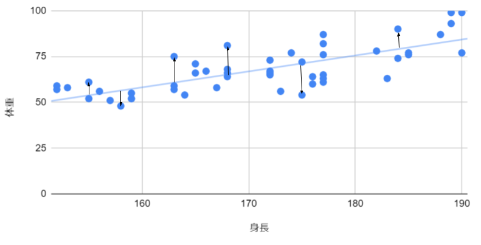
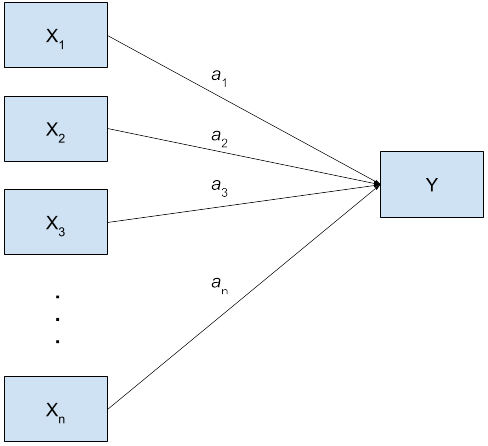
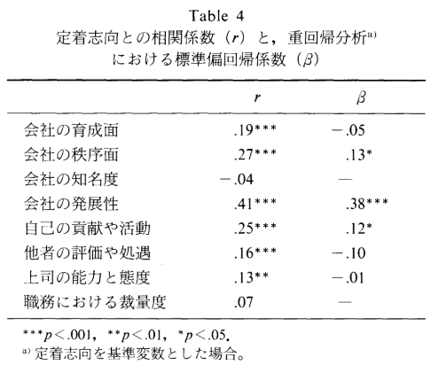
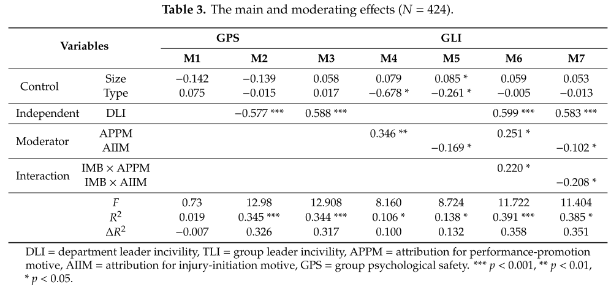

```{r setup, include=FALSE}
knitr::opts_chunk$set(echo = TRUE)
```


相関分析は２つの変数がどの程度連動しているかを示す指標であった．それに対して，回帰分析(重回帰分析)
は一方の変数によって他方の変数の値を予測するための予測式を作り出す分析である．人工知能も最も原初的な原理は回帰分析であるなど，非常に重要な分析手法である．また経済学や経営学，心理学等において因果関係を検証する際にも一般に回帰分析が用いられるなど，今日の科学技術や社会科学においては欠かせない分析手法である．

# 単回帰分析

もっとも単純な回帰分析は，ある変数$x$から$y$を予測する一般式として以下のような式（シンプルな1次関数！！）を仮定し，この式における$a$と$b$を$x$と$y$の実測データから求めるというものである．単回帰分析と呼ばれる．

$$
y = a + bx
$$

$b$のことを**回帰係数（Coefficient）**（一次関数における傾き（slope）），$a$のことを**切片（intercept）**（これはそのまま）と呼ぶ．またXのことを**独立変数**もしくは**説明変数**，Yのことを**従属変数**もしくは**目的変数**と呼ぶ．さらに，この予測式のことを**モデル式**あるいは**回帰式**と呼ぶこともある．


:::ref
回帰分析の内部で行っていることは，予測値と実測値との誤差（以下の図の各矢印が誤差を表す）の全サンプルの総和（残差）が最も低くなるような直線を求めている，というものである（このような$a$，$b$の求め方を最小二乗法と呼ぶ）．


:::

Rで単回帰分析を実施するには`lm()`関数を用いる．`lm()`関数は，以下の引数を取る．

- 第1引数: `目的変数 ~ 説明変数`という形式でモデル式を与える
- 第2引数: 目的変数と説明変数を含むデータフレームを指定する

結果は一旦オブジェクトに保存して，summary()関数を用いることで表示することができる．


:::practice
日本人の20代男性100人の身長の体重の[データ](./practice/example_09_height_weight.csv)を用いて，身長から体重を予測する単回帰分析を行い，回帰係数と切片を求めよ．
```{r include=FALSE}
set.seed(44)
height <- round(rnorm(100, 171.5, 6.7),1)#https://www.e-stat.go.jp/dbview?sid=0003224177 を基に平均・標準偏差を算出
BMI <- round(rnorm(100, 22.90, 4.1),1)  # https://www.e-stat.go.jp/dbview?sid=0003224178
weight <- round(BMI * (height/100)^2,1)
data <- data.frame(height, weight)
write.csv(data, file = "./practice/example_09_height_weight.csv", row.names = FALSE)
```
:::

```{r}
data <- read.csv("./practice/example_09_height_weight.csv")
head(data)

# 単回帰分析
fit <- lm(weight ~ height, data)
summary(fit)
```

結果として英語で様々な数値が表示されるが，重要なものは`Coefficents`に記載されている`Estimate`と`Pr($>|t|$)`である. `Estimate`は算出された回帰係数もしくは切片の値であり，`Pr($>|t|$)`はそれらの有意確率である．なお，この有意確率の解釈は相関の場合と同じく「回帰係数（切片）が0である」という帰無仮説を棄却すべきかどうかというものである．
今回の例の場合，切片の値は-49.2，回帰係数の値は0.676であり，これらの結果から身長から体重を予測する式として，
$$
体重 = 0.676 \times 身長 -49.2 
$$
という式が得られたことになる．
また，回帰係数の有意確率は$2.27\times 10^{-5}$であり，有意水準0.1%でも有意である，という結果が得られた一方，切片の方は，切片の有意確率は0.061であり5%水準を上回った．つまり，切片に関しては「本当は切片は0である」という帰無仮説を棄却できなかった，ということであり，「-49.2という値は誤差の結果として出ただけであり，本当は0である可能性が捨てきれていない」ということである．

<a name="決定係数"/>

:::ref
<details>
<summary>決定係数</summary>
Rでの回帰分析ではさらに決定係数というものを出力してくれる．決定係数は，各サンプルの目的変数のばらつき（分散）のうち，各サンプルの説明変数のばらつきに由来しているものがどの程度の割合かを示す指標（このため「説明率」と呼ぶこともある）であり，予測値と実測値の相関を2乗したもので表される．Rの出力結果では`Multiple R-squared`として示される値がそれにあたる (じつは`Adjusted R-squared`の方が重要であるが，これは後程触れる）．今回の場合だと0.168が決定係数となる．

単回帰分析の場合には，決定係数はそれほど重要視される指標ではないが，重回帰分析の場合には，モデルの適合度を示す指標として重要視されるので，後程改めて説明する．
</details>
:::

## 結果の報告方法

回帰分析の結果を報告する際には，以下のような表にして報告することが一般的である．

<table class="res_table">
<tr class="tr_topborder">
<th>変数名</th>
<th>係数</th>
<th>有意確率</th>
<th> </th>
</tr>
<tr>
<td class="td_left">切片</td>
<td>-49.2</td>
<td>0.061</td>
<td class="td_left">†</td>
</tr>
<tr>
<td class="td_left">身長</td>
<td>0.676</td>
<td>\<0.001</td>
<td class="td_left">***</td>
</tr>
<tr class="tr_topborder">
<td class="td_left">F(1,98)</td>
<td>19.81</td>
<td>\<0.001</td>
<td class="td_left">***</td>
</tr>
<tr>
<td class="td_left">決定係数</td> 
<td>0.168</td>
</tr>
<tr class="tr_bottomborder">
<td  class="td_left">自由度調整済み決定係数</td>
<td>0.159</td>
</tr>
</table>

特に有意確率について，summary()の結果としては$2.27\times 10^{-5}$という数値が出力されるが，このように非常に小さな有意確率については，その値をそのまま報告するのではなく，「\<0.001」とだけ記すのが一般的である．

## 回帰直線の図示

回帰分析の結果を報告する方法として，回帰直線をデータの散布図に重ねて図示する方法もある．これには`ggplot2`パッケージを用いる．
以下に例を示す．

```{r}
library(ggplot2)
ggplot(data, aes(x=height, y=weight)) + # Canvasにdataを結びつけ，x軸にheight, y軸にweightを指定
  geom_point() + #点プロット
  geom_smooth(method="lm", se=FALSE) + #回帰直線の描画
  labs(title="身長と体重の関係", x="身長", y="体重") #タイトルと軸ラベルの設定
```
この例では，geom_smooth()関数を用いており，この関数を用いた場合には`method="lm"`とすることで，ggplot内で回帰分析を実行される．このため，回帰係数や切片を明示的に与える必要がない．

回帰係数や切片を明示的に与えたい場合には以下のように`geom_abline()`関数を用いればよい．引数として`intercept`に切片，`slope`に回帰係数を与えることで，指定した切片，傾き（回帰係数）による直線を描画することができる．
```{r}
ggplot(data, aes(x=height, y=weight)) + 
  geom_point() + 
  geom_abline(intercept = -49.2, slope = 0.676, color="red") + #回帰直線の描画
  labs(title="身長と体重の関係", x="身長", y="体重") 
```

`geom_abline()`関数を用いた場合には，`intercept`と`slope`の他に，`linetype`や`color`などの引数を指定することで，直線のスタイルを変更することができる．


# 重回帰分析

単回帰分析は一つの説明変数に対して一つの目的変数を予測しようとするものであったが，重回帰分析は複数の説明変数を用いて一つの目的変数を予測するしようとするものである．

重回帰分析のモデル式は以下のようになる．

$$
y = a + b_1x_1 + b_2x_2 + \cdots + b_nx_n
$$

現実の世界では，単一の説明変数だけで目的変数が完全に予測できることはあまりない．予測の精度を高めるために複数の説明変数を用いて重回帰分析によって予測式を作ることが一般的である．
なお，重回帰分析の数式は上に示した通りだが，以下のように図で示されることも多い．このような図をモデル図と呼ぶ．




Rで重回帰分析を行うには，単回帰分析と同様に`lm()`関数を用いる．引数も単回帰分析と同様であるが，特に第1引数に

`目的変数 ~ 説明変数1 + 説明変数2 + ...`

という形式で複数の説明変数を含めたモデル式を指定することで，重回帰分析を行うことができる．


:::practice
不動産価格(百万円)に関するこのデータを用いて，敷地面積($m^2$)，築年数，最寄り駅からの徒歩分数，周辺施設の充実度（半径2キロの円内における施設（小学校・中学校・病院・スーパー・ドラッグストア・ホームセンター・公園の数を合計したもの）から不動産価格を予測する数式をつくれ．
```{r include=FALSE}
set.seed(44)
面積 <- abs(round(rnorm(100, 100, 20),1))
築年数 <- abs(round(rnorm(100, 15, 10),0))
徒歩分数 <- abs(round(rnorm(100, 10, 7),0))
充実度 <- abs(round(rnorm(100, 5, 2),0))
価格 <- round(20+8*scale(0.4*scale(面積) - 0.6*scale(築年数) - 0.1*scale(徒歩分数) + 0.2*scale(充実度)+1.3*rnorm(100,0,1)),2)
data <- data.frame(面積, 築年数, 徒歩分数, 充実度, 価格)
write.csv(data, file = "./practice/example_09_price.csv", row.names = FALSE)
```
:::

```{r}
data <- read.csv("./practice/example_09_price.csv")
head(data)

# 重回帰分析
fit <- lm(価格 ~ 面積 + 築年数 + 徒歩分数 + 充実度, data)
summary(fit)
```
結果の見方は，単回帰分析の場合と同じであり，各説明変数の`Estimate`と`Pr($>|t|$)`を見る．
上記の例の場合では，不動産価格を予測する式は以下のようになる．
$$
価格 = 14.783 + 0.082 \times 面積 - 0.333 \times 築年数 - 0.167 \times 徒歩分数 + 0.813 \times 充実度
$$
ただし，徒歩分数の係数については有意確率が5%を上回っており，「徒歩分数の係数の真値は0である」という帰無仮説を棄却できておらず，-0.167という値の信頼性は低いという結果となっている．


## 標準化回帰係数

重回帰分析を利用する目的としては，先に述べた通り**複数の説明変数を用いて予測精度の高いモデル式を得る**ということが第一にあるが，その他に**目的変数に対して影響力の強い説明変数がどれかを知る**ということを目的とすることもある．
この場合には，各説明変数の回帰係数を比較することになるが，単純な重回帰分析の場合，各説明変数の単位系としてどのような単位を取っているかによって，各説明変数の回帰係数の値が変わってしまう上，単位系が異なるもの同士を比較してもよいのか，という問題も生じる．

:::ref
例えば，先の不動産価格の例では，面積の回帰係数が0.082となっているが，面積の表記を平方メートルから[a]（アール．100平方メートルのこと）に変えると，回帰係数は以下の通り約8.2となる．

```{r}
data$面積 <- data$面積/100
fit <- lm(価格 ~ 面積 + 築年数 + 徒歩分数 + 充実度, data)
summary(fit)
```
このように，単純な重回帰分析の場合，回帰係数そのものはその単位系に依存してしまう．
:::

そこで，説明変数間での目的変数への影響力の強弱を見たい場合には，**標準化回帰係数**を用いる．標準化回帰係数は，**各説明変数を平均0，標準偏差1に標準化**した上で回帰分析を行った場合の回帰係数のことであり，各説明変数の単位系に依存しないため，説明変数間での影響力の強弱を比較することができる．

Rで標準化回帰係数を得るには，以下のように`scale()`関数を用いて説明変数・目的変数を標準化した上で回帰分析を行う．
`scale()`関数の使い方には2通りの方法がある．1つはモデル式の各説明変数・目的変数に`scale()`関数を適用する方法，もう1つはデータフレーム全体に`scale()`関数を適用する方法である．

まずは個別に`scale()`関数を適用した場合を以下に示す．

```{r}
data <- read.csv("./practice/example_09_price.csv")
fit <- lm(scale(価格) ~ scale(面積) + scale(築年数) + scale(徒歩分数) + scale(充実度), data)
summary(fit)
```
続いて，データフレーム全体に`scale()`関数を適用した場合を以下に示す．データフレーム全体に`scale()`関数を適用することで，データフレームに含まれているすべての変数をまとめて標準化することができる．ただし，`scale()`関数の出力は行列型であるため，lm()関数にそのまま渡すことはできない．そのため，**`as.data.frame()`関数を用いて行列をデータフレームに変換する必要がある**．

:::ref
さらに，データフレームの中に数値以外の変数（属性に関する要因型の変数など）が含まれていた場合は，scale()関数はエラーを返す．このため，データ全体を標準化する際には，分析に掛ける変数だけを抽出して標準化するのがよい．

なお，lm()関数自体は要因型の変数も説明変数に加えることができる．この点は[後の章](./RText_11_HighLevelModeling.html)で改めて詳細に解説する
:::

```{r}
data <- read.csv("./practice/example_09_price.csv")
data.scaled <- scale(data)
data.scaled <- as.data.frame(data.scaled)
fit <- lm(価格 ~ 面積 + 築年数 + 徒歩分数 + 充実度, data.scaled)
summary(fit)
```
結果はいずれの場合も同じである．

今回の例題の場合，標準化回帰係数は以下のようになる．

$$
価格 = 0.231 \times 面積 - 0.380 \times 築年数 - 0.134 \times 徒歩分数 + 0.204 \times 充実度
$$
この結果から，今回のデータにおいて不動産価格への影響力が影響力が最も強かったのは築年数であることがわかる．

なお，有意確率は標準化した場合でも元の場合と変わりない．


### 標準化回帰係数の解釈
標準化回帰係数にすることによって，回帰係数の値は0から1の間を取るようになる（負の場合は向きが逆になる）．この数値の解釈は相関係数の解釈と同じであり，1に近いほど目的変数に対する影響力が強いことを示し，0に近いほど影響力が弱いことを示す．

ちなみに単回帰分析における標準化回帰係数は説明変数と目的変数の相関係数と一致する．一方で重回帰分析の場合の標準化回帰係数は相関係数とは一致しない．


### 「偏」回帰係数
重回帰分析においては，回帰係数，標準化回帰係数のことを**偏**回帰係数，標準化**偏**回帰係数と呼ぶことがある．これは，各説明変数の回帰係数を，それぞれ**他の説明変数の影響を統制したもの**であることを強調したい場合に用いられる呼び方である．

「他の説明変数の影響を統制する」とは，他の変数がすべて一定であるという仮定を置く，ということである．すなわち，先の例では，築年数の価格に対する影響力は0.380であるが，これは，「**面積や徒歩分数，充実度が同じで，築年数だけが異なっている**」という不動産を比較した場合に，築年数が1年増えると価格が0.380単位下がる，ということである．

このように重回帰分析においては，ある説明変数の目的変数に対する影響力を評価する際に，他の説明変数の影響を統制した（影響を取り除いた）上で評価することができる．このことから，実際に影響力の有無を見たい説明変数に加えて，**目的変数に影響をもたらすと考えられるその他の変数**を含めたモデルを作成して分析を掛けることによって，より純粋な説明変数の影響力を評価することができる．このように目的変数に影響をもたらすと考えられるその他の変数のことを**交絡因子**と呼び，それを統制するためにモデル式に投入される変数のことを統制変数と呼ぶ．

:::ref
実際に統制変数を用いた分析を行う例としては，「モチベーション」（説明変数）と「業績」（目的変数）の因果関係を評価するときに，「業務経験年数」（統制変数）を含めるといったことが考えられる．

なぜなら，業務経験年数が長い人ほど，長い時間をかけて仕事に対する深い理解を得るようになりモチベーションが高まるということは十分に考えられるし，業務経験年数が長い人ほど，長い時間をかけて培われたスキルによって業績が高まるということも十分に考えられるからである．業務経験年数を考慮せずに分析を行った場合，モチベーションと業績の間に因果関係があるかどうかを正確に評価することができなくなることが十分に考えられる．

```{r include=FALSE}
set.seed(23)
業務経験年数 <- runif(100, 0, 25)
モチベーション <- 0.5*業務経験年数 + rnorm(100, 0, 5)
業績 <- 0.2*モチベーション + 0.5*業務経験年数 + rnorm(100, 0, 5)
data <- data.frame(業務経験年数, モチベーション, 業績)
write.csv(data, file = "./practice/example_09_performance.csv", row.names = FALSE)
```

実際に，[このデータ](./practice/example_09_performance.csv)を用いて業績をモチベーションだけで予測する場合と，モチベーションと業務経験年数の両方を説明変数として含めた場合の結果を比較すると以下のようになる．

```{r}
data <- read.csv("./practice/example_09_performance.csv")
# 業務経験年数を投入せず
fit <- lm(業績 ~ モチベーション, as.data.frame(scale(data)))
summary(fit)

# 業務経験年数と投入
fit <- lm(業績 ~ モチベーション+業務経験年数, as.data.frame(scale(data)))
summary(fit)
```

このように，業務経験年数で統制した場合のモチベーションの業績に対する影響力はそれほど大きくないのだが，業務経験年数で統制しなかった場合には，過剰にモチベーションの影響力が強く表れている．

こうなった理由は以下の通りに点プロットしてみるとよくわかる．

```{r}
library(ggplot2)
data <- as.data.frame(scale(data))
ggplot(data, aes(x=モチベーション, y=業績)) + 
  geom_point() + geom_smooth(method="lm", se=FALSE) +
  labs(title="モチベーションと業績の関係(業務経験年数での区別なし)", x="モチベーション", y="業績") 

#業務経験年数の平均より高い・低いで分けて高い群を赤，低い群を青として点プロット
# 低い群だけの回帰直線と高い群だけの回帰直線も描画
#凡例は表示しない
ggplot(data, aes(x=モチベーション, y=業績, color=業務経験年数>mean(業務経験年数))) + 
  geom_point() + geom_smooth(method="lm", se=FALSE) + 
  geom_abline(slope = 0.567,intercept = -8.151e-17, linetype="dashed") +
  labs(title="モチベーションと業績の関係(業務経験年数を平均より高い群を赤，低い群を青で色分け", x="モチベーション", y="業績") +
  scale_color_manual(values=c("blue", "red")) +
  guides(color=FALSE)
```

```{r eval=FALSE, include=FALSE}

#業務経験年数の四分位数で4群に分けて高い方から赤，緑，紫，青として点プロット
# 各群回帰直線も描画
#凡例は表示しない
ggplot(data, aes(x=モチベーション, y=業績, color=cut(業務経験年数, quantile(業務経験年数, probs = c(0, 0.25, 0.5, 0.75, 1)), include.lowest = TRUE)) ) + 
  geom_point() + geom_smooth(method="lm", se=FALSE) + 
  geom_abline(slope = 0.567,intercept = -8.151e-17, linetype="dashed") +
  labs(title="モチベーションと業績の関係(業務経験年数を四分位数で4群に分けて色分け)", x="モチベーション", y="業績") +
  scale_color_manual(values=c("blue", "purple", "green", "red")) +
  guides(color=FALSE)
```


つまり，モチベーションが高く業績が良い人の多くは業務経験年数が長い人であり，モチベーションが低く業績が低い人は業務経験年数が短い人である．いずれの群でもモチベーションの影響がないわけではないが，業務経験年数を統制せずに行ったときの結果(図中の破線の直線)に比べてモチベーションの影響は小さい（傾きが小さい）ことがわかる．
:::


### 「因果関係の検証」への応用

重回帰分析の最も原初的な目的は，最初にも述べた通り予測式を立てることであるが，そこからの応用として，**因果関係の検証**に重回帰分析を用いるのが一般的になっている．

こうした応用ができる理屈は次の通りである．まず，仮説として「ある要因Eが原因となって，Oという事象が起こる」という仮説を立てる．この仮説が真であるならば，Eの状態を測定した変数XとOの状態を測定を測定した変数Yの間には，$Y = a + bX$という関係があるはずである．そこで，重回帰分析を用いて$a$と$b$（特に$b$）を求めて有意な値が得られるかを確認し，有意な関係が得られたのであれば，「仮説が支持された」と結論づけるのである．

ただし，結論の出し方として「仮説が支持された」という言い方であって，「仮説が真であることが証明された（実証された）」とは言わない点には注意してほしい．「EとOの間に因果関係があるならば，$Y=a+bX$である」というのが真であったとしても「$Y＝a+bX$であるならば，EとOの間に因果関係がある」が真であるとは言えない．逆に「$Y\neq a+bX$であるならば，EとOの間には因果関係がない」ということは言える（あくまで因果関係として線形の因果関係のみを想定）．つまり，「有意な結果が得られた」というのは，仮説を否定する結果にはならなかったというだけであって，因果関係を**はっきりと証明したことにはならない**ということである．

本来，因果関係の検証には**実験計画法**が最も適しているとされている．実験計画法は，ある要因が原因となって他の要因に影響を与えるかどうかを検証するために，原因と考えている要因を実際に実験として操作し，操作前に比べて（あるいは操作しなかった場合と比べて），結果となる要因に有意な変化があったかを検証する方法である．実際に有意な変化が検出された場合には，原因と考えた要因と結果と考えた要因の間に因果関係がある，ということを実証したことなる．

加えて，重回帰分析でできるのは因果関係の「検証」であって，因果関係を「発見」することはできない．矢鱈目鱈に説明変数を投入して分析を行い，その結果，何らかの説明変数が有意であったからといって，その説明変数と目的変数の間に因果関係があることが分かったとはいえない．あくまで予測式を作る際に有効な説明変数であったというだけであり，そこに「因果」関係を見いだせるかどうかは，あくまで人の側がその因果関係を論理的に説明できる場合に限る．したがって，重回帰分析による因果関係の検証では，あくまで前もって，説明変数と目的変数の間に因果関係があると予想することの妥当性をきちんと論理的に説明できていることが大前提となる．

## 95%信頼区間
回帰係数の[95%信頼区間](./RText_04_DescriptiveStatistics.html#標本統計量からの母数の推測)は，`confint()`関数で簡単に求めることができる．引数には`lm()`関数で得られた結果を収めたオブジェクトを指定する．
```{r}
confint(fit)
```
95%信頼区間は，95%の確率で真値がその範囲にある，という区間のことなので，その上限と下限はそれぞれその値より下になる，あるいは上になるのが2.5%の確率となる．

:::ref
<details>
<summary>回帰係数や切片の信頼区間の図示</summary>
信頼区間について，`geom_smooth()`関数の`se`引数を`TRUE`にすることによって，回帰直線の周りに95%信頼区間を描画することができる．

```{r}
ggplot(data, aes(x=height, y=weight)) + 
  geom_point() + 
  geom_smooth(method="lm", se=TRUE) + #回帰直線の描画
  labs(title="身長と体重の関係", x="身長", y="体重") 
```

つまり，切片や回帰係数が信頼区間内のいずれかの値を取った場合に，その回帰直線はこの灰色のエリア内に入ってくる，といことである．

参考までに，この図にさらに，（切片：上限, 回帰係数：下限）（切片：下限, 回帰係数：上限）の組み合わせによる直線をabline()を用いて描画すると以下の通りとなる．なお，上限同士，下限同士の組み合わせはデータとの関わり合いから考えて不適なので描画していない（仮に上限同士で描画した場合，身長が150㎝の時の体重の推定値が150*0.978+2.3=148.7kgとなるが明らかにこの予測値はおかしい値である）．

```{r}
ggplot(data, aes(x=height, y=weight)) + 
  geom_point() + 
  geom_smooth(method="lm", se=TRUE) + #回帰直線の描画
  geom_abline(intercept = -100.7, slope = 0.978, linetype="solid", color="red") +
  geom_abline(intercept = 2.3, slope = 0.375, linetype="solid", color="blue") +
  labs(title="身長と体重の関係", x="身長", y="体重") 
```
エリアの両端あたりでは，信頼区間の上限下限と直線が重なっているのがわかる．
</details>
:::

## 決定係数と自由度調整済み決定係数

重回帰分析においては，個々の回帰係数の値や有意確率に加えて，[決定係数](#決定係数)も重要な指標となる．この決定係数は，単回帰分析の際には「目的変数の変動のうち，説明変数によって説明される割合を示す指標」と説明したが，重回帰分析の場合は，目的変数の変動のうち**モデル式全体**によって説明される割合を示す指標となる．言い換えるならば，モデル式全体での目的変数の予測精度を示す指標である．
値は0から1の間を取り，1に近いほど予測精度が高いことを示す．

個々の回帰係数の有意確率が有意であったとしても，決定係数が低い場合には，モデル式全体としての予測精度が低いことを示しており，別の説明変数を新たに追加するなどしてモデル式を改善する必要がある．

決定係数は，`summary()`関数の出力結果の`Multiple R-squared`として示される．

ただし，決定係数は説明変数の数が増えると必ず増加するという特徴がある（たとえ個々の回帰係数が有意でなかったとしても）．このため，説明変数の数に対してペナルティを与えた決定係数として**自由度調整済み決定係数（`Adjusted R-squared`）が用いられることのほうが多い**．


## 結果の報告方法

単回帰分析の場合と同様に，重回帰分析の結果を報告する際には表にして報告することが一般的である．以下では特に標準化回帰係数を報告する場合の表の例を示す．


<table class="res_table">
<tr class="tr_topborder">
<th>変数名</th>
<th>係数</th>
<th>有意確率</th>
<th> </th>
</tr>
<tr>
<td class="td_left">面積</td>
<td>0.231</td>
<td>0.011</td>
<td class="td_left">*</td>
</tr>
<tr>
<td class="td_left">築年数</td>
<td>-0.380</td>
<td>\<0.001</td>
<td class="td_left">***</td>
</tr>
<tr>
<td class="td_left">徒歩分数</td>
<td>-0.134</td>
<td>0.138</td>
<td class="td_left"></td>
</tr>
<tr>
<td class="td_left">充実度</td>
<td>0.204</td>
<td>0.024</td>
<td class="td_left">*</td>
</tr>
<tr class="tr_topborder">
<td class="td_left">F(4,95)</td>
<td>8.65</td>
<td>\<0.001</td>
<td class="td_left">***</td>
</tr>
<tr>
<td class="td_left">決定係数</td> 
<td>0.2.67</td>
</tr>
<tr class="tr_bottomborder">
<td  class="td_left">自由度調整済み決定係数</td>
<td>0.236</td>
</tr>
</table>

ただし，場合によっては，以下の図のように，有意確率の実数は表記せず，係数に対して`*`や`**`などの記号を付与しているだけの場合もよくある．



(出典:森田慎一郎. (2006). 日本の会社員における定着志向 と職務満足感 との関連. 心理学研究, 76(6), 534–539.)

この例では標準化回帰係数と合わせて相関係数も表記している．このように，実際に論文等で報告する際には，それぞれの都合に合わせてカスタマイズしてもよい．


## 変数選択

重回帰分析においては，説明変数が多くなれば多くなるほど予測精度は上がっていくが，その分モデルが複雑になってしまったり，各説明変数が有意でなくなったりする．

:::ref
科学においては** オッカムの剃刀（Occam's razor）**という指針がある．これは「同じ説明力を持つならば，より単純なモデルを選ぶべきである」という原則である．

参考：[西藤 洋, ジョージ・バークリーにみる「オッカムの剃刀」, 科学基礎論研究, 1998-1999, 26 巻, 2 号, p. 77-84](https://www.jstage.jst.go.jp/article/kisoron1954/26/2/26_2_77/_article/-char/ja/)

:::

そこでモデルをより少ない説明変数で構成できるように，説明変数を選択する方法が
ステップワイズ法である．

Rでは`step()`関数が用意されており，簡単にステップワイズ法を用いて変数選択を行うことができる．

:::practice
[このデータ](./practice/example_09_step.csv)は説明変数E1～E16と目的変Oで構成されている．このデータを用いて，Oの予測式として適切なものを示せ．

```{r include=FALSE}
set.seed(61)
E1 <- rnorm(100, 0, 1)
E2 <- 0.7*rnorm(100, 0, 1)+0.3*E1
E3 <- 0.7*rnorm(100, 0, 1)+0.3*E2
E4 <- rnorm(100, 0, 1)
E5 <- 0.6*rnorm(100, 0, 1)+0.4*E4
E6 <- 0.6*rnorm(100, 0, 1)+0.4*E5
E7 <- 0.6*rnorm(100, 0, 1)+0.4*E6
E8 <- 0.6*rnorm(100, 0, 1)+0.4*E4
E9 <- 0.6*rnorm(100, 0, 1)+0.4*E4
E10 <- rnorm(100, 0, 1)
E11 <- 0.5*rnorm(100, 0, 1)+0.5*E10
E12 <- 0.5*rnorm(100, 0, 1)+0.5*E10
E13 <- rnorm(100, 0, 1)
E14 <- 0.3*rnorm(100, 0, 1)+0.7*E13
E15 <- 0.3*rnorm(100, 0, 1)+0.7*E13
E16 <- 0.8*rnorm(100, 0, 1)+0.2*E13
O <- 0.3*E1 + 0.4*E4 + 0.5*E7 + 0.6*E10 + 0.7*E13 + 0.8*E16 + rnorm(100, 0, 1)
data <- data.frame(E1, E2, E3, E4, E5, E6, E7, E8, E9, E10, E11, E12, E13, E14, E15, E16, O)
write.csv(data, file = "./practice/example_09_step.csv", row.names = FALSE)
```
:::

`step()`関数を用いる場合には，まずは全ての説明変数を含めた重回帰分析を実施し，その結果を`step()`関数の引数として与える．

```{r}
data <- read.csv("./practice/example_09_step.csv")

fit <- lm(O ~ E1 + E2 + E3 + E4 + E5 + E6 + E7 + E8 + E9 + E10 + E11 + E12 + E13 + E14 + E15 + E16, data)
summary(fit)
fit.step<-step(fit)
summary(fit.step)
```
このように，`step()`関数を実施すると，デフォルトでは変数選択していく過程がすべて表示されていく．変数の数が多い場合には非常に多くの過程が表示され鬱陶しい．そのような場合には`step()`の第2引数として`trace=FALSE`を引数に与えることで，過程の表示を抑制することができる．

```{r}
fit.step<-step(fit, trace=FALSE)
summary(fit.step)
```

::: ref
Rで搭載されている`step()`関数は，AIC（赤池情報量規準）と呼ばれる指標を用いて変数選択を行う．AICはモデルの良さを示す指標であり，AICが小さいほどモデルの予測精度が高いことを示す．
:::

:::ref
ステップワイズ法は極めて簡単に実施でき，自動的によりシンプルなモデル式にしてくれる便利な方法であるが，安易な利用は避けるべきであるとされる\*1,\*2．

その理由として，以下のような問題が挙げられている．

- **過剰適合（過学習）**: ステップワイズ法は与えられたデータに適合するように変数を選択するため，新しいデータでは予測精度が低下する可能性がある．
- **選択的バイアス**: 多くの仮説検定を繰り返すため，偶然有意になった変数が選択される可能性がある．
- **手法による結果の違い**: ステップワイズ法による変数選択においては，変数投入の方法やモデルを評価する方法など様々な手法が存在しており，用いられる方法によって最終的に選択される変数が異なることがある．
- **理論の無視**: ステップワイズ法はデータに基づいて変数を選択しているだけであり，理論的な妥当性が保証されているわけではない．

実践的な利用のためのビッグデータ解析のように，とにかくたくさんの説明変数を駆使して予測精度の高いモデル式を得たい，というような場合には，ステップワイズ法も有力な手段となるかもしれないが，研究・調査のために利用するにあたっては慎重にすべきである．

そもそも理論構築を目的とする研究・調査においては，ある変数を説明変数として研究の中で含めている時点で，理論的にその説明変数が目的変数に影響をもたらすことが考えられているはずなので，その説明変数が加わることでモデルの適合度（予測精度）が悪くなるからといって，安易に削除するべきではない．悪くなるのであれば，悪くなるということ自体が学術的・理論的な意味を持っている可能性があるので，なぜ悪くなるのかを考えるべきである．

さらには，そうした研究・調査において数多くの説明変数を含めるということは数多くの仮説を立てていることになり，研究・調査の目的をぼやけさせることになる．なので，あくまで研究・調査の目的に照らして的を絞った仮説を作り，その仮説を検証するための必要十分な説明変数を設定すべきである．


\*1:Smith, G.(2018), Step away from stepwise. Journal of Big Data Vol.5, article number 32 . https://doi.org/10.1186/s40537-018-0143-6 [Open Access]

\*2:WHITTINGHAM, M.J., STEPHENS, P.A., BRADBURY, R.B. and FRECKLETON, R.P. (2006), Why do we still use stepwise modelling in ecology and behaviour?. Journal of Animal Ecology, vol.75, pp. 1182-1189. https://doi.org/10.1111/j.1365-2656.2006.01141.x [Open Access]
:::

## 多重共線性という問題
重回帰分析における大きな問題の一つに多重共線性（Multiple Colinerity）という問題がある．
これはモデル式に含めている説明変数間に強い相関があると，それらの説明変数の係数の推定値が不安定になる，あるいは係数の推定値が正しく求まらない，といった問題のことである．

:::practice
[このデータ](./practice/example_09_multicollinearity.csv)は年齢，勤続年数，モチベーションと業績からなるデータである．このデータを基に勤続年数，年齢，モチベーションから業績を推定するモデル式を作れ．
:::

この例題について，実際に標準化した重回帰分析を実行すると以下の通りとなる．
```{r include=FALSE}
set.seed(23)
年齢 <- runif(100, 22, 65)
勤続年数 <- abs(round(年齢 +0.5* rnorm(100, 0, 7)-20,0))
業績 <- 0.1*年齢 + 0.1*勤続年数 + rnorm(100, 0, 5)
業績 <- round(((業績 - min(業績) ) / (max(業績) - min(業績)) * 100)) # 0-100の範囲に変換
モチベーション　<- abs(0.5*業績+rnorm(100, 50, 20))

data <- data.frame(年齢, 勤続年数,モチベーション, 業績)
write.csv(data, file = "./practice/example_09_multicollinearity.csv", row.names = FALSE)
```

```{r}
data <- read.csv("./practice/example_09_multicollinearity.csv")

##　標準化重回帰分析
fit <- lm(業績 ~ 年齢 + 勤続年数+モチベーション, as.data.frame(scale(data)))
summary(fit)
```
一見特に問題がないように見えるが，3つの変数間の相関行列を算出させてみるとおかしな点に気づく．

```{r}
cor(data)
```

この相関行列を見ると，年齢も勤続年数も共に業績に対して約0.4の正の相関を持っている．すなわち，年齢でも勤続年数でも，いずれの場合も年数を重ねると業績が高くなる傾向にある，ということである．また年齢と勤続年数の間の相関は0.97と極めて高い．
翻って，先ほどの重回帰分析を結果を見ると，年齢の係数は負の値となっており，相関の時と符号が逆向きになっている．一方で，勤続年数の係数は正のままではあるものの相関係数の値よりも大きくなっている．
もちろんこうした結果を無理矢理解釈することも可能ではあるが（例えば，年齢が同じ人同士では勤続年数が長い人ほど業績が高いが，勤続年数が同じ人同士では，年齢が低い人ほど業績が高い），やはり直感とは異なった結果である．
このように(1)説明変数同士の相関が高く，かつ(2)相関係数と回帰係数で符号が逆向きなっているケースでは，多重共線性問題が発生している疑いがある．

多重共線性問題が発生した場合には，いずれか一方の変数をモデルから除外するか，相関が高い変数同士を足し合わせた変数を作ってその変数で置き換えるなどして，相関が高い変数がモデルに存在している状況を解消する必要がある．

今回の例の場合だと，年齢と勤続年数から合成変数を作り出すことはそれぞれの概念の上難しいと考えられるので，どちらか一方の変数をモデルから除外することが適切である．いずれを除外するかは研究や調査の目的に照らして判断する必要がある．あるいは，両方のパターンで分析して，どちらがより適切なモデル式を導くかを検討する，もしくは，多重共線性の問題が発生する可能性が高いことを述べた上で，両方のパターンの結果を共に報告し，それぞれから得られる知見を示す，といった方法もある．


以下では，年齢と勤続年数のうち，どちらか一方をモデルから除外して重回帰分析を行ってみた結果である．
```{r}
#勤続年数を除く
fit <- lm(業績 ~ 年齢 + モチベーション, as.data.frame(scale(data)))
summary(fit)

#年齢を除く
fit <- lm(業績 ~ 勤続年数 + モチベーション, as.data.frame(scale(data)))
summary(fit)
```

:::ref
多重共線性問題が発生している可能性が高いことを確認する方法として，`car`パッケージに含まれる`vif()`関数を用いる方法がある．VIF（Variance Inflation Factor）は，各説明変数の分散拡大係数を示す指標であり，一般にVIFが10を超える場合には多重共線性の問題が発生している可能性があるとされる．

`vif()`関数の引数には`lm()`関数の出力結果を与える．なお，`vif()`を利用するためには，`car`パッケージを読み込んでおく必要がある．
```{r}
library(car)
fit <- lm(業績 ~ 年齢 + 勤続年数+モチベーション, as.data.frame(scale(data)))
vif(fit)
```

この例題においては，`vif()`関数を用いてVIFを算出すると，年齢と勤続年数のVIFがそれぞれ約10となっており，多重共線性の問題が発生していることが確認できる．

ただ，10を下回っていれば多重共線性問題が発生していないか，と言われれば必ずしもそうとは言えない．実際に著者自身の分析の経験ではvifが2程度であっても，多重共線性が疑われるような結果が出てきたことがある．さらに今回の例では相関係数が0.97と極めて高い値であったが，これまた著者の経験では0.5前後の相関でも多重共線性が疑われる結果が出てきたこともある．
このように，VIFや相関係数はあくまで目安でしかなく，実際に多重共線性の問題が発生しているかどうかは，その結果を見て判断する必要がある．
:::

<!-- # 交互作用の分析 -->

<!--  -->
<!-- (出典:Liu, C.-E., Yu, S., Chen, Y., & He, W. (2020). Supervision Incivility and Employee Psychological Safety in the Workplace. International Journal of Environmental Research and Public Health, 17(3), 840. https://doi.org/10.3390/ijerph17030840) -->


<!-- # ロジスティック回帰分析 -->

<!-- # 一般化線形モデル -->
