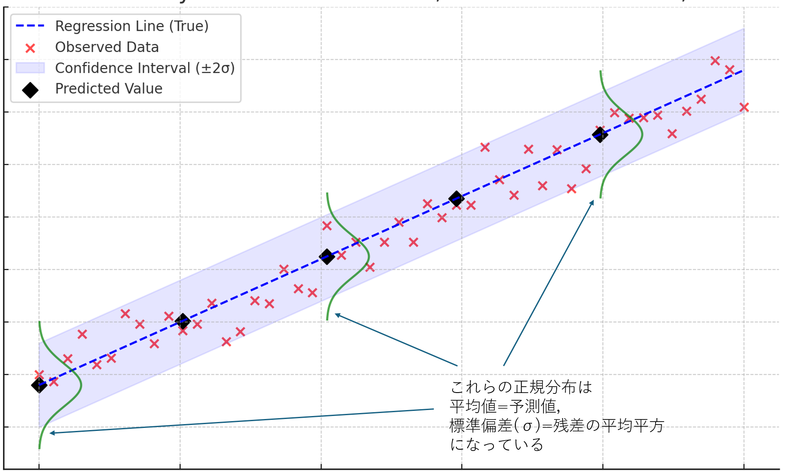

```{r setup, include=FALSE}
knitr::opts_chunk$set(echo = TRUE)
```

# ダミー変数を用いた回帰分析

これまでは**回帰分析説明変数・目的変数ともに連続変数**の場合に用い，**分散分析は説明変数がカテゴリカル変数，目的変数が連続変数**の場合に用いると説明してきた．

しかし実際には，カテゴリカル変数の各水準を0，1の2値を取るダミー変数として表現することによってことによって，回帰分析においても説明変数にカテゴリカル変数を含めることができる．

例1　性別（男・女）のような2つの水準を持つカテゴリカル変数を説明変数として回帰分析を行う場合，以下のように1つのダミー変数を導入することによって，回帰分析を行うことができる．

| |$X$|
|:---|:---:|
|男|0|
|女|1|


例2　A,B,Cという3つの水準を持つカテゴリカル変数を説明変数として回帰分析を行う場合，以下のように2つのダミー変数を導入することによって．

| |$X_1$|$X_2$|
|:---|:---:|:---:|
|A|0|0|
|B|1|0|
|C|0|1|

このように，$n$個の水準を持つカテゴリカル変数を説明変数に含めて回帰分析を行う場合，$n-1$個のダミー変数を導入することによって，回帰分析を行うことができる．

## 2水準をもつカテゴリカル変数を含んだ回帰分析

:::practice
[このデータ](./practice/example_11_Dammy.csv)は，ある企業の従業員50人のデータである．データは，性別（0:女性，1:男性）, その企業での就労期間（連続変数），過去1年間の月当たりの平均残業時間（連続変数），その企業の従業員のの過去1年間の平均月収（単位：万円）を記録したものである．このデータをもとに，平均月収を予測する式を作れ．

```{r include=FALSE}
set.seed(113)

# サンプルサイズ
n <- 50

# ダミー変数: 性別 (0=女性, 1=男性)
gender <- sample(0:1, n, replace = TRUE)

# 連続変数: 就労期間 (0~30年)
experience <- round(runif(n, min = 0, max = 30), 1)

# 連続変数: 平均残業時間(20~60時間)
hours_worked <- round(runif(n, min = 20, max = 60), 1)

# 収入 (従属変数): 
income <- 24 +  experience + 0.4* hours_worked + 6 * gender + 0.8*rnorm(n, mean = 0, sd = 10)

# データフレームを作成
data <- data.frame(
  性別 = gender,
  就労期間 = experience,
  残業時間 = hours_worked,
  平均月収 = income
)

#データフレームのCSVへの書き込み
write.csv(data, file = "./practice/example_11_Dammy.csv", row.names = FALSE)
```
:::

この例のデータの場合には，性別をダミー変数として導入することになる．今回のデータの場合には既に性別は0,1でコード化されているので，読み込んだデータをそのまま`lm()`関数に渡すことで回帰分析を行うことができる．

```{r}
data <- read.csv("./practice/example_11_Dammy.csv")
model <- lm(平均月収 ~ 性別 + 就労期間 + 残業時間, data = data)
summary(model)
```

この結果から，以下のような予測式を立てることができる．

$$
平均月収= 19.68 + 5.48 \times 性別 + 1.11 \times 就労期間 + 0.45 \times 残業時間
$$

つまり，性別が1，すなわち男性の場合には平均月収が約5.48万円高くなる，就労期間が1年長くなると1100円高くなる，残業時間が1時間伸びると4500円高くなる，ということが分かる．
また，いずれの回帰係数も有意であり，性別，就労期間，残業時間は平均月収に対して有意な影響を与えていることが分かる．

:::ref
<details>
<summary>カテゴリカル変数を含んだ回帰分析のイメージ</summary>
カテゴリカル変数を含んだ回帰分析は一体どういうことを行っているのかを理解するには，データを図示してみればよい．
先のデータを図示してみると，以下の通りとなる．
なお，残業時間については平均値(=40.998)を取る（すなわち全員が約41時間の残業をしている）ものと仮定している．
```{r}
library(ggplot2)
data$性別 <- as.factor(data$性別)
ggplot(data, aes(x = 就労期間, y = 平均月収)) + 
  geom_point(aes(color=性別)) + 
  scale_x_continuous(limits=c(0,30), breaks = seq(0, 30, 5)) +
  scale_y_continuous(limits=c(20,90),breaks = seq(0, 100, 20)) +
  geom_abline(intercept = coef(model)[1]+coef(model)[4]*mean(data$残業時間), 
              slope = coef(model)[3], color = "red")+ 
  geom_abline(intercept = coef(model)[1]+coef(model)[2]+coef(model)[4]*mean(data$残業時間),
              slope = coef(model)[3], color = "blue") +
  scale_color_discrete(label=c("女性", "男性")) 

```

つまりカテゴリカル変数は，その値によって「切片」が変わることを意味している．言い換えるならば，**カテゴリカル変数の各水準によって切片が異なっている**という仮定を置いた場合の回帰分析を行っているということである．この仮定を置かなかった場合（つまりカテゴリカル変数を説明変数に加えなかった場合）には，以下の黒色の直線となる．

```{r}
model2 <- lm(平均月収 ~ 就労期間 + 残業時間, data = data)
summary(model2)

ggplot(data, aes(x = 就労期間, y = 平均月収)) + 
  geom_point(aes(color=性別)) +   scale_color_discrete(label=c("女性", "男性")) +
  scale_x_continuous(limits=c(0,30), breaks = seq(0, 30, 5)) +
  scale_y_continuous(limits=c(20,90),breaks = seq(0, 100, 20)) +  
  geom_abline(intercept = coef(model)[1]+coef(model)[4]*mean(data$残業時間), 
              slope = coef(model)[3], color = "red")+ 
  geom_abline(intercept = coef(model)[1]+coef(model)[2]+coef(model)[4]*mean(data$残業時間),
              slope = coef(model)[3], color = "blue") +
  geom_abline(intercept = coef(model2)[1]+coef(model2)[3]*mean(data$残業時間),
              slope = coef(model2)[2], color = "black")
```

つまり，男女別を考慮せずに分析した場合と，男女別を考慮した場合とでは就労期間の平均月収に対する影響力が異なっている，ということである．
また，自由度調整済み決定係数を見てみると，男女別を考慮した場合の方が高いことから，男女別を考慮した方がより適切なモデルであると言える．

さらに，以下の`anova()`関数を用いることによって，この2つのモデルに有意な差があるかどうかを検定することもできる．
```{r}
anova(model, model2)
```

このように，カテゴリカル変数を導入して，グループごとに切片の値が異なっているという前提で分析を行うことによって，モデル全体の予測力が向上することがある．もちろん，導入しても大して予測力の向上が見られない（カテゴリカル変数が有意にならない）のであれば，カテゴリカル変数を導入する必要はない．

</details>
:::

:::ref
<details>
<summary>分散分析との相違点</summary>
回帰分析でダミー変数を導入するのと同様に，分散分析で連続変数を導入することもできる．
たとえば，上記の例を分散分析で行うと以下の通りとなる（タイプ2の分散分析になることに注意！）．

```{r}
library(car)
data$性別 <- as.factor(data$性別)
model_aov <- aov(平均月収 ~ 性別 + 就労期間 + 残業時間, data = data)
Anova(model_aov, type = 2)
```
P値が先ほどの回帰分析の結果と同じであることが確認できる．
すなわち，就労時間や残業時間を統制したうえで，性別の影響が平均月収に対して有意であることが分かる．

このように，回帰分析の結果と分散分析の結果は一致する．ただし，分散分析の場合には実際にカテゴリ間にどの程度の差があるのかまでは分からない([参考](#ダミー参考))．

  
<details>
<summary><a name="ダミー参考">参考</a></summary>
以下のように単純に男女に分けてそれぞれの平均を求めるという方法は誤りである．このような単純な平均の差は男女間での就労期間の差や残業時間の差を考慮していないため，男女間の平均月収の差を正確に評価することができない．
```{r}
aggregate(平均月収 ~ 性別, data = data, mean)
```
</details>

</details>
:::


## 多水準をもつカテゴリカル変数を含んだ回帰分析
先ほどは性別(2水準)を含んだ回帰分析を行ったが，3水準以上のカテゴリカル変数を含んだ回帰分析を行う場合には，ダミー変数を導入する際には，その水準数-1個のダミー変数を導入する必要がある．

:::practice
[このデータ](./practice/example_11_Dammy2.csv)は先ほどと同様に，従業員の月収に関するデータであるが，今度は性別，就労期間，残業時間に加えて，学歴(0:高卒，1:大卒，2:院卒)も加わっている．これらの説明変数をもとに，平均月収を予測する式を作れ．

```{r include=FALSE}
set.seed(113)

# サンプルサイズ
n <- 50

# ダミー変数: 性別 (0=女性, 1=男性)
gender <- sample(0:1, n, replace = TRUE)

# 連続変数: 就労期間 (0~30年)
experience <- round(runif(n, min = 0, max = 30), 1)

# 連続変数: 平均残業時間(20~60時間)
hours_worked <- round(runif(n, min = 20, max = 60), 1)

# 収入 (従属変数): 
income <- 24 +  experience + 0.4* hours_worked + 6 * gender + 0.8*rnorm(n, mean = 0, sd = 10)

# データフレームを作成
data <- data.frame(
  性別 = gender,
  就労期間 = experience,
  残業時間 = hours_worked,
  平均月収 = income
)

library(tidyverse)
男性 <- data %>% filter(性別 == 1)
女性 <- data %>% filter(性別 == 0)

# ダミー変数: 学歴 (0=高卒, 1=大卒, 2=院卒) 
# 男性は2/3が大卒か院卒，残り1/3が高卒か大卒
学歴_男 <- sample(0:2, nrow(男性), replace = TRUE,prob=c(1/12,5/12,6/12) )
# 男性データに学歴を付与
男性$学歴 <-学歴_男

# 女性は2/3が高卒か大卒，残り1/3が大卒か院卒
学歴_女 <- sample(0:2, nrow(女性), replace = TRUE, prob=c(1/12,10/12,1/12))
# 女性データに学歴を付与
女性$学歴 <- 学歴_女

# 男女を結合
data <- rbind(男性, 女性)

# 平均月収に院卒・大卒のプレミアムを付与
data$平均月収 <- data$平均月収 + 7*(data$学歴-1)

#データフレームのCSVへの書き込み
write.csv(data, file = "./practice/example_11_Dammy2.csv", row.names = FALSE)
```
:::

この例のデータの場合には，性別に加えて学歴をダミー変数として導入することになる．学歴は3水準を持つカテゴリカル変数であるため，2つのダミー変数を導入することになる．

ただ，Rではわざわざ手作業でダミー変数を用意する必要はない．Rでは，カテゴリカル変数のクラスを`factor`型に変換しておくことによって，自動的にダミー変数が作成される．
`factor`型への変換は`as.factor()`関数を用いて予め行っておく．

```{r}
data <- read.csv("./practice/example_11_Dammy2.csv")
data$学歴<- as.factor(data$学歴)
model <- lm(平均月収 ~ 性別 + 学歴 + 就労期間 + 残業時間, data = data)
summary(model)
```
この結果の見方として，学歴1，学歴2という2つの変数が追加されているが，これはそれぞれ学歴1が大卒の，学歴2が院卒のダミー変数である．高卒については基準として用いられるため明示的には結果には表れない（要するに学歴1の値が0，学歴2の値が0の時が高卒）．

式に表すと，以下の通りとなる．

$$
\begin{align}
平均月収= &16.70 + 3.49 \times 性別 + 2.91\times 学歴1 + 12.29\times 学歴2 + \\
&\quad 1.08 \times 就労期間 + 0.47 \times 残業時間\\
\text{ただし} &\quad \{性別:女性\rightarrow 0, 男性\rightarrow 1\}, \\
&\quad \{学歴1:大卒\rightarrow 1, それ以外\rightarrow 0\},\\ 
&\quad \{学歴2:院卒\rightarrow 1, それ以外\rightarrow 0\}
\end{align}
$$
この結果から，性別が男性の場合には平均月収が約3.49万円高くなる，大卒の場合には高卒に比べて約2.91万円高くなり，院卒の場合には約12.29万円高くなる，就労期間が1年長くなると10800円高くなる，残業時間が1時間伸びると4700円高くなる，ということが分かる．

ただし，性別については有意ではない．つまり3.49万円というのは誤差の範囲に収まっており，男女の差は平均月収に対して有意な影響を与えていないということである．同様に，学歴1についても有意ではなく，高卒か大卒かは平均月収に対して有意な影響を与えていないという結果となった．


### 学歴を除いた場合との比較
ちなみに，同じデータで学歴をモデルから除外すると以下のような結果となる．
```{r}
model2 <- lm(平均月収 ~ 性別 + 就労期間 + 残業時間, data = data)
summary(model2)

```
この結果を見ると，性別で極めて大きな差がついている．つまり，この結果だけみれば，この会社は男女で給与に大きな差をつけている会社である，という評価となってしまう．

しかしながら，学歴も説明変数に加えると，性別の影響は小さく学歴の影響が大きいことが分かる．

これらの結果から，この会社では学歴が平均月収に対して有意な影響を与えるとともに，院卒者は女性より男性が多いのではないか，という予想が建てられる．

そこで，実際に性別と学歴のクロス集計を行ってみると以下の通りとなる．
```{r}
tb<-table(data$性別, data$学歴)
dimnames(tb) <- list(c("女性", "男性"), c("高卒", "大卒", "院卒")) # tbだと行列に名前がないので名前を付与
print(tb)
```

この結果から，男性では高収入な院卒者が過半数である一方，女性は院卒者は1名しかおらず，残り23名は全員が大卒であることが分かる．
また，逆に高卒は男性で3名いるだけ，という結果となっている．

このように，男女で雇用されている従業員の学歴の分布が大きく異なっていたため，学歴を考慮せずに男女差だけを考えると，女性の方が給与が低い，という結果になってしまっていたのである．

メーカー系の大企業では一般に技術者の採用は工学系の院卒者が多くなる．そして工学の院卒は現時点の日本では圧倒的に男性が多い．その結果として院卒者の採用は男性に偏ることになる．逆にそのバランスをとるために事務系では女性を多く採用するということはあり得る．高卒については，メーカー系の場合，おもに工業高校から現業職として採用するケースが多いため，やはり工業高校の男女比は男性に偏りがちであるため，男性が多くなりやすい．今回のサンプルデータも，このような社会的事情が反映されたものと推察される．

ともかく，学歴を考慮せずに単純に男女だけで比較をすると，その結果は誤ったものとなることが分かるだろう．このように説明変数を適切に設定していくことは極めて重要である．


:::ref
<details>
<summary>`factor`型への変換のもう一つの方法</summary>
`factor`型への変換は`as.factor()`関数を用いて行うのが基本であるが，あくまで回帰分析の中で一時的に`factor`型に変えたいだけというのであれば，以下のように`lm()`に渡すモデル式の中で`factor()`関数を用いることもできる．
```{r}
data <- read.csv("./practice/example_11_Dammy2.csv")
model <- lm(平均月収 ~ 性別 + factor(学歴) + 就労期間 + 残業時間, data = data)
summary(model)
```

ただ，もともとカテゴリカル変数であることはデータ読み込みの時点で分かっていることなので，データに含まれる各列の型をきちんと管理しておくためにも，データを読み込んだ時点で`factor`型に変換しておくことが望ましい．
</details>
:::

:::ref
<details>
<summary>factor型への変換を忘れた場合</summary>
factor型への変換を忘れてしまった場合でも，そのカテゴリカル変数が2値(0,1)なのであれば問題はないのだが，3値以上の場合には，そのカテゴリカル変数を数字でコード化していた場合には連続変数として扱われてしまう．
すなわち，先の例だと以下のようになる．
```{r}
data <- read.csv("./practice/example_11_Dammy2.csv")
model <- lm(平均月収 ~ 性別 + 学歴 + 就労期間 + 残業時間, data = data)
summary(model)
```
一見それらしい数値が出てきているが，これは学歴のコードとして振っている0,1,2を数値として扱っており，学歴を連続変数として扱った結果が出力されている．つまり，これは「学歴といて0.5という数字が**ありえて**，数値が0.5変化すると，月収が約2.4万円変わる」という結果を出力していることになる．当然，学歴に0.5などというものは概念として存在しない．したがって，このような処理は誤りとなる．

従って，3つ以上の水準を持つカテゴリカル変数を説明変数として回帰分析を行う場合には，その変数を`factor`型に変換しておくことが重要である．
</details>
:::

:::ref
<details>
<summary><a name="ダミー参考2">カテゴリカル変数のコードについて</a></summary>
先の例では，カテゴリカル変数のコードとして性別であれば0,1，学歴であれば0,1,2というように数字を割り振っていたが，Rでは必ずしもコードは数字である必要はない．

たとえば，以下の例は，性別を"男性"，"女性"，学歴を"高卒"，"大卒"，"院卒"という文字列でコード化している．
```{r}
data <- read.csv("./practice/example_11_Dammy2.csv")
data$性別 <- as.factor(ifelse(data$性別 == 1, "男性", "女性"))
data$学歴 <- as.factor(ifelse(data$学歴 == 0, "高卒", ifelse(data$学歴 == 1, "大卒", "院卒")))
model <- lm(平均月収 ~ 性別 + 学歴 + 就労期間 + 残業時間, data = data)
summary(model)
```

これの結果の見方として，性別については女性を基準にしていて，男性であった場合に約3.5万円高くなる．学歴については，院卒を基準にしていて，高卒であった場合に院卒に比べて約12.3円安くなり，大卒であった場合に9.4万円やすくなる，という見方をする．

特に学歴については一見すると先ほどと結果が異なるように見えるが，先ほどは学歴のコードが0，すなわち高卒を基準にしていて，大卒は高卒に比べて2.9万円($=12.3-9.4$)高くなり，院卒は高卒に比べて12.3万円高くなるという記述になっおり，基準にしているものが異なっているだけで内容は同じである．

このようにカテゴリカル変数に与える値は別に数値でなくても良いので，各自で使いやすいようなコードを与えておけばよい．なお，与えた値が文字列型(1文字でもOK)の場合，factor型に変換してなくても`lm()`関数の処理の中で自動的にfactor型に変換してくれる．ただ，先ほども書いたように自身のデータの整理・管理の面からカテゴリカル変数なのであればfactor型に変換しておく方が良い.（例えばデータにsummary()関数を掛けた場合の結果が異なってくる[参考](./RText_04_DescriptiveStatistics.html#summary()関数)）．

</details>
:::

## カテゴリカル変数の有意性の見方
カテゴリカル変数の回帰係数とその有意性について，回帰係数は**その時の分析で基準となっているカテゴリとの差**であり，有意性は**その時の分析で基準となっているカテゴリとの差が有意かどうか**を示しているだけである．従て，上記の[参考5](#ダミー参考2)で示しているように基準の取り方が変わると，見た目上の係数やその有意性が変わる． 

こうしたことから，例えばカテゴリ変数における各レベル間の差の有意性を評価するためには，基準を変えて分析を繰り返すことが必要である．ただしその場合には検定の多重性の問題が生じるため，有意確率の補正を行う必要がある（[参考](Rtext_07_BasicTest.html#多重比較)）．

加えて，「カテゴリカル変数を考慮すること」全体が有意な効果を持つかどうかを評価するわけではない．カテゴリカル変数を加えることが全体として有意な説明力を持つかどうかを評価する場合には，以下のいずれかの方法をとる．

- 分散分析を実施する
- そのカテゴリカル変数を含まない場合と含めた場合とで`lm()`を行い，その結果を`anova()`関数によって比較する，

以下，実際のこれらを行っている例を示す．

### 分散分析による評価
複数の説明変数を持つが交互作用を考慮しないので，タイプ2の分散分析となる．
これを行うには`car`パッケージを読み込んで以下のように行う．
```{r}
library(car)
data <- read.csv("./practice/example_11_Dammy2.csv")
data$性別<- as.factor(data$性別)
data$学歴<- as.factor(data$学歴)
model_aov <- aov(平均月収 ~ 性別 + 学歴 + 就労期間 + 残業時間, data = data)
Anova(model_aov, type = 2)
```
この結果から，学歴は平均月収に対して有意な効果を持つことが分かる．

### `anova()`関数による評価
`anova()`関数を使う場合（carパッケージの`Anova()`関数と，最初の文字の大文字・小文字が違う点に注意！），`anova()`だけでなく，それぞれのモデルの自由度調整済み$R^2$も見る必要がある．
```{r}
model <- lm(平均月収 ~ 就労期間 + 残業時間, data = data)
model2 <- lm(平均月収 ~ 性別 + 学歴 + 就労期間 + 残業時間, data = data)
summary(model)
summary(model2)
anova(model, model2)
```
この結果から
学歴を含めなかったモデルの自由度調整済み$R^2$は0.492であるのに対し，学歴を含めたモデルの自由度調整済み$R^2$は0.657である．
また，anovaの結果から，両モデルには説明力に有意な差(P= 0.0001413***)があることが確認できる．これらから，結論として，学歴を含めたモデルの方が有意な説明力を持つということが言える．


ダミー変数を導入することのメリットは以下の2つである．

1. カテゴリカル変数を統制変数として回帰分析に含めることができる
1. カテゴリカル変数の水準間の差を比較することができる


# 交互作用を含む分析

# ロジスティック回帰分析

ロジスティック回帰分析は，従属変数が二値変数（0または1）である場合に適用される．例えば，ある商品を購入するかどうか（購入する場合は1，しない場合は0）を予測する場合などに用いられる．


:::ref
<details>
<summary>ロジスティック回帰分析とは</summary>
普通の回帰分析（特に単回帰分析）では，「目的変数$y$と説明変数$x$との関係は$y=a+b\times x$という直線（1次関数）の関係にある」という仮定を置いて，$x$に対する$y$の実測値と予測値の誤差がデータ全体で最も小さくなるように$a$と$b$を求める，ということをしていた．

これに対してロジスティック回帰分析では，まず目的変数$y$は0か1という2値であるという前提のもとで，ある$x$が与えられたときに$y$が1である確率$P_{y=1}$と説明変数$x$との関係は**ロジスティック関数**と呼ばれる以下のような式によって表現される，という仮定を置いて，その関数のパラメータをデータから推定する．

$$
P_{y=1} = \frac{1}{1+\exp{(-(a+b\times x))}}
$$
$$
\left(=\frac{1}{1+\frac{1}{e^{a+b\times x}}}= \frac{e^{(a+b\times x)}}{1+e^{(a+b\times x)}} \right)
$$

この式の中で，$\exp()$は自然対数の底，もしくはネイピア数（2.71828...）の指数関数である．すなわち$\exp(x)=e^x$である．

このロジスティック関数の特徴は，$x$がどんな値であっても$P$は0から1の間の値を取ることである．
この関数の形状は以下のようになる．

```{r echo=FALSE}
x <- seq(-10, 10, 0.1)
y <- 1/(1+exp(-x))
plot(x, y, type = "l", xlab = "x", ylab = "y")
```

つまり，$x=0$を境に$x$が増加すればするほど，$P$は1に近づく．つまり，目的変数$y$は1である確率が高まる(=$y$が0である確率が低まる）．逆に$x$が減少すればするほど，$P$は0に近づく．つまり，目的変数$y$は1である確率が低まる（=$y$が0である確率が高まる）．

こうしたことから，ロジスティック関数を当てはめることによって，ある$x$が充てられたときに，目的変数が0か1のいずれの値を取る可能性が高のかを予測することができるようになる．

なお，普通の回帰分析では目的変数$y$は連続変数であるということに加えて，$y$の値の確率分布は正規分布である（言い換えれば，ある$x$が与えられた時の$y$の値がどういう値になるかは正規分布で表現される確率分布に従っている）という仮定を置いている．一方，ロジスティック回帰分析では目的変数$y$は0，1の2値変数であるため，$y$が0,1のいずれの値になるか（つまり$y$の確率分布）は二項分布に従っているという仮定が置かれる．
</details>
:::

:::ref
<details>
<summary>ロジスティック関数とロジット変換</summary>
ロジスティック回帰分析におけるモデル式は上記の通り，ロジスティック関数によって表記されるが，この関数を線形回帰分析の式に変換することもできる（なお，以下で$\ln$は自然対数を表す）．

\begin{align}
P &= \frac{1}{1+e^{-(a+b\times x)}} \\

\frac{1}{P} &= 1+e^{-(a+b\times x)} \\

\frac{1}{P}-1 &= e^{-(a+b\times x)} \\

\frac{1-P}{P} &= e^{-(a+b\times x)} \\

\ln{\left(\frac{1-P}{P}\right)} &= -(a+b\times x) \\

\therefore \ \ \ln{\left(\frac{P}{1-P}\right)} &= a+b\times x
\end{align}


このような変換をロジット変換と呼ぶ．このロジット変換を行うと，左辺は対数オッズ比（log odds）となる．対数オッズは，ある事象が起こる確率と起こらない確率の比率を対数変換したものであり，この値が正の値を取れば取るほど，その事象が起こる確率が高まることを示す．
</details>
:::

:::practice
[このデータ](./practice/example_11_Logistic.csv)は，ある店舗のPOSデータからランダムサンプリングした来店者500人分の性別（0:男，1:女），年齢帯（10～70まで10年刻み），来店時間帯（9時～22時まで1時間刻み）と，その人がとある新製品を購入したかどうか（0:購入していない，1:購入した）を記録したデータである．このデータをもとに，ある来店客の性別・年齢帯・来店時間帯からその客が新製品を買うか買わないかを予測する式を立てよ．

```{r include=FALSE}
library(tidyverse)
set.seed(123)
Sex <- sample(0:1, 500, replace = TRUE)  
Age <- sample(10:79, 500, replace = TRUE) %/%10 * 10

# 小さな山（10時台）：平均10, 標準偏差1の正規分布からサンプリング
base_customers <- sample(9:22, 150, replace = TRUE) 
morning_customers <- round(rnorm(50, mean = 10, sd = 1),0)
# 大きな山（17時台）：平均17, 標準偏差1の正規分布からサンプリング
evening_customers <- round(rnorm(300, mean = 17, sd = 2),0)
# 両方の分布から生成されたデータを結合
Time <- c(base_customers, morning_customers, evening_customers)
# 時間帯を9時から22時の範囲に収めるために四捨五入し、範囲外を9-22に修正
Time <- ifelse(Time < 9, 9, ifelse(Time >= 22, 22, Time))

# したかどうか
Buy <- 1/(1+exp(-(0.4*Sex + 0.21*Age + 0.4*Time + 2*rnorm(500, 0, 0.5)))) 
Buy <- ifelse(Buy > mean(Buy), 1, 0)

data <- data.frame(
  性別 = Sex,
  年齢 = Age,
  時間帯 = Time,
  購入 = Buy
)

write.csv(data, file = "Example_11_Logistic.csv", row.names = FALSE)
```

:::

Rでロジスティック回帰分析を行うためには，`glm`関数を用いる．
第1引数には，`目的変数 ~ 説明変数1 + 説明変数2 + ...`という形式で指定する．
第2引数には，`data`引数にデータを指定する．
第3引数には，`family`引数に`binomial`(二項分布)を指定する．

```{r}
data <- read.csv("Example_11_Logistic.csv")
model <- glm(購入 ~ 性別 + 年齢 + 時間帯, data = data, family = binomial)
summary(model)
```

この結果から，この新製品を購入するかどうかを予測する式は以下のようになる．

$$
P = \frac{1}{1+\exp{(-(-14.7+0.323 \times \text{性別} + 0.398 \times \text{年齢} + 0.647 \times \text{時間帯})})}
$$ 


$$
\ln \left( \frac{p}{1-p} \right) = -14.7+0.323 \times \text{性別} + 0.398 \times \text{年齢} + 0.647 \times \text{時間帯}
$$

## オッズ比
ロジスティック回帰分析で得られる各回帰係数の値は，上記の式からも分かる通り各説明変数が1だけ変化したとき（その他の説明変数は一定であると仮定）に，$\ln(\frac{P}{1-P})$がどれだけ変化するかを示す．ただ，$\ln(\frac{P}{1-P})$は直感的には理解し辛いので，これをオッズ比$\frac{P}{1-P}$に変換するのが一般的である．オッズ比への変換は極めて簡単で，各説明変数の回帰係数を指数関数にかけるだけである．

:::ref
<details>
<summary>オッズ比とは</summary>
オッズ比（Odds Ratio）は，ある事象が起こる確率と起こらない確率の比である．たとえば，AとBが試合をするとき，Aが勝つ確率が0.6であるとすると，Aが負ける確率は0.4である（引き分けは考慮しない）．このとき，Aが勝つ確率と負ける確率の比率は0.6/0.4=1.5である．つまり，Aが勝つ確率はAが負ける確率の1.5倍だと言える．このように，ある事象yが起こる確率が起こらない確率の何倍なのかを示すのがオッズ比である．
</details>
:::

各説明変数は`coef()`関数で得られるので，これに`exp()`関数を適用することでオッズ比を求めることができる．
また`confint()`関数を用いることで，各説明変数の信頼区間を求めることもできる．


```{r}
# 各説明変数の回帰係数
coef(model)
# 各説明変数のオッズ比
exp(coef(model))
# 各説明変数の信頼区間
confint(model)
# オッズ比の信頼区間
exp(confint(model))
```
なお，今回のデータの場合，`confint()`を実行した際に警告メッセージが多数表示される．これについては[後程](#完全分離の問題)触れる．

## モデルの適合度

モデル全体の適合度を見る指標として，単純な回帰分析では決定係数やF値が用いられるが，ロジスティック回帰分析では以下のような指標が用いられる．

- **Null DevianceとResidual Deviance**：残差逸脱度．説明変数を使わない場合(Nullモデル)と説明変数を使った場合とで，逸脱度(Deviance)がどれだけ変化したかを見る．この差が大きいほど，説明変数が目的変数を説明していると言える．
- **擬似$R^2$**：決定係数に相当する指標．1に近いほど説明力が高いとされる．残差逸脱度を用いて以下の式で得られる．
$$
\text{McFadden's }R^2 = 1-\frac{\text{Residual Deviance}}{\text{Null Deviance}}
$$
- **対数尤度（Log Likelihood）**: 高い値であるほど適合度が高いとされる．対数尤度の注意点として，この値単独でモデルの適合度を評価できるものではなく，あくまで他のモデルとの比較のための指標である.
- **AIC**：赤池情報量規準（Akaike's Information Criterion）．AICが小さいほど，モデルの適合度が高いと言える．AICも対数尤度と同様に他のモデルとの比較のための指標である．
- **BIC**：ベイズ情報量規準（Bayesian Information Criterion）．BICが小さいほどモデルの適合度が高いとされる．BICも対数尤度と同様に他のモデルとの比較のための指標である．

これらの指標は通常，`summary()`関数で得られる結果に含まれているが，場合によっては別途計算することもある．特によく用いられるのは，AICやBIC，対数尤度であるが，これらはそれぞれ以下のように簡単に求められる関数が用意されている．

```{r}
# 対数尤度
logLik(model)
# AIC
AIC(model)
# BIC
BIC(model)
```

:::ref
<details>
<summary>対数尤度，AIC，BICの詳細な説明</summary>
対数尤度，AIC，BICはいずれも尤度（likelihood）を基に算出される指標である．
では，尤度とはどういうものだろうか．

尤度とは，手許にあるデータから目的変数を予測するモデル式を立てた時に，その予測式のモデルと目的変数の確率分布の下で実際に観測されたデータが得られる確率を表す．

たとえば，説明変数を$X$とし，目的変数$Y$は正規分布に従っている（[注1](#尤度注1)）と仮定する単回帰モデルにおいて，ある観測データ$(x_{i},y_i)$が得られる確率（$X=x_i$のときに$Y=y_i$となる確率）は，正規分布の確率密度関数を用いて以下のように表される．
$$
\begin{align}
P(Y=y_i|X_1=x_{i}) 
& = \frac{1}{\sqrt{2\pi\sigma^2}}\exp{\left(
-\frac{(y_i-\mu_{x_i})^2}{2\sigma^2}\right)}\\
& =\frac{1}{\sqrt{2\pi\sigma^2}}\exp{\left(
-\frac{(y_i-\beta_0-\beta_1x_{i})^2}{2\sigma^2}\right)}\ \ \ \because \mu_{x_i} = \beta_0+\beta_1x_{i}
\end{align}
$$
このようにして推定された回帰モデルの下で，各観測値$(x_i, y_i)$が得られる確率$P(y_i|x_i)$をそれぞれ求めることができる．そして，尤度とはそれらの確率をすべて掛け合わせたものである．

$$
L = P(y_1|x_1) \times P(y_2|x_2) \times ... \times P(y_n|x_n)=\prod_{i=1}^{n}P(y_i|x_i)
$$
ロジスティック回帰モデルの場合には目的変数が二項分布に従っていると仮定されおり，また，説明変数$X$に対して目的変数が1となる確率はロジスティック関数を用いて表現される．よって，ある観測値$(x_i, y_i)$が得られたときに，現在のロジスティック回帰モデルの下でその観測値が得られる確率は以下のように表現される．

$$
\begin{align}
&y_i=1のとき　P(y_i|x_i)=\frac{1}{1+\exp({-(a+b\times x_i)})}\\
&y_i=0のとき　P(y_i|x_i)=1-\frac{1}{1+\exp({-(a+b\times x_i)}}
\end{align}
$$
この2つ式は以下のようにまとめることができる（[注2](#尤度注2)）．
$$
P(y_i|x_i) = P^{y_i} (1-P)^{1-{y_i}}=\left(\frac{1}{1+\exp({-(a+b\times x_i)})}\right)^{y_i}\left(1-\frac{1}{1+\exp({-(a+b\times x_i)})}\right)^{1-{y_i}}
$$
このようにして各観測値に対して，そのような観測値が得られる確率を求め，それらをすべて掛け合わせたものがロジスティック回帰モデルにおける尤度となる．

こうのように尤度とは，**各観測値が従っていると仮定されているモデル式と目的変数に仮定されている確率分布から，実際に観測されたデータが得られる確率をすべての観測に対して求め，それらを掛け合わせてもの**として定義される．

尤度は確率（つまりは小数）の値をサンプル数分だけ掛け合わせることによって得られるものであるため，サンプル数が多くなれば多くなるほど，尤度の値は極端に小さくなる．尤度をそのまま使うのは不便なため，尤度の自然対数を取ったものが**対数尤度（log likelihood）**である．対数を取ることで尤度の値が小さくなりすぎることを防ぐことができる．

そしてこれを用いて以下の式で計算されるのがAIC，BICである．ここでkはモデルに含まれる推定パラメータの数（切片，説明変数の数），nは標本の大きさである．

$$
\begin{align}
\text{AIC} &= -2 \ln(L) +2k \\
\text{BIC} &= -2 \ln(L) +k\ln(n)
\end{align}
$$


<a name="尤度注1">注1：</a>
回帰分析においては，yの実測値は回帰直線の回りにばらついて存在しているが，そのばらつき方は各xに対して一定で，かつ正規分布をしていると仮定されている．また，この時の$\sigma$は目的変数yが回帰直線の回りでどの程度ばらついているかを示す標準偏差であり，回帰分析を行った際に得られる残差（Residuals）を自由度で割ったもの（平均平方）である．

<a name="尤度注2">注2：</a>
$y_i=1$の時は$P^{y_i}=P, (1-P)^{1-{y_i}}=1$となり，結局$P$となる．逆に$y_i=0$の時は$P^{y_i}=1, (1-P)^{1-{y_i}}=1-P$となり，結局$1-P$となる

</details>
:::


## 完全分離の問題


実は，今回の例では信頼区間を求める際に警告メッセージが多く表示される．
これは各説明変数の値の組み合わせに，目的変数（購入）が0，ないし1しか存在しない組み合わせが存在しているためである．
例えば，今回のデータの場合，「女性，10代，9時台来店」の組み合わせでは購入した人がいない．つまり目的変数の値がすべてのサンプルで0となる．
このように，ある特定の説明変数値の組み合わせの場合に0ないし1に目的変数が特定できてしまう場合のことを**完全分離**と呼ぶ．完全分離が含まれているデータでは，ロジスティック回帰分析の結果は信頼できないものとなり，このような警告メッセージが表示される．

なお，今回，警告メッセージは，`confint()`関数実行時に表れたが，場合によっては`glm()`実行時にも表れることがある．いずれにせよ，こうした警告メッセージが現れてしまった場合，glmの結果もconfintの結果も信頼できないものとなるため，注意が必要である．

実際のデータで多くのサンプルを利用している場合には，完全分離になるケースが含まれる可能性は下がるため，こうした問題が起こることはそう多くはないが，サンプル数が少ない場合には発生する可能性がある．そうした完全分離を含むデータに対してロジスティック回帰分析を行いたい場合の対処法として「Firthのバイアス補正法」が提案されている．

Firthのバイアス補正法を適用したロジスティック回帰分析の実施には，以下の2つの方法がある．

- `logistf`パッケージに含まれる`logistf()`関数を用いる（予め`logistf`パッケージをインストールしておく必要がある）．

- `brglm2`パッケージを読み込んだうえで，`glm()`の結果を収めたオブジェクトに対して`Update()`関数を掛ける（予め`brglm2`パッケージをインストールしておく必要がある）．

関数内部での数値計算の方法や小数の扱い方の違いによってわずかな数値の違いが生じることはあるが，ほぼ同じ結果を返す．

### ligstrfパッケージを用いた場合
まずはligstrf関数を用いた場合の実行方法を示す．
```{r} 
# インストールしたパッケージの読み込み
library(logistf) 
#分析実行　第3引数family=binomialの指定は不要
model_logistf <- logistf(購入 ~ 性別 + 年齢 + 時間帯, data = data )
#結果の出力
summary(model_logistf)

```
logistf関数を用いた場合には，
`coef`が分析で得られた回帰係数の推定値，`se(coef)`は推定値の標準誤差，`lower 0.95`と`Upper 0.95`が95%信頼区間の下限と上限，pが有意確率である．
このようにlogistf関数を用いると，信頼区間（それぞれの値）もまとめて表記してくれる．


:::ref
<details>
<summary>methodについて</summary>
各回帰係数の結果表記の最後の列のmethodは信頼区間を計算するときにどの方法を用いたかを示すものである．1のWald法の場合は$回帰係数±1.96×標準誤差$で信頼区間を求めている(この計算方法は広く一般に信頼区間を求める際に用いられる方法である)．2はペナルティ付きプロファイル尤度法と呼ばれる方法で，これがバイアス補正法にあたる（通常のConfint()関数はペナルティを付けない通常のプロファイル尤度法によって信頼区間を求めている）．3はNoneということで，信頼区間の算出を行わない設定の場合に3となるが通常現れることはないだろう．
</details>
:::
このように`logistf()`は信頼区間まで一気に算出してくれる，という利点がある一方で，`summary()`の結果として表示される適合度は尤度比検定とWald検定の結果であり一般に良く用いられる対数尤度やAIC，BICの表記がない．また`AIC()`や`BIC`，`logLik()`などの適合度指標を得るための関数は利用できない，という欠点がある（但し，対数尤度は取得可能であり，そこから手計算させることは可能である）．

:::ref
<details>
<summary>logistf()の結果からの対数尤度の取得方法</summary>
以下のようにすれば対数尤度は得られる．
```{r}
model_logistf$loglik["full"] #フルモデルの対数尤度
model_logistf$loglik["null"] #Nullモデルの対数尤度
```
</details>
:::

:::ref
<details>
<summary>尤度比検定</summary>
尤度比検定とは説明変数を1つ置かないモデル（Nullモデル）の尤度に対して，説明変数を置いたモデル（予測モデル）の尤度がどれだけ改善したかを検定する方法である．具体的には，以下のような式で計算される統計量が$\chi^2$分布に照らしてどの程度の有意確率かを調べることによって，予測モデルが有意にモデルの適合度を向上させたか，すなわち，説明変数を設けることに意味があるかどうかを検証する．
$$
統計量= -2 \times \log\left(\frac{\text{Nullモデルの尤度}}{\text{予測モデルの尤度}}\right)
$$
</details>
:::

:::ref
<details>
<summary>Wald検定</summary>
Wald検定は，もともとは各回帰係数が有意かどうか（回帰係数が0であるという帰無仮説を棄却できるか）を検定するための方法である．Wald検定は以下の式で計算される統計量が標準正規分布に照らしてどの程度の有意確率かを調べることによって，各回帰係数が有意かどうかを検証する．

$$
統計量W= \frac{\text{回帰係数}}{\text{回帰係数の標準誤差}}
$$

これをモデル全体に拡張させると，「すべての回帰係数が0である」ということを帰無仮説とする検定となり，そのための検定統計量は以下のようになる([参考](#Hosmer))．
$$
統計量W=\hat{\beta'}\left[\hat{\text{Var}}(\hat{\beta})\right]^{-1}\hat{\beta} 
$$
ここで，$\hat{\beta}$は推定された回帰係数ベクトル，$\hat{\beta'}$はその転置形，$\hat{\text{Var}}(\hat{\beta})$は推定された回帰係数の分散共分散行列である．これらの内積を取ることで統計量Wが求められる．

実際に先のlogistf()の結果を基にRで計算すると以下の通りとなる．
```{r}
#回帰係数の推定値
B=coef(model_logistf)
#回帰係数の分散共分散行列
V=vcov(model_logistf)
#分散共分散行列の逆行列
V_inv=solve(V)
#統計量Wの計算
W=B%*%V_inv%*%B # %*%は行列の内積を表す演算子
#出力
print(W)
```


このWは説明変数の数を自由度とする$\chi^2$分布に従うので，そこから有意確率を求め，帰無仮説を棄却できるかどうかを判断する．

<a name="Hosmer">参考：</a>

- Daivid W. Hosmer, Applied Logistic Regression second edition, 2000, p.39
- 古川敏仁, Logistic 回帰モデルにおける Wald 検定と TypeⅢ型検定, http://www.biostar.co.jp/ALR_1.pdf（2024年10月13日閲覧）

</details>
:::


オッズ比やオッズ比の信頼区間は先と同様にexp()関数を用いて求めることができる．

```{r}
#オッズ比
exp(coef(model_logistf))
#オッズ比の信頼区
exp(confint(model_logistf))
```

### brglm2パッケージを用いた場合
続いてbrglm2パッケージを用いた場合の実行方法を示す．
ポイントは一旦，そのまま`glm()`を実行したうえで，glm()の結果を収めたオブジェクトに`Update()`関数を掛ける，という点である．`Update()`関数は第1引数にglm()の結果を収めたオブジェクト，第2引数には`method="brglmFit"`を与える．
```{r}
# インストールしたパッケージの読み込み
library(brglm2) 
#普通にglmを実行
model <- glm(購入 ~ 1+性別 + 年齢 + 時間帯, data = data, family=binomial)
# バイアス低減法を適用
model_brglm2 <- update(model, method="brglmFit")
#結果の出力
summary(model_brglm2)
```

このようにして得られた結果は`glm()`と同じ構造を持つオブジェクトであるため，オッズ比や信頼区間，適合度指標を求める方法も`glm()`と同様の方法で求めることができる．

```{r}
#オッズ比
exp(coef(model_brglm2))
#オッズ比の信頼区
exp(confint(model_brglm2))
# AIC
AIC(model_brglm2)
# BIC
BIC(model_brglm2)
# 対数尤度
logLik(model_brglm2)
```


## 結果の報告
ロジスティック回帰分析の結果を報告する場合には，glmのsummary関数で得られる各係数の値（対数オッズ比）ではなく，**オッズ比とその有意性を報告するのが一般的**である．

以下，結果報告の例を示す．この例では各説明変数のオッズ比，有意性とオッズ比の信頼区間を報告している．また適合度を示す指標として，対数尤度とAICを報告している．適合度指標としてこれらを表記するのは，この研究では(1)～(3)という3つのモデルの比較をしているためであると考えられる．(1)は統制変数をモデルに加えずに分析したモデル，(2)は統制変数をモデルに加えたモデル，(3)はさらに交互作用項も加えたモデルである．


(出典：Alzen, J.L., Langdon, L.S. & Otero, V.K. A logistic regression investigation of the relationship between the Learning Assistant model and failure rates in introductory STEM courses. International Journal of STEM Education Vol.5, No.56 (2018). https://doi.org/10.1186/s40594-018-0152-1)


## 標準化ロジスティック回帰分析

単純な回帰分析の場合と同様に，ロジスティック回帰分析でも各説明変数の回帰係数の値やオッズ比では単位に依存してしまうため，目的変数に対する影響の強さを説明変数間で比較することはできない．そのため，説明変数の単位に依存しないように，説明変数を標準化してからロジスティック回帰分析を行うことがある．

注意しなければならない点として，ダミー変数（今回の例であれば「購入」「性別」）は標準化してはならない点である．ダミー変数は0と1という2値の数字ではあるものの，もとは質的でカテゴリカルな概念であり，例えば0.5という値は概念として存在していないはずだからである．標準化するということは平均や標準偏差を考えることになり，こうした「小数」を考慮することになる．このためダミー変数は0, 1の値のまま分析に掛ける．

標準化の方法として，単純な回帰分析の場合にはデータ全体を標準化してしまう（`data=as.data.frame(scale(data))`にしてしまう）のが楽なのだが，ロジスティック回帰分析の場合にはダミー変数や目的変数は元のままで置いておく必要があるので，モデル式の中で個別に説明変数に`scale()`関数を適用するほうが楽だろう．


```{r}
model_scaled <- glm(購入 ~ 性別 + scale(年齢) + scale(時間帯), data = data, family = binomial)
summary(model_scaled)
# 標準化されたオッズ比
exp(coef(model_scaled))
# 標準化されたオッズ比の信頼区間
exp(confint(model_scaled))

# 完全分離データの場合はこちら
model_firth_scaled <- logistf(購入 ~ 性別 + scale(年齢) + scale(時間帯), data = data )
summary(model_firth_scaled)
# 標準化されたオッズ比
exp(coef(model_firth_scaled))
# 標準化されたオッズ比の信頼区間
exp(confint(model_firth_scaled))
```

# プロビット回帰分析

ロジスティック回帰分析と同様に，従属変数が2値変数である場合に適用される分析手法としてプロビット回帰分析がある．

:::ref
<details>
<summary>プロビット回帰分析とは</summary>
ロジスティック回帰分析がロジスティック関数を用いて確率を表現するのに対して，プロビット回帰分析は累積正規分布関数を用いて確率を表現する．

$$
P_{y=1} = \Phi(a+b\times x)
=\int_{-\infty}^{a+b\times x} \frac{1}{\sqrt{2\pi}}e^{-\frac{1}{2}z^2}dz
$$
累積正規分布関数を図示すると以下のように，ロジスティック関数と同様に0から1の間の値を取ることが分かる．

```{r echo=FALSE}
x <- seq(-10, 10, 0.1)
y <- pnorm(x)
plot(x, y, type = "l", xlab = "x", ylab = "y")
```
</details>
:::

ロジスティック回帰分析とプロビット回帰分析のどちらを選択するかは，研究目的やデータの性質によって異なる．一般にマーケティング分野などの心理学や行動科学を基盤とする分野ではロジスティック回帰分析の方が，経済や金融分野ではプロビット回帰分析が用いられる傾向があるようである．ただ，サンプル数が十分に大きい場合には，ロジスティック回帰分析とプロビット回帰分析の結果はほぼ同じになるため，どちらを選択しても問題ない．

Rでプロビット回帰分析を行う場合には，`glm`関数の`family`引数に`binomial(link = "probit")`を指定する．

```{r}
model_probit <- glm(購入 ~ 性別 + 年齢 + 時間帯, data = data, family = binomial(link = "probit"))
summary(model_probit)
```


## 完全分離の問題
プロビット回帰分析においても「glm.fit: 数値的に 0 か 1 である確率が生じました」という警告が出ることがある．実際に上記の例ではこの警告が出てきている．
この警告への対応は，ロジスティック回帰分析の時と同じく，Firthのバイアス補正法を適用することである．
ロジスティック回帰分析とは異なり，プロビット回帰分析においては`logistf`パッケージを用いることはできないため，`brglm2`パッケージを用いる方法を示す．

```{r}
# インストールしたパッケージの読み込み
library(brglm2)
#普通にglmを実行
model_probit <- glm(購入 ~ 1+性別 + 年齢 + 時間帯, data = data, family=binomial(link = "probit"))
# バイアス低減法を適用
model_probit_brglm2 <- update(model_probit, method="brglmFit")
#結果の出力
summary(model_probit_brglm2)
```


## 結果の報告

プロビット回帰分析の結果もロジスティック回帰分析と同様に，各説明変数の回帰係数は直感的には理解しにくいので理解しやすい数値に変換して報告するのが一般的である．ロジスティック回帰分析の場合はロジット変換がから容易にオッズ比を算出することができるため，オッズ比の報告が行われるが，プロビット回帰分析の場合にはオッズ比の代わりに**平均限界効果(Average Marginal Effect)**が報告されることが多い．マージナル効果は，説明変数が1単位変化した際に目的変数が1となる確率$P$がどの程度変化するかを示す指標である．


:::ref
<details>
<summary>平均限界効果の算出式</summary>
平均限界効果は，説明変数$x$が1単位変化した際の目的変数$y$の平均変化量を示す指標であり，以下の式で計算される．
$$
AME = \frac{1}{n}\sum_{i=1}^{n}\frac{\partial P(y=1|x)}{\partial x_i}
$$
この式は，説明変数$x$が1単位変化した際の目的変数$y$の平均変化量を示している．
</details>
:::

Rで平均限界効果を算出するためには，`margins`パッケージを用いるとよい（予め`logistf`パッケージをインストールしておく必要がある）．

```{r}
# インストールしたパッケージの読み込み
library(margins)
# 平均限界効果の算出
marginal_effects <- margins(model_probit_brglm2)
# 結果の出力
summary(marginal_effects)
```
結果のAMEが各説明変数の平均限界効果を示している．SEは標準誤差，Zは検定統計量であり，pは有意確率を示している．lowerとupperは95%信頼区間の下限と上限を示している．
要するに，時間帯が1時間変化すると購入確率が1.6\%増加する，また年齢は1歳上がると購入確率は1\%増加する，といったように解釈することができる．


# ポアソン回帰分析


