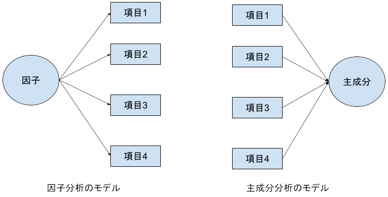
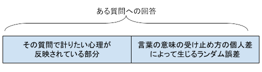
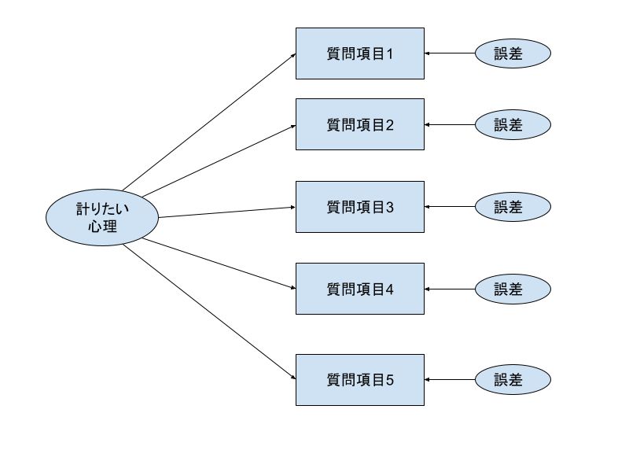
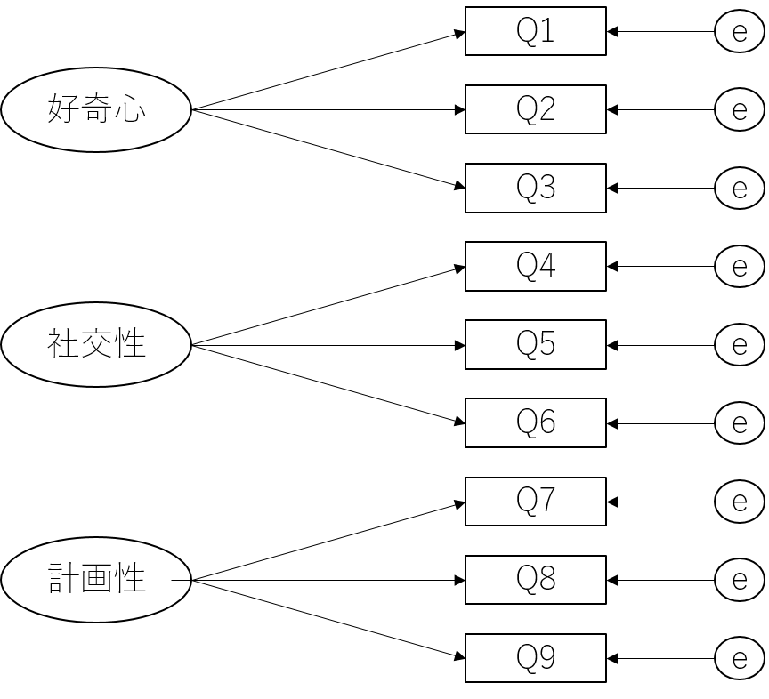

```{r setup, include=FALSE}
knitr::opts_chunk$set(echo = TRUE)
library(tidyverse)
```

取得したデータの変数が多い場合（**多変量データ**と呼ぶ）に，それら1つ1つの変数を分析するのは非常に骨が折れる作業になる．そういう場合には，「似たようなデータ」になっているものを集約して，もとの変数よりも少ない数の集約変数で分析するのが効率的である．

そのような変数の集約をするための分析が主成分分析（PCA: Principal Component Analysis）と因子分析（FA: Factor Analysis）である．

以下ではこれら2つの分析の仕方について説明する．

なお，例によって`tidyverse`パッケージは予め読み込んでおくこと．

# 主成分分析

主成分分析は多数の変数を持ったデータから，文字通りデータの「主成分」を抽出する分析である．主成分とは，**もとのデータ全体のばらつき方の情報を可能な限り反映した変数**のことである．
最も強く反映した変数を第1主成分，２番目に反映した変数は第2主成分，３番目を第3主成分...という具合に名付けられる．

<!-- 最終的には分析にかけた変数の数だけ「主成分」が抽出される．当然ながら全ての「主成分」を使えば元のデータのばらつき情報は完全に反映される． -->


では，実際に以下の例題を使って主成分分析を行なっていこう．

:::practice
[こちら](./practice/example_13_Test.csv)のデータは，大学入試共通テストの5教科9科目分の結果である．これを主成分分析せよ．


（あくまで2024年度の結果からシミュレーションしたものであり，実際の得点ではない）

```{R include=FALSE}
library(truncnorm)
set.seed(41)
num = 10000
ベース <- rnorm(num,0,1)
baserate <- 0.2
国語 <- rnorm(num, 0, 1) + baserate*ベース
数学IA <- rnorm(num, 0, 1) + 0.1*国語+ baserate*ベース
数学IIB <- rnorm(num, 0, 1) + 0.7*数学IA+ baserate*ベース
世界史B <- rnorm(num, 0, 1) + 0.4*国語+ baserate*ベース
地理B <- rnorm(num, 0, 1) + 0.2*世界史B+0.2*国語+ baserate*ベース
化学 <- rnorm(num, 0, 1) + 0.2*数学IA+0.2*数学IIB+ baserate*ベース
物理 <- rnorm(num, 0, 1) +  0.3*数学IA+0.3*数学IIB+ baserate*ベース
英語R <- rnorm(num, 0, 1) + 0.3*国語 + 0.2*数学IA + baserate*ベース
英語L <- rnorm(num, 0, 1) + 0.6*英語R + 0.2*数学IA + baserate*ベース


data <- data.frame(
  国語   = round(国語 * 35.33 + 116.50,0), #mean=116.50, sd=35.33,
  数学IA = round(数学IA * 20.73 + 51.38,0),# truncnorm::rtruncnorm(n=1000, a=0, b=100, mean=51.38, sd=20.73),
  数学IIB= round(数学IIB* 20.67 + 57.74,0),# truncnorm::rtruncnorm(n=1000, a=0, b=100, mean=57.74, sd=20.67),
  世界史B= round(世界史B* 21.55 + 60.28,0),# truncnorm::rtruncnorm(n=1000, a=0, b=100, mean=60.28, sd=21.55),
  地理B  = round(地理B  * 15.04 + 65.74,0),#truncnorm::rtruncnorm(n=1000, a=0, b=100, mean=65.74, sd=15.04),
  物理   = round(物理   * 22.82 + 62.97,0),#truncnorm::rtruncnorm(n=1000, a=0, b=100, mean=54.77, sd=20.95),
  化学   = round(化学   * 20.95 + 54.77,0),#truncnorm::rtruncnorm(n=1000, a=0, b=100, mean=54.77, sd=20.95),
  英語R  = round(英語R  * 19.94 + 51.54,0),#truncnorm::rtruncnorm(n=1000, a=0, b=100, mean=51.54, sd=19.94),
  英語L  = round(英語L  * 17.12 + 67.24,0)#truncnorm::rtruncnorm(n=1000, a=0, b=100, mean=67.24, sd=17.12)
)
write_csv(data, "./practice/example_13_Test.csv")
```

:::

まずはこのデータの概要を把握しておこう．今回のデータは全部で1万点もあるデータなので`print(data)`とするととんでもない表が出力されてしまうので，冒頭6行だけを表示させるように`head()`を使っている．

また，データの概要として標準偏差も表示させたいので`summary()`ではなく`psych`パッケージに含まれる`describe()`を使っている．`describe()`は，[こちら](./RText_04_DescriptiveStatistics.html#記述統計量をまとめて出力するコマンド)で紹介をしたデータの要約統計量を出力する関数である．

``` {r}
data <- read.csv("./practice/example_13_Test.csv")
head(data)
psych::describe(data)
```


なお，`psych::describe()`という書き方は`psych`パッケージを，`describe()`関数を使うときだけ適用する場合に用いる書き方である．もちろん`library(psych)`を実行してもよいが，今回は`describe()`を実行するためだけなので，このような対応をした．

:::ref
<details>
<summary>`::`の詳細</summary>
`::`は正確には「名前空間」（name space）を指定する演算子（Operator)である．
各パッケージはそれぞれそのパッケージ名と同一の「空間」を持っており，各パッケージに含まれる関数はその空間の中でその機能が定義されている．

`library()`関数は現在実行中のプロジェクトにパッケージを読み込む関数であるが，内部で行っていることは，そのパッケージの名前空間をプロジェクトと結びつけてる，というものである．そしてRで関数を実行する際には，その都度，そのプロジェクトと結びつけられた名前空間から関数の定義を検索し，その名前空間まで定義を読み込みに行くという処理を内部で行っている．

つまりlibrary()を使うことによって，その名前空間を関数の検察範囲を含めることができるので，その名前空間に含まれる関数を使用できるようになるのである．

`::`を使うと，関数を呼び出す時点で**明示的に名前空間を指定することができる**．こうすると，検索を掛ける必要がなく，直接その名前空間の中の定義を読み込みに行ける．このため，PCにそのパッケージが存在していさえすれば**`library()`でそのパッケージを読み込んでいなくても**その関数を使うことができるのである．

Rでは同じ名前なのに，異なるパッケージで定義され，機能も異なっている関数が存在する．それらの関数が含まれるパッケージを読み込んでしまうと，実行時にいずれの定義を参照すればよいかが分らなくなるという問題がある．Rではこの解決策として**より新しく読み込んだlibrary()の定義を参照する**ように作られているが，場合によっては前のライブラリのパッケージで定義された関数を実行したいケースも当然存在する．こうした時に`::`で明確にパッケージを指定することによって，期待通りの関数が呼び出されるようになる．
</details>
:::


さらに各科目間の相関もついでに見ておこう．
```{r}
round(cor(data),2)
```

この結果から，国語・世界史B・地理の間，また，数学IA・数学IIB・化学・物理の間，さらに英語R・英語Lの間にはある程度相関があることが分かる．

## 主成分分析の実行
では主成分分析を実行してみよう

主成分分析を行う関数は`prcomp()`である．引数は以下の通り．

- 第1引数: 主成分分析に掛ける多変量が含まれたデータフレーム
- 第2引数 scale（省略可）: データを標準化するかどうか．省略すると`TRUE`が設定される．通常は省略してよい．


:::ref
<details>
<summary>第2引数について</summary>
第2引数についてはデフォルトで`TRUE`となっている．これは例えば多変量データの中に，単位が異なる変数が混在している場合，ばらつき方の情報が単位に依存してしまい，主成分分析の結果が変わってしまうためである．例えば体重[kg]と身長[cm]の場合，体重の分散は身長の分散に比べて小さくなってしまう．これは実際に「ばらつき方」として小さいということではなく，体重が身長に比べて小さな値となる単位を用いているためである．逆に身長を[m]で表記した場合には，体重の方が身長よりも分散が大きくなる．このように，そのままの値ではばらつき方の情報がそれぞれの変数の単位に依存してしまうため，標準化を行って単位系の違いが影響しないようにして，真のばらつき方の情報を利用するのが一般的である．
</details>
:::

結果は一旦オブジェクト`PCA`に収めた上で，`summary()`で出力させる．

```{R}
pca <- prcomp(data)
summary(pca)
```


主成分分析では，与えた変数の数だけ「主成分」が出力され，それらは順に第1主成分，第2主成分，第3主成分，...と呼ばれる．今回の例の場合だと9つの変数を与えているので出力される主成分は全部で9つとなる．

第1主成分が元のデータのばらつきをもっとも大きく反映している変数であり，第2主成分は**第1主成分に含まれていないばらつき**を反映している変数，第3主成分は第1主成分と第2主成分に含まれていないばらつきを反映している変数となる．こうしたことから，9つ全部使えば，当然ながら元のデータのすべてのばらつきを反映することができる．


`summary()`関数で得られる結果は，合成された変数の元のばらつきを反映している度合についての情報を，その度合いが大きいものから順に出力する．

- 1段目: 主成分として抽出（正確には合成）されたそれぞれの成分の標準偏差
- 2段目: **分散説明率**と呼ぶ．各主成分がそれぞれ元のデータのばらつき情報（分散）をどの程度説明しているか（反映しているか）の割合
- 3段目: **累積説明率**と呼ぶ．分散説明率の累積値である．

例えば，上記の結果の場合，第1主成分（PC1）は2段目の情報から元のデータの約`r round(pca$sdev[1]^2/sum(pca$sdev^2)*100,0)`%の情報を説明しているということであり，第1～第3主成分の3つの主成分で元のデータの情報（ばらつき）の約`r round(sum(pca$sdev[1:3]^2)/sum(pca$sdev^2)*100,0)`%を説明（反映）しているということとなる．


## どこまでの主成分を採用するか

主成分分析を使う目的は，多変量データをより少ない数の変数に集約することであり，文字通り，元のデータの「主な成分」を抽出することである．そのため，どこまでの主成分を使うかをそれぞれの目的に応じて選択する必要がある．
選択のパターンとしては主には以下のものがある．

- 単純に第1主成分のみを使う．
- 第1主成分と第2主成分を使う．図として描画する場合にはこのパターンが多い．
- 第1主成分と第2主成分と第3主成分を使う．人が頭の中でイメージできるのは精々ここまで．
- 累積説明率が6割程度になるところまでの主成分を使う．
- fa.parallel()関数を使って，主成分数を決める．
- 次に述べる主成分の解釈可能性から選択する．

fa.parallel()関数は，因子分析の際に因子数を決めるために使われることの多い関数であるが，主成分分析でも同様に使うことができる．詳しくは[因子分析を説明する際](#fa.parallel())に説明する．

今回のデータだと，第3主成分で累積説明率が約6割になるので，とりあえず，第3主成分までを仮採用することにしよう．

つまり，もともと9科目分あった変数が3つの主成分に集約された，ということである．


## 主成分の解釈
上記の方法で実際に採用された主成分について，その主成分が一体どういう意味合いを持った成分なのかの解釈が求められることは多い．

解釈をする場合には，主成分の各変数に対する**主成分負荷量**を見ることが重要である．
主成分負荷量とは，主成分がどの程度その変数に依存しているかを示す指標であり，主成分負荷量の絶対値が大きいほどその変数が主成分に影響を与えていることを示す．正負の向きは関係の向きを表す．

主成分負荷量は，`pca`オブジェクトの`rotation`という変数に格納されており，`pca$rotation`で取得できる．
そのまま表示させると小数点以下の桁数が多くなってしまうので，以下の例では，    `round()`関数によって四捨五入し，小数点第2位まで表示させている．

```{r}
round(pca$rotation,2)
```

この結果から，PC1は絶対値の大きいものから順に数学IA，数学IIB，物理が反映された主成分であり「理系得点」と解釈できる．

逆にPC2は国語，世界史，地理Bの順で大きく反映されており「文系得点」と解釈できるだろう．

第3主成分は英語R，英語Lが他よりも強く反映されており「英語」と解釈できる．


## 主成分得点
さて，採用する主成分が定まったあとは，それぞれのサンプルの主成分得点を得ることが次のステップとなる．主成分得点は，主成分分析の結果を収めたオブジェクトの中に`x`という変数名で収められており，先の例であればpca$x`で取得できる．

head()で最初の6行だけを表示してみる．

```{r}
head(pca$x)
```

さらに主成分得点の概要を把握するために，`describe()`関数を使ってみる．
```{R}
psych::describe(pca$x)
```

今回の主成分分析を実行する際に標準化を行っているため，主成分得点も標準化された得点として抽出されている．このため主成分得点の平均は0となっている．一方標準偏差は元データのばらつきが大きく反映されている主成分だと1を超える（つまり，元の単独の変数が持っていた情報よりも多くの情報を持っている）し，あまり反映されていないものだと1を下回る（つまり元の単独の変数が持っていた情報よりも少ない情報しか持っていない）．

## 主成分分析の使いみち

さて，以上が主成分分析の具体的な手法であるが，主成分分析はどのような場面で使われるのだろうか．

主成分分析の目的は，多変量データをより少ない数の変数に集約することである．そのため，主成分分析は「数多くの変数」を扱う場面で用いられる．

例えば，以下のような場面で主成分分析が使われることがある．

**マクロ経済指標の分析**

  - 目的: 多数の経済指標（GDP成長率，失業率，インフレ率，貿易収支など）の関係性を理解し，データを簡略化する．
  - 例: 世界銀行やIMFが複数の国の経済指標を主成分分析して，各国の経済状況を総合的に評価するための指数（例えば「経済健全性指標」）を作成する．
  
**株式市場のセクター分析**

  - 目的: 株式市場における複数の株価指標（売上高，利益率，PER，PBRなど）を主成分分析して，主要な変動要因を特定する．
  - 例: 投資ファンドが株式市場のセクター（テクノロジー，金融，エネルギーなど）のパフォーマンスに共通する要因を抽出し，リスクを分散した投資戦略を策定する．
  
**顧客行動データの分析**

  - 目的: 購買履歴やアンケート結果など，多次元の顧客データから行動パターンを明らかにする．
  - 例: 小売業やEコマースで，購買頻度，支出額，購入カテゴリなどを主成分分析して，顧客を類似したグループに分類し，マーケティング施策を最適化する．

<!-- **経営戦略における競争要因の特定** -->

<!--   - 目的: 複数の競争要因（市場シェア，顧客満足度，価格競争力など）を次元削減して，企業の競争優位性をシンプルに表現する． -->
<!--   - 例: 経営者が競争戦略を立てる際，主成分分析を用いて最も影響力の大きい要因を特定し，経営資源を集中させる．   -->

<!-- **マーケットセグメンテーション** -->

<!--   - 目的: 市場データや消費者データをもとに，複雑なデータセットを簡略化して市場をセグメント化する． -->
<!--   - 例: 製品開発において，年齢，性別，所得，趣味などの多次元データを主成分分析で要約し，ターゲット顧客層を明確にする． -->

<!-- **経済危機のリスク評価** -->

<!--   - 目的: 銀行や国の財政状況を示す複数の指標を要約し，潜在的なリスクを評価する． -->
<!--   - 例: リーマンショックのような金融危機の際に，バランスシートの健全性指標を主成分分析で統合し，リスクが高い金融機関を特定する． -->

もちろん，実際には主成分析だけでこれらの分析ができるわけではなく，他の分析手法（例えば[回帰分析](./RText_Regression.html)や[クラスター分析]()）と組み合わせて使われることが多い．

特に回帰分析の際に，数多くの変数を説明変数（独立変数）として設定してしまうと，個々の説明変数の回帰係数が有意になりにくくなってしまったり，多重共線性が生じやすくなってしまう．そういう場合には，まず主成分分析を実施して，多数の説明変数を小数のものへと集約しておくと，回帰分析の結果として解釈しやすい結果が出力されるようになる．


# 因子分析

因子分析も主成分分析と同様に沢山ある測定項目をそれより少ない項目に集約する分析である．ただ，「計測値データから，データのばらつきをよく表す成分を抽出する」ことを目的とする主成分分析とは異なり，因子分析では「**計測値データから，背後に潜在していて結果に影響を与えている要因（因子）を推定する**」ことを目的とする（以下の図を参照）．




因子分析は組織行動論や消費者行動論，あるいはミクロ経済学など人の心理や行動を扱う様々な分野で利用されるが，いずれも**アンケート結果に対して因子分析を掛ける**というものである．そこでを以下ではアンケート調査と因子分析の理論的背景について解説し，そののち，因子分析の実施方法について説明する．

## アンケートと潜在変数（因子）

たとえば，心理アンケートをやっていて「似たような質問項目が繰り返し出てきている」と感じたことはないだろうか．実際に心理アンケートでは意味内容が似通った（ただし文言は異なる）質問を複数並べることが一般的である．なぜそのようなことをするのだろうか．それを理解するためには次のことを理解しておく必要がある．

- 基本的に人の心理はあくまでその人の心の中に潜在的に存在しているものであり，それを物理的に直接計測することはできない．
- そのため，質問項目を示してそれへの回答（心理が反映された行動）を元にその心理を推定する必要がある（ここでは質問への回答は１～７や１～５などの数値で「程度」を回答しているものとする）
- しかし，質問項目文を構成している個々の単語の意味の受け止め方やイメージされることは人それぞれ微妙に異なっているし，その時の気分によっても印象は変わるため，どれだけアンケート作成者が熟慮して作ったとしても，質問項目がその心理を計りとれる保証はない

つまり，一つの質問項目を作成したときに，その回答には，以下の図のようにこちらが計りたいと思っている心理が反映されている部分と，人々の間で生じるわずかな言葉の意味の受け止め方の違いやその時々の気分の違いに起因してランダムに混入する誤差との，2つの部分で構成されていることになる．



質問項目が1項目しかないと，この誤差の部分が相対的に大きくなってしまうため，その項目の回答を「測りたい心理」として用いることが難しくなる．

ではどうすればよいだろうか．
文言が異なるが「似たような意味」を持つ質問項目をもう一つ持ってきて，それの回答と先の回答を足し合わせてみると，「測りたい心理」が反映されている箇所は，そのまま重ね合わされて増幅される．一方で誤差の部分は全くランダムに混入しているものになるので，サンプル単位では増幅されたり，相殺されたり，サンプルごとに異なってくるが，データ全体でみれば結局トータルでは元の誤差とそれほど誤差の大きさは変わらなくなる．

数式的に表現すれば，例えば

$$
1つ目の項目の回答 = 0.5 \times 測りたい心理 + 0.5 \times 誤差_1\\
2つ目の項目の回答 = 0.5 \times 測りたい心理 + 0.5 \times 誤差_2
$$

とすれば

$$
1つ目の回答+2つ目の回答 =1.0 \times 測りたい心理 + 0.5 \times 誤差_3
$$ 

となる．$誤差_3$は$誤差_1$と$誤差_2$の和であり，サンプル単独では増幅されることもあれば相殺されることもあるが，そうした増幅と相殺が組み合わさって，データ全体では結局$誤差_3$は$誤差_1$や$誤差_2$と同程度の大きさになる．

つまり単独の項目では，測りたい心理と誤差とが1:1であったのが，2つを足し合わせることによって2:1とできるようになる．
質問項目が3つになれば3:1となるし，4つになれば4:1となる．

このような原理から，一見すると「似たような意味」となる質問項目文を複数作成し，それらを重ね合わせることによって，誤差の部分を相殺させるとともに，計りたい心理が反映されている部分を増幅させているのが心理アンケートの項目なのである．

そして，以上のような考えをベースとして，**実際に測定した複数の項目から潜在している（直接計測ができない）因子（の値）を推定しよう**というのが因子分析である．因子分析の構図を図で示すと以下のようになる．




主成分分析はあくまで得られた結果からばらつき情報をうまく反映した成分を「抽出」する**結果駆動型**であるのに対して，因子分析ではあくまで理論として潜在的な因子を仮定し，その因子の表れが測定結果であるという前提の下に，結果から因子を**逆算**する形で推定する**理論駆動型**である，ということが両者の違いとなる．

<!-- さらに主成分分析では元のばらつき情報を最終的には100%反映させるために，元データが持つ変数の個数と同じ個数の成分が抽出され，その結果を見て，どの成分までを「主成分」として採用するかを決めるのに対し，因子分析では，あらかじめ因子数の仮定が存在していることや，ばらつき情報を100%反映させることは目的ではない点が異なる． -->

## 基本的な因子分析

では実際に以下の例題を使って，因子分析を実行してみよう．

:::practice
学生のSNSの利用状況と学生の性格（好奇心，社交性，計画性）との関連を調査するために，これら3つの性格特性を測定するためのアンケートとして以下に示す9つの項目のアンケートを作成した．順にQ1, Q4, Q7は「好奇心」に関する項目，
Q2, Q5，Q8は「社交性」に関する項目，
Q3, Q6, Q9は「計画性」に関する項目である．また(-)をつけているものは逆転項目である．

- Q1: 新しいものに興味がある
- Q2: 他人とのコミュニケーションが好きである
- Q3: 物事をじっくり考える方である
- Q4: 知らないものにはとりあえず近づいてみる
- Q5: 人の意見よりも自分の意見を重視する（－）
- Q6: 思いついたらすぐに行動する方である（－）
- Q7: 同じことを続けるのは苦手である
- Q8: 誰とでも仲良くなれる方である
- Q9: 計画通りに物事が進まないとイライラする方である




学生400名に対して，これらのアンケートに回答（1：全く当てはまらない～5：すごく当てはまる，の5段階尺度）してもらうとともに，各自のスマートフォンに記録されているSNSアプリの1日に当たりの平均利用時間を回答してもらった．その結果，[このようなデータ](./practice/example_13_personality.csv)が得られた．


このデータから，性格とSNSの利用時間との関係を明らかにせよ．

```{r include=FALSE}
set.seed(123)

num <- 400
Q1 <- rnorm(num, 0, 1)
Q2 <- rnorm(num, 0, 1)+0.3*Q1
Q3 <- rnorm(num, 0, 1)+0.3*Q2
Q4 <- rnorm(num, 0, 1)+Q1
Q5 <- rnorm(num, 0, 1)+Q2
Q6 <- rnorm(num, 0, 1)+Q3
Q7 <- rnorm(num, 0, 1)+Q4 #+ 0.3*Q4
Q8 <- rnorm(num, 0, 1)+Q5 #+ 0.3*Q5
Q9 <- rnorm(num, 0, 1)+Q6 #+ 0.3*Q6
SNS <- 2*rnorm(num, 0, 1)+0.15*(Q1+Q4+Q7)+0.18*(Q2+Q5+Q8)-0.17*(Q3+Q6+Q9)

data <- data.frame(
  Q1 = round((Q1 - min(Q1))/(max(Q1)-min(Q1))*4+1,0), 
  Q2 = round((Q2 - min(Q2))/(max(Q2)-min(Q2))*4+1,0),
  Q3 = round((Q3 - min(Q3))/(max(Q3)-min(Q3))*4+1,0),
  Q4 = round((Q4 - min(Q4))/(max(Q4)-min(Q4))*4+1,0),
  Q5 = 6-round((Q5 - min(Q5))/(max(Q5)-min(Q5))*4+1,0),
  Q6 = 6-round((Q6 - min(Q6))/(max(Q6)-min(Q6))*4+1,0),
  Q7 = round((Q7 - min(Q7))/(max(Q7)-min(Q7))*4+1,0),
  Q8 = round((Q8 - min(Q8))/(max(Q8)-min(Q8))*4+1,0),
  Q9 = round((Q9 - min(Q9))/(max(Q9)-min(Q9))*4+1,0),
  SNS= round((SNS - min(SNS))/(max(SNS)-min(SNS))*5+1.2,1)
)

write_csv(data, file="./practice/example_13_personality.csv")

round(cor(data),2)

print(psych::fa(data, 3), sort=T, digits = 3)#, rotate="promax", fm="ml"))
res <- psych::fa(data, 3)
res$scores

summary(lm(data$SNS ~ res$scores))

```

:::

このような課題の場合，手続として，各性格特性の値を因子分析によって求め，得られた因子得点を説明変数として，SNS利用時間を目的変数とした回帰分析を行うことになる．

そこで，以下で因子分析を行なっていく．

### データの確認
因子分析を行う前に，まずはどういうデータを確認してみよう．

```{r}
# データの読み込み
data <- read.csv("./practice/example_13_personality.csv")

# データの内容確認
head(data) # 冒頭6行表示
summary(data) # 記述統計量の表示
round(cor(data),2) # 相関行列の表示.round関数を使って2桁までにしている
```

相関を見ると基本的に想定していた通りの３項目ずつで相関値が心理学的に高いとされる値になっていることや，逆転項目になっている項目については負の値になっていることがわかる．

加えて，一部の項目では0.2〜0.3ほどの相関（心理学的には弱いながらも相関があるとされる）も見られる．

### 因子分析の実行

Rで因子分析を行う関数はいくつかあるが，もっとも使いやすいのは`psych`パッケージに含まれる`fa()`関数である．引数は以下の通り．

- 第1引数: 因子分析に掛ける多変量が含まれたデータフレーム
- 第2引数: 因子数． 何個の因子を推定するのかを指定する．
- 第3引数 rotate: 回転方法（省略可）． 因子をどのように回転させるかを指定する．
- 第4引数 fm: 推定方法（省略可）． 因子の推定方法を指定する．

第3引数や第4引数については後で説明する．デフォルト値が設定されているので，基本的には省略してもよい．

結果は一旦オブジェクトに収めた上で，`print()`で出力させる．その際には以下の引数とする．

- 第1引数: faの出力結果を収めたオブジェクト
- 第2引数 sort（省略可）: TRUEにすると因子負荷量の絶対値の大きい順に表示される．省略するとデータ上の項目の並びの順に出力される．**TRUEにするのが一般的．**．
- 第3引数 digits（省略可）: 表記の小数点以下の桁数を指定する．省略すると2桁表記となる．


```{r}
#psychパッケージの読み込み
library(psych)

# 因子分析の実行
fa_result <- fa(data[c(1:9)], 3) #dataには最後の列にSNSの利用時間が含まれているので，それを除いたものを指定する
print(fa_result, sort=TRUE) #digits=3とすると結果が3桁表記になる
```


### 結果の見方

様々な結果が表記されるがとりあえず確認すべき箇所は以下の箇所である．

```{r echo=FALSE}
fa_loadings <- fa_result$loadings
fa_loadings <- as.data.frame(unclass(fa_loadings))
fa_loadings_df <- data.frame(
  item = c(1:9),
  MR2=fa_loadings$MR2,
  MR1=fa_loadings$MR1,
  MR3=fa_loadings$MR3
)
rownames(fa_loadings_df) <- c("Q1", "Q2", "Q3", "Q4", "Q5", "Q6", "Q7", "Q8", "Q9")
print(round(fa_loadings_df[c(6,9,3,5,8,2,4,7,1),],2))
```

この部分は推定された3つの因子が各質問項目にどの程度結びついているか（因子を説明変数，質問項目を目的変数としたときの回帰係数）を表している．この値のことを**因子負荷量**と呼ぶ．因子負荷量は−1から1の値を取り，絶対値が1に近いほど強い結びつきを，0に近いほど弱い結びつきを意味する．正負は関係性の向きを表している

因子負荷量は**絶対値が0.4**を超えている場合に，その項目はその因子に結びついていると判断するのが一般的である．
今回の結果だと，MR2はQ3, Q6, Q9と，MR1はQ2, Q5, Q8と，MR3はQ1, Q4, Q7とそれぞれ結びついている，と判断される．
つまりこの結果から，当初想定していた通りの因子構造が推定された，ということがわかる．

### 結果の図示

因子負荷量を図示することで，因子と項目の関係をより直感的に理解することができる．
psychパッケージにはfa()関数の結果を描画してくれる便利な関数として，`fa.diagram()`関数が用意されている．
引数は以下の通り．

- 第1引数: faの出力結果を収めたオブジェクト
- digits: 表記の小数点以下の桁数を指定する．省略すると2桁表記となる．
- cut: 因子負荷量の絶対値がこの値を超える場合に線を引く．省略すると0.3が設定される．
- simple: TRUEにすると各項目につき因子負荷量が最も高い因子との結びつきのみが表示される．FALSEにすると全ての因子との結びつきが表示する．ただしいずれもcutを下回るものについては表示されない．

図の中で赤い破線の矢印は因子負荷量が負の値となっているものを示している．

```{r}
# 図示
fa.diagram(fa_result, digits=2, cut=0.4, simple = TRUE)
```

試しに，cutを0.05まで下げて，simpleをFALSEにしてみると，上では表示されたなかった結びつきや，因子同士の相関が表示される．
```{R}
# SimpleとCutをいじる
fa.diagram(fa_result, digits=2, cut=0.05, simple = FALSE)
```

### 因子得点

推定された因子得点はfa()の出力結果のscoresに格納されている．
以下では，推定された因子得点の冒頭6行を表示している．

```{r}
head(fa_result$scores)
```
因子得点は平均が0，標準偏差が1になるように標準化されている．
（実際には，計算誤差等により標準偏差が完全に1となるわけではないが1に近い値になっている）

次のようcbind()関数を用いると，元のデータに因子得点が格納される．
```{r}
data <- cbind(data, fa_result$scores)
head(data)
```


### 参考：例題の遂行
因子分析としては以上となるが，さらに例題での課題となっている学生のSNS利用時間との関連を調べてみよう．

まずはこれらの因子得点をdataに格納した上で，SNS利用時間との相関を見てみよう．
```{r}
cor(data[c("SNS","MR1","MR2","MR3")])
```
SNSの列をみると，相関係数は0.2〜0.3程度であり，心理学的には弱いながらも相関があると言える．

さらに，「社交性（MR1）や好奇心（MR3）が高く，計画性（MR2）が低い学生ほどSNSを多く利用する」という仮説を検証するために，標準化重回帰分析を行ってみよう．

```{r}
#標準化
data[c("SNS","MR1","MR2","MR3")] <- scale(data[c("SNS","MR1","MR2","MR3")])

lm_result <- lm(SNS ~ MR1+MR2+MR3, data)
summary(lm_result)
```

この結果から，いずれも有意な回帰係数が得られており，「社交性や好奇心が高く，計画性が低い学生ほどSNSを多く利用する」という仮説が支持されたことがわかる．


:::ref
<details>
<summary>因子得点か尺度化か</summary>
実際に心理学や行動科学の論文では，実は因子得点を使うことはあまりなく，多くの場合は因子分析の結果として各因子と項目の関係が見出された後は，関係のある項目同士の単純な平均値や合計値を各因子の「尺度」とすることが多い．

例えば，上記の例だと，以下のようにする．なお，Q5とQ6は逆転項目であるため，数値をひっくり返す必要があるため，`6-`をつけている．6から引いているのは5段階尺度のためであり，7段階尺度の場合には8から引くことになる．

```{r}
# 因子得点を尺度化する
社交性<- (data$Q2 + 6-data$Q5 + data$Q8)/3
好奇心<- (data$Q1 + data$Q4 + data$Q7)/3
計画性<- (data$Q3 + 6-data$Q6 + data$Q9)/3
```

実際にこうして得られた尺度得点を用いて，SNS利用時間との関係を見てみよう．

```{r}
#作成した尺度をデータフレームに格納
data <- cbind(data, 社交性, 好奇心, 計画性)

#相関
cor(data[c("SNS","社交性","好奇心","計画性")])

#回帰分析
data[c("SNS","社交性","好奇心","計画性")] <- scale(data[c("SNS","社交性","好奇心","計画性")])
lm_result <- lm(SNS ~ 社交性+好奇心+計画性, data)
summary(lm_result)

```
先ほどの因子得点の場合と似たような結果となっている．

では，因子得点と尺度得点のいずれを使うかは，研究目的によって異なるが，一般に尺度得点を用いることが多いのは，因子得点はあくまでその時のデータでのみ有効な算出方法によって因子得点を算出しているのであり，他のデータを用いて算出した因子得点との比較が難しいためである．

一方，尺度得点は，得点の算出方法が明確であり，他のデータでも同じ方法で算出できるため，他の研究との比較が容易である．

したがって，自身の研究結果と他の研究結果とを比較したいような場合には，尺度得点を用いることが一般的である．

ただし尺度得点を用いる場合には，因子分析だけでなく，それらを合算することの妥当性（内的整合性：つまり互いに十分な相関を持っているかどうか）をそれぞれの尺度得点を求める前に，それぞれごとに評価する必要もある．一般にはクロンバックの$\alpha$係数や，$\omega$係数を用いて評価することが多い．以下にそれぞれ求めている例を紹介する．

alpha()関数，omega()関数はいずれもpsychパッケージに含まれている．いずれも引数は以下の通り．

- 第1引数: 分析対象となるデータの列を指定する．
- check.keys: TRUEにすると，逆転項目と思われるものが含まれている場合に，自動で値を逆転させて評価する（ただし，必ずしも本当に逆転項目であるとは限らないため，注意が必要）．

```{R}
#クロンバックのα係数
alpha(data[c("Q1", "Q4", "Q7")], check.keys = TRUE)
alpha(data[c("Q2", "Q5", "Q8")], check.keys = TRUE)
alpha(data[c("Q3", "Q6", "Q9")], check.keys = TRUE)

#ω係数
omega(data[c("Q1", "Q4", "Q7")], check.keys = TRUE)
omega(data[c("Q2", "Q5", "Q8")], check.keys = TRUE)
omega(data[c("Q3", "Q6", "Q9")], check.keys = TRUE)
```
いずれもさまざまな結果が表記されるが，alpha()関数の場合にはraw_alphaの値を，omega()関数の場合にはOmega Totalの値を見るとよい．一般的にはこれらが0.7を上回っていれば合算や平均にすることに十分な妥当性があると評価される．一方，0.6〜0.7だと妥当性が十分とはいえず注意しながら使うことになる．0.6を下回ってしまった場合には妥当性でないと判断され，使うべきではない，とされる．

</details>
:::

## 探索的因子分析と検証的因子分析

ところで，心理アンケートは上記に示したロジックから，アンケート項目を多く作れば，それだけ誤差は相殺し合う一方で，測りたい心理が反映されている部分は重ね合わさって増幅していく．こうしたことから，似たような意味内容の質問項目を数多く設ければ，測定したい心理をより純粋に測定することができるようになると考えられる．

しかしながら，実際にそうしてみると，もともとは同じ意味内容だと思って設けた（＝ある共通した1つの因子が反映されるだろうと思っていた）質問項目であっても，微妙な違いがそこに存在していて，その違いが増幅されることによって，複数の因子が潜在していたことが発見される，といったこともしばしばある．

そこで自分が作成して実施した質問項目から，いくつの因子を抽出できるかを探索的に見つけ出すために因子分析を行うこともある．こうした因子分析を**探索的因子分析（Exploratory Factor Analysis: EFA）**と呼ぶ．通常，因子分析という場合には，この探索的因子分析のことを指す．

それに対して，「これらの項目への回答はこの因子から生じるものである」という仮説を自分の中でより強く持っていて，その仮説を検証するために行われる因子分析を**検証的因子分析もしくは確認的因子分析（Confirmatory Factor Analysis: CFA）**と呼ぶ．特に既存の研究で十分に検討されたうえで作りこまれたアンケートを自身の研究に利用するような場合には，探索的に因子を推定するというより，既存研究で言われている通りに因子が推定できるかの検証が重要となるためCFAが用いられることが多い．

CFAを行うには，`lavaan`パッケージという別のパッケージ（共分散構造分析に用いるパッケージ）を使うことが一般的であるが，そちらはまた別の機会に紹介することとして，ここではEFAのみを扱うこととする．

## 探索的因子分析の実施方法

探索的因子分析を実施する際には，以下の手順で行うことが一般的である．

1. 推定する因子数の模索
2. 因子分析の実施と解釈
3. 因子負荷量・適合度指標の確認

これらを順に次の例を使って説明していく．

:::practice
[次のデータ](./practice/example_13_EFA.csv)は実際に著者が自身の研究の中で実施した病院看護師に対するアンケートの回答データである．このアンケートでは，看護師らに対して自分の上司（つまりは看護師長）のリーダーシップを評価してもらうことを目的に22の項目を設けた．Q1～7までと，19，20はどちらかと言うと「良い上司のリーダーシップ」が反映されるだろうと思って設けたのに対して，Q8～18と21，22は「嫌な上司のリーダーシップ」が反映されるだろうと思って設けた項目である．これら22個の質問項目から得られた結果から，いくつの因子が潜在しているかを調べるとともに，推定された因子の内容を解釈せよ．

**具体的な質問項目：**

- Q1	上司は私が落ち込んでる時にはそのことに気づくことができる
- Q2	上司は自職場だけでなく病院全体や地域全体に貢献することの重要性を強調する
- Q3	上司は何か悪いことが起ころうとしていると，そのことに気づき，伝えてくれる
- Q4	上司は，私が困難な状況に対応する際には，「私自身が最良と感じる方法で対応すれば良い」と言ってくれる
- Q5	上司は私のキャリアの発達を優先してくれている
- Q6	上司	は上司自身の利益よりも私自身の利益を優先する
- Q7	上司はいつも誠実である
- Q8	上司は私に対して指示に完全に従うように言ってくる
- Q9	上司はそれが重要なものかどうかにかかわらず，組織におけるあらゆることを自分で決めようとする
- Q10	上司はいつも会議で最後に一言発言をする
- Q11	上司はいつも従業員の前では威圧的なふるまいをする
- Q12	私は上司とともに仕事をするときにはプレッシャーを感じる
- Q13	上司は部下を厳しく指導している
- Q14	上司はタスクが達成できないと厳しく叱責してくる
- Q15	上司は「我々の部署は組織の全部署のなかで，一番の業績を上げなければならない」と強調してくる
- Q16	我々はモノゴトを進める際には上司のルールに従わなければならないさもないと厳しく罰せられる
- Q17	上司は私の（私たちの）業務の実態を分かっていないと感じる
- Q18	上司は私の（私たちの）業務を数字でしか捉えていないと感じる
- Q19	上司は私の（私たちの）業務を遂行している現場によく顔を出す
- Q20	上司は私の（私たちの）業務の状況をよく聞きにくる
- Q21	上司は私の（私たちの）ことよりも，上役の方を見ていると感じる
- Q22	上司に私の（私たちの）業務実態について話ができる機会・場が設けられていない


:::

まずは`psych`パッケージを読み込みと，データの読み込みをしておく．

```{r }
library(psych)

data <- read.csv("practice/example_13_EFA.csv")
```

また読み込んだデータの内容も一応確認してみよう．
なお`[-1]`をつけているのは，今回のデータの場合，冒頭の列はサンプルNo.であるためである．このように`-列番号`とすることで指定した列を除外することができる（[参考](RText_03_BasicUsage.html#ベクトルからの要素の削除)）．
```{r echo=FALSE}
head(data)
data$SampleNo.<-as.factor(data$SampleNo.)
round(describe(data[-1]),2)
```

### 因子数の模索

質問紙をつくる際には当然ながら「推定したい因子」があるはずであり，その因子が反映されるであろう質問項目が作られているので，「推定したい因子」の数がここでいう因子数となるのが基本である．

しかしながら，実際には自分が思い描いた通りの因子構成にならず，想定よりも少ない因子構成になったり，逆に想定よりも多い因子構成となったりすることも多い．

そこで分析にかけるにあたって，まずは`fa.parallel()`関数や，`vss()`関数を使って，どの程度の因子数となるのかの目処を得ようとすることは多い．

実際に先のデータに対してこれらの関数を実行してみよう．

#### fa.parallel()　{.unnumbered}

`fa.parallel()`関数の引数は以下の通りである．

 - 第1引数: データフレーム
 - 第2引数 `fa`（省略可）:`"fa"`，`"pc"`, `"both"`のいずれかを入力する．これは出力結果を因子分析用(fa)のみ表記するのか，主成分分析用(pc)のみ表記するのか，両方の結果を表記させるのかをコントロールするものである． 省略するとデフォルトは`"both"`となる．
 

```{r}
fa.parallel(data[-1], fa="fa")
```
 
このように`fa.parallel()`関数を実行すると，**スクリープロット**と呼ばれる図が表示されるとともに，メッセージとして因子数の候補が出力される．

図には$\triangle$印の青い折れ線グラフと赤点線，赤破線のグラフが表示されている（赤点線はほぼ赤破線に重なるのでわかりにくくなっている）．このグラフが表記しているものを理解するには高度な数学の知識が必要となるが，見方としては，**青い折れ線グラフと赤いグラフとが交差するあたりが因子数候補**となる．

実際にメッセージで表示されているものは，このようにして求めた因子数候補である．

ちなみに，[こちら](#どこまでの主成分を採用するか)で述べたように`fa.parallel()`関数は主成分分析の時の採用する主成分数を決めるときにも使える．その場合には，fa="pc"と設定すればよい．

#### vss() 　{.unnumbered}
`vss()`関数は簡易的に因子分析を様々な因子数で行い，その結果として得られる各種適合度指標をグラフや表で出力するものである．
`vss()`関数の引数は以下の通りである．

 - 第1引数: データフレーム
 - 第2引数 `n`(省略可):シミュレートするときの最大因子数．省略時のデフォルトは8． 
 <!-- - 第3引数 `rotate`(省略可): 推定する際に用いる回転方法.`"none"`, `"varimax"`, `"oblimin"`,`"promax"`のいずれか．省略時のデフォルトは`"varimax"`． -->
 <!-- - 第4引数 `fm`(省略可): 因子の推定方法．`"minres"`, `"mle"`, `"pa"`, `"pc"`のいずれか．省略時のデフォルトは"minres"． -->

```{R}
vss(data[-1])

```

##### グラフの見方 　{.unnumbered}

まずはグラフの見方であるが，これはVSS（Very Simple Structure）と呼ばれる方法で因子数を決定する際に用いられるグラフである，横軸が設定する因子数，縦軸が評価指標となるVSSの値，そしてグラフ中の1から4までがそれぞれVSS1，VSS2，VSS3，VSS4の値を示している．

ここでVSS1～VSS4とは，各項目に反映されると仮定する因子の数である．つまり，VSS1は1つの項目に反映されているのはあくまで1つの因子だけという仮定の下（もっとも単純な因子構造！）で，因子数を順に増やしたときにVSSの値がどう推移するかを示している．VSS2の場合は，1つの項目に対して2つの因子が反映されているという仮定の下でのVSSの値の推移である．同様にVSS3は1つの項目に3つの因子が，VSS4の場合1つの項目に4つの因子が反映されている，という仮定の下でのVSSの値の推移である[[参考](https://www2.kobe-u.ac.jp/~bunji/files/lecture/MVA/mva-06-factor-analysis.pdf)]．

質問項目を作成するときの理想的な状況を考えるなら，1つの質問項目には1つのみ因子が反映されているということが理想である．そのため，VSS1の値が最も高いところが因子数として適切であると考えられる．すなわち，今回だとVSS1だと1因子が示唆される．

ただ実際にはそこまで理想的な状況が得られることは少ないため，VSS2やVSS3，VSS4の値も参考にしながら因子数を決定することが一般的である．例えば，VSS1よりもVSS2が全般に高く，VSS2よりVSS3が全般に高い，さらにVSS4はわずかだがVSS3より高い．そしてVSS4のなかでも特に5因子の時が一番高い値となっている．

こうしたことから，5を因子数の候補として採用することが適切であると考えられる．

##### メッセージと表の見方 　{.unnumbered}
一方メッセージの方を見ると，
まずはVSS1とVSS2の結果が表記されている．それぞれ1と2が示唆されるという結果である．これについては上記の説明の通りである．

続いて，MAP (Minimum average partial; 最小平均偏相関)の結果が表記されている．MAPという指標が最も小さくなる因子数を候補として選択するというもので，今回だとこれは2を示唆している．

さらにBIC (Bayesian Information Criterion; ベイズ情報量規準)の結果が表記されている．BICはモデルの複雑さとデータの適合度をバランスさせた指標で，値が小さいほど良いモデルであるとされる．今回だとこれは6を示唆している．

他にもサンプル数の影響を調整したBICも表示されており，この場合には8が示唆されている．ただ，ここでの8は今回の場合だとシミュレーションの最大因子数として設定されている値でもあるので，実際にはこれよりも多い因子数の方がマッチしている可能性もある．

表はこれらの実際の指標値を示したものである．表ではほかにRMSEAなどの様々な適合度指標も表示されているが，それらまで見るのはあまり一般的ではないので，ここでは省略する．

<!-- ## 因子分析が行っていること -->

<!-- 「潜在的な因子を推定」ということを理解するのには，いわゆる心理学や行動科学で用いられるアンケートをイメージすると理解しやすい（実際に因子分析が多用されるのは心理学や行動科学の分野である）． -->

<!-- 例えば，以下のようなアンケートを考えてみよう． -->

<!-- - Q1: 新しいものに興味がある -->
<!-- - Q2: 他人とのコミュニケーションが好きである -->
<!-- - Q3: 物事をじっくり考える方である -->
<!-- - Q4: 知らないものにはとりあえず近づいてみる -->
<!-- - Q5: 人の意見よりも自分の意見を重視する（－） -->
<!-- - Q6: 思いついたらすぐに行動する方である（－） -->
<!-- - Q7: 同じことを続けるのは苦手である -->
<!-- - Q8: 誰とでも仲良くなれる方である -->
<!-- - Q9: 計画通りに物事が進まないとイライラする方である -->

<!-- 項目文から容易に想像つく通り，Q1, Q4, Q7は「好奇性」に関する項目， -->
<!-- Q2, Q5，Q8は「社交性」に関する項目， -->
<!-- Q3, Q6, Q9は「計画性」に関する項目であると解釈できる． -->
<!-- つまり，これら9つの項目は，その人が持つこうした3つの性質を測定するための項目と言える． -->

<!-- さて，これらの3つの性質とこれら9つの質問項目はどのような関係にあるだろうか？ -->
<!-- 当然ながら，その人が性質として持っているものが，これら9つの質問項目の回答に反映されていると考えるのが自然であろう． -->
<!-- つまり以下の図のように3つ性質が原因で，9つの質問項目の回答が結果である，という関係が想定される． -->


<!-- **人の性質や心理は直接的に測定することはできない**．そこで，その性質や心理が反映されると考えられる質問項目を使い，得られた回答から**逆算**する形で，その人の性質や心理を推定しようというのが因子分析が行っていることである． -->

<!-- あくまで「潜在している因子」を逆算する形で「推定」しているのであり，主成分分析のようにデータから主成分を「抽出」するわけではない点に注意してほしい． -->

<!-- :::ref -->
<!-- <details> -->
<!-- <summary>なぜ複数の質問項目を設けるのか</summary> -->
<!-- 上記の例のように，人の心理を測定するためのアンケートでは，1つの心理を測定するために複数の質問項目を設けるのが一般的である． -->

<!-- これは，1つの質問項目だけではその人の心理を正確に測定することが難しいためである． -->
<!-- すなわち，各質問項目への回答は，もちろんその質問で測定したい心理が反映されているであろうが，同時にそのほかの影響も入り込んで回答として表れてくる． -->

<!-- 例えば，質問文の解釈や印象はみな完全に同じというわけではなく，人によって微妙な違いを持っているため，その回答に実際にどの程度，測定したい心理が反映されているかは人によって異なっている． -->
<!-- あるいは，その日の体調や気分によっても回答が変わることもある．例えば，回答の直前まで友達と楽しく話していたという場合にはQ1「他人とのコミュニケーションが好き」に対して高い値を回答するだろうが，その日は試験勉強でずっと図書館にこもっていたという場合には，たとえ同じ人であっても無意識のうちに低く回答することも十分にあり得る． -->

<!-- このようなその時々でランダムに入り込んでしまう誤差も反映されてそれぞれの質問の回答が生み出されている（下図参照．eは誤差（Error）を表す）． -->


<!-- そうした誤差成分を取り除いて，本当に測定したい心理成分だけをきちんと測定するために，複数の質問項目を設けてそれらを結び付け，それによって，誤差成分を互いに相殺させ合うとともに，測定したいものを増幅させているのである． -->

<!-- こうした目的から，心理アンケートでは一見同じような質問項目が沢山並ぶ，という特徴を持っている． -->
<!-- 逆に言えば，そうした質問項目が多いほど，きちんとしたアンケートであると言える．少数の質問項目だけで測定したい心理を測定するのは，質問項目を極めて慎重に設計する必要がある．一般に，1つの心理的な性質を測定するのに3つ以上の質問を設けるべきとされる． -->

<!-- ただし，多ければ多いほど良いというわけではない．実用上の問題として質問項目数が多いと回答者にとっては面倒になり回答してくれなくなることもあるし，分析の視点からの問題として，多くの質問を頑張って作っても，実際には測定したい心理があまり反映されていない項目が含まれやすくなってしまう．したがって，質問項目数は適切なバランスを保つことが重要である． -->
<!-- </details> -->
<!-- ::: -->

### 因子分析の実施

とりあえず`fa.parallel()`関数や`vss()`関数の結果から**5**を最初の候補として因子分析を行なってみよう．
因子分析の実施方法は先ほどと同じく，`psych`パッケージの`fa()`関数を使う．

#### 5因子 　{.unnumbered}
とりあえず因子構造だけ把握したいので，細かな結果は表示させずに，因子負荷量だけを図で表示させる．
```{r}
fa_result_5 <- fa(data[-1], 5)
fa.diagram(fa_result_5,cut=.4, digits=2, simple = FALSE)
```
Q10はどの因子に対しても0.4の基準を満たさなかった．

#### 6因子 　{.unnumbered}
今度は6因子構造で実施してみよう．

```{r}
fa_result_6 <- fa(data[-1], 6)
fa.diagram(fa_result_6,cut=.4, digits=2, simple = FALSE)
```
すると，このように6つ目の因子はいずれの質問項目にも0.4を超える因子負荷量が得られないという結果となった．

多すぎる因子数を設定すると，このようにいずれの質問項目にも因子負荷量が得られない因子が出てくることがある．したがって今回は6以上の因子数というのは候補から外れることになる．

#### 4因子 　{.unnumbered}
今度は，因子数を4としてみよう．

```{r}
fa_result_4 <- fa(data[-1], 4)
fa.diagram(fa_result_4,cut=.4, digits=2, simple = FALSE)
```
どうやら5因子の時と比べて，Q8, Q9が1つ目に表示されている因子に吸収されたようである．
Q10は今度もいずれにも因子負荷量が0.4を超えない結果となった．

#### 3因子 　{.unnumbered}
さらに，因子数を3にしてみる．

```{r}
fa_result_3 <- fa(data[-1], 3)
fa.diagram(fa_result_3,cut=.4, digits=2, simple = FALSE)
```
こうすると，Q19, Q20が3つ目の因子に吸収されたようである．
今度もQ10はいずれの因子とも結び付かなかった．


#### まとめ 　{.unnumbered}
この辺りで，これらの結果を総合的に判断すると，どうやらQ10はそもそもどの因子にも関連していない項目だった，と考える方が良さそうである．

### 回転と推定方法

<!-- [先に述べた](#因子分析の実行)が， -->
因子分析を実行する`fa()`関数には第3引数，第4引数を設定することが可能である．

これらが一体どういうものかについてはやや高度な内容となるため，ここではこれらの引数の設定の仕方のみを説明する．


#### 第3引数　回転方法（`rotate`）　{.unnumbered}

|回転方法|タイプ|特徴|使用目的|
|:--|:--|:-------|:------|
|`varimax`|直交回転|解釈しやすく最も広く使われる|因子の独立性を保ちたい場合|
|`quartimax`|直交回転|単一因子の影響を強調|単純構造を強調したい場合|
|`promax`|斜交回転|計算効率が良く，大規模データに適している|因子の相関を許容したい場合|
|`oblimin`|斜交回転|因子の相関を許容しつつ適応的に単純化|現実のデータに近いモデルを探る（デフォルト）|
|`simplimax`|直交・斜交両方|特定の変数を特定の因子に結びつける|解釈を明確化したい場合|
  
直交回転と斜交回転の違いは，因子間の相関を許容するかどうかである．直交回転は因子間の相関を許容しない(因子間の相関は0であるという前提おく)ため，因子間の独立性を保つことができる．一方，斜交回転は因子間の相関を許容するため，因子間の関係性を考慮した因子構造を推定することができる．
  
#### 第4引数　推定方法（`fm`）　{.unnumbered}


| 手法      | 名称                             | 説明                                       |
|:----|:----------------------------|:-------------------------------------------|
| `ml`   | 最尤法（Maximum Likelihood）|尤度を最大化する形で因子を推定する．データが正規分布に従う場合に有効 |
| `minres`| 最小二乗法（Minimum Residual）| 誤差分散を最小化する形で因子を推定する．因子構造のシンプル化に適している（デフォルト）|
| `pa` | 主軸法（Principal Axis Factoring）| 相関行列の固有値分解に基づき，共通因子の抽出を行う|
| `uls` | 最小二乗法（Unweighted Least Squares） | 標準誤差を考慮せず，単純な回帰モデルに基づいて因子を推定する|
| `wls` | 重み付き最小二乗法（Weighted Least Squares）|誤差分散を考慮した最小二乗推定法で因子を推定する．信頼性の高い推定が可能|
| `gls`| 一般化最小二乗法（Generalized Least Squares） |共分散構造に基づく推定方法で，観測変数の分散の違いを考慮|
| `pc` | 主成分法（Principal Components）  | 因子分析とは異なり，データの分散を最大限に説明する成分を抽出する手法 |

これらから適宜選んで実行することになる．どれを選べば良いか正直悩ましいものがあるが，一般的には，以下の組み合わせがよく用いられる．

- `oblimin`回転と`minres`推定（デフォルトの設定）
- `varimax`回転と`pa`推定
- `promax`回転と`ml`推定

実際に`varimax`回転と`pa`推定と，`promax`回転と`ml`推定で，5因子構造での分析してみよう．

まずは`varimax`と`pa`で．
```{r}
fa_result_v_pa <- fa(data[-1], 5, rotate="varimax", fm="pa")
fa.diagram(fa_result_v_pa,cut=.4, digits=2, simple = FALSE)
```
続いて`promax`と`ml`で．
```{r}
fa_result_p_ml<- fa(data[-1], 5, rotate="promax", fm="ml")
fa.diagram(fa_result_p_ml,cut=.4, digits=2, simple = FALSE)
```
`varimax`回転は因子間に相関を仮定しないため，それぞれの因子間に相関係数は表示されない．一方で，`promax`回転は因子間に相関を仮定するため，それぞれの因子間の相関係数も表示される．

また`promax`の場合，因子負荷量が1を超える値になることもある．実際に上記の図でもML3とQ18や，ML1とQ19は1を超えている．

それぞれ因子負荷量が微妙に変わっているのかわかるだろう．このように回転や推定方法の設定を変えることによって，因子負荷量が変わるので，場合によってはどの因子にも負荷量が0.4を超えなかった項目で0.4を超える負荷量が出てくることもある．
したがって，デフォルトの設定（`Oblimin`回転,`minres`推定）でわずかに0.4を超えなかったものがあった場合には，他の回転方法を試してみると良い．


今回の場合，結局回転や推定方法を変えてもQ10はどの因子にも結びつかなかった．したがって，Q10はやはりどの因子にも関連していないと考えるのが妥当である．

### 適合度指標
因子分析の結果を`print()`すると，前半は因子負荷量が表示されるが，後半では推定された因子構造がどの程度データと適合しているかを評価するための指標（適合度指標）が出力される．

様々な適合度指標が表記されているが，代表的なものは以下のものになる．

**TLI（Tucker Lewis Index）**は，1に近いほど適合度が高いことを示す．一般には0.95以上であれば適合度が高いと解釈され，逆に0.90を下回る場合，適合度が低いとされることが多い．

**RMSEA（Root Mean Square Error of Approximation）**は，0に近いほど適合度が高いことを示す．一般には0.05以下であれば適合度が高いとされ，逆に0.10を超える場合，適合度が低いとされることが多い．

**BIC (Bayesian Information Criterion)**は絶対的な評価基準はなく，比較のために使われることが多い．BICが小さいほど適合度が高いとされる．

これらの値を使って妥当な因子構造を探ることもできる．先ほどの３〜6因子構造のそれぞれで適合度指標を見てみよう．


#### 3因子構造 　{.unnumbered}
```{r echo=FALSE}
summary(fa_result_3)
```

#### 4因子構造 　{.unnumbered}
```{r echo=FALSE}
summary(fa_result_4)
```

#### 5因子構造 　{.unnumbered}
```{r echo=FALSE}
summary(fa_result_5)
```
#### 6因子構造 　{.unnumbered}
```{r echo=FALSE}
summary(fa_result_6)
```

結果をまとめると，以下の表の通りとなる．

| 因子数 | TLI | RMSEA | BIC |
|:------:|:---:|:-----:|:---:|
| 3 | `r round(fa_result_3$TLI,2)`| `r round(fa_result_3$RMSEA[[1]],2)`| `r round(fa_result_3$BIC,2)`|
| 4 | `r round(fa_result_4$TLI,2)`| `r round(fa_result_4$RMSEA[[1]],2)`| `r round(fa_result_4$BIC,2)`|
| 5 | `r round(fa_result_5$TLI,2)`| `r round(fa_result_5$RMSEA[[1]],2)`| `r round(fa_result_5$BIC,2)`|
| 6 | `r round(fa_result_6$TLI,2)`| `r round(fa_result_6$RMSEA[[1]],2)`| `r round(fa_result_6$BIC,2)`|

これらの結果から，適合度指標としては6因子構造が最も適合している，という結果となる．
ただ，先に述べた通り，6因子構造は第6因子がいずれの項目とも0.4以上の負荷量を持たなかったため，除外される．
5因子構造では，TLIにせよRMSEAにせよ，いずれも適合度指標としては完全に十分とはいえないが，低いとされる基準よりは上であるため，5因子構造で良さそうである．


### 因子の解釈
最後は因子の解釈である．因子分析の結果から得られた因子をどのように解釈するかは，その因子と結びついている質問項目を見ていくことが基本である．ここで解釈が難しい結果となるならば，因子構造を見直すことになる．

改めて今回の5因子構造を整理すると以下の通りとなる．

- Q5 上司は私のキャリアの発達を優先してくれている
- Q3 上司は何か悪いことが起ころうとしていると，そのことに気づき，伝えてくれる
- Q4 上司は，私が困難な状況に対応する際には，「私自身が最良と感じる方法で対応すれば良い」と言ってくれる
- Q2 上司は自職場だけでなく病院全体や地域全体に貢献することの重要性を強調する
- Q1 上司は私が落ち込んでる時にはそのことに気づくことができる
- Q6 上司 は上司自身の利益よりも私自身の利益を優先する
- Q7 上司はいつも誠実である

これらの結果から第1因子は「支援型リーダーシップ性」と整理できるだろう(実はこの項目は実際には「サーバントリーダーシップ」として[Liden et al. (2008)](#liden)によって開発された項目である）．

- Q14	上司はタスクが達成できないと厳しく叱責してくる
- Q13	上司は部下を厳しく指導している
- Q15	上司は「我々の部署は組織の全部署のなかで，一番の業績を上げなければならない」と強調してくる
- Q12	私は上司とともに仕事をするときにはプレッシャーを感じる
- Q16	我々はモノゴトを進める際には上司のルールに従わなければならないさもないと厳しく罰せられる
- Q11	上司はいつも従業員の前では威圧的なふるまいをする

これらの結果から第2因子は「圧迫型リーダーシップ性」と整理できるだろう．

- Q18	上司は私の（私たちの）業務を数字でしか捉えていないと感じる
- Q17	上司は私の（私たちの）業務の実態を分かっていないと感じる
- Q22	上司に私の（私たちの）業務実態について話ができる機会・場が設けられていない
- Q21	上司は私の（私たちの）ことよりも，上役の方を見ていると感じる

これらの結果から第3因子は「現場軽視型リーダーシップ性」と整理できるだろう．

- Q8	上司は私に対して指示に完全に従うように言ってくる
- Q9	上司はそれが重要なものかどうかにかかわらず，組織におけるあらゆることを自分で決めようとする

これらの結果からは第4因子は「自己中心型リーダーシップ性」と整理できるだろう．

- Q19	上司は私の（私たちの）業務を遂行している現場によく顔を出す
- Q20	上司は私の（私たちの）業務の状況をよく聞きにくる

最後とにこれら2つから第5因子は「現場重視型リーダーシップ性」と整理できるだろう．

このように，因子分析の結果から得られた因子を質問項目と結びつけて解釈することが重要である．
今回は上記の通りに解釈することができたが，場合によっては解釈に悩むような結果が出てくることもある．
そのような場合には因子数を見直したり，回転や推定方法を設定し直したり，あるいは除外した方が良い項目を除外して，因子分析を再実行してみることが必要になる．

逆に，もし解釈がしやすい結果なのであれば，適合度がそれよりも高い因子構造があったとしても，解釈がしやすいものを選択することもよく行われる．例えば今回の結果では5因子構造よりも4因子構造の方が解釈しやすいならば，4因子構造を選択することもあり得る．

ちなみに4因子構造を仮定した場合，「自己中心型リーダーシップ」と「圧迫型リーダーシップ」が一つの因子としてまとまる．
実は，これら2つは元々「権威主義的リーダーシップ」という一つの概念を測定する質問項目として[Chen et al.(2004)](#cheng)において開発されたものである．したがって，あくまでもともとは1つの因子であるという点を重視するならば，適合度としては5因子構造よりも劣るものの，4因子構造を採用することも十分にあり得ることである．

### 探索的因子分析のまとめ

以上，具体例を用いて探索的因子分析の進め方を紹介した．
実際には**探索的**という言葉の通り，手順が明確に定まっているわけではなく，因子数を変えたり，回転方法を変えたり，推定方法を変えたりしつつ，適合度指標を見たり，結果の解釈可能性を考えたりを繰り返しながら試行錯誤していくことになる．正解というものが存在しないため，「より良い結果」を求めて延々と分析を繰り返してしまいがちであるが，ある程度自分として納得できる結果が得られたら，そこで割り切ることも重要である．


:::work
[次のデータ](./practice/13_work_fa.csv)は実際に著者が指導したゼミ生が2021年度に行った優柔不断度を測るアンケート結果である．
アンケート項目は以下の通りである．

- Q1: 何かを選ぶ時は些細なことは気にしない
- Q2: 重要なことを決めるとき，些細な問題にこだわり多くの時間を費やす
- Q3: 決断を先送りにしようとする
- Q4: 重要な問題は，直前まで決定を延ばす
- Q5: 他の人が何を選ぶのか気になる
- Q6: 自分が選んだものが他の人と違うと不安になる
- Q7: 決断した後，その決断に後悔しない
- Q8: 決めた後で，間違ってしまったと思うことがよくある

このデータを使って，以下の2つのことを行え．

1. 主成分分析を実施し，累積説明率が60％を超えたところまでの主成分について，その内容を質問項目と照らしてを解釈せよ．
1. 探索的因子分析を実施し，適切だと思う因子構造を各自で見つけ，推定された因子の内容を質問項目に照らして解釈せよ．

```{r include=T}
data <- read.csv("./practice/13_work_fa.csv")

head(data)

# colnames(data) <- c("time_stamp","Q1","Q2","Q3","Q4","Q5","Q6","Q7","Q8")
# 
# head(data[-c(10,11)])
# 
# data <- data[-c(10,11)]
# write_csv(data,"./practice/13_work_fa.csv")

pc_res<-prcomp(data[-1])
summary(pc_res)
biplot(pc_res)
round(pc_res$rotation,2)


fa.parallel(data[-1], fa="fa")
vss(data[-1])
fa_result <- fa(data[-1], 4, rotate="varimax", fm="pa")
fa.diagram(fa_result,cut=.4, digits=2, simple = FALSE)
```
:::

### 参考文献  {.unnumbered .unlisted} 

<a id="liden" href="https://www.sciencedirect.com/science/article/abs/pii/S1048984314001313">R. C. Liden, S. J. Wayne, J. D. Meuser, J. Hu, J. Wu, C. Liao,``
Servant leadership: Validation of a short form of the SL-28'',
The Leadership Quarterly,
Volume 26, Issue 2,
2015,
Pages 254-269</a>

<a id="cheng" href="https://onlinelibrary.wiley.com/doi/abs/10.1111/j.1467-839X.2004.00137.x">B. S. Chen, L. F. Chou, T. Y. Wu, M. P. Huang , J. L. Farh, ``Paternalistic
Leadership and Subordinate Responses: Establishing a Leadership Model in Chinese
Organizations'', Asian Journal of Social Psychology, 2004.</a>
