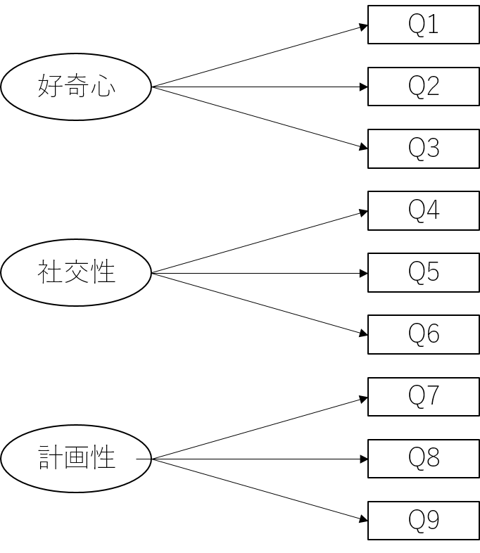

```{r setup, include=FALSE}
knitr::opts_chunk$set(echo = TRUE)
library(tidyverse)
```

取得したデータの変数が多い場合（**多変量データ**と呼ぶ）に，それら1つ1つの変数を分析するのは非常に骨が折れる作業になる．そういう場合には，「似たようなデータ」になっているものを集約して，もとの変数よりも少ない数の集約変数で分析するのが効率的である．

そのような変数の集約をするための分析が主成分分析（PCA: Principal Component Analysis）と因子分析（FA: Factor Analysis）である．

以下ではこれら2つの分析の仕方について説明する．

なお，例によって`tidyverse`パッケージは予め読み込んでおくこと．

# 主成分分析

主成分分析は多数の変数を持ったデータから，文字通りデータの「主成分」を抽出する分析である．主成分とは，**もとのデータ全体のばらつき方の情報をもっともよく表す変数**を抽出する分析方法である．

:::ref
<details>
<summary>第2引数について</summary>
第2引数についてはデフォルトで`TRUE`となっている．これは例えば多変量データの中に，単位が異なる変数が混在している場合，ばらつき方の情報が単位に依存してしまい，主成分分析の結果が変わってしまうためである．例えば体重[kg]と身長[cm]の場合，体重の分散は身長の分散に比べて小さくなってしまう．これは実際に「ばらつき方」として小さいということではなく，体重が身長に比べて小さな値となる単位を用いているためである．逆に身長を[m]で表記した場合には，体重の方が身長よりも分散が大きくなる．このように，そのままの値ではばらつき方の情報がそれぞれの変数の単位に依存してしまうため，標準化を行って単位系の違いが影響しないようにして，真のばらつき方の情報を利用するのが一般的である．
</details>
:::

:::practice
[こちら](./practice/example_13_Test.csv)のデータは，大学入試共通テストの5教科9科目分の結果である．これを主成分分析せよ．


（あくまで2024年度の結果からシミュレーションしたものであり，実際の得点ではない）

```{R include=FALSE}
library(truncnorm)
set.seed(41)
num = 10000
国語 <- rnorm(num, 0, 1)
数学IA <- rnorm(num, 0, 1) + 0.1*国語
数学IIB <- rnorm(num, 0, 1) + 0.7*数学IA
世界史B <- rnorm(num, 0, 1) + 0.4*国語
地理B <- rnorm(num, 0, 1) + 0.2*世界史B+0.2*国語
化学 <- rnorm(num, 0, 1) + 0.2*数学IA+0.2*数学IIB
物理 <- rnorm(num, 0, 1) +  0.3*数学IA+0.3*数学IIB
英語R <- rnorm(num, 0, 1) + 0.3*国語
英語L <- rnorm(num, 0, 1) + 0.6*英語R


data <- data.frame(
  国語   = round(国語 * 35.33 + 116.50,0), #mean=116.50, sd=35.33,
  数学IA = round(数学IA * 20.73 + 51.38,0),# truncnorm::rtruncnorm(n=1000, a=0, b=100, mean=51.38, sd=20.73),
  数学IIB= round(数学IIB* 20.67 + 57.74,0),# truncnorm::rtruncnorm(n=1000, a=0, b=100, mean=57.74, sd=20.67),
  世界史B= round(世界史B* 21.55 + 60.28,0),# truncnorm::rtruncnorm(n=1000, a=0, b=100, mean=60.28, sd=21.55),
  地理B  = round(地理B  * 15.04 + 65.74,0),#truncnorm::rtruncnorm(n=1000, a=0, b=100, mean=65.74, sd=15.04),
  物理   = round(物理   * 22.82 + 62.97,0),#truncnorm::rtruncnorm(n=1000, a=0, b=100, mean=54.77, sd=20.95),
  化学   = round(化学   * 20.95 + 54.77,0),#truncnorm::rtruncnorm(n=1000, a=0, b=100, mean=54.77, sd=20.95),
  英語R  = round(英語R  * 19.94 + 51.54,0),#truncnorm::rtruncnorm(n=1000, a=0, b=100, mean=51.54, sd=19.94),
  英語L  = round(英語L  * 17.12 + 67.24,0)#truncnorm::rtruncnorm(n=1000, a=0, b=100, mean=67.24, sd=17.12)
)
write_csv(data, "./practice/example_13_Test.csv")
```

:::

まずはこのデータの概要を把握しておこう．今回のデータは全部で1万点もあるデータなので`print(data)`とするととんでもない表が出力されてしまうので，冒頭6行だけを表示させるように`head()`を使っている．また，データの概要として標準偏差も表示させたいので`summary()`ではなく`describe()`を使っている．`describe()`は，[こちら](./RText_04_DescriptiveStatistics.html#記述統計量をまとめて出力するコマンド)で紹介をしたデータの要約統計量を出力する関数である．

なお，`psych::`は`psych`パッケージを，ある関数でだけ適用する場合に用いられる接頭語である．もちろん`library(psych)`を実行してもよいが，今回は`describe()`を実行するためだけなので，接頭語を付けるだけで対応することにした．

:::ref
<details>
<summary>`::`演算子の詳細</summary>
`::`は正確には「名前空間」（name space）を指定する演算子である．
各パッケージはそれぞれそのパッケージ名の空間を持っており，各パッケージに含まれる関数はその空間の中でその機能が定義されている．

`library()`関数は現在実行中のプロジェクトにパッケージを読み込む関数であるが，内部で行っていることは，そのパッケージの名前空間をプロジェクトと結びつけてる，というものである．そしてRで実際に関数を実行する際には，関数が呼び出されると，その都度，プロジェクトと結びつけられた名前空間から関数の定義を検索し，その名前空間まで定義を読み込みに行くという処理を内部で行っている．

つまりlibrary()を使うことによって，その名前空間を関数の検察範囲を含めることができるので，その名前空間に含まれる関数を使用できるようになるのである．

`::`を使うと，関数を呼び出す時点で**明示的に名前空間を指定することができる**．こうすると，検索を掛ける必要がなく，直接その名前空間の中の定義を読み込みに行ける．このため，PCにそのパッケージが存在していさえすれば**そのパッケージを読み込んでいなくても**その関数を使うことができるのである．

こうした`::`という演算子が実装されている理由として，Rでは同じ名前になっている関数なのに，異なるパッケージで定義され，機能も異なっている関数が存在する．それらの関数は，library()でパッケージを読み込むと，実行時にいぞれの定義を参照すればよいかが分らなくなるという問題がある．Rではこの解決策としてより新しく読み込んだlibrary()の定義を参照するように作られているが，場合によっては別のパッケージの関数を呼び出したいケースも当然存在する．こうした時に`::`で明確にパッケージを指定することによって，期待通りの関数が呼び出されるようになる．
</details>
:::

``` {r}
data <- read.csv("./practice/example_13_Test.csv")
head(data)
psych::describe(data)
```

さらに各科目間の相関もついでに見ておこう．
```{r}
round(cor(data),2)
```

この結果から，国語・世界史B・地理の間，また，数学IA・数学IIB・化学・物理の間，さらに英語R・英語Lの間にはある程度相関があることが分かる．

## 主成分分析の実行
では主成分分析を実行してみよう

主成分分析を行う関数は`prcomp()`である．引数は以下の通り．

- 第1引数: 主成分分析に掛ける多変量が含まれたデータフレーム
- 第2引数scale（省略可）: データを標準化するかどうか．省略すると`TRUE`が設定される．通常は省略してよい．

結果は一旦オブジェクト`PCA`に収めた上で，`summary()`で出力させる．

```{R}
pca <- prcomp(data, scale=TRUE) #
summary(pca)
```


主成分分析では，与えた変数の数だけ「主成分」が出力され，それらは順に第1主成分，第2主成分，第3主成分，...と呼ばれる．今回の例の場合だと9つの変数を与えているので出力される主成分は全部で9つとなる．

第1主成分が元のデータのばらつきをもっとも大きく反映している変数であり，第2主成分は**第1主成分に含まれていないばらつき**を反映している変数，第3主成分は第1主成分と第2主成分に含まれていないばらつきを反映している変数となる．こうしたことから，9つ全部使えば，当然ながら元のデータのすべてのばらつきを反映することができる．


`summary()`関数で得られる結果は，合成された変数の元のばらつきを反映している度合についての情報を，その度合いが大きいものから順に出力する．

- 1段目: 主成分として抽出（正確には合成）されたそれぞれの成分の標準偏差
- 2段目: **分散説明率**と呼ぶ．各主成分がそれぞれ元のデータのばらつき情報（分散）をどの程度説明しているか（反映しているか）の割合
- 3段目: **累積説明率**と呼ぶ．分散説明率の累積値である．

例えば，上記の結果の場合，第1主成分（PC1）は2段目の情報から元のデータの約`r round(pca$sdev[1]^2/sum(pca$sdev^2)*100,0)`%の情報を説明しているということであり，第1～第3主成分の3つの主成分で元のデータの情報（ばらつき）の約`r round(sum(pca$sdev[1:3]^2)/sum(pca$sdev^2)*100,0)`%を説明（反映）しているということとなる．


## どこまでの主成分を採用するか

主成分分析を使う目的は，多変量データをより少ない数の変数に集約することであり，文字通り，元のデータの「主な成分」を抽出することである．そのため，どこまでの主成分を使うかをそれぞれの目的に応じて選択する必要がある．
選択のパターンとしては主には以下のものがある．

- 単純に第1主成分のみを使う．
- 第1主成分と第2主成分を使う．図として描画する場合にはこのパターンが多い．
- 第1主成分と第2主成分と第3主成分を使う．人が頭の中でイメージできるのは精々ここまで．
- 累積説明率が6割程度になるところまでの主成分を使う．
- 次に述べる主成分の解釈可能性から選択する．

今回のデータだと，第3主成分で累積説明率が約6割になるので，とりあえず，第3主成分までを採用することにしよう．

つまり，もともと9科目分あった変数が3つの主成分に集約された，ということである．


## 主成分の解釈
上記の方法で実際に採用された主成分について，その主成分が一体どういう意味合いを持った成分なのかの解釈が求められることは多い．

解釈をする場合には，主成分の各変数に対する**主成分負荷量**を見ることが重要である．
主成分負荷量とは，主成分がどの程度その変数に依存しているかを示す指標であり，主成分負荷量が大きいほどその変数が主成分に影響を与えていることを示す．

主成分負荷量は，`pca`オブジェクトの`rotation`という変数に格納されており，`pca$rotation`で取得できる．
そのまま表示させると小数点以下の桁数が多くなってしまうので，以下の例では，    `round()`関数によって四捨五入し，小数点第2位まで表示させている．

```{r}
round(pca$rotation,2)
```

この結果から，PC1は主に数学IA，数学IIB，物理，化学が反映された主成分であり「理系得点」と解釈できる．

逆にPC2は主に国語，世界史，地理，英語R，英語Lが反映されており「文系得点」と解釈できるだろう．

第3主成分も国語，世界史，地理，英語R，英語が反映されているが，国語，世界史，地理の3科目は負の値となっている．つまり「英語力と日本語力の対比」を示しているのかもしれない．

ただ，この第3主成分をうまく言葉で表現するのは難しいし，逆に第1・第2主成分は非常に分かりやすく分かれている．

よって，最終的には第1・第2主成分の2つに絞るのが良いだろう．

## 主成分得点
さて，採用する主成分が定まったあとは，それぞれのサンプルの主成分得点を得ることが次のステップとなる．主成分得点は，主成分分析の結果を収めたオブジェクトの中に`x`という変数名で収められており，先の例であればpca$x`で取得できる．

head()で最初の6行だけを表示してみる．

```{r}
head(pca$x)
```

さらに主成分得点の概要を把握するために，`describe()`関数を使ってみる．
```{R}
psych::describe(pca$x)
```

今回の主成分分析を実行する際に標準化を行っているため，主成分得点も標準化された得点として抽出されている．このため主成分得点の平均は0となっている．一方標準偏差は元データのばらつきが大きく反映されている主成分だと1を超える（つまり，元の単独の変数が持っていた情報よりも多くの情報を持っている）し，あまり反映されていないものだと1を下回る（つまり元の単独の変数が持っていた情報よりも少ない情報しか持っていない）．

## 主成分分析の使いみち

さて，以上が主成分分析の具体的な手法であるが，主成分分析はどのような場面で使われるのだろうか．

主成分分析の目的は，多変量データをより少ない数の変数に集約することである．そのため，主成分分析は「数多くの変数」を扱う場面で用いられる．

例えば，以下のような場面で主成分分析が使われることがある．

**マクロ経済指標の分析**

  - 目的: 多数の経済指標（GDP成長率，失業率，インフレ率，貿易収支など）の関係性を理解し，データを簡略化する．
  - 例: 世界銀行やIMFが複数の国の経済指標を主成分分析して，各国の経済状況を総合的に評価するための指数（例えば「経済健全性指標」）を作成する．
  
**株式市場のセクター分析**

  - 目的: 株式市場における複数の株価指標（売上高，利益率，PER，PBRなど）を主成分分析して，主要な変動要因を特定する．
  - 例: 投資ファンドが株式市場のセクター（テクノロジー，金融，エネルギーなど）のパフォーマンスに共通する要因を抽出し，リスクを分散した投資戦略を策定する．
  
**顧客行動データの分析**

  - 目的: 購買履歴やアンケート結果など，多次元の顧客データから行動パターンを明らかにする．
  - 例: 小売業やEコマースで，購買頻度，支出額，購入カテゴリなどを主成分分析して，顧客を類似したグループに分類し，マーケティング施策を最適化する．

<!-- **経営戦略における競争要因の特定** -->

<!--   - 目的: 複数の競争要因（市場シェア，顧客満足度，価格競争力など）を次元削減して，企業の競争優位性をシンプルに表現する． -->
<!--   - 例: 経営者が競争戦略を立てる際，主成分分析を用いて最も影響力の大きい要因を特定し，経営資源を集中させる．   -->

<!-- **マーケットセグメンテーション** -->

<!--   - 目的: 市場データや消費者データをもとに，複雑なデータセットを簡略化して市場をセグメント化する． -->
<!--   - 例: 製品開発において，年齢，性別，所得，趣味などの多次元データを主成分分析で要約し，ターゲット顧客層を明確にする． -->

<!-- **経済危機のリスク評価** -->

<!--   - 目的: 銀行や国の財政状況を示す複数の指標を要約し，潜在的なリスクを評価する． -->
<!--   - 例: リーマンショックのような金融危機の際に，バランスシートの健全性指標を主成分分析で統合し，リスクが高い金融機関を特定する． -->

もちろん，実際には主成分析だけでこれらの分析ができるわけではなく，他の分析手法（例えば[回帰分析](./RText_Regression.html)や[クラスター分析]()）と組み合わせて使われることが多い．

特に回帰分析の際に，数多くの変数を説明変数（独立変数）として設定してしまうと，ここの説明変数の回帰係数が有意になりにくくなってしまったり，多重共線性が生じやすくなってしまう．そういう場合には，まず主成分分析を実施して，多数の説明変数を小数のものへと集約しておくと，回帰分析の結果として解釈しやすい結果が出力されるようになる．


# 因子分析

因子分析も主成分分析と同様に多変量データを集約するための手法であるが，主成分分析とは異なり，**元のデータの背後にある潜在的な因子を推定する**ことを目的としている．

## 因子分析が行っていること

「潜在的な因子を推定」ということを理解するのには，いわゆる心理学や行動科学で用いられるアンケートをイメージすると理解しやすい（実際に因子分析が多用されるのは心理学や行動科学の分野である）．

例えば，以下のようなアンケートを考えてみよう．

- Q1: 新しいものに興味がある
- Q2: 他人とのコミュニケーションが好き
- Q3: 物事をじっくり考える方である
- Q4: 知らないものにはとりあえず近づいてみる
- Q5: 人の意見よりも自分の意見を重視する
- Q6: 思いついたらすぐに行動する方である
- Q7: 同じことを続けるのが苦手である
- Q8: 誰とでも仲良くなれる方である
- Q9: 計画通りに物事が進まないとイライラする方である

項目文から容易に想像つく通り，Q1, Q4, Q7は「好奇心」あるいは「変化志向性」に関する項目，
Q2, Q5，Q8は「社交性」に関する項目，
Q3, Q6, Q9は「計画性」に関する項目であると解釈できる．
つまり，これら9つの項目は，その人が持つこうした3つの性質を測定するための項目と言える．

さて，これらの3つの性質とこれら9つの質問項目はどのような関係にあるだろうか？
当然ながら，その人が性質として持っているものが，これら9つの質問項目の回答に反映されていると考えるのが自然であろう．
つまり以下の図のように3つ性質が原因で，9つの質問項目の回答が結果である，という関係が想定される．



**人の性質や心理は直接的に測定することはできない**．そこで，その性質や心理が反映されると考えられる質問項目を使い，得られた回答から**逆算**する形で，その人の性質や心理を推定しようというのが因子分析が行っていることである．

あくまで「潜在している因子」を逆算する形で「推定」しているのであり，主成分分析のようにデータから主成分を「抽出」するわけではない点に注意してほしい．

:::ref
<details>
<summary>なぜ複数の質問項目を設けるのか</summary>
上記の例のように，人の心理を測定するためのアンケートでは，1つの心理を測定するために複数の質問項目を設けるのが一般的である．

これは，1つの質問項目だけではその人の心理を正確に測定することが難しいためである．
すなわち，各質問項目への回答は，もちろんその質問で測定したい心理が反映されているであろうが，同時にそのほかの影響も入り込んで回答として表れてくる．

例えば，質問文の解釈や印象はみな完全に同じというわけではなく，人によって微妙な違いを持っているため，その回答に実際にどの程度，測定したい心理が反映されているかは人によって異なっている．
あるいは，その日の体調や気分によっても回答が変わることもある．例えば，回答の直前まで友達と楽しく話していたという場合にはQ1「他人とのコミュニケーションが好き」に対して高い値を回答するだろうが，その日は試験勉強でずっと図書館にこもっていたという場合には，たとえ同じ人であっても無意識のうちに低く回答することも十分にあり得る．

このようなその時々でランダムに入り込んでしまう誤差も反映されてそれぞれの質問の回答が生み出されている（下図参照．eは誤差（Error）を表す）．


そうした誤差成分を取り除いて，本当に測定したい心理成分だけをきちんと測定するために，複数の質問項目を設けてそれらを結び付け，それによって，誤差成分を互いに相殺させ合うとともに，測定したいものを増幅させているのである．

こうした目的から，心理アンケートでは一見同じような質問項目が沢山並ぶ，という特徴を持っている．
逆に言えば，そうした質問項目が多いほど，きちんとしたアンケートであると言える．少数の質問項目だけで測定したい心理を測定するのは，質問項目を極めて慎重に設計する必要がある．一般に，1つの心理的な性質を測定するのに3つ以上の質問を設けるべきとされる．

ただし，多ければ多いほど良いというわけではない．実用上の問題として質問項目数が多いと回答者にとっては面倒になり回答してくれなくなることもあるし，分析の視点からの問題として，多くの質問を頑張って作っても，実際には測定したい心理があまり反映されていない項目が含まれやすくなってしまう．したがって，質問項目数は適切なバランスを保つことが重要である．
</details>
:::

## 因子分析の実行

では実際に因子分析を実行してみよう．

:::practice
学生のSNSの利用状況と学生の性格との関連を調査するために，学生400名に対して先に示した9つの項目のアンケートに回答（1：全く当てはまらない～5：すごく当てはまる，の5段階尺度）してもらうとともに，各自のスマートフォンに記録されているSNSアプリの1日に当たりの平均利用時間を回答してもらった．その結果，[このようなデータ](./practice/example_13_personality.csv)が得られた．

このデータから，まずは学生の性格に関する因子の値を推定せよ．

```{r include=FALSE}
set.seed(123)

num <- 400
Q1 <- rnorm(num, 0, 1)
Q2 <- rnorm(num, 0, 1)+0.3*Q1
Q3 <- rnorm(num, 0, 1)+0.3*Q2
Q4 <- rnorm(num, 0, 1)+Q1
Q5 <- rnorm(num, 0, 1)+Q2
Q6 <- rnorm(num, 0, 1)+Q3
Q7 <- rnorm(num, 0, 1)+Q4 #+ 0.3*Q4
Q8 <- rnorm(num, 0, 1)+Q5 #+ 0.3*Q5
Q9 <- rnorm(num, 0, 1)+Q6 #+ 0.3*Q6

data <- data.frame(
  Q1 = round((Q1 - min(Q1))/(max(Q1)-min(Q1))*4+1,0), 
  Q2 = round((Q2 - min(Q2))/(max(Q2)-min(Q2))*4+1,0),
  Q3 = round((Q3 - min(Q3))/(max(Q3)-min(Q3))*4+1,0),
  Q4 = round((Q4 - min(Q4))/(max(Q4)-min(Q4))*4+1,0),
  Q5 = round((Q5 - min(Q5))/(max(Q5)-min(Q5))*4+1,0),
  Q6 = round((Q6 - min(Q6))/(max(Q6)-min(Q6))*4+1,0),
  Q7 = round((Q7 - min(Q7))/(max(Q7)-min(Q7))*4+1,0),
  Q8 = round((Q8 - min(Q8))/(max(Q8)-min(Q8))*4+1,0),
  Q9 = round((Q9 - min(Q9))/(max(Q9)-min(Q9))*4+1,0)
)

write_csv(data, file="./practice/example_13_personality.csv")

round(cor(data),2)

print(psych::fa(data, 3), sort=T, digits = 3)#, rotate="promax", fm="ml"))


```

:::

まずはデータ読み込みと内容確認．

```{r}
# ライブラリの読み込み
library(psych)

# データの読み込み
data <- read.csv("./practice/example_13_personality.csv")

# データの内容確認
head(data) # 冒頭6行表示
describe(data) # 記述統計量の表示
round(cor(data),2) # 相関行列の表示.round関数を使って2桁までにしている
```

Rで因子分析を行う関数はいくつかあるが，もっとも使いやすいのは`psych`パッケージに含まれる`fa()`関数である．引数は以下の通り．

- 第1引数: 因子分析に掛ける多変量が含まれたデータフレーム
- 第2引数: 因子数（省略可）． 何個の因子を抽出するかを指定する．
- 第3引数 rotate: 回転方法（省略可）． 因子をどのように回転させるかを指定する．
- 第4引数 fm: 推定方法（省略可）． 因子の推定方法を指定する．

第3引数や第4引数については後で説明する．デフォルト値が設定されているので，基本的には省略してもよい．

結果は一旦オブジェクトに収めた上で，`print()`で出力させる．その際には以下の引数とする．

- 第1引数: faの出力結果を収めたオブジェクト
- 第2引数 sort: TRUEにすると因子負荷量の絶対値の大きい順に表示される．**TRUEにするのが一般的．**．
- 第3引数 digits: 表記の小数点以下の桁数を指定する．省略すると2桁表記となる．


```{r}
# 因子分析の実行
fa <- fa(data, 3)
print(fa, sort=T) #digits=3とすると結果が3桁表記になる
```


