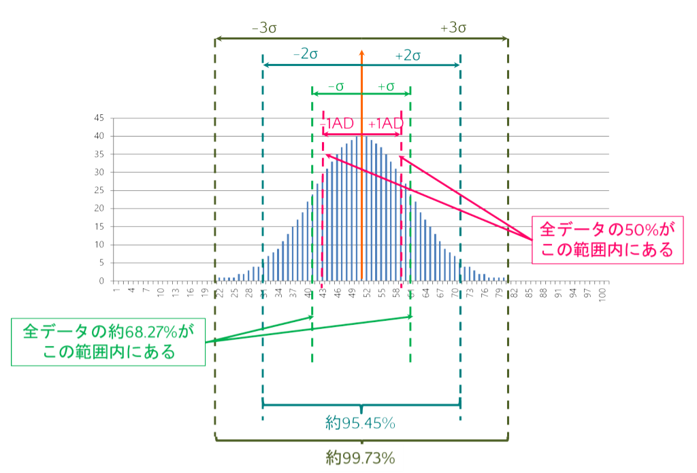

```{r setup, include=FALSE}
knitr::opts_chunk$set(echo = TRUE)
```

```{css, echo=FALSE}
.tocify-subheader { /* 全部のサブヘッダーを最初から表示する*/
    display: block !important;
}
.tocify-item {/*長いヘッダーも折り返さない*/
    white-space: nowrap;
}

body{
  counter-reset: ref_number practice_number;
}

.float img{
  /* 上右下左 */
  /* margin: 5% 0% 0% 0% ;*/ 
  /* width : 75%; */
  margin: auto;
  display: block;

  border-radius: 8px 8px 0 0 ;
  position: relative;
  width : 60%;
}

.float .figcaption {
  position: relative;
  font-style: italic;
  font-size: large;
  font-weight: bold;
  color: #666;
  text-align: center;
  margin:0% auto 5% auto;
  border-bottom: solid 1px #666;
  border-left: solid 1px #666;
  border-right: solid 1px #666;
  border-radius:0 0 8px 8px;
  width : 60%
}

img {
  margin: auto;
  display: block;
  border: solid 1px #666;
  border-radius: 8px;
  position: relative;
  width : 100%;
}

.ref {
  position: relative;
  margin:5%;
  padding:5px;
  background-color: rgba(255, 255, 128, .5);
  color: #666;
}
.ref::before{
  counter-increment: ref_number 1;
  content: "[参考 " counter(ref_number) "]";
  font-weight: bold;
  display: block;
  margin-bottom: 3px;
}

h1 {
  margin-top : 10px;
  padding-top : 50px;
}


.practice {
  position: relative;
  margin:5%;
  padding:5px;
  background-color: rgba(128, 255, 200, .5);
  color: #666;
}
.practice::before{
  counter-increment: practice_number 1;
  content: "[例題 " counter(practice_number) "]";
  font-weight: bold;
  display: block;
  margin-bottom: 3px;
}

.r{ 
　/**copy の禁止**/
  user-select: none;
  -moz-user-select: none;
  -webkit-user-select: none;
  -ms-user-select: none;
  -khtml-user-select: none;
  -webkit-touch-callout: none;
}

```


# 記述統計量

あるデータセットの特徴を把握するときに用いられる統計量。元のデータから算出される。なお、ここではデータとは数値のみで構成されているものとする。

以下では実際に以下のデータを使って例を示していく。

```{r}
Shohoku <- data.frame(
  name = c("赤木","桜木","三井","宮城","流川","木暮","潮崎","安田","角田","石井","佐々岡","桑田"),
  number=c(4,10,13,7,11,5, 8, 6, 9, 12, 13, 15),
  score= c(7,4,10,7,9,6,6, 7, 7,  5,  5,  4)
)
Shohoku
```

**以降は、前回紹介した[スクリプトファイル](./RText_BasicUsage.html#スクリプト)を作成し、上記の内容を含めて自分で入力・実行して出力結果を確認しながら進めていくこと。**

## 代表値（平均、中央値、最頻値）

あるデータセットの全体的な特徴を一番端的に表現する値であり、文字通りデータセットを「代表」する値。平均、中央値、最頻値の3種類がある。

### 平均

すべてのデータ（数値）を足し合わせて、データの数で割った値のこと。

$$
\bar{x} =\frac{1}{n}\sum^{n}_{i=1}x_{i}  
$$
Rで求めるには`mean()`関数を用いる。

```{r}
example<-c(1,2,3,4,5) # 例として1,2,3,4,5という5つの数値からなるベクトルを使った
mean(example)
mean(Shohoku$score) #先ほどの湘北高校バスケ部のフリースロー10本勝負のスコアの平均
```

なお、実際のデータを扱う際には、CSVファイルやExcelファイルからデータを読み込むことが多くなる。そうしたデータファイルにはたまに「空白」が含まれているケースがある（例えばアンケートで無回答だったり、実験で計測に失敗したりした場合）。その場合、Rにそれらのデータを読み込むと、空白だった箇所には`NA`(Not
Available：利用不可能という意味)という記号が自動的に入力される。

`mean()`関数を用いる際に、与えたベクトルに`NA`が含まれていた場合、Errorにはならないが出力は`NA`となる。

このようなデータの場合には、以下のように`na.omit`オプションを`True`（真）に設定する。するとNAを除いた上で平均が算出される（当然、データの総数はNAの数の分だけ減ることになる）。

```{r error=T}
example<- c(1,2,3,4,NA)
mean(example) #NAが含まれているのでNAが出力される

example<- c(1,2,3,4,NA)
mean(example, na.rm = T) 

```

### 中央値

全てのデータ（数値）を数の大小で順に並べ、ちょうど中央の順位に来る数値。データ点数が偶数だった場合には、中央の位置の前後の数の平均値を中央値とする。

Rでは`median()`を用いる

```{R}
median(Shohoku$score)
```

先の湘北高校のデータは12人分なので、中央値は6位と7位の間をとることになるため、小数の値が出てきている。

### 最頻値 

全てのデータ（数値）について、度数分布をとり、最も度数が大きい（出現頻度が最も多い）数値。

Rでは最頻値を直接求める関数は存在しない。そのため、まずは`table()`コマンドを使って、対象となるデータの度数分布表を求める。
次いで、その度数分布表に度数が最も高いものを求める、という手続きで算出する。
ただし、度数分布表で最も度数が高いものを取り出したときのデータは[名前付きベクトル](./RText_BasicUsage.html#名前付きベクトル)で出力され、最頻値を表す値は度数値に対する「名前」（すなわち文字列）として出力れる。そこでその名前を数値として読みなおす必要がある。
以下は例である。行っている一連の処理をよく確認しておくこと。

```{R}
table_data<-table(Shohoku$score) # 度数分布表を作成
print(table_data)
d<-which.max(table_data) ##度数分布表から最も度数が高い値を取り出す
print(d) # 7と4が表示されている。わかりにくいが、これは"7"という名前の付いた列に4という度数データが入っている、ということを表している。ここで"7"は数値ではなく文字列である。
mode<-as.numeric(names(d)) #欲しいのは値としての7なので、names()を掛けた後に、as.numeric()を行っている。
print(mode)
```

ちなみに、上記のスクリプトファイルは細かく一つ一つ分けて書いているが、以下のように関数の中に関数を入れることで、シンプルに書くことができる。このように関数が入れ子になっている場合、内側の関数から順次実行される。

```{r}
as.numeric(names(which.max(table(Shohoku$score))))
```

::: ref
さらには、`tidyvers`というライブラリを読み込んでおくことによって、以下のような書き方もできる。なお、初めてTidyverseを使う場合には、library(tidyverse)を読み込んだときにパッケージのインストールをするかどうか聞かれるので、installを選択しておく。tidyverseについては後ほど別章で詳しく説明する。

```{r message=FALSE, warning=FALSE}
library(tidyverse)
Shohoku$score %>%
  table() %>%
  which.max() %>%
  names() %>%
  as.numeric() 
```

:::

### 平均・中央値・最頻値の関係

正規分布のように左右対象の一山の度数分布をしていた場合には、平均値・中央値・最頻値は全てほぼ一致する。


一方、次の図のように左右非対称であった場合には、平均値・中央値・最頻値は一致しなくなる。


## ばらつき（分散・標準偏差、四分位数）

あるデータセットがどの程度ばらつき（広がり）を持っているのかを示す指標。平均系の平均偏差・分散・標準偏差と、中央値系の四分位数とがある。

### 平均偏差 

平均偏差とは、データ全体の平均値を予め求めておいた上で、各データと平均値との距離（差の絶対値）を全てのデータに対して求め、その平均をとったもの。


$$
M.A.D =\frac{1}{n}\sum^{n}_{i=1}|x_{i} - \bar{x}|
$$ 
Rでは`mad()`関数を用いる。

```{r}
MAD <- mad(Shohoku$score)
print(MAD)
```

### 分散 

平均偏差は数式のなかに絶対値記号が入ってきて、数値計算が非常に面倒になる。絶対値を加えたのは単純に$x_{i}-\bar{x}$を求めると$x_{i}$によっては負の数字になるからである。負を正にするためだけなら、$x_{i}-\bar{x}$を2乗するということでもよい。そこで、「差の絶対値」ではなく「差の2乗」の平均値をばらつきの指標としたものが分散(Variance)である。一般に
$S^{2}$と表現する。「2乗の平均」にしたことによって数値自体の絶対的な意味の解釈は難しくなる。すなわち、例えば元々は平均値からの距離が1，2，3のデータはそれぞれ等間隔で平均から離れていることになるが、これを2乗すると1,4,9となり等間隔ではなくなる。このように、平均から離れれば離れるだけより大きな値になってしまって、数値自体の絶対的な意味が分かり難くなってしまう。ただ、少なくとも2つのデータセットがある時に、どちらのデータのほうがよりばらついているかは分散の値を比較することによって知ることができる。

$$
S^{2} = \frac{1}{n}\sum^{n}_{i=1}(x_{i}-\bar{x})^2
$$

Rでは`var()`関数と`nrow()`関数を用いて以下のように書く。`nrow()`はデータフレームの行数、すなわちデータフレームに含まれているサンプル数を返す関数である。複雑な式に見えるが、要するに、$\frac{データ数-1}{データ数}$を`var()`に掛けているということである。これは`var()`関数は[不偏分散](#分散の点推定)を算出する関数であり、データそのものの分散（標本分散）を算出するためには、補正をしてやる必要があるためである。[不偏分散](#分散の点推定)については後ほど改めて説明する。

```{R}
s2<- var(Shohoku$score)
n <- nrow(Shohoku)
VAR <- (n-1)/n*s2
print(VAR) #こちらが標本分散
```


### 標準偏差 
 
分散の場合、先に述べた通り、距離（差）の2乗にしてしまっているので、元のデータと次元が異なってしまい、出てきた数値が何を意味しているかがにわかには分からない。そこで分散の平方根を取ることによって、元のデータと同じ次元の数値として、元のデータと比較したり平均と組み合わせられるようにしたものが標準偏差(Standard Deviation)である。一般に$S$と表現する。


$$
S=\sqrt{S^{2}} = \sqrt{\frac{1}{n}\sum^{n}_{i=1}(x_{i}-\bar{x})^2}
$$

Rでは`sd()`関数を用いるが、データそのものの標準偏差を得たい場合には分散の時と同様に`nrow()`関数を用いた補正（標準偏差の場合にはさらに平方根を求める関数`sqrt()`も用いる）をしてやる必要がある。
```{r}
s <- sd(Shohoku$score) # こちらのsは小文字
S <- sqrt((n-1)/n)*s # nは先に求めたnrow()関数の出力。
print(S)
```
標準偏差は「ばらつき」の単位（ものさし）として用いることが一般的である。データが完全に正規分布をしていた場合、次の図のように、平均値から±1Sだけ離れたところに境界を引くと、その境界内には全データの約68.27%のデータが含まれる。同様に±2Sの範囲内であれば約95.45%のデータが、±3Sになると約99.73%のデータが含まれることになる。



:::ref
### データの標準化（正規化）得点
平均$\bar{x}$を基準（すなわち0）とし、それぞれのデータの値$x_{i}$と平均との距離を標準偏差$S$を単位として表現した値。要するに、そのデータ全体の中で、あるデータ値が相対的にどのくらいの位置にあるのかを表した値のことを標準化得点、もしくは正規化得点と呼ぶ。一般に$z_{i}$と表現する。さらに、こうした処理を行うことを標準化、あるいは正規化と呼ぶ。
$$
z_{i} = \frac{x_{i}-\bar{x}}{S}
$$

Rで標準化を行う場合、`scale()`関数を用いればよい。
```{r}
z <- scale(Shohoku$score)
print(z)
```
出力結果の上12個は各データ値を標準化した値である。続いて、`attr()`にあるのは、それぞれ標準化に用いた平均値と標準偏差である。先ほど求めた平均、標準偏差と比べてみると、平均は一致しているが標準偏差は異なる。これは、`scale()`関数が内部で計算に用いている標準偏差は、あくまで補正の掛けない不偏標準偏差、すなわち`sd()`関数の結果をそのまま計算に用いているからである。実際に、先ほど`sd()`関数の結果を格納した`s`（小文字）をプリントさせてみると、同じ値が出力される。
```{r}
print(s)
```

### 偏差値
標準化得点が得られれば、受験の際にお世話になった「偏差値」というものを以下の式で算出することができる。
$$
偏差値= z_{i}*10＋50
$$
要するに、偏差値とは標準化得点を10倍したものに50を足したものである。この式から得点が平均点と一致していた場合に偏差値が50になることが理解できる。また、データが正規分布をしている場合には、先に示した標準偏差とデータの分布の図より、偏差値が60から40の範囲内に約68%のデータが含まれていることがわかる。さらに、偏差値が70を超えていた場合には、そのデータ値は全体の上位2.5%以内にある、ということになる。
:::

### 四分位数 
全てのデータ（数値）を小さいものから順に並べ、最小値(0%)、下位25%、中央値(50%)、上位25%、最大値(100%)の順位に来る数値のことをまとめて四分位数と呼ぶ。特に下位25%を第1四分位数、上位25％を第3四分位数と呼ぶ。
分散と標準偏差が平均値を代表値とした場合のばらつきの指標であるのに対して、中央値を代表値とした場合のばらつきの指標が四分位数となる。

四分位数を求めるRの基本関数は`quantile()`である。`quantile()`関数は算出対象となるデータを与えた後に、どの四分位数を求めるかを小数で与えてやる。
```{r results='hold'}
Q_1 <- quantile(Shohoku$score, 0.25) # 第1四分位数　下位25%の値。
Q_2 <- quantile(Shohoku$score, 0.75) # 第3四分位数　上位25%、すなわち下から75%の値
print(Q_1)
print(Q_2)
```
:::ref
このように関数を用いるときに`()`に与えるデータやオプションのことを**引数（ひきすう）**と呼ぶ。
:::

また、`quantile()`は以下のように2つ目の引数に`c()`を用いて複数のパラメータを指定してやることで、複数の四分位数を一度に求めることもできる。
```{R}
Q <- quantile(Shohoku$score, c(0.0, 0.25, 0.50, 0.75, 1.0))
print(Q)
```
ちなみに、`quantile()`の出力は[名前付きベクトル](./RText_BasicUsage.html#名前付きベクトル)である。


:::ref
四分位数はその数字そのものを示すより、一般に「箱ひげ図」と呼ばれるグラフを作成する際に用いられることが多い。箱ひげ図の具体例を以下に示す。箱の上端と下端で第1、第3四分位数を示し、箱の中の線で中央値を示す。さらに上下に伸びたひげで最大値、最小値を示す。場合によっては、箱の中に点線で平均値を示したり、一点鎖線で最頻値を示したりといったことも可能である。


このグラフの秀逸な点は、データが概ねどのような分布をしているかを示すことができる点である。例の箱ひげ図の場合、上にひげが長く伸び、さらに第3四分位数と中央値の間が、第1四分位数と中央値の間よりも広がっていることから、データの分布として、全体として点の低いほうに山が偏っており、点の高いほうに裾野が伸びた分布をしているということが読み取れる。

以前は棒グラフで平均値を示したグラフや、平均値の棒グラフに標準偏差の幅分だけ「ひげ」（エラーバーと呼ぶ）をつけたグラフを示すのがほとんどであったが、平均と標準偏差を示すだけでは、上記のような分布の形状までは分からない。このため、最近では、箱ひげ図を示すことも多くなってきている。
:::

## 記述統計量をまとめて出力するコマンド
以上、個別に記述統計量を算出する方法について説明した。
算出したこれらの統計量を別の計算で用いたい場合には、個別にこれらのコマンドで算出する必要がある。
一方、レポートや論文などで記述統計量を報告したり、とりあえず全体的な傾向を把握したいといった場合には、`summary()`関数や`describe()`関数を利用することができる

### summary()関数
`summary()`関数を使うと、ベクトルやデータフレームに含まれている各列について、四分位数と平均値を一度に得ることができる。また、ベクトルやデータフレームの列が文字列型だった場合にはデータの点数が、ベクトルやデータフレームの列が要因型（factor型）だった場合には要因ごとのデータ点数が表示される。

簡単にデータ全体の傾向を把握することができるので、データを読み込んだ場合には`summary()`をまずは実施する、というのがデータ分析の基本フローと言えるだろう。

```{r}
summary(Shohoku) #データフレームを与えると、含まれているベクトルごとの平均と四分位数を出力される。
summary(Shohoku$score) #ベクトルを与えると、そのベクトルの平均と四分位数をが出力される。
```

### describe()関数

`psych`パッケージに含まれる`describe()`関数を用いるとより詳しい記述統計量を得ることができる。`psych`パッケージを利用するためには、上部のメニューの中からTools->install.packagesを選択したうえで、以下のようにPackagesに`psych`と入力してパッケージをインストールする。


インストールが完了すれば、`library()`関数を使って`psych`パッケージを読み込み、`describe()`関数を実行すると、以下のような結果が表示される。

```{r results='hold'}
library(psych)
describe(Shohoku)
```
それぞれ、以下のような指標である

|名前|内容|
|:-|:-----------|
|mean|平均|
|sd|標準偏差（不偏標準偏差）|
|median|中央値|
|trimmed|トリム平均（データの上下5%ずつを取り除いて算出した平均）|
|mad|平均偏差|
|min|最小値|
|max|最大値|
|range|最大値－最小値|
|skew|歪度（データの分布がどの程度左右に偏っているか。負の場合は左に、正の場合には右に偏っている。また値が大きいほど偏りが大きい。）|
|kurtosis|尖度（データの分布がどの程度尖っているか。正規分布の尖り具合を0として、正の場合には正規分布より尖っており、負の場合には正規分布より平坦になっている）|
|se|標準誤差（詳しくは後述{#平均値の区間推定}。）|

なお、上記のname列に対する結果の通り、`describe()`関数はたとえ列の型が文字列であっても数字を出力してくる。当然ながら意味は全くない。参考までに、この出力結果は各要素のインデックス番号をデータとして計算を行ったものであある。


:::ref
<span id="PackagesInstall"/>
この例のようにRでは標準的なコマンド以外にも様々なコマンドが用意されている。ただし、それらのコマンドを利用するためには、そのコマンドが定義された外部パッケージをTools->install.packagesによってインストールし、さらにスクリプト内で`library()`関数を使ってそのパッケージを読み込む必要がある。
なお`library()`関数での外部パッケージの読み込みはスクリプトの実行中1回だけで良い。1度読み込みば、その後はその外部パッケージのコマンドを入力するだけでコマンドを実行することができる。
またパッケージのインストールも一度行えばその後は行う必要はなくなる。
:::

# 推測統計量

## 全数調査とサンプリング調査

何らかの調査をするときに、その調査が想定している対象全体のことを「母集団」という。それに対して、母集団の中から一部だけを抜け出して調査を行った場合、実際に調査を行った対象を「サンプル（標本）集団」と呼び、サンプル集団に含まれる個々のデータのことをサンプル（標本）と呼ぶ。また、母集団に対して行う調査を母集団調査、あるいは全数調査と呼び、サンプル集団に対して行う調査をサンプル調査と呼ぶ。


母集団調査（全数調査）を実施できればそれに越したことはないが、実際には費用的・時間的な制約であったり、現実に不可能であったりするために、母集団調査を実施できないことは多い。そういう場合には、現実的に実施可能な限られた数のサンプル調査を行い、その結果をもとに母集団の特徴を推測するということが行われる。

**母集団調査（全数調査）の例**

- **中学での校内の定期テスト**：あくまでその中学の中での成績を把握するためのものであり、対象はその中学の生徒に限られ、さらに全員が受けることが前提のテストであることから、母集団にアクセスできていると言える。同様に大学入試共通テストもその年度の全受験生が受けている（もちろん受けない受験生もいないわけではないが、そのような受験生はそもそも対象とはなっていない）ので、これも母集団全体にアクセスできている例である。
- **国勢調査**：国勢調査はその時の日本の状態を把握することを目的に、5年に一回、日本国に在住のすべての人を対象に行われる調査であり、母集団そのもの（その時に日本に在住している人全て）にアクセスしている例である。
- **小中学校で行われる健康診断**：日本の場合、小学校と中学校は義務教育として対象者全員が通うことが義務付けられている。さらに健康診断は学校保健安全法により全ての学校で実施することが定められている。したがって、小中学校における健康診断はその年度の日本の6歳児から15歳児までの全員に対する診断であり、母集団にアクセスしている例である。一方、高校や大学でも全員に対する健康診断は行われているが、これらの学校は義務教育ではない。したがって、これらの学校での健康診断結果は、日本の16歳〜22歳の母集団全体に対する調査結果ではない。

**母集団にアクセスできず、あくまでサンプル調査となる例**

- **血液型による性格の違いの検証のための性格診断調査**：実際に血液型によって性格が違っているかを全数調査によって検証するためには、全世界の全ての人に調査しなければならない。さらに現時点での全世界の人にアクセスできたとしても「単に今現在はそうなってるだけだろう」というツッコミが入り得るので、理論としての完全性を確保するためには、過去の全人類やこれから先の全人類を調査しなければならない。当然ながらそんなことは不可能である。したがって、血液型による性格の違いを母集団調査によって検証することは不可能であり、どれだけ多くのデータを集めたとしても、それはあくまでサンプル調査である。
- **新聞社等が実施する世論調査**：世論調査は各自治体が持つ選挙人名簿から10人おきや20人おきにピックアップされた人に対してハガキや電話、あるいは訪問によって調査している。得たいのはその時点での日本全体の世論であり、その時の日本人への全数調査ができれば良いが、それをするにはコスト的にも時間的にも現実的ではないので、限られた数のサンプルだけに調査を行い、そこから得た結果をもとに、日本全体の世論を推測している。
- **視聴率調査**：視聴率はビデオリサーチ社がモニター世帯に選ばれた世帯に対して「どの番組を視聴しているか」を記録する機械を設置し、その機械に記録された情報をもとに算出している。あくまでモニター世帯だけしか調査は行なっていないのでサンプル調査であり、その結果をもとに「日本全体でどの番組がどの程度視聴されているか」を推測している。

そのほか、マーケティング調査なども基本的に全てサンプル調査である。

## 母数と標本統計量
母集団全体での記述統計量を**母数**と呼ぶ。また、特に平均、分散については**母平均**、**母分散**と呼ぶこともある。
それに対してサンプル集団の記述統計量を**標本統計量**と呼び、平均を**標本平均**、分散を**標本分散**と呼ぶ。

母集団全体にアクセスできる場合には、得られたデータの記述統計量は母数そのものとなる。それに対してサンプル集団にしかアクセスできない場合には、そのデータの記述統計量はあくまで標本統計量であり母数ではない。

## 標本統計量からの母数の推測
先の例にも述べた通り、サンプル調査ではデータそのものの記述統計量（つまり標本統計量）が得たいのではなく、その結果を基に母数を推定することが目的である。従って、標本統計量から母数を推定する必要がある。

推定には大きく2種類あり、値を単刀直入に推定することを点推定と呼ぶ。一方、「95%の確率で、この範囲内に母数がある可能性が高い」という範囲を推定することを区間推定と呼ぶ。点推定の値のことを**不偏推定量**、区間推定の範囲のことを「95%信頼区間」と呼ぶ。なお、区間推定では「95%」が用いられることが多いが、場合によっては90%や99%が用いられることもああり、その場合には信頼区間の呼び名もそれぞれの確率値に変わる。

細かな導出過程や導出に当たっての考え方については省略するが、母数の推定値は以下の数式によって算出される。なお、以下では$\mu$, $\sigma^2$は母平均と簿分散、$\hat\mu$や$\hat{\sigma^2}$は母平均と簿分散の推定量、$\bar{x}$と$s^2$は標本平均、標本分散を表す。

### 平均値の点推定

母平均の不偏推定量を式で表すと以下のようになる。
$$
\mu \approx \hat{\mu}=\bar{x}=\frac{1}{n}\sum^{n}_{i=1}x_{i}
$$
要するに、母平均の推定量は標本平均そのものである。つまり、サンプル調査を行った時、得られたデータの平均を母集団全体の平均と見なそう、ということである。

したがってRで母平均の推定量を求めるときも、従来通り`mean()`関数を用いればよい。

```{r}
mean(Shohoku$score)
```

### 分散の点推定

母分散の不偏推定量（不偏分散）は以下の式となる。

$$
\sigma^2 \approx \hat{\sigma^2}=\frac{n}{n-1}s^2=\frac{1}{n-1}\sum^{n}_{i=1}(x_i-\bar{x})^2
$$

要するに、標本分散を求める時には「データと平均との差の二乗の和」を**n**で割っていたのを、**n-1**で割る形にしているだけである（なぜ$n-1$になるかは結構面倒な話になるので省略。興味ある人は上の数式の導出過程をネットで調べてみてほしい。ちなみにこの$n-1$のことを**自由度**と呼ぶ）。

さらに母標準偏差の不偏推定量は、上記の式の平方根となる。

\begin{align}
\sigma \approx \hat{\sigma}&=\sqrt{\frac{n}{n-1}s^2} = \sqrt{\frac{1}{n-1}\sum^{n}_{i=1}(x_i-\bar{x})^2} \\
&= \sqrt{\frac{n}{n-1}}s
\end{align} 

Rで不偏分散や標準偏差の不偏推定量を求める方法については、すでに上記で説明したとおり、`var()`や`sd()`を用いればよい。

すなわち、先ほどの湘北高校のデータを用いるならば、以下の通りとなる。
```{r results='hold'}
var(Shohoku$score)
sd(Shohoku$score)
```

ちなみに、この数値の解釈として、湘北高校のバスケ部員はフリースローで10本中、約6本（平均の不偏推定量）を入れることができるが、メンバー間でのばらつきとして1.8点ほどの標準偏差を持っている、ということである。これはあくまで母数の推定量をであり、赤木・桜木・三井・宮城・流川の5人の得点の平均や5人の中でのばらつきではない。5人をサンプルとした「湘北高校のレギュラーメンバー」という母集団のフリースローの成績の推定値ということである。つまり、赤木・桜木・三井・宮城・流川が入学する前のレギュラーメンバーや、彼らが引退した後のレギュラーメンバーも対象に入れた、**湘北高校バスケ部のレギュラーメンバー一般**の成績の推定値ということになる。


### 平均値の区間推定
続いて、区間推定であるが、平均の区間推定を行う際には**標準誤差(Standard Error)**と呼ばれる統計量を算出する必要がある。標準誤差は以下の数式で算出される。

$$
SE = \sqrt{\frac{\hat{\sigma^2}}{n}}=\frac{\hat{\sigma}}{\sqrt{n}}
$$ 
要するに、標準偏差の不偏推定量を$\sqrt{n}$で割った値である。
この標準誤差（以下SE）を用いて、平均値の95%信頼区間（上限と下限）はそれぞれ以下の数式で得られる。

\begin{align}
上限 &= \hat\mu + t\times SE \\
下限 &= \hat\mu - t\times SE
\end{align}

ここで$t$とは**自由度$n-1$（$n$はサンプル数）のT分布表の両側95%から得られる値**である。T分布表は大抵の統計学の教科書の末尾に記載されている。具体的には以下のような表である。自由度n-1の行の$\alpha＝0.025$の値を読む。例えば、サンプル数が30の場合、自由度は29なので、t＝2.045となる。


Rで平均値の信頼区間を求めるにあたっては、2つの方法がある。

まず一つ目は`t.test()`を使う方法である。本来`t.test()`関数は後で説明する[平均の比較](#平均と分散の比較)に用いる関数であるが、信頼区間を出力させるのに用いることができる。

```{r}
res<-t.test(Shohoku$score)
res$conf.int
```
$5.252698$が下限、$7.580636$が上限となる。$0.95$は信頼区間の確率である。

ちなみに、`res`自体を出力させると以下のような出力になる。ごちゃごちゃと書かれているが、真ん中あたりに`95 percent confidence interval:`とあり、信頼区間が記載されている。 
```{r}
print(res)
```

もし信頼区間の確率設定を変えたい場合には以下のようにすればよい。
```{r}
res<-t.test(Shohoku$score, conf.level = 0.99)
res$conf.int
```

二つ目の方法は、先に示した式を自分で打ち込む方法である。
```{r results='hold'}
#　平均と標準誤差の算出
n <-length(Shohoku$score)#length()はベクトルの長さ（要素数）を得る関数。もちろんnrow(Shohoku)としてもよい。
res_mean <- mean(Shohoku$score)
res_se <- sd(Shohoku$score)/sqrt(n)  

#ｔ値の取得
t_value <- qt(0.975, df=n-1) # 0.025でもよい。0.025とした場合、負の数字が出力される点に注意すること。

#信頼区間の算出
Band_Upper <- res_mean + t_value * res_se
Band_Lower <- res_mean - t_value * res_se

#出力
c(Band_Lower, Band_Upper)
```
先ほどと同じ数値が算出されていることが確認できる。


### 分散の区間推定

分散についての95%信頼区間については不偏分散$\hat{\sigma^2}$を用いて次の式で与えられる。

\begin{align}
上限 &= \frac{(n-1)\hat{\sigma^2}}{\chi^2_{0.975}} \\
下限 &= \frac{(n-1)\hat{\sigma^2}}{\chi^2_{0.025}}
\end{align}

$\chi^2$(カイ2乗と呼ぶ)は、$t$と同様に**自由度n-1（nはサンプル数）のカイ2乗分布表から得られる値**である。分布表と同様に、カイ2乗分布表も統計学の教科書には記載されている。具体的には次々項のような表である。自由度n-1の$\alpha＝0.025と0.975$の値を読み取る。例えば、サンプル数が30の場合、自由度は29なので、上限算出に使う$\chi^2$値は16.047、下限算出に使う$\chi^2$値は45.722となる


Rで分散の信頼区間を算出する方法も2つある。1つは`EnvStats`パッケージに含まれている`varTest()`関数を使う方法である。使うには`EnvStats`パッケージをインストールしたうえで、`library()`関数を実行する必要がある（[こちら参照](#PackagesInstall))。
```{r}
library(EnvStats)
res<-varTest(Shohoku$score)
res$conf.int
res<-varTest(Shohoku$score, conf.level = 0.90) #90%信頼区間の場合
res$conf.int
```

ちなみに`varTest()`自体の出力結果は以下の通りである。一番下に信頼区間が記載されている。なお、上のコードで確率を90%に設定したものをresに格納しているので、90%信頼区間の結果が表示されている。

```{r}
print(res)
```
もう一つの方法は、平均値の区間推定と同様に先に示した式を自分で打ち込む方法である。

```{r}
n <- nrow(Shohoku) # 今度はnrow()を用いた。当然length()を用いてもよい
res_var <- var(Shohoku$score)

# カイ二乗分布のクリティカル値を使用して信頼区間を計算
chi_upper <- qchisq(0.025, df = n - 1) #上で示した式の上限・下限の確率値が入れ替わっていることに注意
chi_lower <- qchisq(0.975, df = n - 1) 

# 分散の信頼区間
Band_Lower <- (n - 1) * res_var / chi_lower 
Band_Upper <- (n - 1) * res_var / chi_upper

#出力
c(Band_Lower, Band_Upper)
```

なお、Rで計算するときの$\chi^2$値算出の関数`qchisq()`での確率設定値と、先ほど式で示したものの中での$\chi^2$値の確率設定値が入れ替わっている。これは確率を「残された方」で見るのか、「切り落とす方」で見るのかの違いである。入れ替わってしまったとしても数値自体が変わるわけではないので、実際に出力させてみて、上限と下限の値が逆順になっていれば、数値を入れ替えればよい。

:::ref
平均値の区間推定にしろ、分散の区間推定にしろ、「95%」信頼区間なのに、$\alpha＝0.05$や$0.95$ではなく$\alpha＝0.025$や$0.975$の値を読むのはなぜなのか疑問に思う人もいると思う。これは「95％の確率でその区間の中に平均値がある」という範囲を取り出す、ということはその範囲よりも上下にある2.5%ずつを切り落とすということだからである。仮に5%と95%の値を読むことにしてしまうと、残された区間は90%となってしまう。
:::

# グループごとの統計量の算出

これまでつかってきたデータ（湘北高校のデータ）には特にグループ（群）分けという概念は存在していないデータであった。
しかし実際のデータには大抵、属性項目（例えば、性別や、実験データにおいては実験条件、あるいは学年や年齢区分、国籍など）によるグループ分けというものが存在する。そういったグループ分けが存在するときに、グループごとに記述統計量（推測統計量）を算出するには、`aggregate()`関数を用いると良い。


以下では先の湘北高校のデータを、レギュラー組と控え組にグループ分けしたものにしたうえで、グループごとの平均と標準偏差を算出させてみる。

## 要因型変数の作成
まずは湘北高校のデータにグルプ分けのための変数`Group`を追加する。
```{r}
Shohoku["Group"] <- as.factor(c("レギュラー", "レギュラー", "レギュラー", "レギュラー", "レギュラー", "控え", "控え", "控え", "控え", "控え", "控え", "控え"))
Shohoku # 確認
```

`as.factor()`関数に関しては先に軽く触れたが([参考](#型の変換))、ここで改めて詳しく説明する。
グループ分けに使う変数の型は**「要因型」**と呼ぶ。要因型に設定するためには`c()`関数を使って作成したベクトルを`as.factor()`関数で括ってやる必要がある。内容は`レギュラー`や`控え`という文字列になっているが、列全体としては文字列型ではないことに注意してもらいたい。

文字列型と要因型とでは結果が異なる。`summary()`の実行結果として出力されるものが異なってくる。それぞれ以下で確認してみてほしい。

```{r results='hold'}
Shohoku$Group <- as.factor(c("レギュラー", "レギュラー", "レギュラー", "レギュラー", "レギュラー", "控え", "控え", "控え", "控え", "控え", "控え", "控え"))
summary(Shohoku)
```

```{r results='hold'}
Shohoku$Group <- c("レギュラー", "レギュラー", "レギュラー", "レギュラー", "レギュラー", "控え", "控え", "控え", "控え", "控え", "控え", "控え")
summary(Shohoku)
```

要因型にした場合には、それぞれのグループに含まれるデータの数が返されるのに対して、文字列型の場合には全体のデータ点数と文字列型であることを示す`Class: character`や`Mode: charater`という表示が返されるだけである。

なお、要因型に設定するのであれば、その内容は数値でも構わない。ただ、**数値をグループ分け変数に使用する場合には特に`as.factor()`を実行するのを忘れないようにしなければならない。文字列型だった場合には数値演算はできないので結果自体は要因型であってもなくても変わらないことはよくあるが、数値型のときに`as.factor()`を忘れてしまうと、グループ分け用の変数としていたつもりでも数値の変数として処理され、演算の中に組み込まれてしまうことがあり、誤った結果を出力するケースがある**（例えば、回帰分析）。

```{r results='hold'}
Shohoku$Group <- as.factor(c(1,1,1,1,1,2,2,2,2,2,2,2)) #1:レギュラー, 2:控え
summary(Shohoku)
```

```{r results='hold'}
Shohoku$Group <- c(1,1,1,1,1,2,2,2,2,2,2,2)
summary(Shohoku)
```

## グループ別での演算の実行

`aggregate()`関数の機能は、ベクトルデータに対して、グループ分けを行った上で、それぞれのグループのデータに対して設定した関数演算を実行するというものである。
第1引数には、**演算対象データの列名~グループ分けデータの列名**という書式で、それぞれのデータを指定する。第2引数には演算を行いたいデータが入っているデータフレームを与える。第3引数には、実行したい**演算関数の名前**を与える。入力するものはあくまで関数の名前だけでよく、`()`はつける必要はない。

結果はデータフレームで出力される。

```{r}
#グループ分け変数の設定
Shohoku$Group <- as.factor(c("レギュラー", "レギュラー", "レギュラー", "レギュラー", "レギュラー", "控え", "控え", "控え", "控え", "控え", "控え", "控え"))

#平均を算出
res.mean<-aggregate(score~Group, Shohoku,mean)
print(res.mean)


#標準偏差を算出
res.sd<-aggregate(score~Group, Shohoku, sd)
print(res.sd)
```
