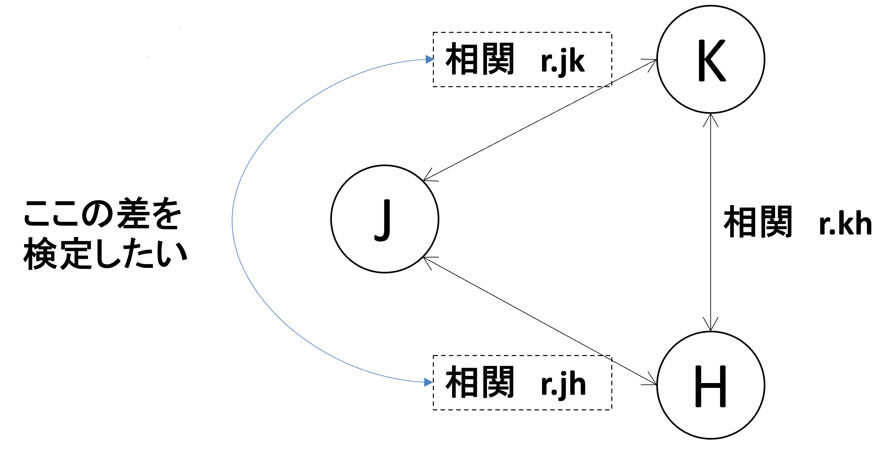
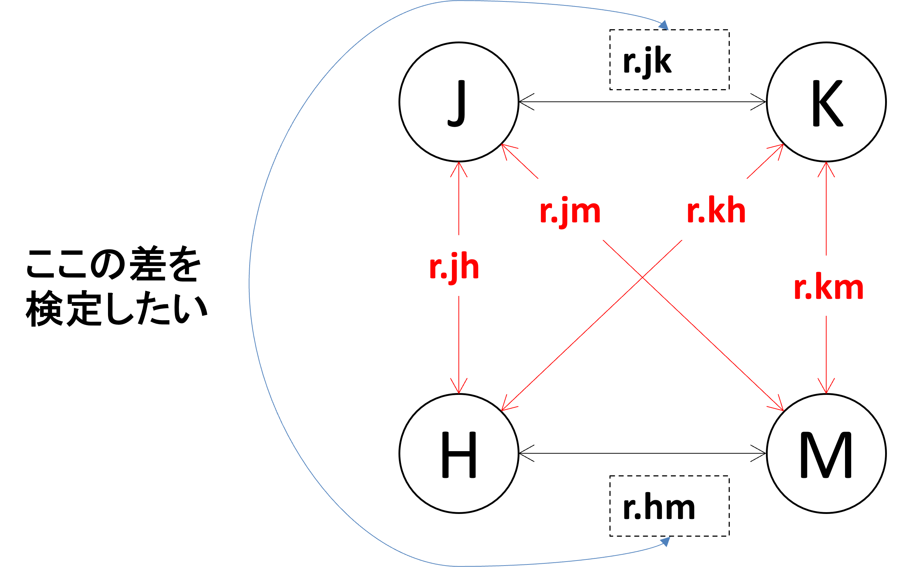

# ライブラリの読み込み

- 例文: `library(tidyverse)`
- 引数：読み込むライブラリ名
- 返り値: 特になし
- 留意点: ライブラリを読み込む前に，予めライブラリを自身のPosit Cloudにインストールする必要がある．一度インストールしておけば，その後は読み込むだけでよい．また，一度読み込んだライブラリはその実行環境上，あるいは，そのRmarkdownファイル上ではずっと有効になる．


# データ読み込み

## csvファイルを読み込みこむ．

- 例文: `data <- read.csv("./myfolder/data.csv", header=TRUE, encoding="UTF-8")`
- 引数：
  - 第1引数：ファイルのパス名．Posit Cloud上でフォルダを作って，フォルダの中にCSVファイルがある場合には`"./フォルダ名/ファイル名.csv"`と指定する.
  - 第2引数`header=TRUE`: ヘッダーがある場合に指定
  - 第3引数`encoding="UTF-8"`: 文字コードを指定．UTF-8で文字化けしてうまく読み込めない場合には`"SJIS"`を試す．
- 返り値: 読み込んだデータを格納したデータフレーム


## データフレームオブジェクトから欠損値を含む行を一括で削除する．

- 例文: `data <- na.omit(data)`
- 引数：欠損値を含むデータフレームオブジェクト
- 返り値: 欠損値を含まないデータフレームオブジェクト


# データの確認

## オブジェクトの要約情報をを表示する．

- 例文: `summary(data)`
- 引数：要約統計量を表示したいデータフレーム，もしくはベクトル
- 返り値：数値の場合には，最小値，第1四分位数，中央値，平均値，第3四分位数，最大値が表示される．要因型の場合には，水準名と要素数が表示される．文字列型の場合にはサンプル数と`character`型であることをが表示される．
- 留意点: 与えるオブジェクトのクラスによって，表示される情報が異なっている．上記はあくまでデータフレームやベクトルを与えた場合の出力．

## オブジェクトの先頭から指定した行数分を表示する．

- 例文: `head(data, 5)`
- 引数：
  - 第1引数：表示したいデータフレーム，もしくはベクトル
  - 第2引数：表示したい行数．省略した場合には6行分が表示される．
- 返り値: 指定した行数分のデータフレームオブジェクト．

## オブジェクトの要約統計量を表示する．

- 例文: `describe(data)`
- 必要ライブラリ：`psych`
- `summary()`と異なり，平均値，標準偏差などが表示される．
- 引数：要約統計量を表示したいデータフレーム，もしくはベクトル


## データフレームに含まれる変数名（列名）を表示する．

- 例文: `colnames(data)`
- 引数：列名を表示したいデータフレーム
― 返り値: データフレームに含まれる変数名のベクトル


## 出力
- 例文: `print(data)`
- 引数：出力したいオブジェクト
- 留意点：単純な数値や，ベクトル，データフレームなどは，printを付けなくても，オブジェクト名をそのまま実行するだけで出力されるが，オブジェクトによってはprint()で出力する場合と，オブジェクト名をそのまま実行した場合とで結果が異なる場合がある．


# 基本的な処理
## 算術

### 絶対値を求める．

- 例文: `abs(data)`
- 引数：絶対値を求めたい数値を含むオブジェクト
― 返り値：絶対値

### 数値の小数部を四捨五入する．

- 例文: `round(data, 2)`
- 引数：
  - 第1引数：数値を含むオブジェクト
  - 第2引数：有効にする小数点以下の桁数．この桁数までが表記される
- 返り値：四捨五入された数値
- 留意点：あくまで少数以下の指定の桁数までを四捨五入する，というものである．したがって，整数位での四捨五入をするためには，一旦，全体を1/100や1/1000をして，小数位にまで落としてからround()を適用し，後で100や1000でかけるといった処理が必要になる．

### 数値の小数部を切り捨てるする．

- 例文: `floor(data)`
- 引数：少数以下を切り捨てたい数値を含むオブジェクト
- 返り値：切り捨てられた整数値
- 留意点：小数以下は全て切り捨てられるので，例えば小数第1位まで残したい場合には，全体を10倍してからfloor()を掛け，後で10で割るといった処理が必要になる．

### 数値の小数部を切り上げる．

- 例文: `ceiling(data)`
- 引数：少数以下を切り上げたい数値を含むオブジェクト
- 返り値：切り上げられた整数値
- 留意点：小数以下は全て切り上げられるので，例えば小数第1位まで残したい場合には，全体を10倍してからceiling()を掛け，後で10で割るといった処理が必要になる．


### 平方根を求める

- 例文: `qrt(data)`
- 引数：平方根を求めたい数値を含むオブジェクト
- 返り値：平方根

### 合計を求める

- `sum()`
- ベクトルオブジェクトに含まれる数値の合計値を求める．
- 例文: `sum(data)`
- 引数：合計値を求めたい数値ベクトルのオブジェクト
- 返り値：合計値


## データの操作

### ベクトルの結合

- 例文: `c(data1, data2)`
- 引数：
  - 第1引数：結合したいベクトル
  - 第2引数：結合したいベクトル
  - 以下同様に結したいベクトルを指定する．
- 返り値：結合されたベクトル．

### データフレームの作成
- データフレームオブジェクトの作成
- 例文: `data.frame(d1=data1, d2=data2, d3=data3)`
- 引数：
  - 第1引数:データフレームの1列目にふくめるベクトルデータ．`変数名=ベクトルデータ`とするとデータフレーム上での変数名を設定できる．変数名の設定を省略した場合には，ベクトル名が変数名となる．
  - 第2引数:データフレームの2列目にふくめるベクトルデータ．
  - 第3引数:データフレームの3列目にふくめるベクトルデータ．
  - 以下同様にデータフレームの列数分だけベクトルデータを指定する．
- 返り値：データフレームオブジェクト
- 留意点: データフレームオブジェクトを作成する際には，各列のベクトルデータの長さが一致している必要がある．

### データフレームを列方向に結合する

- 例文: `cbind(data1, data2)`
- 引数：結合したいデータフレームオブジェクト
― 返り値：結合されたデータフレームオブジェクト
- 留意点: 結合するデータフレームオブジェクトの行数は一致している必要がある．


### データフレームオブジェクトを行方向に結合する

- 例文: `rbind(data1, data2)`
- 引数：結合したいデータフレームオブジェクト
- 返り値：結合されたデータフレームオブジェクト
- 留意点: 結合するデータフレームオブジェクトの列数は一致している必要がある．


### 連続した数値ベクトルを生成する

- 例文: `1:10`
- 引数：連続した数値の最初の値と最後の値を指定する．
- 返り値：指定した範囲の連続した数値ベクトル

### ベクトルデータから指定した要素を抽出する

- 例文: `data[3]`, `data[1:10]`，`data[c(1,3,5)]`, `data[-1]`, `data[c(-1,-4)]`
― 引数：抽出したい要素のインデックス番号．複数のものを取り出したい場合には`c(1,3,5:10)`のようにベクトルで指定.
- 返り値：抽出した要素だけのベクトルデータ．
- 留意点：負の値を指定するとその列が除外されたものが返される．負の値と正の値を混在させることはできない．


### データフレームオブジェクトから指定した行，列を抽出する．

- 例文: `data[3,5]`, `data[c(1,3,5:10), c(1,3,5:10)]`, \\ `data[c(1,3,5:10), ]`, `data[, c(1,3,5:10)]`, `data[c(1,3,5:10)]`
- 引数：
  - 第1引数：抽出したい行のインデックス番号．記載方法はベクトルデータの抽出と同様．省略した場合，すべての行が抽出される
  - 第2引数：抽出したい列のインデックス番号．記載方法はベクトルデータの抽出と同様．省略した場合，すべての列が抽出される．
  また，`c("変数名1", "変数名2”, "変数名3”)`のように各列の変数名を指定することもできる．
- 返り値：抽出した行と列のデータフレームオブジェクト．
― 留意点：data_res<-data[c(1,3,5:10)]という形で列だけを指定することもできる．この場合，すべての行が抽出される．


### データフレームオブジェクトから指定した列を抽出する．
- 例文: `data$変数名`
- 引数：抽出したい列の変数名．
- 返り値：抽出した列のベクトルデータ．

### ベクトルに含まれる要素数を求める

- 例文: `length(data)`
- 引数：要素数を求めたいベクトルデータ
- 返り値：ベクトルに含まれる要素数


### データフレームの行数（サンプル数）を求める．

- 例文: `nrow(data)`
- 引数：行数を求めたいデータフレームオブジェクト
- 返り値：データフレームオブジェクトの行数（サンプル数）

### データフレームの列数（変数数）を求める．
- 例文: `ncol(data)`
- 引数：列数を求めたいデータフレームオブジェクト
- 返り値：データフレームオブジェクトの列数（変数数）


## 型の変換

### オブジェクトを要因型に変換する．

- 例文: `as.factor(data$var1)`
- 引数：要因型に変換したいオブジェクト
- 返り値：要因型に変換されたオブジェクト

###  オブジェクトを数値型に変換する．

- 例文: `as.numeric(data$var1)`
- 引数：数値型に変換したいオブジェクト
- 返り値：数値型に変換されたオブジェクト


### オブジェクトを文字列型に変換する．
- 例文: `as.character(data$var1)`
- 引数：文字列型に変換したいオブジェクト
- 返り値：文字列型に変換されたオブジェクト


### 行列型オブジェクトをデータフレーム型に変換する．

- 例文: `as.data.frame(data)`
- 引数：データフレーム型に変換したい行列型オブジェクト．
- 返り値：データフレーム型に変換されたオブジェクト．

# 抽出・加工・置換・ロング-ワイドの変換
以下では，いずれも実行に当たっては当たっては，`library(tidyverse)`を読み込んでおくことを前提とする．

## データの抽出

### 条件に合致するデータの抽出

- 例文: `filter(data, var1>10)`
- 引数：
  - 第1引数：抽出したいデータフレームオブジェクト
  - 第2引数：抽出条件を指定する．条件指定の主な書き方は以下の通り．複数の条件を指定する場合，`&`を使って条件をつなげると**すべての条件を満たすデータ**が，`|`を使って条件をつなげると**いずれかの条件を満たすデータ**が抽出される．
    - `var1>10`: 指定した値**より大きい**データを抽出
    - `var1>=10`: 指定した値**以上**のデータを抽出
    - `var1<10`: 指定した値**より小さい**データを抽出
    - `var1<=10`: 指定した値**以下**のデータを抽出
    - `var1==10`: 指定した値と等しいデータを抽出．文字列型や要因型でも利用可能．
    - `var1!=10`: 指定した値と異なるデータを抽出．文字列型や要因型でも利用可能．
    - `var1 %in% c(1,2,3)`: 指定した値のいずれかに合致するデータを抽出．要因型でも利用可能．
- 返り値：指定した条件で抽出されたデータフレームオブジェクト

### 列の抽出
- 例文: `select(data, var1, var2)`
- 引数：
  - 第1引数：抽出したいデータフレームオブジェクト
  - 第2引数：抽出したい列を指定する．`-`を使って列を指定すると，その列を除外することができる．
- 返り値：指定した列で抽出されたデータフレームオブジェクト
- 留意点：[]を使って列を抽出するものと同じ効果を持つ．パイプライン処理をするときには`select()`を使う．

## データフレームへの変数の追加
データフレームに含まれる変数やその他のベクトルを使って新たな変数を生成し，元のデータフレームに追加する．

### 1つの変数を追加する．
- 例文: `data$var3 <- data$var1+data$var2+ex_val `
- 留意点：単純にベクトルの演算を行ったうえで，元のデータフレームに`$`
で新たな変数名を指定して，格納すればよい．

### 複数の変数をまとめて追加する
- 例文: `mutate(data, var3=var1+var2, var4=var1-var2, var5=var1*ex_val)`
- 引数：
  - 第1引数：追加したいデータフレームオブジェクト
  - 第2引数：追加したい列名とその計算式を指定する．
  - 第3引数以降：他の変数を追加したい場合には，第2引数に倣って順次数式を指定する．
- 返り値：新たな列が追加されたデータフレームオブジェクト
- 留意点：データフレームに含まれる変数に何らかの演算処理を行って新たなデータを作り，元のデータオブジェクトに格納する．演算処理の際に，データフレームに含まれる変数は変数名を指定するだけでよい．データフレーム外の変数を用いることもできる．

```{r include=FALSE}
library(tidyverse)
data <- data.frame(var1=c(1,2,3,4,5),
                   var2=c(6,7,8,9,10)
                   )
ex_val <- 10

data_res<-mutate(data, 
                 var3=var1+var2+ex_val, 
                 var4=var1-var2,
                 var5=var1*ex_val
                 )
print(data_res)
```

## 変数に含まれているデータの置換
`if_else()`, `recode()`, `case_when()`の3つの関数がある．

`if_else()`と`case_when()`は数値，文字列いずれの置換にも対応．
一方，`recode()`は文字列からの置換のみに対応．

また，if_else()は複数の置換条件を置く際には入れ子にしていく必要があるが，`recode()`と`case_when()`は複数の置換条件を並べて書くだけでよい．

いずれも`tidyverse`パッケージ（正確には`dplyr`パッケージ）を用いる．

### その1　if_else()
- 例文1: `if_else(data$var1>3, "A", "B", missing="erorr")` (数字から文字列)
- 例文2: `if_else(data$var1>3, 1, 0, missing=NA)` (数字から数字)
- 例文3: `if_else(data$var1=="X", "A", "B")` (文字列から文字列)
- 例文4: `if_else(data$var1=="X", 1, 0)` (文字列から数字)
- 例文5: `if_else(data$var1>3, "A", if_else(data$var1>1,"B","c"))` (入れ子)
- 例文6: `if_else(data$var1>3 & data$var2=="Y", "A", "B")` (複数の変数を条件にする)
- 引数：
  - 第1引数：置換条件を指定．条件の書き方は[先に](#条件に合致するデータの抽出)紹介したものと同じ．
  - 第2引数：条件が真の場合に置換される値を指定．
  - 第3引数：条件が偽の場合に置換される値を指定．
  - 第4引数 `missing="error"`：`NA`（欠損値）がある場合に， `NA` を置換する値を指定．省略した場合，`NA`はそのまま`NA`となる．
- 返り値：置換後の変数
- 留意点：文字列，数値のいずれにも対応(例文1--4)．第2引数や第3引数に`if_else()`を入れ子にして利用することもできる(例文5)．また，条件の中では異なる変数を組み合わせた条件を作ることもできる(例文6)．
[先に](#複数の変数をまとめて追加する)で紹介した`mutate()`と組み合わせて使うことが多い．`mutate()`の中で用いる場合には，`data$`をつける必要はない．


### その2　recode()
- 例文1 文字列から文字列: `recode(data$var1, "x1"="A", "x2"="B", "x3"="C", .default="error")` 
- 例文2 文字列から数字：`recode(data$var1, "x1"=1, "x2"=2, "x3"=3, .default=0)`
- 引数：
  - 第1引数：置換対象の変数
  - 第2引数以降：置換対象の値と置換後の値を`=`で結んで指定．
  - 最終引数 `.default=`（省略可）：すべての条件に合致しない場合の置換値を指定する．省略した場合，すべての条件に合致しないものは，例文1の場合には元の値が保持されるが，例文2の場合には`NA`に置換される．
- 返り値：置換後の変数
- 留意点：文字列からの置換のみに対応．`if_else()`のように入れ子にしなくても，複数の置換条件を指定することができる．`mutate()`の中で用いる場合には，`data$`をつける必要はない．


### その3　case_when()
- 例文: 
```{r eval=FALSE}
data$var3<-case_when(data$var1>3 ~ "A", 
                     data$var1<=3 & data$var2 == "Y" ~ "B", 
                     TRUE ~ "C")
```
データフレームに含まれるデータから条件に応じて値を置換した変数を作り出す．dataに含まれるvar1の値が3より大きい場合には"A"，var1が3以下かつvar2が"Y"の場合には"B"，それ以外の場合には"C"と置換する．置換されたデータはvar3に格納される．

- 引数：
  - 第1引数：`~`の左側に置換条件を指定し，右側に置換値（文字列でも数値でも可）を指定する．`&`や`|`を用いて条件を複数並べても良い
  - 第2引数以降：必要な場合には，第1引数に倣って順次置換条件と置換値を指定する．
  - 最終引数： すべての置換条件に合致しない場合の置換値を指定する場合，`~`の左側に`TRUE`を指定し，右側に置換値を指定する．もしこの指定がなかった場合，すべての条件に合致しないものは`NA`に置換される． 
- 返り値：置換後の変数
- 留意点：`if_else()`と`recode()`の良いとこ取りをした関数．複数の置換条件を設ける時に`if_else()`のように入れ子にする必要がなく，`recode()`のように条件を並べて書くだけで良い．また，`recode()`のように文字列からの置換に限定されておらず，`if_else()`のように文字列，数値いずれの置換にも対応している．`mutate()`の中で用いる場合には，`data$`をつける必要はない．

```{r include=FALSE}
library(tidyverse)
data <- data.frame(var1=c(4,2,3,4,5),
                   var2=c("X","Y","X","Y","Z")
                   )
print(data)

data_res<-mutate(data, 
                 var3=case_when(var1>3 ~ "A", 
                                var1<=3 & var2 == "Y" ~ "B", 
                                TRUE ~ "C")
                 )
print(data_res)


```

## ワイド型データからロング型データへの変換

- 例文: `pivot_longer(data, cols=c(var1, var2), names_to="変数名", values_to="値")`
- 引数：
  - 第1引数：変換したいデータフレームオブジェクト
  - 第2引数：1変数にまとめたい複数の変数を`c()`を用いて指定する．
  `c(-var1, -var2)`というように`-`を用いて指定した場合，指定した変数以外の変数がすべて使われたロング型データが作成される．
  - 第3引数`names_to="変数名"`: ロング型に変換した際の変数名を指定する．
  - 第4引数`values_to="値"`: ロング型に変換した際の値が格納される変数名を指定する．
- 返り値：ロング型に変換されたデータフレームオブジェクト．
- 留意点：指定していない変数は同じ値が繰り返される．例えば，以下の例では，idと性別は`変数=変数1`と`変数=変数2`とで同じ値が繰り返される．

```{r include=FALSE}
library(tidyverse)
# ワイド型データの作成
data <- data.frame(id=c(1,2,3,4,5),
                   性別=c("M","F","M","F","M"),
                   変数1=c(6,7,8,9,10),
                   変数2=c(11,12,13,14,15)
                   )

# ロング型データにする
data_long<-pivot_longer(data, 
                       cols=c(変数1, 変数2), 
                       names_to="変数", 
                       values_to="値")
head(data_long)

# 除外変数を指定する形にした場合
data_long<-pivot_longer(data, 
                       cols=c(-id,-性別), 
                       names_to="変数", 
                       values_to="値")
head(data_long)
```


## ロング型データからワイド型データへの変換

- 例文: `pivot_wider(data, names_from="変数名", values_from="値")`
- 引数：
  - 第1引数：変換したいデータフレームオブジェクト
  - 第2引数`names_from="変数名"`: ワイド型に変換した際の変数名を指定する．
  - 第3引数`values_from="値"`: ワイド型に変換した際の値を指定する．
- 返り値：ワイド型に変換されたデータフレームオブジェクト

```{r include=FALSE}
library(tidyverse)
# ロング型データは先の例から引き続き使用
head(data_long)

# ワイド型データにする
data_wide<-pivot_wider(data_long, 
                       names_from="変数", 
                       values_from="値")
head(data_wide)
```

                   


# データの記述統計量を得る

## 1変数の単純な記述統計量を得る

### 数値ベクトルの平均値を求める．

- 例文: `mean(data, na.rm=TRUE)`
- 引数:
  - 第1引数：数値ベクトル
  - 第2引数`na.rm=TRUE`: 欠損値を除外する．省略した場合FALSEとなり，欠損値が含まれる場合にはNAが返される．


### 数値ベクトルの標準偏差を求める．
- `sd()`
- 例文: `sd(data, na.rm=TRUE)`
- 引数:
  - 第1引数：数値を含むオブジェクト
  - 第2引数`na.rm=TRUE`: 欠損値を除外する．省略した場合FALSEとなり，欠損値が含まれる場合にはNAが返される．


### 数値ベクトルの分散を求める．
- 例文: `var(data, na.rm=TRUE)`
- 引数:
  - 第1引数：数値ベクトル
  - 第2引数`na.rm=TRUE`: 欠損値を除外する．省略した場合FALSEとなり，欠損値が含まれる場合にはNAが返される．

### 数値ベクトルのの最大値を求める．
- 例文: `max(data)`
- 引数:
  - 第1引数：数値ベクトル
  - 第2引数`na.rm=TRUE`: 欠損値を除外する．省略した場合FALSEとなり，欠損値が含まれる場合にはNAが返される．

### 数値ベクトルのの最小値を求める．
- 例文: `min(data)`
- 引数:
  - 第1引数：数値ベクトル
  - 第2引数`na.rm=TRUE`: 欠損値を除外する．省略した場合FALSEとなり，欠損値が含まれる場合にはNAが返される．


### 数値ベクトルのの中央値を求める．
- 例文: `median(data)`
- 引数:
  - 第1引数：数値ベクトル
  - 第2引数`na.rm=TRUE`: 欠損値を除外する．省略した場合FALSEとなり，欠損値が含まれる場合にはNAが返される．


### 数値ベクトルのの分位数を求める．
- 例文: `quantile(data, c(0.25, 0.75))`
- 引数：
  - 第1引数：分位数を求めたい数値を含むオブジェクト
  - 第2引数：分位数の位置を0から1で指定する．複数のものを同時に得たい場合には`c(0.25, 0.75)`のように指定する．
- 返り値: 指定した分位数の値を含むベクトル（名前付き）．

### 度数分布を求める．
- 例文: `table(data)`, `table(data$factor1, data$factor2)`
- 引数：含まれている値の頻度を求めたいオブジェクト
- 返り値: 水準ごとの頻度を含むテーブルオブジェクト．
- 留意点：引数に複数個の変数を指定した場合，それらのクロス集計表が作成される．


### 1変数の**標準誤差**を得る

`sd()`を用いて標準偏差を求め，その値を**標本数の平方根**で割ることで求める．

```{r eval=FALSE}
num <- length(data)
data_res<-sd(data)/sqrt(num)
```

### 1変数の平均値の信頼区間を得る

- 例文: `t.test(data, conf.level = 0.95)$conf.int`
- 引数：
  - 第1引数：数値を含むオブジェクト
  - 第2引数`conf.level=0.95`（省略可）: 信頼区間の信頼係数を指定する．省略した場合は0.95．
- 返り値: 信頼区間の値
- 留意点:
[`t.test()`](#2群で平均値を比較したい)を用いて**1変数のt検定**（母平均が指定した値（デフォルトでは0）でないかの検定）を行った後，出力されるオブジェクトに含まれる信頼区間`conf.int`の値を`$`で得る．


<!-- 平均値・標準誤差を求め，`qt()`を用いて算出される．以下は95%信頼区間を求めることもできる． -->

<!-- ```{r eval=FALSE} -->
<!-- num <- length(data) -->
<!-- mean <- mean(data) -->
<!-- se <- sd(data)/sqrt(num) -->
<!-- Lower<-mean-qt(0.975, num-1)*se -->
<!-- Upper<-mean+qt(0.975, num-1)*se) -->
<!-- ``` -->

## グループごとの記述統計量を得る
`aggregate()`を用いる．

### 1つの変数に対して

- 例文：`aggregate(var1 ~ group, data, mean)`
- 引数：
  - 第1引数: `~`の左側には集計したい変数(var1)を，右側にはグループ分けのための要因型変数(group)を指定する．
  - 第2引数: データフレームオブジェクト．
  - 第3引数: 集計関数を指定する．`mean`や`sd`など．

### 複数の変数に対して

- 例文：`aggregate(cbind(var1, var2) ~ group, data, mean)`
- 引数：
  - 第1引数: `~`の左側に集計したい複数の変数を`cbind()`を用いて指定する．右側にはグループ分けのための要因型を指定する．
  - 第2引数: データフレームオブジェクト．
  - 第3引数: 集計関数を指定する．`mean`や`sd`など．
- 返り値: グループごとに集計された各変数の結果がデータフレームとして返される．

```{r include=FALSE}
data <- data.frame(変数1=c(1,2,3,4,5,6,7,8,9,10),
                   変数2=c(11,12,13,14,15,16,17,18,19,20),
                   グループ1=c("A","A","A","A","A","B","B","B","B","B")
                   )

aggregate(cbind(変数1,変数2) ~ グループ1, data, mean)
```
  
### 1つの変数に対して，複数のグループ分け基準を指定して

- 例文：`aggregate(var1 ~ group1 + group2, data, mean)`
- 引数：
  - 第1引数: `~`の左側に集計したい変数を指定する．右側にはグループ分けのため複数の要因型変数を`+`を用いて並べる．
  - 第2引数: データフレームオブジェクト．
  - 第3引数: 集計関数を指定する．`mean`や`sd`など．
- 返り値: 複数のグループでクロス集計された結果がロング型のデータフレームとして返される．

```{r include=FALSE}
data <- data.frame(変数1=c(1,2,3,4,5,6,7,8,9,10),
                   変数2=c(11,12,13,14,15,16,17,18,19,20),
                   グループ1=c("A","A","A","A","A","B","B","B","B","B"),
                   グループ2=c("X","X","Y","Y","Z","X","X","Y","Y","Z"))

aggregate(変数1 ~ グループ1 + グループ2, data, mean)
```

### 複数の変数に対して，複数のグループ分け基準を指定して

- 例文：`aggregate(cbind(var1, var2) ~ group1 + group2, data, mean)`

- 引数：
  - 第1引数: `~`の左側に集計したい複数の変数を`cbind()`を用いて指定する．右側にはグループ分けのため複数の要因型変数を`+`を用いて並べる．
  - 第2引数: データフレームオブジェクト．
  - 第3引数: 集計関数を指定する．`mean`や`sd`など．
- 返り値: 複数のグループでクロス集計された結果がロング型のデータフレームとして返される．

```{r include=FALSE}
data <- data.frame(変数1=c(1,2,3,4,5,6,7,8,9,10),
                   変数2=c(11,12,13,14,15,16,17,18,19,20),
                   変数3=c(21,22,23,24,25,26,27,28,29,30),
                   グループ1=c("A","A","A","A","A","B","B","B","B","B"),
                   グループ2=c("X","X","Y","Y","Z","X","X","Y","Y","Z"))

aggregate(cbind(変数1, 変数2, 変数3) ~ グループ1 + グループ2, data, mean)
```
  
  


### 複数の集計関数を同時に適用

- 例文：`aggregate(var1 ~ group, data, function(x) c(mean=mean(x), sd=sd(x)))`
- 引数：
  - 第1引数: `~`の左側には集計したい変数名を，右側にはグループ分けのための要因型を指定する．`cbind()`を使って複数の変数を指定することも可能．
  - 第2引数: データフレームオブジェクトを指定する．`+`を使って複数の変数を指定することも可能．
  - 第3引数: `function(x)` と置いたうえで**半角スペース**を置き，`c()`で集計関数を与える．この際，名前付きベクトルで与えると，出力結果にその名称が反映される．
  
```{r include=FALSE}
data <- data.frame(変数1=c(1,2,3,4,5,6,7,8,9,10),
                   変数2=c(11,12,13,14,15,16,17,18,19,20),
                   グループ1=c("A","A","A","A","A","B","B","B","B","B"),
                   グループ2=c("X","X","Y","Y","Y","X","X","Y","Y","Y")
                   )

aggregate(cbind(変数1,変数2) ~ グループ1+グループ2, data, function(x) c(平均=mean(x), 標準偏差=sd(x)))
```

# 比較をしたい

## 2群で平均値を比較したい

`t.test()`を用いる．データの対応関係の有無で使い方が異なる．


### データに対応関係がない場合

- 例文: `t.test(x=data1, y=data2)`
- 引数：
  - 第1引数 `x`: 比較したい数値ベクトル1. `x=`は省略しても良い
  - 第2引数 `y`: 比較したい数値ベクトル2．`y=`は省略しても良い
  - 第3引数`alternative`:省略可．省略した場合，両側検定を行う．片側検定を行いたい場合には`"greater"`または`"less"`を指定する．
- 返り値: 検定結果を含むリストオブジェクト．print()で出力させることができる．

```{r include=FALSE}
#例用データの作成
data1 <- c(1,2,3,4,5)
data2 <- c(6,7,8,9,10)

#T検定
t.test(data1, data2)
```

ロング型データの場合，次のように記述することもできる．

- 例文: `t.test(var~group, data)`
- 引数：
  - 第1引数 : 数値変数とグループ変数`~`で結んで指定する．グループ変数は要因型で水準は2つだけであることが前提．
  - 第2引数: データフレームオブジェクト

```{r include=FALSE}
#例用データの作成
data <- data.frame(var=c(1,2,3,4,5,6,7,8,9,10),
                   group=c("A","A","A","A","A","B","B","B","B","B")
                   )

# T検定
data$group <- as.factor(data$group)
t.test(var~group, data)
```

### データに対応関係がある場合

- 例文: `t.test(x=data1, y=data2, paired=TRUE)`
- 引数：
  - 第1引数 `x`: 比較したい数値ベクトル1. `x=`は省略しても良い
  - 第2引数 `y`: 比較したい数値ベクトル2．`y=`は省略しても良い
  - 第3引数`alternative`:省略可．省略した場合，両側検定を行う．片側検定を行いたい場合には`"greater"`または`"less"`を指定する．
  - 第4引数`paired=TRUE`: 対応関係がある場合には`TRUE`を指定する．
- 留意点: 対応関係がある場合，データの数は等しくなければならない．また，対応関係のあるデータの場合，ロング型データを用いることはできない．あくまでfilter()などを用いて，それぞれのデータを別個のベクトルとして抽出してからt.test()を適用する．


  
```{r include=FALSE}
# 例用データの作成
data1 <- rnorm(5, 5, 1)
data2 <- rnorm(5, 6, 1)

# 対応ありデータでのT検定
t.test(data1, data2, paired=TRUE)
```


## 2群で分散を比較したい

- 例文: `var.test(x=data1, y=data2)`
- 引数：
  - 第1引数 `x`: 比較したい数値ベクトル1. `x=`は省略しても良い
  - 第2引数 `y`: 比較したい数値ベクトル2．`y=`は省略しても良い
- 返り値: 検定結果を含むリストオブジェクト．print()で出力させることができる．

## 2群で比率を比較したい

- 例文: `prop.test(c(10, 20), c(100, 200), correct=FALSE)`
- 引数：
  - 第1引数: それぞれの群での成功数（分子に来る数）をベクトルで指定する．
  - 第2引数: それぞれの群での総数（分母に来る数）をベクトルで指定する．
  - 第3引数 `correct`: 省略可．Yatesの補正を行うかどうか．省略すると`TRUE`．5以上のサンプルがあるのであれば`FALSE`にする．
  
  
予め[table()](#度数分布を求める)を用いてクロス集計表を作成しておくと，それを引数としてprop.test()を適用することもできる．

- 例文: `prop.test(data_table)`
- 引数: table()で作成したクロス集計表オブジェクト．関数の中でtable()を使ってもよい．

```{r include=FALSE}
# 例用データの作成
set.seed(12)
data <- data.frame(性別=sample(c("男性","女性"), 100, replace=TRUE),
                   結果=sample(c("合格","不合格"), 100, replace=TRUE)
                   )

# クロス集計表の作成
table(data$性別, data$結果)

# クロス集計表から得た値を用いて比率の比較
prop.test(c(37, 21), c(37+21, 21+21))

# クロス集計表を引数として与える方法．
prop.test(table(data$性別, data$結果))
```

## 2つの要因の独立性を検定したい

クロス集計表を作成したときに，いずれかのセルが5以下になっている場合には，Fisherの正確確率検定を行う．それ以外の場合には，カイ二乗検定を行う（Fisherの正確確率検定を使っても良いが，計算時間が長くなってしまったり，処理がタイムアウトしてしまう可能性がある）．

### カイ二乗検定

- 例文: `chisq.test(data_table, correct=FALSE)`
- 引数: 
  - 第1引数: [table()](#度数分布を求める)を用いて作成したクロス集計表オブジェクト．chisq.test()の中でtable()を使ってもよい．
  - 第2引数`correct=FALSE`: Yatesの補正を行うかどうか．いずれかのセルが5以下の場合には`TRUE`にするが，最近ではその場合はFisherの正確確率検定を用いるのが一般的．逆に5以上の場合には必ず`FALSE`にする．
  
```{r include=FALSE}
# 例用データの作成
set.seed(12)
data <- data.frame(性別=as.factor(sample(c("男性","女性"), 100, replace=TRUE)),
                   結果=as.factor(sample(c("合格","不合格"), 100, replace=TRUE))
                   )

# クロス集計表の作成
data_table <- table(data$性別, data$結果)
print(data_table)

# カイ二乗検定
chisq.test(data_table, correct=FALSE)
```

table()を介さず，それぞれの要因のベクトルデータを直接chisq.test()に与えても良い．

- 例文: `chisq.test(data$facor1, data$factor2, correct=FALSE)`
- 引数: 
  - 第1引数: 要因1のベクトルデータ
  - 第2引数: 要因2のベクトルデータ
  - 第3引数`correct=FALSE`: Yatesの補正を行うかどうか．上記参照．
  
```{r include=FALSE}
chisq.test(data$性別, data$結果, correct=FALSE)
```
### Fisherの正確確率検定
f- 例文: `fisher.test(data_table)`
- 引数: 
  - 第1引数: [table()](#度数分布を求める)を用いて作成したクロス集計表オブジェクト．fisher.test()の中でtable()を使ってもよい．

```{r include=FALSE}
# 例用データの作成
set.seed(120)
data <- data.frame(性別=as.factor(sample(c("男性","女性"), 30, replace=TRUE, prob=c(0.3, 0.7))),
                   結果=as.factor(sample(c("合格","不合格"), 30, replace=TRUE))
                   )

# クロス集計表の作成
data_table <- table(data$性別, data$結果)
print(data_table)

# Fisherの正確確率検定
fisher.test(data_table)
```


## 3群以上での比較をしたい

平均の比較にせよ，分散の比較にせよ，比率の比較にせよ，3群以上の間で比較をしたい場合には，予めすべての組み合わせでの一対比較を行ない，p値を取得したうえで，`p.adjust()`を用いて多重比較の補正を行う.

- 例文: `p.adjust(c(p1, p2, p3), method="holm")`
- 引数：
  - 第1引数: 比較したいp値をベクトルで指定する．
  - 第2引数`method`: 多重比較の補正方法を指定する．`"holm"`や`"bonferroni"`など．
- 留意点: p値はいずれの検定の場合も，出力されるオブジェクトに`$p.value`でアクセスすることで取得できる．


```{r include=FALSE}
# 例用データの作成
set.seed(43)
data1 <- rnorm(25, 4.0, 2)
data2 <- rnorm(25, 5.0, 2)
data3 <- rnorm(25, 6.0, 2)

# 一対比較
p1 <- t.test(data1, data2)$p.value
p2 <- t.test(data1, data3)$p.value
p3 <- t.test(data2, data3)$p.value

# 多重比較の補正
p.adjust(c(p1, p2, p3), method="holm")
```

# 相関を調べたい

## 相関係数を求めたい
- 例文: `cor(data1, data2)`, `cor(data)`
- 引数：
  - 第1引数: 数値ベクトル1, もしくは数値のデータフレーム
  - 第2引数: 数値ベクトル2
- 返り値: 相関係数を返す．

## 相関係数の検定をしたい
- 例文: `cor.test(data1, data2)`
- 引数：
  - 第1引数: 数値ベクトル1
  - 第2引数: 数値ベクトル2
- 返り値: 相関係数の検定結果を含むリストオブジェクト．

```{r include=FALSE}
# 例用データの作成
set.seed(12)
data1 <- rnorm(25, 4.0, 2)
data2 <- rnorm(25, 5.0, 2)

# 相関係数の検定
cor.test(data1, data2)
```


## 相関の差の検定をしたい

### 独立サンプルにおける相関の差の検定
- 例文: `cocor.indep.groups(r1, r2, n1, n2)`
- `cocor`パッケージを用いる．
- 引数：
  - 第1引数: 相関係数1
  - 第2引数: 相関係数2
  - 第3引数: サンプルサイズ1
  - 第4引数: サンプルサイズ2
- 返り値: 相関係数の差の検定結果を含むリストオブジェクト．検定結果は中段のfisher1925の部分にあり，この中のp-valueが有意確率である.
- FisherのZ検定

### 同一サンプルにおける1つの変数Jが共通している相関の差の検定
- 例文：`cocor.dep.groups.overlap(r.jk, r.jh, r.hk, n)`
- `cocor`パッケージを用いる．
- 引数：
  - 第1引数r.jk: 相関係数比較元
  - 第2引数r.jh: 相関係数比較先
  - 第3引数r.hk: 共通していない変数同士の相関係数
  - 第4引数: サンプルサイズ
- 返り値: 相関係数の差の検定結果を含むリストオブジェクト．検定結果はsteiger1980の結果を見るのが一般的である（この検定のことをStiegerのZ検定と呼ぶ）




### 同一サンプルにおける互いに異なる変数間の相関の差の検定
- 例文：`cocor.dep.groups.nonoverlap(r.jk, r.hm, r.jh, r.jm, r.kh, r.km n)`
- `cocor`パッケージを用いる．
- 引数：
  - 第1引数r.jk: 1つ目(J-K)の相関係数
  - 第2引数r.hm: 2つ目(H-M)の相関係数
  - 第3引数r.jh: J-H間の相関係数
  - 第4引数r.jm: J-M間の相関係数
  - 第5引数r.kh: K-H間の相関係数
  - 第6引数r.km: K-M間の相関係数
  - 第7引数n: サンプルサイズ
- 返り値: 相関係数の差の検定結果を含むリストオブジェクト．検定結果はsteiger1980の結果を見るのが一般的である（この検定のことをStiegerのZ検定と呼ぶ）




# 連続変数間での予測式を作りたい・因果関係を調べたい(回帰分析)

## 単純な重回帰分析
- 例文: `lm(y ~ x1 + x2, data)`
- 引数：
  - 第1引数: 目的変数（従属変数）と説明変数（独立変数）を`~`で結んで指定する．
  - 第2引数: データフレームオブジェクト
- 返り値: 回帰分析の結果を含むオブジェクト．summary()で出力させることができる．

```{r include=FALSE}
# 例用データの作成
set.seed(12)
data <- data.frame(x1=rnorm(25, 4.0, 2),
                   x2=rnorm(25, 5.0, 2),
                   y=rnorm(25, 6.0, 2)
                   )

# 回帰分析
res.lm <- lm(y ~ x1 + x2, data)
summary(res.lm)
```

## 標準化重回帰分析
- 例文: `lm(scale(y) ~ scale(x1) + scale(x2), data)`
- 引数：
  - 第1引数: 目的変数（従属変数）と説明変数（独立変数）を`~`で結んで指定する．このとき，標準化したい変数には`scale()`を適用すると，その変数が標準化された上で回帰分析が掛けられる．
  - 第2引数: データフレームオブジェクト
- 返り値: 回帰分析の結果を含むオブジェクト．summary()で出力させることができる．
- 留意点: 全変数を標準化する場合には，データそのものに`scale()`を適用することもできる．ただし，その場合にはscale()の返り値が行列型になるため，データフレームオブジェクトとして扱うためには`as.data.frame()`を適用する必要がある．

```{r include=FALSE}
# 例用データの作成
set.seed(12)
data <- data.frame(x1=rnorm(25, 4.0, 2),
                   x2=rnorm(25, 5.0, 2),
                   y=rnorm(25, 6.0, 2)
                   )

# 回帰分析
res.lm <- lm(scale(y) ~ scale(x1) + scale(x2), data)
summary(res.lm)
```


```{r include=FALSE}
# 例用データの作成
set.seed(12)
data <- data.frame(x1=rnorm(25, 4.0, 2),
                   x2=rnorm(25, 5.0, 2),
                   y=rnorm(25, 6.0, 2)
                   )

# 回帰分析
res.lm <- lm(y~ x1+x2, as.data.frame(scale(data)))
summary(res.lm)
```

## 交互作用項を含む重回帰分析
- 例文: `lm(y ~ x1 * x2, data)`
- 引数：
  - 第1引数: 目的変数（従属変数）と説明変数（独立変数）を`~`で結んで指定する．交互作用項を含む場合には`*`を用いて指定する．なお，交互作用と主効果を明確に分けて表現したい場合には，`x1+x2+x1:x2`と記述すれば良い．
  - 第2引数: データフレームオブジェクト
- 返り値: 回帰分析の結果を含むオブジェクト．summary()で出力させることができる．


```{r include=FALSE}
# 例用データの作成
set.seed(12)
data <- data.frame(x1=rnorm(25, 4.0, 2),
                   x2=rnorm(25, 5.0, 2),
                   y=rnorm(25, 6.0, 2)
                   )

# 回帰分析
res.lm <- lm(y ~ x1 * x2, data)
summary(res.lm)
```

## 一部の変数をカテゴリカル変数として扱いたい
- 例文: `lm(y ~ factor(x1) + x2, data)`
- 引数：
  - 第1引数: 目的変数（従属変数）と説明変数（独立変数）を`~`で結んで指定する．カテゴリカル変数には`factor()`を適用する．
  - 第2引数: データフレームオブジェクト
- 返り値: 回帰分析の結果を含むオブジェクト．summary()で出力させることができる．

```{r include=FALSE}
# 例用データの作成
set.seed(12)
data <- data.frame(x1=sample(c("A","B","C"), 25, replace=TRUE),
                   x2=rnorm(25, 5.0, 2),
                   y=rnorm(25, 6.0, 2)
                   )

# 回帰分析
res.lm <- lm(y ~ factor(x1) + x2, data)
summary(res.lm)
```

## ステップワイズ法による変数選択

- 例文: `step(res.lm, trace=FALSE)`
- 引数：
  - 第1引数: 回帰分析の結果を含むオブジェクト．
  - 第2引数`trace`（省略化）: 途中経過を表示するかどうか．`FALSE`で非表示となる．省略した場合は`TRUE`となり，変数選択の過程がすべて表示される．
  - 第3引数 `scope=list(lower=)`（省略可）：変数選択の範囲を指定する．`lower`には最小モデル（削除してほしくない変数のみで実施されたlm()の結果）を指定する．
  - 第4引数`direction`（省略化）: 変数選択の方向を指定する．`"both"`で前進選択と後退選択を同時に行う．他には`"forward"`（前進のみ）や`"backward"`（後退のみ）がある．省略すると`"both"`となる．
- 返り値: ステップワイズ法による変数選択の結果を含むlmオブジェクト．summary()で出力させることができる．
- 留意点：変数を入れたり外したりしながらlm()を繰り返し実施し，AICが最も低くなるようなモデルを見つけ出す．あくまで理論は一切考慮せずに結果だけを見て変数選択するため，その結果が理論的に良いモデルであるとは限らない．

```{r include=FALSE}
# 例用データの作成
set.seed(12)
data <- data.frame(x1=rnorm(25, 4.0, 2),
                   x2=rnorm(25, 5.0, 2),
                   x3=rnorm(25, 6.0, 2),
                   x4=rnorm(25, 7.0, 2),
                   x5=rnorm(25, 8.0, 2)
                   )
data <- mutate(data, y = 0.2*x1 + 0.3*x2 + 0.4*x3 + 0.05*x4 + 0.05*x5 + rnorm(25, 0, 1))

# 回帰分析
res.lm <- lm(y ~ x1 + x2 + x3 + x4 + x5, data)
summary(res.lm)

# ステップワイズ法による変数選択 過程は非表示
res.step <- step(res.lm, trace=FALSE)
summary(res.step)

# x1は削除しないようにする．
res.lm.lower <- lm(y ~ x1 , data) #x1のみでlmを実施 
res.step <- step(res.lm, trace=TRUE, scope=list(lower=res.lm.lower)) #過程は表示
summary(res.step)

```

  
  

# 離散変数と連続変数の間の因果関係を調べたい（分散分析）

## 1要因分散分析

### 対応なしデータ/被験者間計画
- 例文: `aov(y ~ x, data)`
- 引数：
  - 第1引数: モデル式．目的変数（従属変数）と説明変数（独立変数）を`~`で結んで指定する．**説明変数は要因型である必要がある．**
  - 第2引数: データフレームオブジェクト
- 返り値: 分散分析の結果を含むオブジェクト．summary()で出力させることができる．

### 対応ありデータ/被験者内計画
2つの書き方がある．

#### その1

- 例文: `aov(y ~ x + Error(subject/x), data)`
- 引数：
  - 第1引数: モデル式．目的変数（従属変数）と説明変数（独立変数）を`~`で結んで指定する．各項の説明は以下の通り．
    - `y`: 目的変数（連続変数）
    - `x`: 説明変数（要因型変数）
    - `Error(subject/x)`: subject（被験者IDもしくはサンプルID．）の違いによる影響（Subjectの主効果，Sucjectとxの交互作用)を誤差として扱うことを指示する項．
      - もしxの各水準で各Sucjtectの測定が1回しかない場合には，Sucjectとxの交互作用は検討できないので`Error(subject)`と記述しても同じ結果が得られる．
  - 第2引数: データフレームオブジェクト
- 返り値: 分散分析の結果を含むオブジェクト．summary()で出力させることができる．


#### その2

- 例文: `aov_ez(id=subject, dv=y, within=x, data=data)`
- `afex`パッケージを用いる．
- 引数：
  - 第1引数`id`: 被験者IDもしくはサンプルID．
  - 第2引数`dv`: 目的変数（従属変数）
  - 第3引数`within`: 説明変数（要因型変数）
  - 第4引数`data`: データフレームオブジェクト
  - 第5引数`type=3`: 分散分析の種類．`"3"`で被験者内計画の分散分析を行う
- 返り値: 分散分析の結果を含むオブジェクト．summary()で出力させることができる．


```{r include=FALSE}
# 例用データの作成
set.seed(20)
yb<-rnorm(50, 6.0, 2)
ya<-yb + 3 + rnorm(50, 0, 2)
data <- data.frame(subject=rep(1:50, 3),
                   x=c(rep("A", 50), rep("B", 50),rep("c", 50)),
                   y=c(rnorm(50, 6.0, 2), rnorm(50, 7.0, 2),rnorm(50, 7.0, 2))
                   )
data$subject <- as.factor(data$subject)
data$x <- as.factor(data$x)


# 被験者内計画2要因分散分析
res.aov <- aov(y ~ x + Error(subject/x), data)
summary(res.aov)

# # lmerTestを用いた方法
# library(lmerTest)
# res.aov <- lmer(y ~ x + (1+x|subject), data=data)
# Anova(res.aov, type=3)

# afexを用いた方法
library(afex)
res.aov <- aov_ez(id="subject", dv="y", within="x", data=data, type = 3)
summary(res.aov)
```

## 2要因分散分析

### 対応なしデータ/被験者間計画
2つの要因が共に被験者間計画になっている場合である．
2つの方法がある．．

#### その1
`aov()`と`Anova()`を組み合わせて行う．

- 例文: 
```{r eval=FALSE}
library(car)
res.aov <- aov(y ~ x1*x2, data)
Anova(res.aov, type=3) 
```
- `car`パッケージを用いる(`Anova()`に対して)．
- 引数：
  - `aov()`部分について
    - 第1引数: モデル式．目的変数と2つの説明変数（共に**要因型**）を`~`で結んで指定する．交互作用項を含む場合には両説明変数`*`を用いて並べるか，`+`で並べたあとに`x1:x2`という交互作用項を置く．
      - `y`: 目的変数（連続変数）
      - `x1`: 説明変数（要因型変数）その1
      - `x2`: 説明変数（要因型変数）その2
      - `x1:x2`: 交互作用項．`x1*x2`と記述した場合には記述不要．
    - 第2引数: データフレームオブジェクト
  - `Anova()`部分について
    - 第1引数: `aov()`の結果を含むオブジェクト
    - 第2引数`type=3`: 交互作用項を持つ2要因分散分析を行う場合には`type=3`を指定する．交互作用をおかない場合には`type=2`を指定する．
- 返り値: 結果を含むオブジェクト．
- 留意点: 2要因分散分析を行う場合には，`aov()`の結果を`Anova()`に与えることで，2要因分散分析を行うことができる．

#### その2
- 例文: `aov_ez(id=subject, dv=y, between=c(x1, x2), data=data, type=3)`
- `afex`パッケージを用いる．
- 引数：
  - 第1引数`id`: 被験者IDもしくはサンプルID．
  - 第2引数`dv`: 目的変数（従属変数）
  - 第3引数`between`: 2つの説明変数（要因型変数）を`c()`で括って指定する．
  - 第4引数`data`: データフレームオブジェクト
  - 第5引数`type=3`: 分散分析の種類．`"3"`で被験者内計画の分散分析を行う
- 返り値: 分散分析の結果を含むオブジェクト．summary()で出力させることができる．
- 留意点: `aov_ez()`を用いる場合，サンプル識別番号`subject`（要因型）を設ける必要がある．被験者間計画なので，サンプル識別番号はあくまで1つのデータと1:1で対応することになる．


```{r include=FALSE}
# 例用データの作成
set.seed(12)
data <- data.frame(subject=1:50,
                   x1=c(rep("A", 25), rep("B", 25)),
                   x2=rep(c("X","Y"), 25),
                   y=rnorm(50, 6.0, 2)
                   )
data$subject <- as.factor(data$subject)
data$x1 <- as.factor(data$x1)
data$x2 <- as.factor(data$x2)

# 2要因分散分析
library(car)
res.aov <- aov(y ~ x1*x2, data)
Anova(res.aov, type=3)

# afexを用いた方法
library(afex)
res.aov <- aov_ez(id="subject", dv="y", between=c("x1", "x2"), data=data, type=3)
summary(res.aov)
```

### 対応ありデータ/被験者内計画
2つの要因が共に被験者内計画になっている場合である．
2つの方法がある．


#### その1

- 例文: `aov(y ~ x1*x2 + Error(subject/(x1*x2)), data)`
- 引数：
  - 第1引数: モデル式．目的変数（従属変数）と説明変数（独立変数）を`~`で結んで指定する．各項の説明は以下の通り．
    - `y`: 目的変数（連続変数）
    - `x1`: 説明変数（要因型変数）その1
    - `x2`: 説明変数（要因型変数）その2
    - `x1:x2`: 交互作用項．`x1*x2`と記述した場合には記述不要．
    - `Error(subject/(x1*x2))`: subject（被験者IDもしくはサンプルID．）の違いによる影響（Subjectの主効果，Sucjectとxの交互作用,，Sucjectとyの交互作用，Sucjectとxとyの交互作用)を誤差として扱うことを指示する項．
  - 第2引数: データフレームオブジェクト
- 返り値: 分散分析の結果を含むオブジェクト．summary()で出力させることができる．


#### その2

- 例文: `aov_ez(id=subject, dv=y, within=c(x,x2), data=data, type=3)`
- `afex`パッケージを用いる．
- 引数：
  - 第1引数`id`: 被験者IDもしくはサンプルID．
  - 第2引数`dv`: 目的変数（従属変数）
  - 第3引数`within`: 2つの説明変数（要因型変数）を`c()`で括って指定する．
  - 第4引数`data`: データフレームオブジェクト
  - 第5引数`type=3`: 分散分析の種類．`"3"`で被験者内計画の分散分析を行う
- 返り値: 分散分析の結果を含むオブジェクト．summary()で出力させることができる．

```{r include=FALSE}
# 例用データの作成
set.seed(22)
data <- data.frame(subject=rep(1:25, 4),
                   x1=c(rep("A", 50), rep("B", 50)),
                   x2=rep(c("X","Y"), 50),
                   y=c(rnorm(50, 6.0, 2), rnorm(50, 7.0, 2))
                   )
data$subject <- as.factor(data$subject)
data$x1 <- as.factor(data$x1)
data$x2 <- as.factor(data$x2)

# 被験者内計画2要因分散分析
res.aov <- aov(y ~ x1*x2 + Error(subject/(x1*x2)), data)
summary(res.aov)

# afexを用いた方法
library(afex)
res.aov <- aov_ez(id="subject", dv="y", within=c("x1", "x2"), data=data, type = 3)
summary(res.aov)
```

### 一方の変数だけ対応ありデータ/混合計画
2つの要因のうち1つは被験者間計画，もう一つが被験者内計画になっている場合である．
2つの方法がある．

#### その1

- 例文: `aov(y ~ x1*x2 + Error(subject/x2), data)`
- 引数：
  - 第1引数: モデル式．目的変数（従属変数）と説明変数（独立変数）を`~`で結んで指定する．各項の説明は以下の通り．
    - `y`: 目的変数（連続変数）
    - `x1`: 被験者間計画の説明変数（要因型変数）
    - `x2`: 被験者内計画の説明変数（要因型変数）
    - `x1:x2`: 交互作用項．`x1*x2`と記述した場合には記述不要．
    - `Error(subject/x2)`: subject（被験者IDもしくはサンプルID．）の違いによる影響（Subjectの主効果，Sucjectとxの交互作用,，Sucjectとyの交互作用，Sucjectとxとyの交互作用)を誤差として扱うことを指示する項．
  - 第2引数: データフレームオブジェクト
- 返り値: 分散分析の結果を含むオブジェクト．summary()で出力させることができる．

#### その2

- 例文: `aov_ez(id=subject, dv=y, between=x1, within=x2, data=data, type=3)`
- `afex`パッケージを用いる．
- 引数：
  - 第1引数`id`: 被験者IDもしくはサンプルID．
  - 第2引数`dv`: 目的変数（従属変数）
  - 第3引数`between`: 被験者間計画の説明変数（要因型変数）
  - 第4引数`within`: 被験者内計画の説明変数（要因型変数）
  - 第5引数`data`: データフレームオブジェクト
  - 第6引数`type=3`: 分散分析の種類．`"3"`で被験者内計画の分散分析を行う
- 返り値: 分散分析の結果を含むオブジェクト．summary()で出力させることができる．

```{r include=FALSE}
# 例用データの作成
set.seed(123)
data <- data.frame(
  subject = rep(1:30, each = 2),   # 同じ被験者が2回測定
  x1 = rep(c(rep("A",15), rep("B",15)), each = 2),
  x2 = rep(c("X","Y"), 30),       # X, Y を同じ被験者が両方受ける
  y  = rnorm(60, 50, 5)
)
data$subject <- as.factor(data$subject)
data$x1 <- as.factor(data$x1)
data$x2 <- as.factor(data$x2)

# 混合計画2要因分散分析
res.aov <- aov(y ~ x1*x2 + Error(subject/x2), data)
summary(res.aov)

# afexを用いた方法
library(afex)
res.aov <- aov_ez(id="subject", dv="y", between="x1", within="x2", data=data, type = 3)
summary(res.aov)
```

# 変数を集約したい

## 主成分分析
- 例文: `prcomp(data, scale=TRUE)`
- 引数：
  - 第1引数: データフレームオブジェクト
  - 第2引数`scale=TRUE`（省略可）: データを標準化するかどうか．標準化したくない場合には`FALSE`を指定する．省略すると標準化が行われる．
- 返り値: 主成分分析の結果を含むオブジェクト．各主成分の分散説明率や累積説明率は`summary()`で出力させることができる．

### 主成分負荷量を得たい

- 例文: `res.pca$rotation`
- 引数：主成分分析の結果を含むオブジェクトに`$`をつけて`rotation`を指定する．
- 返り値: 主成分負荷量を含む行列オブジェクト．

### 主成分得点を得たい

- 例文: `res.pca$x`
- 引数：主成分分析の結果を含むオブジェクトに`$`をつけて`x`を指定する．
- 返り値: 主成分得点を含む行列オブジェクト．


## 因子分析

### 因子数を模索したい

#### スクリープロットを得たい

- 例文: `fa.parallel(data, fa="fa")`
- `psych`パッケージを用いる．
- 引数：
  - 第1引数: データフレームオブジェクト
  - 第2引数`fa="fa"`（省略可）:出力を因子分析用にするか，主成分分析用にするかを指定する．因子分析用にする場合には`"fa"`を指定する．主成分分析用にする場合には`"pc"`を指定する．省略すると両方が表示される．
- 返り値: スクリープロットが出力されるとともに，因子数の候補が表示される．

#### vss法を実施したい

- 例文: `vss(data)`
- `psych`パッケージを用いる．
- 引数：
  - 第1引数: データフレームオブジェクト
  - 第2引数`n=8`（省略可）:シミュレートするときの最大因子数を指定する．省略すると8が指定される．
- 返り値: VSSの結果が表示されるとともに，VSSのグラフが出力される．

### 探索的因子分析を実施したい

- 例文: `fa(data, 2, rotate="oblimin", fm="minres")`
- `psych`パッケージを用いる．
- 引数：
  - 第1引数: データフレームオブジェクト
  - 第2引数: 因子数を指定する．
  - 第3引数`rotate="oblimin"`（省略可）: 因子負荷量の回転方法を指定する．省略すると斜交回転の1種である`oblimin`が行われる．他に，直交回転系として`"varimax"`, `"quartimax"`，斜交回転系で`"promax"`などが指定できる．
  - 第4引数`fm="minres"`（省略可）: 因子分析の方法を指定する．`"minres"`で最小残差法が指定される．他には`"ml"`（最尤法）や`"pa"`（主軸法）などが指定できる．
- 返り値: 因子分析の結果を含むオブジェクト．出力は以下を参照．

### 因子分析の結果を出力させたい

- 例文: `print(res.fa, sort=TRUE, digits=2)`
- `psych`パッケージを用いる．
- 引数：
  - 第1引数: 因子分析の結果を含むオブジェクト
  - 第2引数`sort=TRUE`（省略可）: 因子負荷量を表示する際に，各因子の因子負荷量の大きい順に表示するかどうか．`TRUE`にすると各因子ごとに負荷量の大きい順に表示される．省略すると`FALSE`となり，変数名の順に表示される．
  - 第3引数`digits=2`（省略可）: 因子負荷量の表示桁数を指定する．省略すると2桁になる．
- 返り値: 因子分析の結果が表示される．

### 因子分析の結果を図示したい

- 例文: `fa.diagram(res.fa, digits=2, cut=.3, simple=TRUE)`
- `psych`パッケージを用いる．
- 引数：
  - 第1引数: 因子分析の結果を含むオブジェクト
  - 第2引数`digits=2`（省略可）: 因子負荷量の表示桁数を指定する．省略すると2桁になる．
  - 第3引数`cut=.3`（省略可）: 因子負荷量の絶対値がこの値より小さい場合には表示しない．省略すると0.3が指定される．
  - 第4引数`simple=TRUE`（省略可）: `TRUE`にすると各項目につき因子負荷量が最も高い因子との結びつきのみが表示される．FALSEにすると全ての因子との結びつきが表示する．ただしいずれもcutを下回るものについては表示されない．
- 返り値: 図示された因子分析の結果．


### 因子得点を得たい

- 例文: `res.fa$scores`
- 引数：因子分析の結果を含むオブジェクトに`$`をつけて`scores`を指定する．
- 返り値: 因子得点を含む行列オブジェクト．


# サンプルをグルーピングしたい

## 階層的クラスタリング法
以下の手順で実施する．

1. `scale()`を用いてデータを標準化する．
    - 引数: データフレームオブジェクト
    
1. `dist()`を用いてデータの距離行列を求める．
    - 第1引数: 標準化させたデータオブオブジェクト
    - 第2引数 `method`: 距離の計算方法を指定する．省略した場合，ユークリッド距離となる．
    
1. `hclust()`を用いて階層的クラスタリングを行う．
    - 第1引数: 距離行列オブジェクト
    - 第2引数 `method`: クラスタリングの方法を指定する．省略した場合には`"complete"`（最長距離法）が指定される．
    
1. `plot()`を用いてデンドログラムを表示させ，クラスタ数を決める．
1. `cutree()`を用いてクラスタリングの結果を取得する．
    - 第1引数: `hclust()`の結果を含むオブジェクト
    - 第2引数 `k`: クラスタ数を指定する．

例文:
```{r eval=FALSE}
data_std <- scale(data)
data_dist <- dist(data_std)
hc <- hclust(dist_data, method="ward.D2")
plot(hc)
res.clust<-cutree(hc, k=3)
```

- 最終的な返り値: 各サンプルに振られるクラスタ番号を収めたベクトル．これを例えば`data$cluster <- res.clust`のようにデータフレームに追加することで，クラスタリングの結果を元のデータフレームに保存することができ，クラスターごとの平均値の算出などに利用できるできる([参考](#グループごとの記述統計量を得る))．

## k-means法

- 例文: `kmeans(data, centers=3, nstart=10)`
- 引数：
  - 第1引数: データフレームオブジェクト(標準化済みのものがよい)
  - 第2引数`centers`: クラスタ数を指定する．
  - 第3引数`nstart=10`: 初期値を変えてクラスタリングを行う回数を指定する．
- 返り値: クラスタリングの結果を含むオブジェクト．`res.kmeans$cluster`で各サンプルに振られるクラスタ番号を取得できる．
- 留意点: k-means法はランダムに選択される初期値によってクラスタリングの結果が変わることがある．そのため，`nstart`を大きくすることで，複数回クラスタリングを行い，最もクラスタリングが良いものを選ぶことができる．


# ggplot2を用いたデータの可視化

`tidyverse`パッケージを（正確には`ggplot2`パッケージ）読み込んでおくこと．

基本的に，以下の流れで`+`で結び付けていく．

1. `ggplot()`でキャンバスオブジェクトを作成する．
1. `geom_`系の描画関数を用いて，キャンバスオブジェクトに描画する．
1. x軸やy軸のラベル，タイトルなどを設定する．
1. 必要に応じた追加処理を行う．
1. キャンバスオブジェクトを出力する．

## キャンバスの作成
- 例文: `ggplot(data, aes(x=x, y=y, color=group, fill=group, shape=group))`
- 引数：
    - 第1引数 (省略可): キャンバスに結びつけるデータフレームオブジェクト．省略した場合には描画関数内で指定する．
    - 第2引数 `aes()` (省略可): **データに基づく描画要素**を指定する．
    以下のいずれも省略することができ，その場合には描画関数内の`aes()`で必要に応じて指定する．
    キャンバス作成時に指定すると，以後の描画関数は全て，この設定の下で描画される．
    なお，引数の順番は入れ替わっていても良い．
      - 第1引数 `x` (省略可): x軸に対応する変数を指定する．
      - 第2引数 `y` (省略可): y軸に対応する変数を指定する．
      - 第3引数 `color` (省略可): 点や線について，データに基づいて色分けしたい場合，色分けを指示する変数を指定する．
      - 第4引数 `fill` (省略可): 塗りつぶしについて，データに基づいて塗分けしたい場合，色分けを指示する変数を指定する．
      - 第5引数 `shape` (省略可): データに基づいてマーカーの形を変えたい場合，形分けを指示する変数を指定する．
- 返り値:キャンバスオブジェクト
    
## 散布図を描く
- 例文: `geom_point(data,aes(x=x, y=y, shape=group), color="blue", size=2, alpha=0.5)`
- 引数：
    - 第1引数 (省略可): キャンバスに結びつけるデータフレームオブジェクト．
    先に`ggplot()`内で指定している場合は省略可能．
    - 第2引数 `aes()` (省略可): 先に`ggplot()`内で指定している場合は省略可能．
    記載方法は[先](#キャンバスの作成)と同様．
    - 第3引数 `color` (省略可): 点の色を指定する．ここで色を指定すると`aes()`内の色分け設定が無効化され，
    すべてがここで指定した色になる．
    - 第4引数 `size=2` (省略可): マーカーのサイズを指定する．
    - 第5引数 `alpha=0.5` (省略可): マーカーの透明度を指定する．点の重なりを表現したい場合にはこれを指定するとよい．
    - 第6変数 `shape` (省略可): マーカーの形を数字で指定する．ここで形を指定すると`aes()`内の形分け設定が無効化され，
    すべてがここで指定した形になる．
    - 第7引数 `position="jitter"` (省略可): `"jitter"`に設定すると，すべての点がデータの座標位置からランダムにずらされる．省略するとデータの通りに重ね合わせて描画される．
- 返り値: 散布図が描かれたggplotオブジェクト

```{r}
library(ggplot2)

## 通常の散布図（色を青に，形を2（△記号）に，重なり対応として透明度を0.3に設定）
ggplot(data=iris, aes(x=Sepal.Length, y=Sepal.Width)) +
  geom_point(color="blue", shape=2, size=2, alpha=0.3)

## 色分け設定をした散布図（重なり対応として透明度を0.5に設定
ggplot(data=iris, aes(x=Sepal.Length, y=Sepal.Width)) +
  geom_point(aes(color=Species, shape=Species),size=2, alpha=0.5)

## 重なり対応としてjitterを設定した散布図
ggplot(data=iris, aes(x=Sepal.Length, y=Sepal.Width)) +
  geom_point(aes(color=Species, shape=Species), position="jitter", size=2)
```

## ヒストグラム（度数分布表）を描く
- 例文: `geom_histogram(data, aes(x=x, fill=group), bins=30, alpha=0.5)`
- 引数：
    - 第1引数 (省略可): キャンバスに結びつけるデータフレームオブジェクト．
    先に`ggplot()`内で指定している場合は省略可能．
    - 第2引数 `aes()` (省略可): 先に`ggplot()`内で指定している場合は省略可能．留意点は以下の通り．
      - 第1引数 `x`ないしは`y`: 度数分布を見たい変数を指定する．いずれか一方のみを指定する．xを指定すると縦方向のバーに，yを指定すると横方向のバーになる．
      - 第2引数 `fill` (省略可): 設定した場合，グループごとに度数分布が作られた上で塗分けがなされる．
      省略した場合はグループの区別なくすべてのデータを一まとめにした度数分布が作成される．
      - 第3引数 `color` (省略可): バーの枠線がグループごとに色分けされる．その他の機能は`fill`と同様．
    - 第3引数 `bins=30` もしくは `binwidth=0.3`: 区間の数(`bins`)，もしくは区間幅(`binwidth`)のいずれかを指定する．
    `bins`を指定した場合，区間幅は`x`の最大値と最小値を`bins`の値で割った値になる．
    - 第4引数 `color` (省略可): 枠線の色を指定する．ここで色を指定すると`aes()`内の色分け設定が無効化され，
    すべてがここで指定した色になる．
    - 第5引数 `fill` (省略可): バーの塗りつぶし色を指定する．ここで色を指定すると`aes()`内の塗分け設定が無効化され，
    すべてがここで指定した色になる．
    - 第6引数 `alpha=0.5` (省略可): ヒストグラムの透明度を指定する．省略した場合は透明度は0となる．
    - 第7引数 `position="dodge"` (省略可):
    `aes()`で`color`や`fill`を設定し，グループごとに塗分けする場合に，各グループのバーの位置を指定する．
    `"dodge"`で横に並べる．`"identity"`で重ねる．`"stack"`で積み上げる．`"fill"`で積み上げ比率になる．
- 返り値: ヒストグラムが描かれたggplotオブジェクト
- 留意点: グループ設定をした場合，`position`を`"identity"`に設定すると，各グループのバーが重なってしまい，描画順序によっては背の低いいバーが背の高いバーに隠されてしまうため，透明度を設定することが望ましい．


```{r}
# 通常のヒストグラム（グループ設定なし）
ggplot(data=iris) +
  geom_histogram(aes(x=Sepal.Width), color="white", bins=10, position="stack")

# 横棒グラフのヒストグラム（グループ設定なし）
ggplot(data=iris) +
  geom_histogram(aes(y=Sepal.Width), color="white", bins=10, position="stack")

# グループ設定ありの積み上げヒストグラム
ggplot(data=iris) +
  geom_histogram(aes(x=Sepal.Width,fill=Species), color="white", bins=10, position="stack")

# グループ設定ありの横並びヒストグラム
ggplot(data=iris) +
  geom_histogram(aes(x=Sepal.Width,fill=Species), color="white", bins=10, position="dodge")

# グループ設定ありの重ね合わせヒストグラム（重なりがわかるように，透明度を0.3に設定）
ggplot(data=iris) +
  geom_histogram(aes(x=Sepal.Width,fill=Species), color="white", bins=10, position="identity", alpha=0.3 )
```

## 箱ひげ図を描く
- 例文: `geom_boxplot(data, aes(x=group, y=y, fill=group), alpha=0.5)`
- 引数：
    - 第1引数 (省略可): キャンバスに結びつけるデータフレームオブジェクト．
    先に`ggplot()`内で指定している場合は省略可能．
    - 第2引数 `aes()` (省略可): 先に`ggplot()`内で指定している場合は省略可能．留意点は以下の通り．
      - 第1引数 `y`: 箱ひげ図を描く対象の変数を指定する．
      - 第2引数 `x`と`fill` (省略可):       箱ひげ図を描くためのグループ分けを行う変数を指定する．
      省略した場合，全てのデータが一つにまとめられた箱ひげ図が描かれる．
      `x`を指定すると箱ひげ図の横軸がグループ名になる．
      `fill`を指定するとグループごとに箱ひげ図が塗分けられる．
    - 第3引数 `alpha=0.5` (省略可): 箱ひげ図の透明度を指定する．
- 返り値: 箱ひげ図が描かれたggplotオブジェクト
- 留意点: `x`と`y`を入れ替えると，箱ひげ図の向きが変わる．例えばワイド型に並んだ3つの変数の箱ひげ図をまとめて描画させたい場合には，ロング型データに変換して，それら3つの変数を一つの変数にまとめておく必要がある．

```{r}
# 通常の箱ひげ図（グループ設定なし）
ggplot(data=iris) +
  geom_boxplot(aes(y=Sepal.Width))

# グループ設定ありの箱ひげ図
ggplot(data=iris) +
  geom_boxplot(aes(y=Sepal.Width, fill=Species))

# グループ設定ありの箱ひげ図
ggplot(data=iris) +
  geom_boxplot(aes(x=Sepal.Width, fill=Species))

# 4つの変数の箱ひげ図
## "Sepal.Length", "Sepal.Width", "Petal.Length", "Petal.Width"がワイド型に並んでいるのを確認
head(iris)
## "Sepal.Length", "Sepal.Width", "Petal.Length", "Petal.Width"の4つの変数をロング型に
iris_long <- pivot_longer(iris,
                          cols = c(Sepal.Length, Sepal.Width, Petal.Length, Petal.Width),
                          names_to = "変数", 
                          values_to = "値")
## 箱ひげ図を描画
ggplot(data=iris_long) +
  geom_boxplot(aes(y=値, x=変数, fill=変数))
```


## グループごとの平均の棒グラフとエラーバーを描く
データそのものを与える場合と，予め平均や標準偏差を算出したデータを与える場合とで書き方が変わる．

### データそのものを与える場合 
- 例文: `geom_bar(data, aes(x=group, y=y, fill=group), stat="summary", fun="mean", position="dodge", width=0.5)`
- 引数：
    - 第1引数 (省略可): キャンバスに結びつけるデータフレームオブジェクト．先に`ggplot()`内で指定している場合は省略可能．
    - 第2引数 `aes()` (省略可): 先に`ggplot()`内で指定している場合は省略可能．
    - 第3引数 `stat="summary"` : 棒グラフの高さをどのように計算するかを指定する．`"summary"`を指定したばあい，`fun`で指定した関数を用いて，`y`の平均値を自動で計算する．
    - 第4引数 `fun="mean"` (省略可): `stat`で指定した計算方法を指定する．`"mean"`で平均値を計算する．他には`mean_se`（平均と標準偏差)や`"median"`（中央値）や`"max"`（最大値）などが指定できる．
    - 第5引数 `width=0.5` (省略可): 棒グラフの幅を指定する．
    
- 返り値: 平均の棒グラフが描かれたggplotオブジェクト

```{r}
# dataとaesはggplot()で与えた．
ggplot(data=iris, aes(x=Species, y=Sepal.Width, fill = Species)) +
  geom_bar(stat="summary", fun="mean",width=0.5)
```

#### エラーバーの追記
- 例文: `geom_errorbar(data, aes(x=group, y=y),stat = "summary", fun.data = mean_se, width = 0.2, color = "black")`
- 引数：
    - 第1引数 (省略可): キャンバスに結びつけるデータフレームオブジェクト．先に`ggplot()`内で指定している場合は省略可能．
    - 第2引数 `aes()` (省略可): 先に`ggplot()`内で指定している場合は省略可能．
    - 第3引数 `stat="summary"` : エラーバーの高さをどのように計算するかを指定する．`"summary"`を指定したばあい，`fun.data`で指定した関数を用いて，`y`の平均値と標準誤差を自動で計算する．
    - 第4引数 `fun.data=mean_se` : `stat`で指定した計算方法を指定する．
      - `mean_se`で標準誤差がエラーバーとして描かれる．
      - `mean_sdl`にすると標準偏差となる．
        - `fun.data=function(x) mean_sdl(x, mult=2)`とすると，`mult`で標準偏差の何倍をエラーバーとするかを指定できる．
      - `mean_cl_normal`で平均値と95%信頼区間となる．
    - 第5引数 `width=0.2` (省略可): エラーバーの幅を指定する．
    - 第6引数 `color="black"` (省略可): エラーバーの色を指定する．

```{r}
# dataとaesはggplot()で与えた．
ggplot(data=iris, aes(x=Species, y=Sepal.Width, fill = Species)) +
  geom_bar(stat="summary", fun="mean",width=0.5) +
  geom_errorbar(stat = "summary", fun.data = mean_se, width = 0.2, color = "black")+
  geom_errorbar(stat = "summary", fun.data = function(x) mean_sdl(x, mult=2), width = 0.2, color = "white")+
  geom_errorbar(stat = "summary", fun.data = mean_cl_normal, width = 0.2, color = "purple")
  
```

## 回帰直線と信頼区間を描く

## 任意の直線を描く